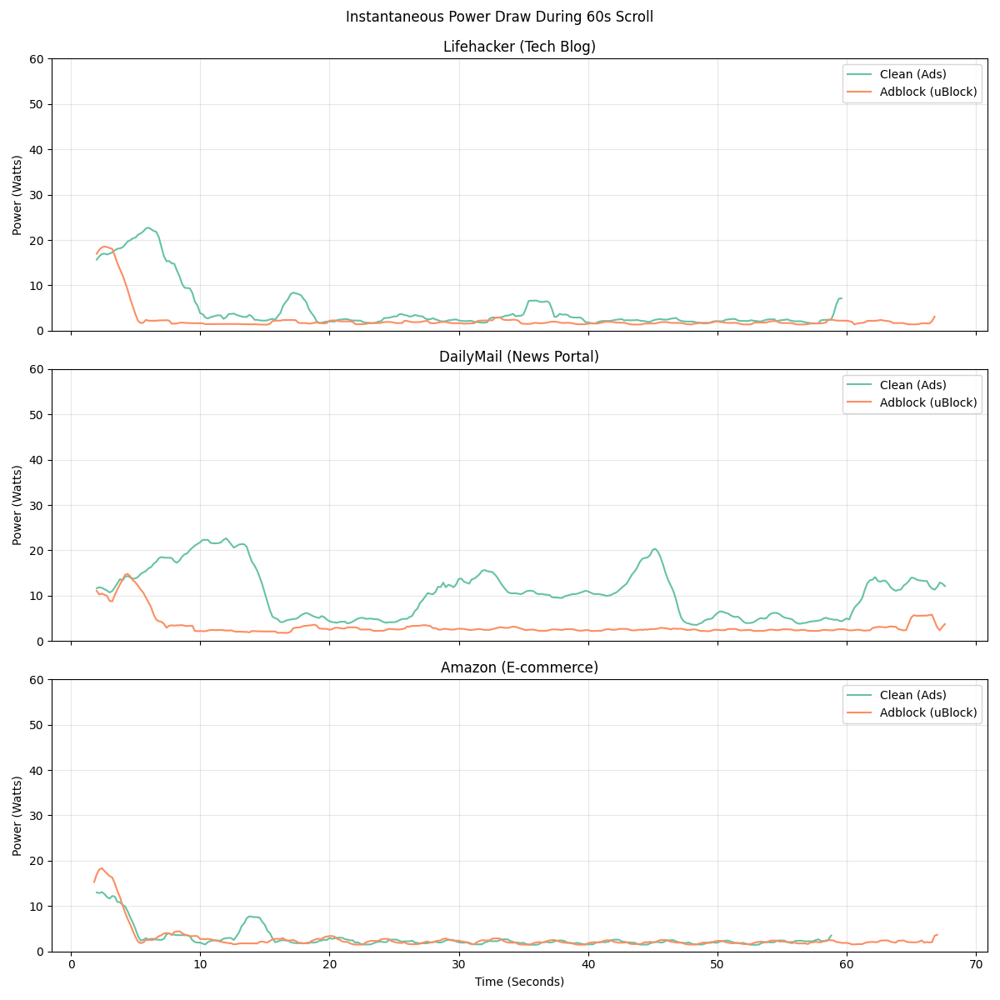

## Introduction & Background

### The Cost of "Free"
Although a vast amount of content on the internet is available to users for "free," companies are still able to monetize their platforms effectively. This is achieved through a variety of income sources, such as premium subscriptions, diversification into other services, and data brokering. However, the foundational pillar of the modern web's economy remains **advertisements**. Site owners sell digital real estate to third-party ad networks, which then serve dynamic media to users. Furthermore, site owners utilize complex tracking cookies to build user profiles, allowing ad networks to serve highly targeted advertisements. If the system knows a user recently searched for running shoes, it will aggressively bid to show them sports apparel, encouraging immediate consumer action [6].

While advertisements are an essential part of a website's profit margins, they have a notoriously negative impact on the user experience. A comprehensive study conducted on 1,000 users revealed that 81% of people actively dislike internet advertisements, with 60% finding them highly intrusive [1]. This disdain is particularly directed at pop-ups, auto-playing video banners, and interstitial ads that block content until dismissed.

### The Hidden Technical and Environmental Toll
Beyond the visual annoyance, there is a hidden, highly technical cost to programmatic advertising: **drastically increased hardware resource consumption** [2]. Advertisements are no longer simple static images. When a user navigates to a modern news portal, a cascade of hidden events occurs. The browser must execute heavy JavaScript files to initiate "header bidding" (a real-time auction where ad networks bid on the user's view), load third-party tracking scripts, establish multiple external server connections, and finally render processor-intensive media or animations. 

Due to the need to fetch these extra files—many of which are poorly optimized or fail to comply with standard web performance metrics—ads cause websites to load much slower than necessary [3]. This "JavaScript bloat" keeps the CPU out of its low-power idle states. From the perspective of **Green Software Engineering**, this is highly problematic. The Information and Communication Technology (ICT) sector is responsible for a rapidly growing percentage of global greenhouse gas emissions [7]. If every page load requires the CPU to do mathematically useless work (like calculating ad bids and tracking mouse movements), the aggregate energy wasted across billions of daily internet users is astronomical.

### Adblockers as an Energy Solution
A common way users mitigate these problems is through **adblockers** [4]. These are browser extensions that intercept network requests as a website is loading, comparing the requested URLs and scripts against community-maintained blocklists (such as EasyList). If a match is found, the extension nullifies the request before it even reaches the network. This prevents the browser from downloading the script, evaluating the JavaScript, or rendering the media.

While adblockers are traditionally viewed through the lens of privacy and user experience, we propose looking at them through the lens of sustainability. If turning off ads decreases loading times and CPU usage, it should naturally lead to improved battery life on laptops and mobile devices, and subsequently, a lower carbon footprint. 

This leads to the core focus of our research:
> **Research Question:** Does using an adblocker lead to a statistically significant improvement in power consumption while browsing media-heavy websites, and can we quantify this environmental benefit?

---

## Hypothesis

We hypothesize that websites loaded **without** an adblocker will consume significantly more CPU package energy than the same websites loaded with an adblocker enabled. Ads require the browser to perform a high volume of background processing. By blocking these scripts at the network level, the CPU can return to its idle state much faster.

Furthermore, we expect the magnitude of energy savings to scale directly with the ad-density of the page. A website heavily reliant on auto-playing videos, injected banners, and aggressive trackers will show a massive disparity in energy consumption between the two states. 

Conversely, for a website that serves **no third-party ads**, we expect the adblocker to offer zero energy benefits. In fact, we hypothesize that the adblocker will introduce a slight *energy penalty*. The extension must still load into system memory and actively scan every single outgoing network request against its internal database. On an ad-free site, this filtering overhead yields no blocked elements, resulting in a net loss of efficiency.

---

## The Experiment Methodology

To answer our research question, we designed a fully automated software experiment to measure the energy consumption of a client machine across three different websites, each representing a distinct tier of advertisement density.

### Target Websites
1. **DailyMail (News Portal)** - *Heavy Ad Density*: The DailyMail homepage is notorious for its aggressive monetization. It features pop-up banners, sticky video players that follow the user as they scroll, and dozens of third-party tracking scripts. The ads on this site constantly refresh, leading to sustained CPU usage even when the user is not actively interacting with the page.
2. **Lifehacker (Tech Blog)** - *Moderate Ad Density*: A standard technology blog that relies on display advertising. It lacks the overwhelming, screen-covering ads of DailyMail, but still loads inline banners, sponsored content blocks, and telemetry scripts.
3. **Amazon (E-commerce)** - *Baseline / Zero Third-Party Ads*: Amazon is a marketplace that relies entirely on first-party infrastructure. While it has "sponsored products," these are baked into the core HTML response of the site, not served by external JavaScript ad networks. We use Amazon as a baseline to measure the strict computational overhead of the AdBlocker itself.

### Automation & Measurement Setup
Human interaction is inherently flawed when measuring micro-joules of energy. A user might scroll slightly faster one run, or take a second longer to close a pop-up, completely skewing the power metrics. To ensure empirical validity, we fully automated the browsing sessions using **Python and Selenium WebDriver**, executing **20 iterations** per website for both "Clean" (no adblock) and "Adblock" states.

#### 1. Profile Management and Cache Control
Browser caching is a major threat to validity in web energy studies. If an ad image is downloaded on run 1, run 2 will load it from the local disk, consuming much less energy. To combat this, our bash orchestrator (`experiment.sh`) dynamically manages Chrome profiles:
* For the **Clean runs**, a completely fresh, temporary Chrome profile is generated in the `/tmp/` directory for every single iteration and destroyed immediately after.
* For the **Adblock runs**, we must use a persistent profile because the extension (uBlock Origin Lite) needs to be installed and its filter lists updated. However, before *every single run*, our script programmatically wipes the `Default/Cache`, `Default/Code Cache`, and `Default/GPUCache` directories to ensure a "cold load" while retaining the extension settings.

#### 2. Handling Cookie Banners (The Consent Script)
One of the most complex hurdles in web automation is the EU General Data Protection Regulation (GDPR) cookie consent banners. These banners halt page execution, blur the screen, and prevent normal scrolling until interacted with. If left unhandled, we would be measuring the energy of a static consent screen rather than the website's ad-rendering behavior. 

To solve this, our Python script (`scroll_bot.py`) implements a smart explicit wait mechanism using XPath selectors:
```python
def attempt_click(xpath_str):
    try:
        element = wait.until(EC.presence_of_element_located((By.XPATH, xpath_str)))
        driver.execute_script("arguments[0].click();", element)
        return True
    except:
        return False

if "dailymail.co.uk" in url:
    attempt_click("//button[contains(text(), 'Accept')]")
# (Similar logic applies for Amazon and Lifehacker)
```
By automatically intercepting and dismissing these pop-ups within the first few seconds of the DOM loading, we ensure that the rest of the 60-second test is strictly measuring the rendering of the core website and its advertisements.

#### 3. Standardized User Behavior
Once the page is clear, the script executes a standardized 60-second scrolling routine to simulate a user reading the front page. It locates the HTML `<body>` tag and enters a 12-iteration loop: sending a `Page Down` keystroke, waiting exactly 3 seconds to allow lazy-loaded ads to render, sending a `Page Up` keystroke, and waiting 1 second. This forces the browser's rendering engine to constantly paint new frames and evaluate scroll-triggered JavaScript.

#### 4. Energy Profiling with EnergiBridge
To measure the energy cost of this automation, we utilized **EnergiBridge** [5]. EnergiBridge is a command-line tool that interfaces directly with Intel RAPL (Running Average Power Limit) sensors found on modern x86 processors. RAPL provides highly granular, hardware-level measurements of the energy consumed by the CPU package [9].

Our master script wraps the Python execution in an EnergiBridge profiling session, polling the CPU sensors roughly every 200 milliseconds. This generates a dense CSV file containing precise timestamps, instantaneous Power (Watts), and cumulative Energy (Joules) for the exact duration of the script.

#### 5. uBlock Origin Lite & Manifest V3
For our intervention, we chose **uBlock Origin Lite**. Unlike older adblockers that inject heavy JavaScript into every page to evaluate network requests dynamically, uBlock Origin Lite utilizes Chrome's new **Declarative Net Request (Manifest V3) API** [8]. This allows the extension to hand a massive list of blocked domains directly to the browser engine itself. The browser handles the blocking natively at the network layer, which is exponentially more CPU-efficient. This ensures we are testing the most modern, energy-efficient blocking technology available.

---

## Results & Analysis

The raw CSV data produced by EnergiBridge across the 120 total runs was processed using a Python data analysis pipeline (`pandas`, `scipy`, `seaborn`). We calculated the total energy consumed per run and performed Welch’s t-tests (which do not assume equal variance) to ensure statistical significance.

### Total Energy Consumption & Statistical Variance

The results overwhelmingly prove our initial hypothesis: using an adblocker significantly affects the power consumption of web browsing, and the impact scales directly with the ad-density of the page.


*Figure 1: Total energy consumption (Joules) across 20 iterations per website, comparing standard browsing (Clean) vs. uBlock Origin Lite (Adblock).*

| Website | Mean Clean (J) | Mean Adblock (J) | Energy Savings | P-Value |
| :--- | :--- | :--- | :--- | :--- |
| **DailyMail** (Heavy Ads) | 659.33 J | 234.90 J | **64.37%** | 6.62e-10 |
| **Lifehacker** (Moderate Ads) | 301.18 J | 174.48 J | **42.07%** | 1.15e-33 |
| **Amazon** (No Ads) | 180.35 J | 196.24 J | **-8.81%** *(Increase)* | 5.29e-07 |

*Table 1: Summary statistics of CPU package energy consumption over a 60-second session.*

As seen in Table 1 and Figure 1, on the website with the highest ad density (**DailyMail**), using an adblocker achieves a massive **64.3% reduction** in total CPU energy. 

Equally fascinating is the **variance** shown in the boxplot. Without an adblocker, the consumption between DailyMail runs varies wildly (ranging from 480 Joules to over 900 Joules). This massive standard deviation is a direct result of the programmatic ad-bidding ecosystem. Every time you refresh DailyMail, a different set of ads is won in the real-time auction. Run 3 might load three static images, while Run 4 might load two heavy, unoptimized, auto-playing video banners. Enabling the adblocker not only drastically lowers the median consumption to ~235 Joules, but it tightly compresses the variance. By stripping away the unpredictable third-party network, the page load becomes highly deterministic and efficient.

For **Lifehacker**, we see similar but less extreme results. We recorded a robust average of **42% in energy savings**. The data points are much more clustered, proving that the adblocker's usage is highly justified even for websites with standard, less intrusive blog advertisements.

### The Overhead Cost of Adblockers

Our baseline test on **Amazon** validates our secondary hypothesis regarding extension overhead. It is actually *less* energy-efficient to use an adblocker on a site without third-party ad networks. Because the browser must load the extension into memory and evaluate Amazon's legitimate image and script requests against its filter list—without actually blocking anything—we see an **8.8% increase** in total power consumption. However, the raw increase (about 16 Joules) is microscopic compared to the 424 Joules saved on DailyMail.

### Power Draw Over Time

To better understand *when* the energy is being consumed during the session, we converted the cumulative energy into instantaneous power draw (Watts) and plotted it over the 60-second timeline.


*Figure 2: Instantaneous CPU power draw (Watts) during a representative 60-second scrolling session.*

All charts exhibit a significant power spike between the 0 and 10-second marks. This represents the initial network handshake, DOM (Document Object Model) construction, and primary script execution. 

* On **DailyMail** (Clean, Teal Line), the power draw refuses to settle. It remains highly erratic, frequently spiking back up to 15-20 Watts throughout the entire 60 seconds. This visualizes the cost of lazy-loaded ads fetching new content, tracking scripts pinging servers with the user's scroll depth, and video players rendering frames. 
* On the **Adblock** runs (Orange Line), after the initial page load spike, the power draw swiftly drops to a near-idle state (around 2-3 Watts) for the remainder of the session. The browser only expends energy to smoothly scroll the text and native images, completely ignoring the ad infrastructure.

---

## Global Extrapolation: The Carbon Footprint of Ads

To understand the importance of these measurements in the context of sustainable software engineering, we must scale our findings. Let us take DailyMail as a case study. 

In our experiment, a 60-second visit to DailyMail without an adblocker consumed, on average, **424.4 more Joules** than a visit with an adblocker. According to SimilarWeb data, DailyMail receives approximately **217 million visits per month** [10].

If we assume an average visit length of 1 minute, the global energy wasted solely on rendering DailyMail's advertisements by its user base is:

*   424.4 Joules × 217,000,000 visits ≈ **92.1 Billion Joules per month**
*   Converting Joules to Kilowatt-hours (kWh): (92.1 × 10^9) / (3.6 × 10^6) ≈ **25,580 kWh per month**

To put that into perspective, the average household in the Netherlands consumes about 2,400 kWh *per year* [11]. The energy wasted annually just to process DailyMail's ads on client devices is equivalent to powering roughly **128 Dutch homes for an entire year**. 

Using the EU average carbon intensity of electricity generation (approximately **187 gCO₂e/kWh** as of 2024 [12]), rendering DailyMail's ads produces roughly **4.8 Metric Tons of CO₂** every single month. To offset this monthly footprint, you would need to plant nearly **80 trees** and let them grow for 10 years—and this calculation only accounts for the CPU power on the client's laptop, completely ignoring the energy spent by data centers and networking equipment!

---

## Conclusion & Threats to Validity

### Conclusion
Our automated experiment yields a definitive conclusion: **using an adblocker significantly reduces CPU energy consumption on ad-supported websites.** Furthermore, the energy reduction scales directly with the volume and intrusiveness of the ads on the page.

On our most ad-heavy test subject (DailyMail), mitigating ads resulted in a staggering 64% reduction in CPU energy, dropping the cost of a 60-second session from 659 Joules down to 235 Joules. Even on moderate sites like Lifehacker, users save over 40% of their processing power. While the adblocker does incur a minor ~9% energy penalty on sites completely devoid of third-party ads (like Amazon), the massive savings achieved on the rest of the web mathematically dwarf this baseline cost.

The practical takeaway is undeniable. Adblockers are not just tools for better user experience or privacy; they are powerful tools for environmental conservation. By preventing the execution of bloated tracking scripts and unoptimized media, users can tangibly extend their hardware's battery life and actively reduce the carbon footprint of their daily internet usage.

### Threats to Validity
While our methodology was tightly controlled, certain limitations must be acknowledged:
1. **Hardware Scope**: We measured strictly CPU package energy via Intel RAPL. We did not capture the energy costs of GPU hardware acceleration, display screen brightness (ads often use bright white backgrounds), or Network Interface Cards (NIC) keeping connections alive. Because ads heavily utilize all three of these components, the *actual total system energy savings* of using an adblocker are undoubtedly much higher than our CPU-only figures suggest.
2. **Fixed Behavior**: Our scroll behavior was fixed to 12 loop iterations. It did not account for differences in total page length across the three sites, meaning we interacted with a different percentage of the total DOM on DailyMail compared to Amazon.
3. **Network Volatility**: While we ran 20 iterations to find a stable mean, internet speeds and ad-server response times naturally fluctuate, which can introduce minor variations in how long the CPU spends waiting for network I/O.

Future work could expand upon this by utilizing physical power meters (plugged into the wall) to measure whole-system draw, and testing across a wider variety of browsers (e.g., Firefox, Safari) and adblocking technologies to see which engine is the most inherently sustainable.

---

## Replication Package

To ensure our findings are fully transparent and reproducible by other researchers, we have automated the entire testing environment. Our replication package includes:
1. `scroll_bot.py`: The Selenium script utilizing explicit XPath waits to dynamically handle GDPR cookie consent banners and standardize human-like scrolling behavior.
2. `experiment.sh`: The Bash orchestrator that strictly manages Chrome profiles (creating temporary clean profiles and clearing caches for persistent adblock profiles) while interfacing with the EnergiBridge daemon.
3. `run_study.sh`: The master execution script that loops the 20 iterations across the 3 defined websites, enforcing strict cooldown periods to prevent thermal throttling from skewing data.
4. `analyze_results.py`: The Python data pipeline that parses the raw EnergiBridge output, calculates T-test statistics, and generates the Seaborn visualizations seen in this report.

The complete code, raw data (`.csv` files), and setup instructions can be found in our public GitHub repository: **[Group 16 GitHub Repository](https://github.com/aduyum/Group16_P1)**

---

## References
[1] LBBOnline. (n.d.). *We Are Different: Youth Insight - I Hate Ads Report*. Available at: https://lbbonline.com/news/we-are-different-youth-insight-i-hate-ads-report  
[2] StatusCake. (n.d.). *Online Ads Are Slowing Web Page Loading Speed*. Available at: https://www.statuscake.com/blog/online-ads-are-slowing-web-page-loading-speed/  
[3] Wouters, L. (n.d.). *Problems with Ads and How to Solve Them*. Medium. Available at: https://medium.com/@lisawouters/problems-with-ads-and-how-to-solve-them-ac499e6ccbee  
[4] HubSpot. (n.d.). *How Ad Blocking Works*. Available at: https://blog.hubspot.com/marketing/how-ad-blocking-works  
[5] Durieux, T. et al. (2024). *EnergiBridge*. GitHub Repository. Available at: https://github.com/tdurieux/EnergiBridge  
[6] Investopedia. (n.d.). *How Do Internet Companies Profit If They Give Away Their Services Free?* Available at: https://www.investopedia.com/ask/answers/040215/how-do-internet-companies-profit-if-they-give-away-their-services-free.asp  
[7] Freitag, C., et al. (2021). *The real climate and transformative impact of ICT: A critique of estimates, trends, and regulations*. Patterns, 2(9). Available at: https://doi.org/10.1016/j.patter.2021.100340  
[8] Google Chrome Developers. (n.d.). *Declarative Net Request API*. Chrome Extensions Documentation. Available at: https://developer.chrome.com/docs/extensions/reference/api/declarativeNetRequest  
[9] Weaver, V. M., et al. (2015). *Evaluating the accuracy of Intel RAPL power measurement*. 2015 IEEE Workshop on Programming Models and Applications for Multicores and Manycores (PMAM).  
[10] Similarweb. (2024). *dailymail.co.uk Traffic Analytics & Market Share*. Available at: https://www.similarweb.com/website/dailymail.co.uk/  
[11] Milieu Centraal. (2024). *Gemiddeld energieverbruik (Average energy consumption in the Netherlands)*. Available at: https://www.milieucentraal.nl/energie-besparen/inzicht-in-je-energierekening/gemiddeld-energieverbruik/  
[12] European Environment Agency. (2023). *Greenhouse gas emission intensity of electricity generation in Europe*. Available at: https://www.eea.europa.eu/en/analysis/indicators/greenhouse-gas-emission-intensity-of-1