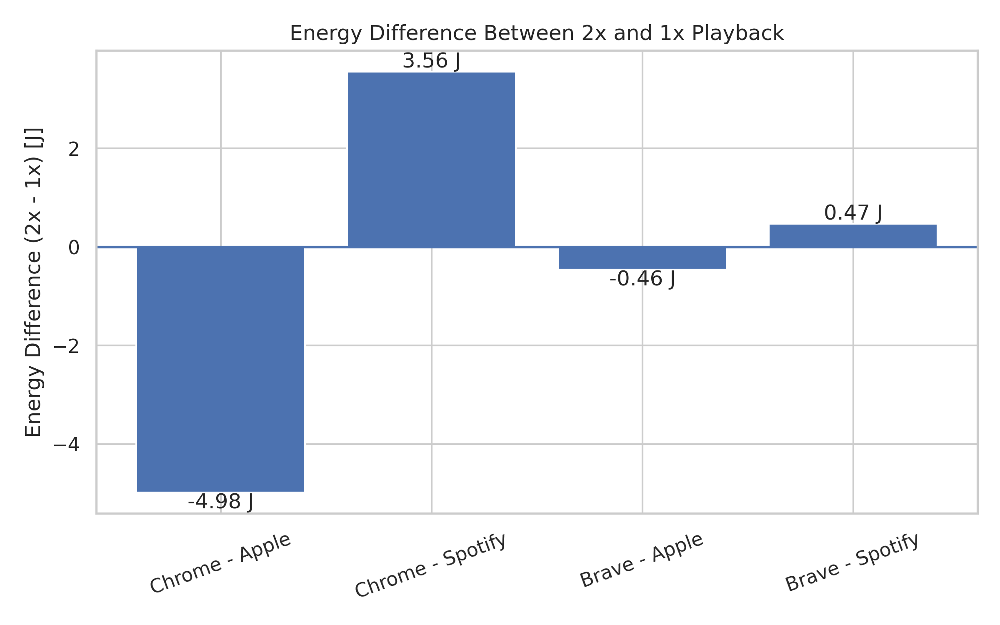
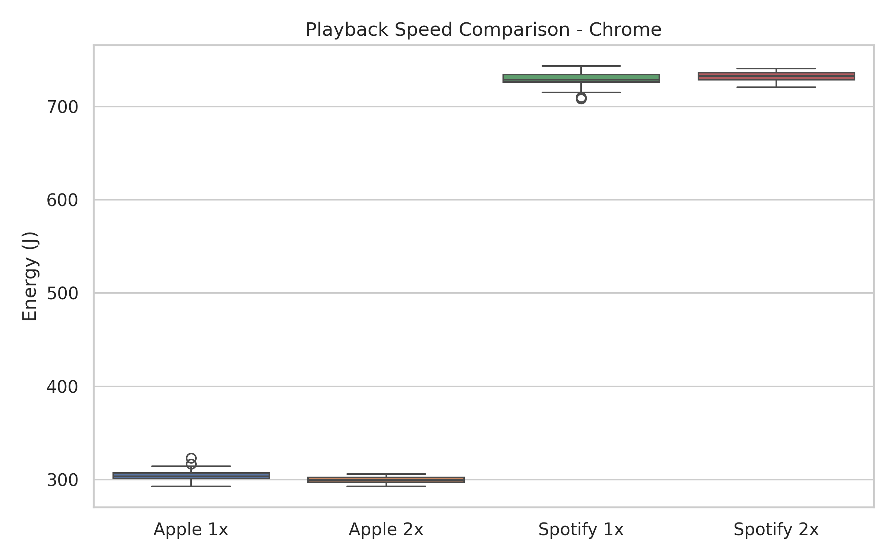
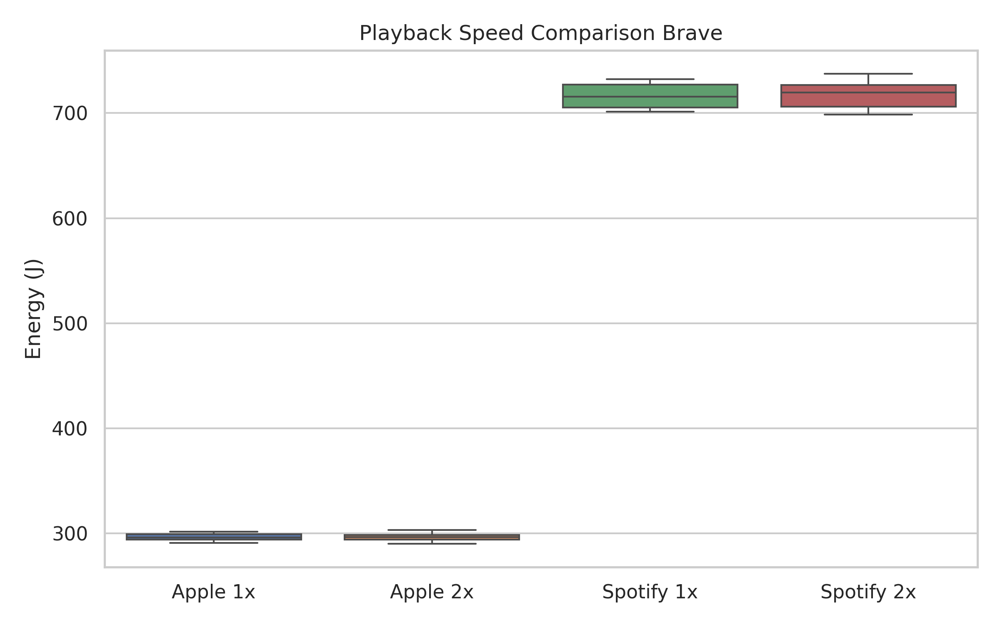
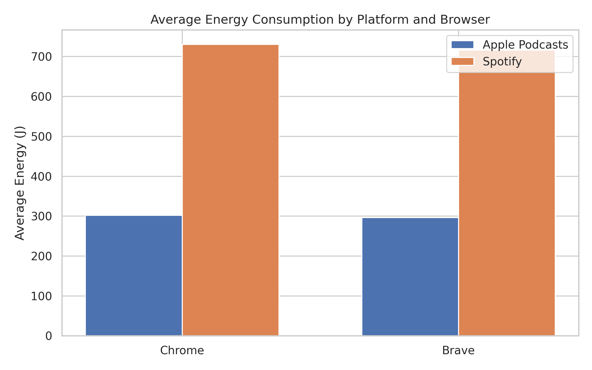
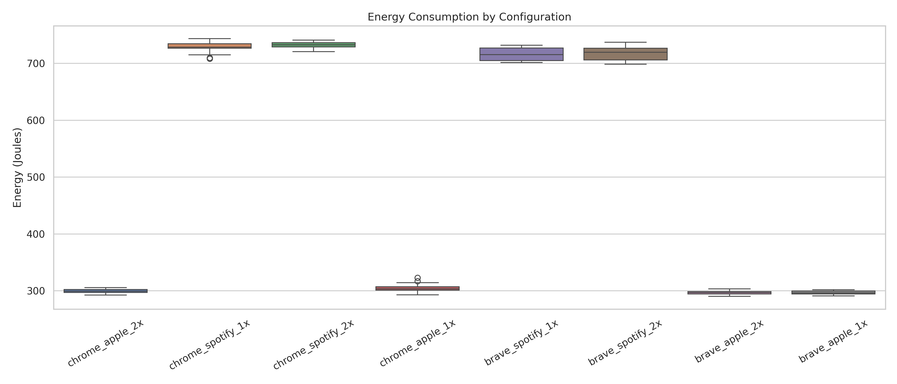
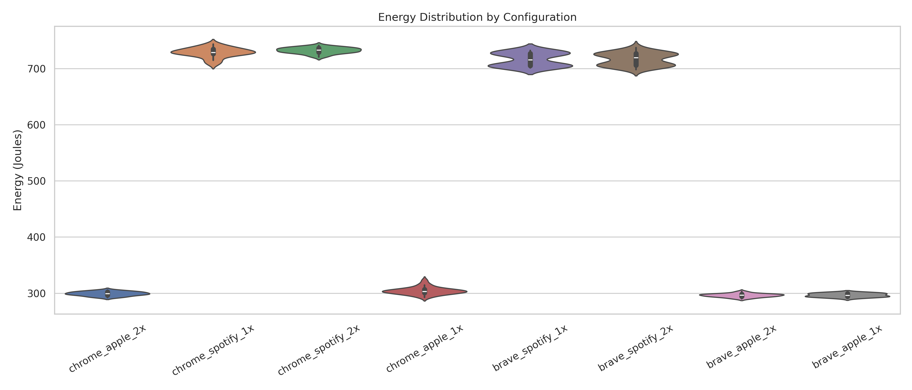

<!-- # Energy Consumption for Online Podcast Playback -->

## **1\. Introduction** 
Digital media consumption has become an integral part of everyday life, spanning platforms such as YouTube, Netflix, and digital music services. Podcasts, in particular, have seen significant growth in recent years \[1\], with millions of users consuming audio content daily through platforms such as Spotify and Apple Podcasts. A common user behaviour on these platforms is adjusting playback speed (e.g., 1x, 1.5x, or 2x) to listen to the content faster and more efficiently \[2\]\[3\].

While increasing playback speed reduces listening time, the net effect of this trade-off on total energy consumption is not immediately obvious as faster playback increases processing demand while reducing overall playback duration.

Most existing research on streaming sustainability focuses on network infrastructure, data centers, or media compression efficiency \[4\]. Existing podcast research largely focuses on language learning, education, and user engagement. However, less attention has been given to client-side energy consumption, that is, the energy used by end-user devices during playback. Since end-user devices are widely distributed and always active, even small differences in power usage may accumulate into meaningful environmental impacts when scaled across millions of users.

This study investigates how playback speed affects device-level energy consumption during desktop web-based podcast streaming. Specifically, we compare Spotify and Apple Podcasts web players under controlled conditions and measure total energy usage and average power consumption of the content consumed.

By isolating playback speed as a behavioural variable, this work contributes to sustainable software engineering by examining how everyday user choices interact with software design and platform implementation to influence energy efficiency.

> **Research Question:**  How does increasing playback speed (1x vs 2x) influence device-level energy consumption during desktop-based podcast streaming across different platforms and browsers?

## **2\. Methodology**

### 2.1 Experimental Overview

This study measures device-level energy consumption during continuous podcast playback under controlled desktop conditions. The experiment assesses how playback speed and browser implementation influence energy usage.

All measurements were conducted on a single laptop to eliminate hardware variability. Playback sessions were fully automated to ensure identical interaction across all configurations.

### 2.2 Design Decisions and Platform Selection

The experimental framework and platform choices were guided by three main categories: experimental control, reproducibility, and relevance to real-world usage.

#### **Selection of Spotify and Apple Podcasts**

Spotify and Apple Podcasts were chosen because they are two of the most widely used podcast platforms globally \[5\]\[6\]. Both platforms support variable playback speed, which is central to our research question. Comparing these two platforms allows us to evaluate whether implementation differences influence energy efficiency under the same playback conditions.

#### **Web-Based Platforms vs Native Application**

The web versions of Spotify and Apple Podcasts were selected instead of their desktop applications. While native applications are more commonly used, web-based playback allows for stronger experimental control and automation. Browser automation frameworks such as Playwright allow constant scripting of navigation, playback initiation, and speed adjustment. This ensures that all trials follow an identical structure and can be reproduced reliably.

#### **Selection of Chrome and Brave Browsers**

Google Chrome and Brave were selected as representative Chromium-based browsers. Google Chrome was selected due to its current global market share \[7\]. To maintain experimental control, a second Chromium-based browser was selected rather than choosing a browser built on a different rendering engine. By selecting two browsers based on the same engine, variability introduced by engine-level architecture is reduced. This allows for a more controlled comparison focused on browser-level implementation differences, background process behaviour, and energy management strategies rather than engine-specific effects.

### 2.3 Experimental Variables

#### **Independent Variables**

The following factors were varied:

* Browser  
  * Google Chrome  
  * Brave Browser  
* Playback Speed  
  * 1x (normal speed)  
  * 2x (accelerated playback)  
* Podcast Platform  
  * Spotify  
  * Apple Podcasts

This results in eight configurations:

* Chrome \- Spotify \- 1x speed  
* Chrome \- Spotify \- 2x speed  
* Brave \- Spotify \- 1x speed  
* Brave \- Spotify \- 2x speed  
* Chrome \- Apple Podcasts \- 1x speed  
* Chrome \- Apple Podcasts \- 2x speed  
* Brave \- Apple Podcasts \- 1x speed  
* Brave \- Apple Podcasts \- 2x speed

#### **Controlled Variables**

The following factors were held constant across all trials:

* Screen resolution  
* Playback content (same podcast episode)  
* System volume and speaker  
* Network connection (Wifi)
* Background applications   
* Measurement duration  
* Sampling interval  
* Hardware configuration

### 2.4 Test Platform

All experiments were conducted on a single laptop to remove hardware related variability.

| Component | Specification |
| :---- | :---- |
| Model | Lenovo Yoga Pro 7 14ASP9 |
| CPU | AMD Ryzen™ AI 9 365 (20 logical cores) |
| Integrated GPU | AMD Radeon™ 890M |
| Memory | 32 GB RAM |
| Architecture | x86\_64 |

### 2.5 Software Environment

| Component | Specification |
| :---- | :---- |
| Operating System | Ubuntu 25.10 |
| Kernel | Linux 6.17.0 |
| Desktop Environment | GNOME 49 |
| Display Server | Wayland |
| Firmware Version | PSCN17WW |

### 2.6 Measurement Setup

Energy measurements were collected using EnergiBridge \[8\]. EnergiBridge samples processor energy counters at specific intervals. For our experiment we used an interval of 500ms. 

Total energy consumption for each trial was computed using the cumulative CPU\_ENERGY counter:

*Energy \= Final Value \- Initial Value*

### 2.7 Automation Procedure

Playback sessions were fully automated using Playwright \[9\], a browser automation framework that enables deterministic control of web-based interactions. Playwright allows programmatic launching of browser instances, navigation to specific URLs, and scripted interaction with page elements. This ensures that each trial follows an identical execution path, eliminating variability caused by manual user input.

Persistent browser profiles were used to maintain authenticated sessions and ensure consistent playback behaviour across runs. This avoids repeated login flows and ensures that DRM modules and session states remain stable throughout the experiment.

Rather than relying solely on user interface controls, playback was initiated through scripted interaction with the player interface, after which the HTML ‘\<audio\>’ element’s ‘playbackRate’ property was set programmatically to ensure consistent speed configuration. Playback initiation was verified before energy measurement began to ensure that decoding activity was active.

Each trial followed the same automated sequence:

1. Launch browser  
2. Wait for browser initialisation (5 seconds)  
3. Navigate to the podcast platform web player at the selected podcast episode URL  
4. Wait for page load stabilisation  
5. Click play  
6. Wait to ensure playback start (3 seconds)  
7. Set playback speed (1x or 2x)  
8. Start energy measurement (EnergiBridge)  
9. Measure for 90 seconds  
10. Stop measurement  
11. Close browser  
12. Cooldown period of 30 seconds

The browser startup, page load, and playback start waits allow buffering, decoding, and CPU frequency scaling to stabilise before measurements are recorded. The cooldown phase reduces carryover effects between runs.

Automation ensures reproducibility, consistent timing, and identical interaction patterns across all configurations.

### 2.8 Repetition Strategy and Variance Reduction

Each configuration was repeated 30 times to reduce measurement variation caused by:

* OS scheduling behaviour  
* Background system processes  
* Core temperatures  
* Short term system noise

## **3\. Results**

### 3.1 Is Playing at 2x Speed More Energy Efficient?

The main question was simple:

> **Does playing podcasts at 2x speed reduce CPU energy consumption?**

***Figure 1\. Energy difference between 2x and 1x playback across browser-platform combinations***

**Figure 1** shows the difference in energy between 2x and 1x playback for each browser-platform combination.

Values below zero mean that 2x playback uses less energy.  
Values above zero mean that 2x playback uses more energy.

From the figure, we can see that:

* Chrome \- Apple shows a noticeable energy reduction (about \-5 J).  
* All other combinations are very close to zero.

This means that only Apple Podcasts in Chrome clearly benefit from faster playback.  
For Spotify (in both browsers) and Apple in Brave, the energy difference is extremely small.

Although a difference of 5J may appear small, statistical analysis shows that it is both statistically significant and practically meaningful. The effect size was large, indicating a substantial difference between 1x and 2x playback and not suggesting random variation. 

So the answer is: In most cases, no. Except for one (Chrome \+ Apple Podcasts).

### 3.2 How Do the Playback Distributions Compare?

To better understand what is happening, Figures 2 and 3 show the distribution of energy measurements using boxplots.

#### **Chrome**

***Figure 2\. Playback speed comparison in Chrome***

As shown in **Figure 2**, Apple Podcasts in Chrome shows a downward shift when moving from 1x to 2x playback. The median energy consumption is lower at 2x, and the distributions overlap less than in other cases. This visual separation shows that the reduction is consistent and not due to random variation.

Spotify in Chrome behaves differently. In Figure 2, the 1x and 2x boxplots overlap heavily, with very similar medians and spreads. Although there is a small numerical difference, statistical significance testing and effect size testing revealed that the difference is not statistically significant and could simply reflect random variability between runs.

In practical terms:

Playback speed meaningfully affects energy consumption for Apple Podcasts in Chrome, but not for Spotify.

#### **Brave**

***Figure 3\. Playback speed comparison in Brave***

As shown in **Figure 3**, the pattern in Brave is even more stable than in Chrome. For both Apple Podcasts and Spotify, the 1x and 2x boxplots almost completely overlap. The medians are nearly identical, and the spreads are very similar.

This strong overlap indicates that playback speed has virtually no impact on energy consumption in Brave, regardless of platform.

While Spotify shows a very small numerical difference between 1x and 2x playback, Figure 3 makes it clear that the distributions overlap heavily. Statistical testing confirms that this difference is not significant, meaning it could simply be due to natural variation between runs.

In practical terms:

In Brave, changing playback speed does not meaningfully affect energy usage for either Apple Podcasts or Spotify.

### 3.3 Does the Platform Matter More Than Speed?

If playback speed has limited impact, does the streaming platform itself make a difference?

***Figure 4 compares average energy consumption across platforms and browsers***

Across both browsers and playback speeds:

* Apple Podcasts consumes roughly **300 J**  
* Spotify consumes roughly **720–730 J**

This means Spotify uses more than **double** the CPU energy of Apple Podcasts.

Importantly, this pattern holds regardless of playback speed.

This leads to a key insight:

* The choice of streaming platform has a much larger impact on energy consumption than playback speed.

### 3.4 Why We Can Trust These Results

All configurations were tested 30 times to ensure stable and reliable measurements. Normality was assessed using the **Shapiro–Wilk test**. For normally distributed data, we applied **Welch’s t-test**, and for non-normal data, we used the **Mann–Whitney U test**. Effect sizes (Cohen’s *d* and CLES where appropriate) were also calculated to evaluate practical significance.

Only one comparison (Chrome \+ Apple Podcasts) met the statistical significance threshold (α \= 0.05), with a large effect size. All other comparisons showed either no statistical significance or negligible practical differences.

Full statistical tables, p-values, normality results, and effect size calculations are provided in the Appendix.

## **4\. Discussion**

### 4.1 What actually drove energy consumption?

### 4.2 Why did browser choice barely matter?

### 4.3 Why playback speed had limited impact?

### 4.4 Broader Implications \-\> Why should you care?

## **5\. Limitations and Issues**

This study was conducted on a single laptop running a fixed operating system configuration. While this improved experimental consistency, it limits generalisability to other hardware architectures, particularly ARM-based systems, mobile devices, or alternative operating systems. 

Energy measurements were based on CPU package-level counters and did not isolate GPU, memory, or network contributions. As media streaming engages multiple subsystems, total device energy may differ from CPU measurements alone.

The measurement window (90 seconds) may not fully capture longer-term adaptive behaviour such as buffering adjustments or dynamic bitrate changes. The experiment also focused exclusively on web-based playback. Native desktop or mobile applications may employ different media pipelines, hardware acceleration strategies, or background processes, which could alter energy characteristics.

Finally, despite careful control of variables, minor variability may still arise from operating system scheduling behaviour, background processes, thermal conditions, and adaptive streaming dynamics. Although repetition reduced random noise, such factors cannot be entirely eliminated.

## **6\. Conclusion**

This study examined how playback speed influences device-level energy consumption during desktop-based web podcast streaming. Across 240 experimental runs, playback speed did not consistently reduce energy use. Only one browser–platform combination showed a statistically significant difference.

Platform choice had a substantially larger impact on energy consumption than playback speed. The findings suggest that improvements in platform design are likely to have a greater effect on energy efficiency than changes in listening behaviour.

## **7\. Future Work**

Future work could compare web-based players with native applications, extend experiments to mobile devices, and include additional playback speeds such as 1.5x. Measuring GPU and memory energy separately would provide a more complete system-level view. Further studies could examine offline playback, video podcasts, and other operating systems to improve generalisability.

## **References**

\[1\] Podcast Statistics. n.d. *33 Podcast Statistics 2026 (Number of Podcasts & Viewership).* Retrieved February 23, 2026 from [https://podcastatistics.com/](https://podcastatistics.com/)

\[2\] A. Harris. 2016\. Lots of Us Listen to Podcasts Faster Than “Normal.” Join Us\! *Slate.* October 6, 2016\. Retrieved February 23, 2026 from [https://www.slate.com/blogs/normal/2016/10/06/speed\_listening\_to\_podcasts\_is\_totally\_normal\_and\_practical.html](https://www.slate.com/blogs/normal/2016/10/06/speed_listening_to_podcasts_is_totally_normal_and_practical.html)

\[3\] K. Notopoulos. 2024\. The Best Speed for Podcasts Is 1.2X. Trust Me. *Business Insider.* January 5, 2024\. Retrieved February 23, 2026 from [https://www.businessinsider.com/best-speed-podcasts-audiobooks-how-to-listen-2024-1](https://www.businessinsider.com/best-speed-podcasts-audiobooks-how-to-listen-2024-1)

\[4\] S. Afzal, N. Mehran, Z. A. Ourimi, F. Tashtarian, H. Amirpour, R. Prodan, and C. Timmerer. 2024\. A survey on energy consumption and environmental impact of video streaming. *arXiv preprint arXiv:2401.09854.* Retrieved February 23, 2026 from [https://arxiv.org/abs/2401.09854](https://arxiv.org/abs/2401.09854)

\[5\] M. Harutyunyan. 2026\. Must-Know Podcast Statistics in 2026\. *Loopex Digital.* January 30, 2026\. Retrieved February 23, 2026 from [https://www.loopexdigital.com/blog/podcast-statistics](https://www.loopexdigital.com/blog/podcast-statistics)

\[6\] Teleprompter.com Team. 2025\. Podcast Statistics 2025: Global Listener Growth and Trends. [*Teleprompter.com*](http://Teleprompter.com)*.* November 28, 2025\. Retrieved February 23, 2026 from [https://www.teleprompter.com/blog/podcast-statistics](https://www.teleprompter.com/blog/podcast-statistics)

\[7\] StatCounter. n.d. *Browser market share worldwide (desktop).* Retrieved February 23, 2026 from [https://gs.statcounter.com/browser-market-share/desktop/worldwide](https://gs.statcounter.com/browser-market-share/desktop/worldwide)

\[8\] T. Durieux. n.d. *EnergiBridge.* GitHub repository. Retrieved February 23, 2026 from [https://github.com/tdurieux/energibridge](https://github.com/tdurieux/energibridge)

\[9\] Microsoft. n.d. *Playwright.* Retrieved February 23, 2026 from [https://playwright.dev/](https://playwright.dev/)

\[10\] Statistics How To. n.d. *Cohen’s d: Definition, formula and examples.* Retrieved February 23, 2026 from [https://www.statisticshowto.com/probability-and-statistics/statistics-definitions/cohens-d/](https://www.statisticshowto.com/probability-and-statistics/statistics-definitions/cohens-d/)

## **Appendix**

### Appendix A \- Experimental Setup & Data Cleaning

#### **Measurement Overview**

Each configuration was run 30 times, resulting in a total of 240 measurements across all configs. Energy values were computed using the *CPU\_ENERGY* counter retrieved from EnergiBridge.

#### **Outlier Removal**

Outlier detection was done using the three-standard-deviation rule (\|x − x̄\| > 3s).

A total of 1 run was identified as a statistical outlier and removed from further analysis.  The remaining data were used for statistical testing. This outlier was removed from the brave\_apple\_1x configuration. 

### Appendix B \- Descriptive Statistics

#### **Full Descriptive Table**

| *Configuration* | *\# samples* | *Mean (J)* | *Std (J)* | *Median (J)* |
| ----- | ----- | ----- | ----- | ----- |
| **Chrome \- Apple 1x** | 30 | 304.24 | 6.41 | 303.49 |
| **Chrome \- Apple 2x** | 30 | 299.26 | 3.68 | 299.27 |
| **Chrome \- Spotify 1x** | 30 | 728.74 | 8.57 | 728.78 |
| **Chrome \-Spotify 2x** | 30 | 732.30 | 5.17 | 732.90 |
| **Brave \- Apple 1x** | 29 | 296.78 | 3.30 | 296.32 |
| **Brave \- Apple 2x** | 30 | 296.32 | 3.14 | 296.63 |
| **Brave \- Spotify 1x** | 30 | 716.36 | 11.85 | 715.56 |
| **Brave \- Spotify 2x** | 30 | 716.83 | 11.16 | 719.50 |

*Table A1. Descriptive statistics for each browser–platform–speed configuration (N, mean, standard deviation, and median energy in Joules).*

| *Configuration* | *Avg Energy (J)* |
| ----- | ----- |
| **Chrome \- Apple** | \~300 J |
| **Chrome \- Spotify** | \~730 J |
| **Brave \- Apple** | \~296 J |
| **Brave \- Spotify** | \~716 J |

*Table A2. Average CPU energy consumption across browser and platform combinations, aggregated over playback speeds.*

### Appendix C \- Exploratory Visualizations**

#### **Global Box Plot**

*Figure A1. Global boxplot of energy consumption across all configurations, illustrating overall distribution, spread, and outlier*

#### **Global Violin Plot**

*Figure A2. Global violin plot showing the full energy distribution density for each configuration.*

#### **Focused 1x vs 2x Plots**

<table>
<tr>
<td></td>
<td></td>
</tr>
<tr>
<td></td>
<td></td>
</tr>
</table>

*Figure A3. Pairwise 1× versus 2× playback boxplots for each browser–platform combination.*

### Appendix D \- Statistical Assumptions & Testing

#### **Normality Testing**

The Shapiro-Wilk test was applied to each configuration to assess normality of energy measurements.  For configurations where p ≥ 0.05, normality was assumed. For configurations where p \< 0.05, data was considered non-normal.

| *Configuration* | *Shapiro p-value* | *Normal Distribution Assumed?* |
| ----- | ----- | ----- |
| **Chrome \- Apple 1x** | 0.132789 | Yes |
| **Chrome \- Apple 2x** | 0.532414 | Yes |
| **Chrome \- Spotify 1x** | 0.170301 | Yes |
| **Chrome \- Spotify 2x** | 0.604625 | Yes |
| **Brave \- Apple 1x** | 0.104885 | Yes |
| **Brave \- Apple 2x** | 0.819705 | Yes |
| **Brave \- Spotify 1x** | 0.000055 | No |
| **Brave \- Spotify 2x** | 0.009320 | No |

*Table A3. Shapiro-Wilk normality test results for each configuration.*

#### **Statistical Significance Testing**

To compare 1x and 2x playback within each browser-platform pair, a two-sided Welch’s t-test was performed for configurations satisfying normality (α \= 0.05), while the Mann-Whitney U test was applied for non-normally distributed data.

| *Comparison* | *Test Used* | *p-value* | *Statistically Significant?* |
| ----- | ----- | ----- | ----- |
| **Chrome \- Spotify (1x vs 2x)** | Welch’s t-test | 0.057297 | No |
| **Brave \- Spotify (1x vs 2x)** | Mann-Whitney U | 0.911709 | No |
| **Chrome \- Apple (1x vs 2x)** | Welch’s t-test | 0.000583 | Yes |
| **Brave \- Apple (1x vs 2x)** | Welch’s t-test | 0.585504 | No |

*Table A4. Statistical significance testing results comparing 1× and 2× playback within each browser–platform pair (α \= 0.05).*

### Appendix E \- Effect Size Analysis

#### **Cohen’s d Interpretation \+ CLES**

Effect sizes were interpreted using standard thresholds for Cohen’s d (small ≥ 0.2, medium ≥ 0.5, large ≥ 0.8) \[10\]  and the Common Language Effect Size interpretation framework.

| *Comparison* | *Effect Size Method* | *Effect Size Value(s)* | *Interpretation* |
| ----- | ----- | ----- | ----- |
| **Chrome \- Spotify (1x vs 2x)** | Cohen’s d | d \= \-0.5030 | Medium |
| **Brave \- Spotify (1x vs 2x)** | Median ΔM \+ CLES | ΔM \= \-3.9388 CLES \= 0.4911 | \~49.11% probability (no clear dominance) |
| **Chrome \- Apple (1x vs 2x)** | Cohen’s d | d \= 0.9537 | Large |
| **Brave \- Apple (1x vs 2x)** | Cohen’s d | d \= 0.1429 | Negligible |

*Table A5. Effect size results for 1× versus 2× comparisons, including Cohen’s d and Common Language Effect Size (CLES) interpretations.*