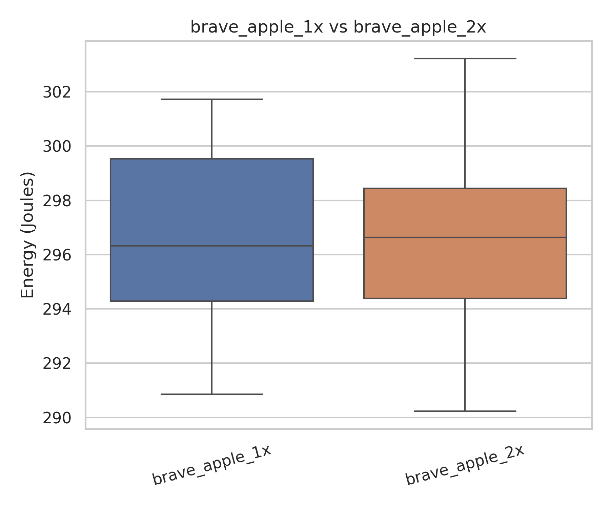
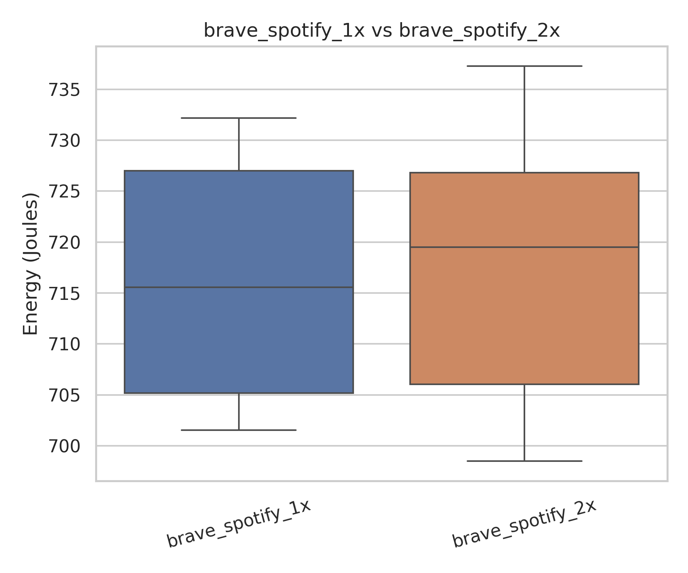
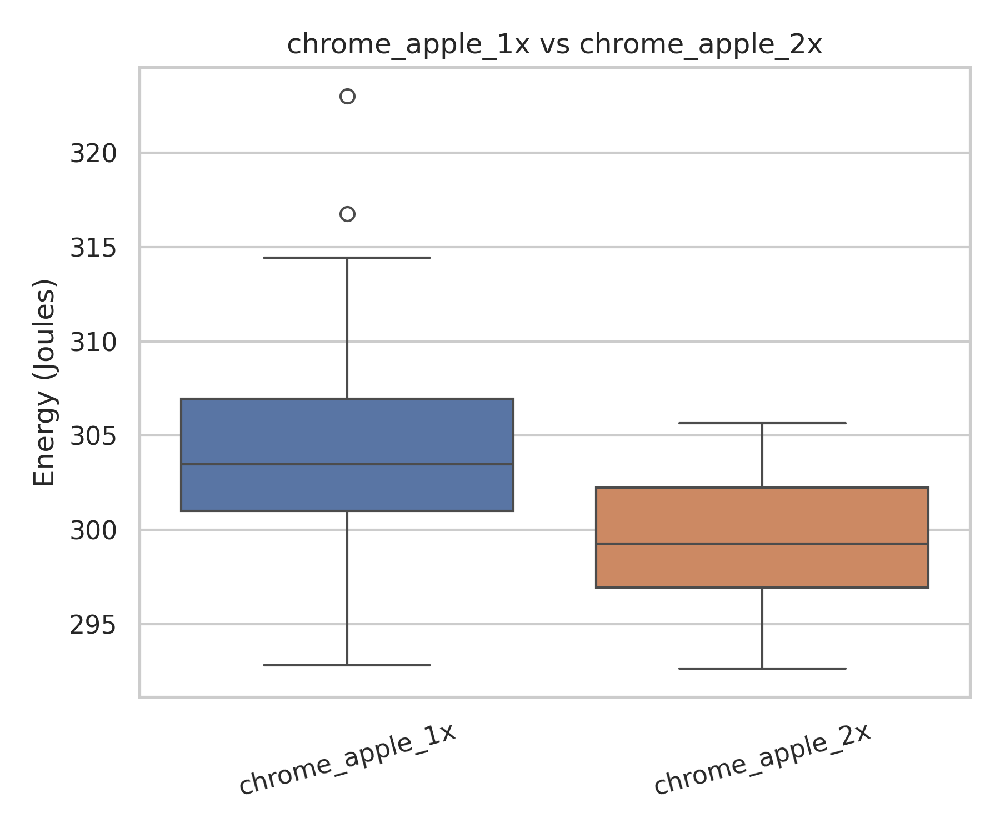
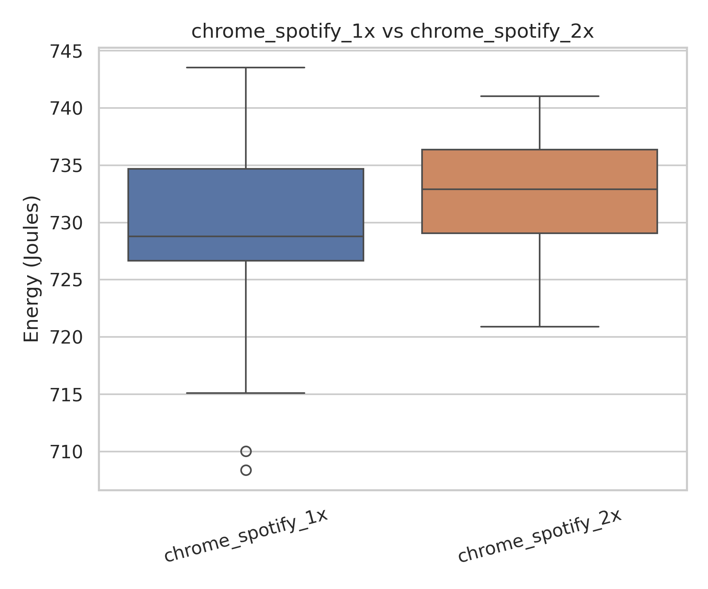

# Energy Consumption for Online Podcast Playback

## 1\. Introduction  
Digital media consumption has become an integral part of everyday life, spanning platforms such as YouTube, Netflix, and digital music services. Podcasts, in particular, have seen significant growth in recent years \[1\], with millions of users consuming audio content daily through platforms such as Spotify and Apple Podcasts. A common user behaviour on these platforms is adjusting playback speed (e.g., 1x, 1.5x, or 2x) to listen to the content faster and more efficiently \[2\]\[3\].

While increasing playback speed reduces listening time, the net effect of this trade-off on total energy consumption is not immediately obvious as faster playback increases processing demand while reducing overall playback duration.

Most existing research on streaming sustainability focuses on network infrastructure, data centers, or media compression efficiency \[4\]. Existing podcast research largely focuses on language learning, education, and user engagement. However, less attention has been given to client-side energy consumption, that is, the energy used by end-user devices during playback. Since end-user devices are widely distributed and always active, even small differences in power usage may accumulate into meaningful environmental impacts when scaled across millions of users.

This study investigates how playback speed affects device-level energy consumption during desktop web-based podcast streaming. Specifically, we compare Spotify and Apple Podcasts web players under controlled conditions and measure total energy usage and average power consumption of the content consumed.

By isolating playback speed as a behavioural variable, this work contributes to sustainable software engineering by examining how everyday user choices interact with software design and platform implementation to influence energy efficiency.

**Research Question:**  How does increasing playback speed (1x vs 2x) influence device-level energy consumption during desktop-based podcast streaming across different platforms and browsers?

## 2\. Methodology

### 2.1 Experimental Overview

This study measures device-level energy consumption during continuous podcast playback under controlled desktop conditions. The experiment assesses how playback speed and browser implementation influence energy usage.

All measurements were conducted on a single laptop to eliminate hardware variability. Playback sessions were fully automated to ensure identical interaction across all configurations.

### 2.2  Design Decisions and Platform Selection

The experimental framework and platform choices were guided by three main categories: experimental control, reproducibility, and relevance to real-world usage.

#### Selection of Spotify and Apple Podcasts

Spotify and Apple Podcasts were chosen because they are two of the most widely used podcast platforms globally \[5\]\[6\]. Both platforms support variable playback speed, which is central to our research question. Comparing these two platforms allows us to evaluate whether implementation differences influence energy efficiency under the same playback conditions.

#### Web-Based Platforms vs Native Applications

The web versions of Spotify and Apple Podcasts were selected instead of their desktop applications. While native applications are more commonly used, web-based playback allows for stronger experimental control and automation. Browser automation frameworks such as Playwright allow constant scripting of navigation, playback initiation, and speed adjustment. This ensures that all trials follow an identical structure and can be reproduced reliably.

#### Selection of Chrome and Brave Browsers

Google Chrome and Brave were selected as representative Chromium-based browsers. Google Chrome was selected due to its current global market share \[7\]. To maintain experimental control, a second Chromium-based browser was selected rather than choosing a browser built on a different rendering engine. By selecting two browsers based on the same engine, variability introduced by engine-level architecture is reduced. This allows for a more controlled comparison focused on browser-level implementation differences, background process behaviour, and energy management strategies rather than engine-specific effects.

### 2.3 Experimental Variables

#### Independent Variables 

The following factors were varied:

* Browser  
  * Google Chrome  
  * Brave Browser  
* Playback Speed  
  * 1x (normal speed)  
  * 2x (accelerated playback)  
* Podcast Platform  
  * Spotify  
  * Apple Podcasts

This results in eight configurations:

* Chrome \- Spotify \- 1x speed  
* Chrome \- Spotify \- 2x speed  
* Brave \- Spotify \- 1x speed  
* Brave \- Spotify \- 2x speed  
* Chrome \- Apple Podcasts \- 1x speed  
* Chrome \- Apple Podcasts \- 2x speed  
* Brave \- Apple Podcasts \- 1x speed  
* Brave \- Apple Podcasts \- 2x speed

### 2.4 Test Platform

All experiments were conducted on a single laptop to remove hardware related variability.

| Component | Specification |
| :---- | :---- |
| Model | Lenovo Yoga Pro 7 14ASP9 |
| CPU | AMD Ryzen™ AI 9 365 (20 logical cores) |
| Integrated GPU | AMD Radeon™ 890M |
| Memory | 32 GB RAM |
| Architecture | x86\_64 |

### 2.5 Software Environment

| Component | Specification |
| :---- | :---- |
| Operating System | Ubuntu 25.10 |
| Kernel | Linux 6.17.0 |
| Desktop Environment | GNOME 49 |
| Display Server | Wayland |
| Firmware Version | PSCN17WW |

### 2.6 Measurement Setup

Energy measurements were collected using EnergiBridge \[8\]. EnergiBridge samples processor energy counters at specific intervals. For our experiment we used an interval of 500ms. 

Total energy consumption for each trial was computed using the cumulative CPU\_ENERGY counter:

Energy \= Final Value \- Initial Value

### 2.7 Automation Procedure

Playback sessions were fully automated using Playwright \[9\], a browser automation framework that enables deterministic control of web-based interactions. Playwright allows programmatic launching of browser instances, navigation to specific URLs, and scripted interaction with page elements. This ensures that each trial follows an identical execution path, eliminating variability caused by manual user input.

Persistent browser profiles were used to maintain authenticated sessions and ensure consistent playback behaviour across runs. This avoids repeated login flows and ensures that DRM modules and session states remain stable throughout the experiment.

Rather than relying solely on user interface controls, playback was initiated through scripted interaction with the player interface, after which the HTML ‘\<audio\>’ element’s ‘playbackRate’ property was set programmatically to ensure consistent speed configuration. Playback initiation was verified before energy measurement began to ensure that decoding activity was active.

Each trial followed the same automated sequence:

1. Launch browser  
2. Wait for browser initialisation (5 seconds)  
3. Navigate to the podcast platform web player at the selected podcast episode URL  
4. Wait for page load stabilisation  
5. Click play  
6. Wait to ensure playback start (3 seconds)  
7. Set playback speed (1x or 2x)  
8. Start energy measurement (EnergiBridge)  
9. Measure for 90 seconds  
10. Stop measurement  
11. Close browser  
12. Cooldown period of 30 seconds

The browser startup, page load, and playback start waits allow buffering, decoding, and CPU frequency scaling to stabilise before measurements are recorded. The cooldown phase reduces carryover effects between runs.

Automation ensures reproducibility, consistent timing, and identical interaction patterns across all configurations.

### 2.8 Controlled Variables

The following factors were held constant across all trials:

* Screen resolution  
* Playback content (same podcast episode)  
* System volume and speaker  
* Network connection  
* Background applications   
* Measurement duration  
* Sampling interval  
* Hardware configuration

### 2.9 Repetition Strategy and Variance Reduction

Each configuration was repeated 30 times to reduce measurement variation caused by:

* OS scheduling behaviour  
* Background system processes  
* Core temperatures  
* Short term system noise

## 3\. Results & Data Analysis

### 3.1 Data Cleaning and Preprocessing

Each configuration was run 30 times, resulting in a total of 240 measurements across all configs. Energy values were computed using the *CPU\_ENERGY* counter retrieved from EnergiBridge.

Outlier detection was done using the three-standard-deviation rule (|x − x̄| \> 3s). 

A total of 1 run was identified as a statistical outlier and removed from further analysis.  The remaining data were used for statistical testing. This outlier was removed from the brave\_apple\_1x configuration. 

### 3.2 Exploratory Analysis & Visualisations

| *Configuration* | *\# samples* | *Mean (J)* | *Std (J)* | *Median (J)* |
| ----- | ----- | ----- | ----- | ----- |
| **Chrome \- Apple 1x** | 30 | 304.24 | 6.41 | 303.49 |
| **Chrome \- Apple 2x** | 30 | 299.26 | 3.68 | 299.27 |
| **Chrome \- Spotify 1x** | 30 | 728.74 | 8.57 | 728.78 |
| **Chrome \-Spotify 2x** | 30 | 732.30 | 5.17 | 732.90 |
| **Brave \- Apple 1x** | 29 | 296.78 | 3.30 | 296.32 |
| **Brave \- Apple 2x** | 30 | 296.32 | 3.14 | 296.63 |
| **Brave \- Spotify 1x** | 30 | 716.36 | 11.85 | 715.56 |
| **Brave \- Spotify 2x** | 30 | 716.83 | 11.16 | 719.50 |

#### Global Box Plot

#### Global Violin Plot

#### Focused 1x versus 2x Box Plots

  
  

  
  

### 3.3 Normality Testing

The Shapiro-Wilk test was applied to each configuration to assess normality of energy measurements.  For configurations where p ≥ 0.05, normality was assumed. For configurations where p \< 0.05, data was considered non-normal.

| *Configuration* | *Shapiro p-value* | *Normal Distribution Assumed?* |
| ----- | ----- | ----- |
| **Chrome \- Apple 1x** | 0.132789 | Yes |
| **Chrome \- Apple 2x** | 0.532414 | Yes |
| **Chrome \- Spotify 1x** | 0.170301 | Yes |
| **Chrome \- Spotify 2x** | 0.604625 | Yes |
| **Brave \- Apple 1x** | 0.104885 | Yes |
| **Brave \- Apple 2x** | 0.819705 | Yes |
| **Brave \- Spotify 1x** | 0.000055 | No |
| **Brave \- Spotify 2x** | 0.009320 | No |

### 3.4 Statistical Significance Testing

To compare 1x and 2x playback within each browser-platform pair, a two-sided Welch’s t-test was performed for configurations satisfying normality (α \= 0.05), while the Mann-Whitney U test was applied for non-normally distributed data.

| *Comparison* | *Test Used* | *p-value* | *Statistically Significant?* |
| ----- | ----- | ----- | ----- |
| **Chrome \- Spotify (1x vs 2x)** | Welch’s t-test | 0.057297 | No |
| **Brave \- Spotify (1x vs 2x)** | Mann-Whitney U | 0.911709 | No |
| **Chrome \- Apple (1x vs 2x)** | Welch’s t-test | 0.000583 | Yes |
| **Brave \- Apple (1x vs 2x)** | Welch’s t-test | 0.585504 | No |

### 3.5 Effect Size Analysis

Effect sizes were interpreted using standard thresholds for Cohen’s d (small ≥ 0.2, medium ≥ 0.5, large ≥ 0.8) \[10\]  and the Common Language Effect Size interpretation framework.

| *Comparison* | *Effect Size Method* | *Effect Size Value(s)* | *Interpretation* |
| ----- | ----- | ----- | ----- |
| **Chrome \- Spotify (1x vs 2x)** | Cohen’s d | d \= \-0.5030 | Medium |
| **Brave \- Spotify (1x vs 2x)** | Median ΔM \+ CLES | ΔM \= \-3.9388 CLES \= 0.4911 | \~49.11% probability (no clear dominance) |
| **Chrome \- Apple (1x vs 2x)** | Cohen’s d | d \= 0.9537 | Large |
| **Brave \- Apple (1x vs 2x)** | Cohen’s d | d \= 0.1429 | Negligible |

### 3.6 Summary of Findings

Across 240 experimental runs, only one statistical outlier was identified and removed (Brave-Apple 1x), allowing for measurement stability and consistency across configurations.

#### Normality and Test Selection

Shapiro-Wilk testing indicated that all configurations except Brave-Spotify (1x and 2x) satisfied normality assumptions. Thus:

* Welch’s t-tests were applied for all normally distributed comparisons.  
* The Mann-Whitney U test was applied for Brave-Spotify.

#### Statistical Significance

Only the **Chrome-Apple (1x vs 2x)** comparison showed a statistically significant difference (p \= 0.000583). All other browser-platform pairs showed no statistically significant difference at a \= 0.05.

However, it is worth noting that Chrome–Spotify approached significance (p \= 0.057), but did not meet the α \= 0.05 threshold.

#### Effect Sizes and Practical Significance

Effect size analysis revealed the following:

* **Chrome-Apple** showed a large effect size (d \= 0.95), indicating a significant reduction in energy consumption at 2x  playback.  
* **Chrome-Spotify** showed a medium effect size (d \= 0.50) meaning that the difference between 1× and 2x  playback was moderate in size, but there was not enough statistical evidence to confirm that the difference is reliable.  
* **Brave-Spotify** demonstrated negligible practical difference (CLES ≈ 0.49), meaning that the energy consumption was more or less the same for 1x and 2x playback.  
* **Brave-Apple** also showed a negligible effect (d \= 0.14). Playback speed had very little impact on energy consumption.

These statistical findings form the basis for the interpretation presented in the following discussion section.

## 4\. Discussion

### 4.1 Interpretation of Results

Across 240 experimental runs, playback speed did not consistently reduce device-level energy consumption. Only the Chrome–Apple configuration showed a statistically significant difference between 1x and 2x playback (p \= 0.000583), with a large effect size (d \= 0.95). In all other cases, differences were either small or statistically non-significant (e.g., Chrome–Spotify, p \= 0.057; Brave–Spotify, p \= 0.912).

Platform differences were much larger. Spotify consumed approximately 716–732 J per run, while Apple Podcasts consumed approximately 296–304 J under identical conditions. This represents more than a twofold difference in total energy use. These findings suggest that platform implementation has a substantially greater influence on energy consumption than playback speed.

### 4.2  Practical Significance

From a practical standpoint, increasing playback speed is unlikely to produce consistent energy savings for most users. While Chrome–Apple showed a measurable reduction at 2x speed, the absolute difference was modest relative to total consumption.

In contrast, platform choice resulted in energy differences exceeding 400 J per trial. When scaled across repeated listening sessions and large user bases, such differences could become meaningful. These results suggest that improvements in platform efficiency may offer greater sustainability benefits than behavioural adjustments such as increasing playback speed.

## 5\. Limitations and Issues

This study was conducted on a single laptop running a fixed operating system configuration. While this improved experimental consistency, it limits generalisability to other hardware architectures, particularly ARM-based systems, mobile devices, or alternative operating systems. 

Energy measurements were based on CPU package-level counters and did not isolate GPU, memory, or network contributions. As media streaming engages multiple subsystems, total device energy may differ from CPU measurements alone.

The measurement window (90 seconds) may not fully capture longer-term adaptive behaviour such as buffering adjustments or dynamic bitrate changes. The experiment also focused exclusively on web-based playback. Native desktop or mobile applications may employ different media pipelines, hardware acceleration strategies, or background processes, which could alter energy characteristics.

Finally, despite careful control of variables, minor variability may still arise from operating system scheduling behaviour, background processes, thermal conditions, and adaptive streaming dynamics. Although repetition reduced random noise, such factors cannot be entirely eliminated.

## 6\. Conclusion

This study examined how playback speed influences device-level energy consumption during desktop-based web podcast streaming. Across 240 experimental runs, playback speed did not consistently reduce energy use. Only one browser–platform combination showed a statistically significant difference.

Platform choice had a substantially larger impact on energy consumption than playback speed. The findings suggest that improvements in platform design are likely to have a greater effect on energy efficiency than changes in listening behaviour.

## 7\. Future Work

Future work could compare web-based players with native applications, extend experiments to mobile devices, and include additional playback speeds such as 1.5x. Measuring GPU and memory energy separately would provide a more complete system-level view. Further studies could examine offline playback, video podcasts, and other operating systems to improve generalisability.

## References

\[1\] Podcast Statistics. n.d. *33 Podcast Statistics 2026 (Number of Podcasts & Viewership).* Retrieved February 23, 2026 from [https://podcastatistics.com/](https://podcastatistics.com/)

\[2\] A. Harris. 2016\. Lots of Us Listen to Podcasts Faster Than “Normal.” Join Us\! *Slate.* October 6, 2016\. Retrieved February 23, 2026 from [https://www.slate.com/blogs/normal/2016/10/06/speed\_listening\_to\_podcasts\_is\_totally\_normal\_and\_practical.html](https://www.slate.com/blogs/normal/2016/10/06/speed_listening_to_podcasts_is_totally_normal_and_practical.html)

\[3\] K. Notopoulos. 2024\. The Best Speed for Podcasts Is 1.2X. Trust Me. *Business Insider.* January 5, 2024\. Retrieved February 23, 2026 from [https://www.businessinsider.com/best-speed-podcasts-audiobooks-how-to-listen-2024-1](https://www.businessinsider.com/best-speed-podcasts-audiobooks-how-to-listen-2024-1)

\[4\] S. Afzal, N. Mehran, Z. A. Ourimi, F. Tashtarian, H. Amirpour, R. Prodan, and C. Timmerer. 2024\. A survey on energy consumption and environmental impact of video streaming. *arXiv preprint arXiv:2401.09854.* Retrieved February 23, 2026 from [https://arxiv.org/abs/2401.09854](https://arxiv.org/abs/2401.09854)

\[5\] M. Harutyunyan. 2026\. Must-Know Podcast Statistics in 2026\. *Loopex Digital.* January 30, 2026\. Retrieved February 23, 2026 from [https://www.loopexdigital.com/blog/podcast-statistics](https://www.loopexdigital.com/blog/podcast-statistics)

\[6\] Teleprompter.com Team. 2025\. Podcast Statistics 2025: Global Listener Growth and Trends. [*Teleprompter.com*](http://Teleprompter.com)*.* November 28, 2025\. Retrieved February 23, 2026 from [https://www.teleprompter.com/blog/podcast-statistics](https://www.teleprompter.com/blog/podcast-statistics)

\[7\] StatCounter. n.d. *Browser market share worldwide (desktop).* Retrieved February 23, 2026 from [https://gs.statcounter.com/browser-market-share/desktop/worldwide](https://gs.statcounter.com/browser-market-share/desktop/worldwide)

\[8\] T. Durieux. n.d. *EnergiBridge.* GitHub repository. Retrieved February 23, 2026 from [https://github.com/tdurieux/energibridge](https://github.com/tdurieux/energibridge)

\[9\] Microsoft. n.d. *Playwright.* Retrieved February 23, 2026 from [https://playwright.dev/](https://playwright.dev/)

\[10\] Statistics How To. n.d. *Cohen’s d: Definition, formula and examples.* Retrieved February 23, 2026 from [https://www.statisticshowto.com/probability-and-statistics/statistics-definitions/cohens-d/](https://www.statisticshowto.com/probability-and-statistics/statistics-definitions/cohens-d/)