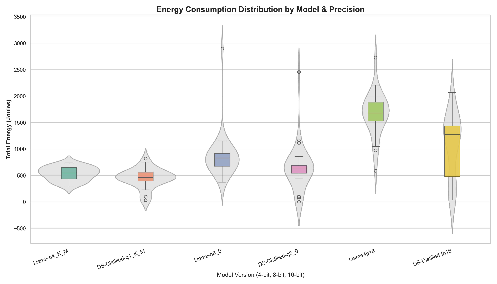
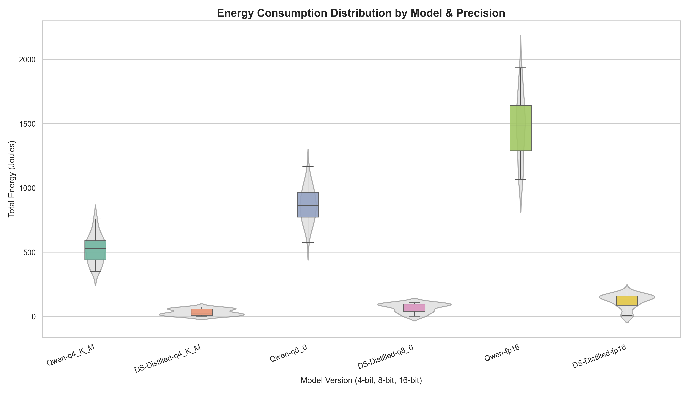
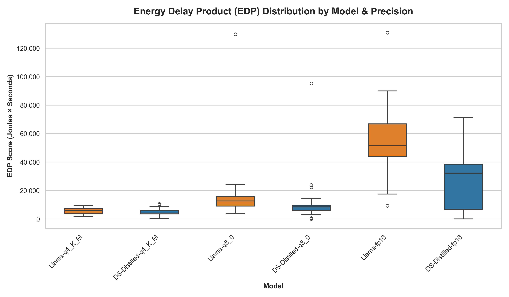
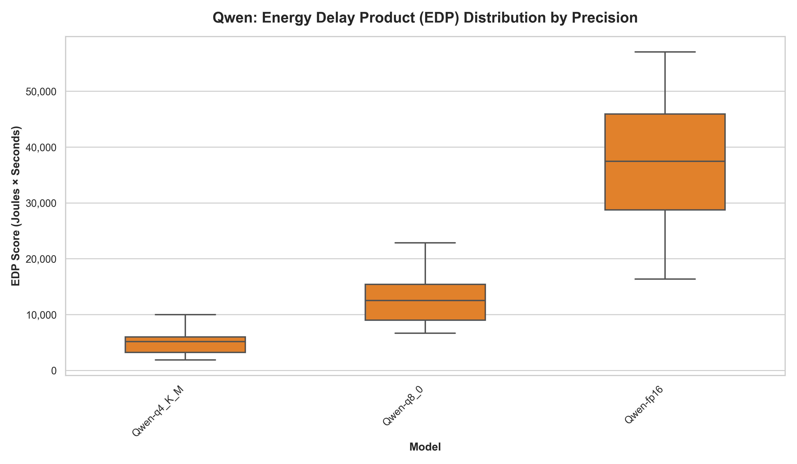
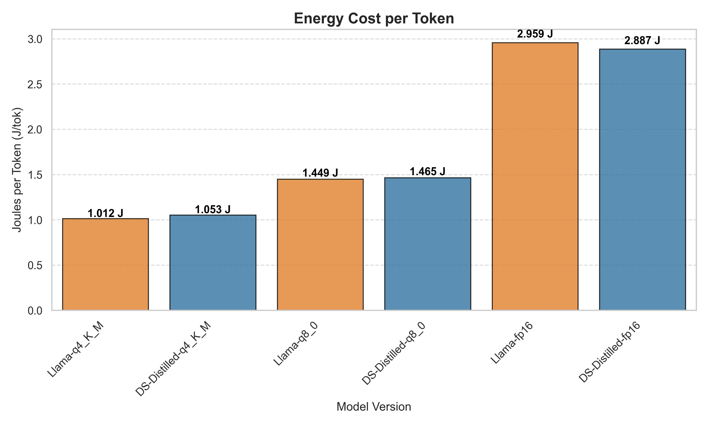
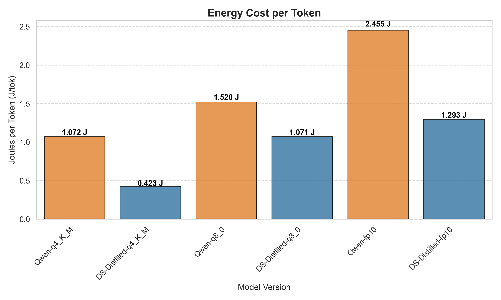

## Introduction
The widespread adoption of Large Language Models (LLMs) has become a reality in recent years. The field is now intensely competitive, with larger and more specialised models being introduced at an unprecedented pace. Yet, this rapid progress carries significant energy demands. In the early stages, progress was driven by expanding datasets and training for longer durations on more expensive, high-end hardware; performance gains were solely obtained through vertical scaling. However, what if bigger is not always better? This revelation came in January 2025 with the release of DeepSeek-R1, a model which could match the performance of well established LLM giants such as ChatGPT and Gemini, using low-end GPUs at a fraction of the training cost. This breakthrough signalled a paradigm shift, demonstrating that algorithmic and architectural efficiency are an untapped source of performance gains with significant implications for energy usage and efficiency.

## Motivation
While DeepSeek’s training efficiency has been widely celebrated, its inference efficiency implications remain largely unexplored. This distinction is important because unlike training which occurs only once, inference occurs repeatedly over the course of a model’s lifetime which could potentially lead to greater cumulative energy consumption. DeepSeek achieves its efficiency through its unique combination of a sparse mixture of expert architecture, reinforcement learning, and data distillation techniques. Consequently, only a reduced subset of relevant parameters are activated during inference, thus allowing the model to generate an answer more efficiently using fewer tokens. This raises an interesting research question: if these sparse activation patterns can reduce computational load during inference, could this efficiency pattern be transferred to entirely different models through the process of distillation? If successful, this would demonstrate that efficiency is not merely a property of a particular model, but a learnable behaviour that can be transplanted. This study therefore investigates whether distillation from models trained using DeepSeek’s approach yields student models that are more energy-efficient compared to their conventionally-trained counterparts.

## Methodology
To answer our research question, we designed an experimental setup to compare the energy consumption between DeepSeek distilled and conventionally-trained models under controlled conditions. When it comes to the choice of particular models to test, we decided to use Llama 3.1 and Qwen 2.5 because the release of DeepSeek-R1 includes distilled variants of both architectures. This allows us to perform a direct comparison without needing to distill the models ourselves. For each architecture, we test at 3 quantization levels (4, 8, and 16 bit) to determine whether any observed efficiency differences persist across the range of precisions used in common deployments.

We ran the models on a single laptop with the following specifications:
- GPU: Nvidia GeForce RTX 4090 Mobile 16GB GDDR6
- CPU: 13th Gen Intel(R) Core(TM) i9-13900H (2.60 GHz)
- OS: NixOS 25.11 “Xantusia”

We test the following 12 models locally using [Ollama](https://ollama.com/) and measure their energy consumption using [EnergiBridge](https://github.com/tdurieux/EnergiBridge). Due to storage limitations, we could only load 6 models at a time on the system, so each architecture was tested separately on different days which should not impact our findings since we are not comparing architectures.

**Batch 1**
- deepseek-r1_8b-llama-distill-fp16  VS  llama3.1_8b-instruct-fp16
- deepseek-r1_8b-llama-distill-q8_0  VS  llama3.1_8b-instruct-q8_0
- deepseek-r1_8b-llama-distill-q4_K_M  VS  llama3.1_8b-instruct-q4_K_M

**Batch 2**
- deepseek-r1_7b-qwen-distill-q4_K_M  VS  qwen2.5_7b-instruct-q4_K_M
- deepseek-r1_7b-qwen-distill-q8_0  VS  qwen2.5_7b-instruct-q8_0
- deepseek-r1_7b-qwen-distill-fp16  VS  qwen2.5_7b-instruct-fp16

Each model receives an identical prompt featuring a [Connections Word Puzzle](https://www.connectionsunlimited.org/?archive=2/2/2026#login), chosen for its open-ended nature and complexity which ensures that models must engage in genuine problem solving rather than simple recall. We disable DeepSeek’s thinking mode to facilitate fair comparison with the original model which does not support this feature. This prompt is repeated 30 times for each model, using new sessions each time to prevent any caching effects that could skew energy measurements, for a total of 360 inferences. We also conduct 30 control measurements for each architecture where we measure the system’s idle energy usage as a baseline.

Before starting the experiment, we ensure a minimal running system by closing all applications, removing all physical connections to peripherals and disabling network, bluetooth, and notifications. We also set the room temperature to a constant value of 17 degrees Celsius and freeze our settings by disabling any automatic setting adjustments; in particular, we set the screen brightness to a fixed value of 70%.  We then warm-up the system for 5 minutes by prompting the models without invoking EnergiBridge, and subsequently generate a randomised trial schedule. A trial can be either an inference or an idle control. We use random shuffling to mitigate the effects of possible changes in the environment which could skew energy measurements. Between each trial, we allow the system to rest for 1 minute to prevent anomalous energy readings due to tail energy consumption. We automated the entire experimental procedure using bash scripts and made our [replication package](https://github.com/wmarcu/cs4575-llm-comparison) publicly available to be transparent and encourage reproducibility.

## Data Preprocessing
With our raw metrics successfully recorded by _EnergiBridge_, we were left with 420 individual CSV files (30 trials across 12 model configurations, plus a baseline control group in each experiment). In this study, we focus on Graphics Processing Unit (GPU) metrics because LLM inference is fundamentally a GPU-bound workload. 

### Total Energy (Trapezoid Rule)
EnergiBridge records power consumption as a rate (milliwatts) at regular time intervals. To find the actual total energy consumed by the GPU during a prompt generation, we needed to calculate the total area under the power-over-time curve. We achieved this by applying the **Trapezoid Rule** for numerical integration. By integrating the GPU power (converted to Watts) over the duration of the execution (in seconds), we successfully derived the Total Energy in *Joules* for every single trial.

### Data Cleaning: Errors and Outliers

In empirical software engineering, there is a strict difference between a statistical outlier (a valid run that was unexpectedly slow) and invalid data. Including broken runs in our dataset would artificially lower our average energy consumption so it is vital to account for this. We first scanned the output logs to remove cases where the model failed to load, likely due to GPU VRAM bottlenecks. Any trial that hit our hard execution limit (60 seconds) was classified as a timeout. Finally, we applied a consistent statistical filter across every model configuration. Any trial whose total execution time deviated from its sample *mean by more than 3 standard deviations* was removed. In total, our cleaning pipeline discarded 14 invalid or anomalous runs. We retained the clean dataset of **406 valid executions** out of the original 420.

### Baseline Subtraction
To ensure our measurements reflected pure algorithmic efficiency, rather than static hardware overhead, we utilized our control group to calculate the system’s baseline idle power. By subtracting this constant background footprint from the total energy of each execution, we isolated the Dynamic Energy *(ΔΕ)*. This provides a much clearer comparison of each model's true efficiency.

## Results & Discussion

### Energy Consumption
To visualize the distribution of energy consumption across our 12 configurations, we utilized **Violin-Boxplots**. This representation allows us to observe both the central tendencies (median) and the probability density of the trials, which is critical for assessing model reliability.

<figure style="max-width: 800px;">
  
  <figcaption><strong>Figure: Llama vs. DeepSeek Distilled Violin-Boxplot</strong></figcaption>
</figure>

<figure style="max-width: 800px;">
  
  <figcaption><strong>Figure: Qwen vs. DeepSeek Distilled Violin-Boxplot</strong></figcaption>
</figure>

Across both architectures, the data illustrates a substantial decrease in energy demand as precision is reduced. Moving from **16-bit** to **4-bit** precision resulted in a median energy reduction of approximately **65-70%**. DeepSeek-r1-7b is the exception to this while showing much smaller relative gains from quantization because it already operates at an efficient low energy floor in its 16-bit configuration (under 250J). 

Furthermore, when considering distillation, the results suggest a trend toward lower energy requirements in the DeepSeek-distilled student, especially for Qwen. For instance, while **Qwen-fp16** median energy hovered near **1500 Joules**, the **DS-fp16** version operated below **250 Joules**. This observation supports the idea that efficiency-focused training and distillation might manifest as lower physical energy demand during inference. 

A key finding in our analysis is the _"Stability Gap"_ observed between precision levels. In batch 1, the 4-bit models show compact distributions, indicating a high degree of predictability. However, as precision increases, both the baseline Llama and the DeepSeek distilled models exhibit elongated "necks" and extreme outliers reaching 3000 Joules. In the **16-bit** comparison, while the DeepSeek-distilled model maintained a lower median, it showed significantly **higher variance**, represented by a much taller boxplot.

Since we minimize external noise and use identical prompts, this variance likely represents _internal algorithmic stochasticity_. This indicates that the distilled model’s internal activation patterns are less stable at high precision, leading to fluctuations in energy demand that are not present in the Llama baseline. Interestingly, batch 2 disrupts this trend. The DeepSeek-distilled Qwen maintains a compact, predictable distribution across all precision levels. This lack of extreme variance indicates that high-precision volatility is not a universal trait of distilled models, and may instead be influenced by the specific characteristics of the base architecture. 

### Statistical Significance and Normality Testing
To quantify the observed differences with scientific certainty, we must look beyond visual distributions. Building on our exploratory data analysis, we applied statistical validation to quantify the energy differences for statistically sound results. To select the appropriate significance tests, we first evaluated the normality of our dynamic energy data using the **Shapiro-Wilk test**. 

**Table 1: Statistical Validation (Llama vs DeepSeek-Distilled)**

| Precision | Llama Norm (*p*) | DeepSeek Norm (*p*) | Statistical Test | Significance Result (*p*) |
| :--- | :--- | :--- | :--- | :--- |
| 4-BIT | 0.288 | 0.065 | Welch's T-Test | 0.045 |
| 8-BIT | < 0.001 | < 0.001 | Mann-Whitney U | 0.002 |
| 16-BIT | 0.127 | 0.011 | Mann-Whitney U | < 0.001 |

**Table 2: Statistical Validation (Qwen vs DeepSeek-Distilled)**

| Precision | Qwen Norm (*p*) | DeepSeek Norm (*p*) | Statistical Test | Significance Result (*p*) |
| :--- | :--- | :--- | :--- | :--- |
| 4-BIT | 0.602 | 0.007 | Mann-Whitney U | < 0.001 |
| 8-BIT | 0.999 | < 0.001 | Mann-Whitney U | < 0.001 |
| 16-BIT | 0.345 | < 0.001 | Mann-Whitney U | < 0.001 |

Across every tested configuration in both experiments, the energy differences were **statistically significant** *(p < 0.05)*, confirming that the observed energy savings are conclusive and not the result of random experimental noise.
Because Large Language Model inference involves probabilistic token generation, executions are rarely purely deterministic. Therefore, after ruling out experimental errors and external noise, we can conclude that non-normality here is an expected characteristic of AI execution, not an experimental flaw.

### Effect Size
Effect Size analysis measures the magnitude of those differences to assess their practical significance. We use two primary metrics based on the data distribution:

- **Cohen’s d**: Used for normal distributions to measure the difference between means normalized by standard deviation.
- **Vargha-Delaney A12**: A non-parametric "common language" effect size used for non-normal data. It represents the probability that a random execution from the first group will consume more energy than one from the second.

**Table 1: Horizontal Effect Size (Llama vs. DeepSeek Distilled)**

| Precision | Metric | Llama Energy (J) | DeepSeek Energy (J) | Distill Savings | Effect Size Metric | Value | 
| :--- | :--- | :--- | :--- | :--- | :--- | :--- | 
| 4-BIT | Mean | 534.2 | 448.2 | 16.1% | Cohen's d | 0.54 | 
| 8-BIT | Median | 827.2 | 641.1 | 22.5% | A12 | 0.74 | 
| 16-BIT | Median | 1677.7 | 1273.2 | 24.1% | A12 | 0.81 |

**Table 2: Horizontal Effect Size (Qwen vs. DeepSeek Distilled)**

| Precision | Metric | Qwen Energy (J) | DeepSeek Energy (J) | Distill Savings | Effect Size Metric | Value | 
| :--- | :--- | :--- | :--- | :--- | :--- | :--- | 
| 4-BIT | Median | 526.6 | 25.8 | 95.1% | A12 | 1.00 |
| 8-BIT | Median | 864.0 | 81.4 | 90.6% | A12 | 1.00 | 
| 16-BIT | Median | 1482.5 | 143.6 | 90.3% | A12 | 1.00 |

The data indicates that the DeepSeek-distilled models are consistently more efficient than their baseline counterparts. The Vargha-Delaney **A12** value of **0.81** for the **16-bit** model, in Llama vs DeepSeek comparison, represents a large effect, indicating a high probability that a random DeepSeek-Distilled execution will be more efficient than a Llama execution. For Qwen, the distillation effect is really interesting achieving **~90%** energy savings across all precisions. The **A12** score of **1.00** means that in *100%* of the recorded pairs, the DeepSeek model consumed less energy than the Qwen baseline.

**Table 3: Vertical Effect Size (Quantization Savings)**\
*This table measures the impact of reducing precision (Quantization) within the same model family.*

| Model Family | FP16 &rarr; Q8 Sav. | A12 (16&rarr;8) | FP16 &rarr; Q4 Sav. | A12 (16&rarr;4) | Q8 &rarr; Q4 Sav. | A12 (8&rarr;4) |
| :--- | :--- | :--- | :--- | :--- | :--- | :--- |
| Llama 3.1 | 50.7% | 0.92 | 67.4% | 0.99 | 33.8% | 0.88 |
| DeepSeek R1 Distilled Llama 3.1 | 49.6% | 0.73 | 63.7% | 0.77 | 27.9% | 0.74 |
| Qwen 2.5 | 41.7% | 0.99 | 64.5% | 1.00 | 39.1% | 0.98 |
| DeepSeek R1 Distilled Qwen 2.5 | 43.3% | 0.81 | 82.0% | 0.90 | 68.3% | 0.78 |

Remarkably, even for the highly efficient *DeepSeek-Qwen* model, applying 4-bit quantization reduces its already low energy footprint by a further **82.0%**. While both distillation and quantization benefit energy savings, we observe that quantization is more effective in this regard.

### Energy Delay Product (EDP)
The transition from raw energy consumption to the EDP provides a holistic view of the efficiency of the Llama and DeepSeek architectures by penalizing slower execution times. 

<figure style="max-width: 800px;">
  
  <figcaption><strong>Figure: Llama vs. DeepSeek Distilled EDP boxplot</strong></figcaption>
</figure>

*The EDP plots of Qwen and DeepSeek-Distilled were separated, because of the high difference in EDP score.*

  <figure style="flex: 1; max-width: 800px;">
    
    <figcaption align="center"><strong>Figure: Qwen EDP boxplot</strong></figcaption>
  </figure>
  
  <figure style="flex: 1; max-width: 800px;">
    
    <figcaption align="center"><strong>Figure: DeepSeek-Distilled Qwen EDP boxplot</strong></figcaption>
  </figure>

We also measured volatility (**Coefficient of Variation, or CV%**) to indicate predictability, showing how much a model's individual runs deviate relative to its average.

**Table 1: EDP and Volatility - (Llama 3.1 8B vs DeepSeek Distilled Llama)**

| Model | Median Energy (J) | Time (s) | EDP Score | Volatility (CV%) | 
| :--- | :--- | :--- | :--- | :--- | 
| DS-q4_K_M | 462.5 | 9.60 | 4,162.0 | 56.8% |
| Llama-q4_K_M | 547.8 | 10.31 | 6,056.2 | 39.8% |
| DS-q8_0 | 641.1 | 12.81 | 8,535.3 | 154.4% |
| Llama-q8_0 | 827.2 | 15.41 | 12,660.5 | 135.1% |
| DS-fp16 | 1,273.2 | 23.01 | 32,111.7 | 71.2% |
| Llama-fp16 | 1,677.7 | 30.42 | 51,466.1 | 45.6% |

**Table 2: EDP and Volatility - (Qwen 2.5 7B vs DeepSeek Distilled Qwen)** 

| Model | Median Energy (J) | Time (s) | EDP Score | Volatility (CV%) | 
| :--- | :--- | :--- | :--- | :--- | 
| DS-q4_K_M | 25.8 | 3.20 | 79.8 | 85.4% | 
| Qwen-q4_K_M | 526.6 | 9.31 | 5,187.9 | 41.1% |
| DS-q8_0 | 81.4 | 4.60 | 358.5 | 61.7% | 
| Qwen-q8_0 | 864.0 | 14.61 | 12,553.9 | 32.0% |
| DS-fp16 | 143.6 | 7.60 | 1,097.2 | 57.0% | 
| Qwen-fp16 | 1,482.5 | 25.51 | 37,447.1 | 32.4% |

The results indicate that **4-bit** quantization generally represents the most sustainable configuration. Remarkably, DeepSeek distilled Qwen’s highest-cost configuration (*DS-fp16, EDP 1,097.2*) is still nearly five times more efficient than the baseline Qwen's lowest-cost configuration (*Qwen-q4_K_M, EDP 5,187.9*). Furthermore, the 4-bit versions exhibit the lowest relative volatility, indicating that aggressive quantization does not just save power, yielding more stable and predictable performance. In contrast, **8-bit** quantization acts as an unstable middle ground (*154.4% DeepSeek and 135.1% Llama*) where execution paths become highly unpredictable, occasionally triggering massive latency and energy spikes.

While the distilled DeepSeek models consistently achieve the lowest median EDP scores, their higher CV% values might initially suggest they are more erratic. For example, *Qwen 16-bit* quantization, the CV is 32.4%, while the *distilled version* shows a more "volatile" 57.0%. However, the EDP scores for Qwen range massively between 15,000 to 60,000, unlike the distilled version which remains small and stable.

### Joules per Token

To enable fair comparison of energy usage despite varying response length from the LLMs, we normalize the results by calculating **Joules used per token** generated. Our analysis reveals a critical distinction between a model's underlying computational cost and its algorithmic conciseness. For Llama, initial total energy results favored DeepSeek-Distilled, but normalization shows near-identical J/tok, indicating no fundamental difference in computational cost. For Qwen, however, the distilled DeepSeek model demonstrates dramatic efficiency gains across all precision levels. This suggests that for the Qwen architecture, distillation successfully reduced the computational overhead for token generation.

<figure style="flex: 1; max-width: 800px;">
  
  <figcaption><strong>Figure: Energy Cost per Token (Llama vs DeepSeek-Distilled)</strong></figcaption>
</figure>

<figure style="flex: 1; max-width: 800px;">
  
  <figcaption><strong>Figure: Energy Cost per Token (Qwen vs DeepSeek-Distilled)</strong></figcaption>
</figure>

### Verbosity Gap

We take a deeper look into the generated outputs to understand whether energy differences can be explained by a model’s natural tendency to be more or less verbose.

**Table: Verbosity Gap (Llama vs. DeepSeek Distilled)** 

| Precision | DeepSeek Tokens Median | Llama Tokens Median | Verbosity Gap (% Increase) | 
| :--- | :--- | :--- | :--- | 
| Q4 | 439 | 541 | +23.2% | 
| Q8 | 437 | 571 | +30.7% | 
| FP16 | 441 | 567 | +28.6% |

**Table: Verbosity Gap (Qwen vs. DeepSeek Distilled)** 

| Precision | DeepSeek Tokens Median | Qwen Tokens Median | Verbosity Gap (% Increase) | 
| :--- | :--- | :--- | :--- | 
| Q4 | 61 | 491 | +704.9% | 
| Q8 | 76 | 568 | +647.4% | 
| FP16 | 111 | 604 | +444.1% |

On average, the *baseline Llama* architecture generated **27.5%** more tokens per prompt than its *distilled counterpart*. The *baseline Qwen* architecture generated an astonishing **598.8%** more tokens per prompt than the highly concise *Qwen-distilled DeepSeek* model. These findings shift our understanding of DeepSeek's efficiency. While our results prove that distillation can improve mathematical instruction efficiency, both architectures definitively show that output volume is a massive driver of total power draw.

## Conclusion

Our statistical analysis reinforces the exploratory findings: architectural distillation provides a significant efficiency advantage, yielding savings ranging from 16% to over 90% depending on the underlying base architecture. However, the most profound and consistent impact on sustainability comes from quantization, which reduces energy consumption by upwards of 60% to 80% regardless of the model family. These results demonstrate that while architectural distillation is a highly effective and valid path to "Green AI," pairing it with aggressive quantization provides the most reliable and substantial practical savings for sustainable software deployments.

While our findings suggest that DeepSeek distillation effectively lowers the "energy floor," the magnitude of these savings is dependent on the base architecture, with Qwen achieving significantly higher efficiency gains than Llama. Another major factor affecting energy consumption is the difference in verbosity between the original model and its distilled counterpart. Conversational verbosity naturally leads to longer execution times, incurring proportionally higher total energy costs. DeepSeek seems to be optimised for this, so when it acts as a teacher, it enables students to satisfy prompt requirements with far fewer tokens. In the context of Green Software Engineering, this confirms that when evaluating an AI model that uses less total power is not necessarily more sustainable-it may simply be doing less work; true sustainability should be evaluated at the token level.

In Sustainable Software Engineering, predictability is highly valued in practical settings. If a model's energy consumption is erratic, it becomes much harder for developers to budget for power or optimize their systems. Our results suggest a practical trade-off: regular models offer predictable, consistent performance ideal for user-facing applications, while distilled models minimize total energy footprint over time at the cost of increased variability, making it suitable for background tasks.

Circling back to our research question, our results indicate that some level of efficiency transfer is possible through distillation. Both distilled models demonstrated measurable energy savings compared to their baselines, with Qwen’s architecture being seemingly more receptive to these efficiency gains.
While we cannot make absolute, universal claims without testing a wider array of model families, our results provide compelling evidence that distillation is a highly effective, albeit architecture-dependent, pathway for Green AI. Further research is necessary to fully map how these efficiency traits interact with different foundational neural networks across varied hardware.

## Limitations & Future Work 
This study prioritized experimental control, and a few design choices constrain how far the findings generalize.

All inferences used a single fixed prompt to maintain identical conditions across models; consequently, the observed verbosity and energy patterns are currently situated within the context of structured reasoning tasks. Testing across a broader prompt set would strengthen the conclusions, particularly to see whether the behavioral differences between distilled and non-distilled models persist across different task types like code generation or summarization.

The hardware setup is also worth acknowledging. Everything ran on a single machine, and energy readings during inference are sensitive to GPU architecture and thermal behavior. The relative differences between models should still hold, but the absolute values are specific to our setup. Expanding to additional model architectures beyond Llama and Qwen would help clarify whether the efficiency patterns found here are general properties of knowledge distillation from DeepSeek-R1, or something more specific to the two architectures tested.

Finally, DeepSeek's thinking mode was disabled throughout to keep the comparison fair against models that do not have an equivalent feature. The energy figures for DeepSeek are therefore likely lower than a real deployment with extended reasoning enabled would produce. Measuring that overhead, and whether it is offset by quality improvements, would be a natural follow-up.

Beyond these limitations, the most immediate extension would be evaluating response correctness alongside energy consumption. This study identifies which models are more efficient, but not whether that comes at a quality cost. Computing a quality per joule metric would make the findings considerably more actionable, and exploring different quantization parameters alongside this would also be worthwhile.

### References

1. Wang, L., et al. (2025). *Green prompting: A comprehensive evaluation of prompt engineering on LLM energy efficiency*. arXiv. [https://arxiv.org/html/2503.10666v1](https://arxiv.org/html/2503.10666v1)
2. Capgemini Research Institute. (2025). *From words to watts: How prompting patterns shape AI's environmental impact*. [Link to Report](https://www.capgemini.com/insights/expert-perspectives/from-words-to-watts-how-prompting-patterns-shape-ais-environmental-impact/)
3. Jin, H., et al. (2025). *The energy cost of reasoning: Analyzing energy usage in LLMs with test-time compute*. OpenReview. [https://openreview.net/forum?id=Kdc8aiKxF6](https://openreview.net/forum?id=Kdc8aiKxF6)
4. National Science Review. *DeepSeek-V3 Technical Report*. [Read Article](https://academic.oup.com/nsr/article/12/3/nwaf044/8010848?login=false)
5. Financial Content (2026). *The DeepSeek Disruption: How R1's $6 Million Breakthrough Shattered the AI Brute-Force Myth*. [Read Article](https://www.financialcontent.com/article/tokenring-2026-2-5-the-deepseek-disruption-how-r1s-6-million-breakthrough-shattered-the-ai-brute-force-myth)
6. *Training Efficiency:* Rinnovabili. *DeepSeek's Energy Consumption: AI's 75% Power Cut*. [Read Article](https://www.rinnovabili.net/business/markets/deepseeks-energy-consumption-ais-75-power-cut/)
7. *Inference Challenges:* MIT Technology Review (2025). *DeepSeek might not be such good news for energy after all*. [Read Article](https://www.technologyreview.com/2025/01/31/1110776/deepseek-might-not-be-such-good-news-for-energy-after-all/)
8. *Inference Challenges:* TechAnnouncer. *Unpacking DeepSeek Energy Usage: A Deep Dive into AI's Power Footprint*. [Read Article](https://techannouncer.com/unpacking-deepseek-energy-usage-a-deep-dive-into-ais-power-footprint/)
9. *Jevons Paradox (Overuse):* ScienceDirect. *DeepSeek efficient but high energy consumption due to popularity*. [Read Article](https://www.sciencedirect.com/science/article/pii/S266667582500147X)
10. *Methodology Limitations Note:* ScienceDirect. *Estimation-based analysis of AI energy trends* (Note: Relies on reported figures rather than direct measurement). [Read Article](https://www.sciencedirect.com/science/article/pii/S1364032125008329#tbl3)
