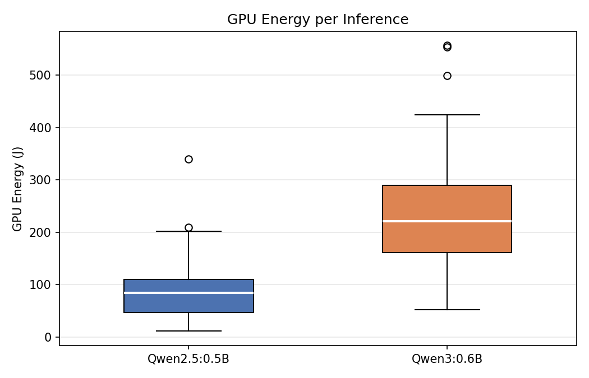
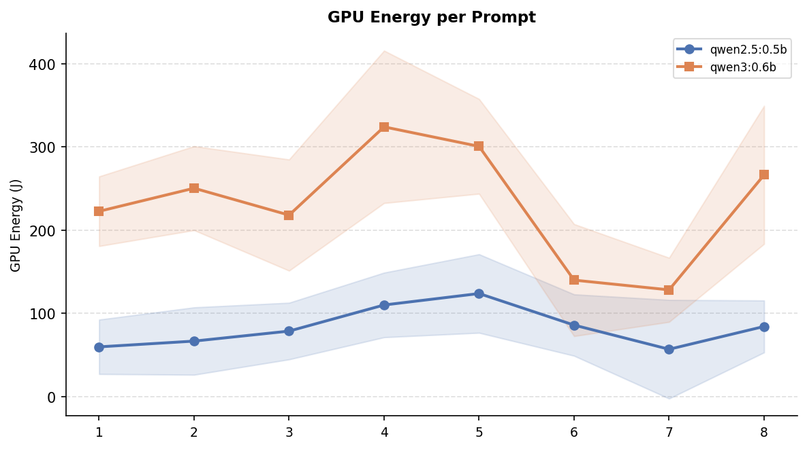
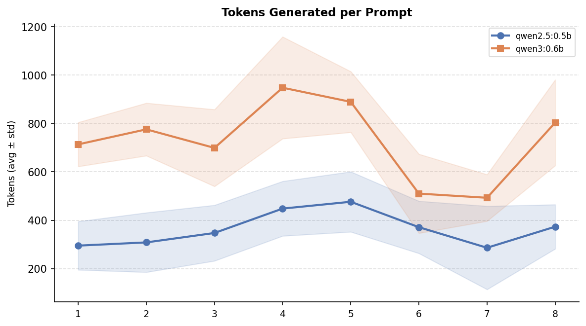
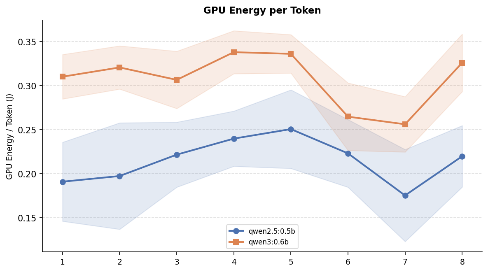

# Token to Energy: Comparing Energy Consumption of Different Large Language Models (LLMs)
24 Feb 2026 — Nicholas Wu, Levi Ari Pronk, Francisco Duque de Morais Amaro, Miroslav Atanasov

*While many of us use online providers to query Large Language Models (LLMs), there are offline alternatives that can be run locally. Have you ever wondered how much energy they actually consume? In this article, we explore just that!*

---

## Introduction

Large Language Models have become essential tools for answering questions, generating text, and assisting with a wide range of tasks. Services like ChatGPT, Gemini and Claude process billions of queries daily, but the energy cost of each inference is hidden behind an API call to remote datacenters spread around the world. An alternative is to run models *locally* using tools like [Ollama](https://ollama.com), an open-source framework that makes it straightforward to download and host LLMs on retail hardware.

Running models locally avoids the token bill, but raises a different one, which prompts a natural question: **how much energy does a single inference consume, and do you pay for better AI in electricity?** Even small differences in per-query energy consumption become significant when multiplied across millions of users and prompts. Understanding these differences is a first step toward making informed, energy-conscious choices about which model to deploy.

In this study, we compare two lightweight models from the Qwen family to investigate a simple but practical question: **Does better performance come at an energy cost**?

| Model | Parameters | Description | Size | 
|-------|-----------|-------------|-------|
| **[Qwen2.5:0.5B](https://ollama.com/library/qwen2.5:0.5b)**| 494 Million | Compact model from the Qwen 2.5 series | 398MB | 
| **[Qwen3:0.6B](https://ollama.com/library/qwen3:0.6b)** | 752 Million | Newer-generation model from the Qwen 3 series | 523MB |

The newer model is similar in size to its predecessor, yet performs meaningfully better across standard benchmarks [[1]](#ref-1). The models are close enough that any difference in energy consumption would be telling. If Qwen3 scores significantly higher on standard benchmarks while drawing the same power then better performance comes for free. If its energy footprint scales with its performance gains, it doesn't. Both models are small enough to run on a single retail GPU. We measure GPU energy consumption in joules and inference speed in tokens per second, repeating every test 30 times to allow for robust statistical analysis. A broader question of this blog is: to what degree is it worthwhile to scale up or down a model to change energy consumption?

---

## Experimental Setup

To allow for accurate replication of the experiment, the following sections describe the hardware, measurement approach, and experimental controls in detail.

### System Setup

All experiments were conducted on a home Linux machine with the following specifications:

| Component | Detail |
|-----------|--------|
| **Operating System** | Ubuntu 24.04.3 LTS |
| **GPU** | NVIDIA GeForce RTX 3060 |
| **Python** | 3.12.3 |
| **Ollama** | 0.16.3 |
| **CPU x Cores** | Intel Core i7-8700K x 12 | 
| **RAM** | 32GB |

All inference was performed on the GPU. The system was connected to mains power throughout. 

No other processes rather than Visual Studio Code with the open project were running during inference.

---

### Energy Measurement

GPU energy was measured by polling **[nvidia-smi](https://developer.nvidia.com/system-management-interface)** every 250 ms during each inference call. Total energy was then derived from those power samples using trapezoidal integration:

$$E_{\text{GPU}} \approx \sum_{i=1}^{N} \frac{P_{i-1} + P_i}{2} \cdot \Delta t_i$$

CPU energy consumption was also recorded as a secondary metric using **[Intel RAPL](https://www.intel.com/content/www/us/en/developer/articles/technical/software-security-guidance/advisory-guidance/running-average-power-limit-energy-reporting.html)** (Running Average Power Limit), taking snapshots at the beginning and at the end of every inference. RAPL [works](https://greencompute.uk/Measurement/RAPL) by using Model Specific Registers (MSRs) to track energy consumption at small (roughly 1 ms) intervals. 

The full implementation is available in the replication package under `benchmark.py` and `energy_monitor.py`.

### Used Prompts

To test the models across a range of topics and response complexities, we selected eight distinct (and extremely interesting) prompts covering biology, mathematics, computer science and physics: 

| # | Topic | Prompt |
|---|-------| -------|
| 1 | Speed of Light |What is the speed of light in a vacuum and why is it considered a universal constant? |
| 2 | Mitosis vs Meiosis| Explain the difference between mitosis and meiosis. |
| 3 | Northern Lights |  What causes the northern lights (aurora borealis)? |
| 4 | HTTPS Encryption | How does HTTPS encryption work? |
| 5 | Pythagorean Theorem | What is the Pythagorean theorem? Give a practical example of how it is used. |
| 6 | Water cycle |Describe the water cycle and its three main stages. |
| 7 | Photosynthesis | What is photosynthesis and what are its inputs and outputs? |
| 8 | Black Hole | Explain what a black hole is and how it forms. |

Each prompt asks the model to explain a well-known concept, producing responses that vary in length and complexity. This diversity allows us to observe how energy consumption scales with output size.

### Experimental Controls

To obtain reliable and statistically relevant GPU energy measurements, several controls were applied:

- **Alternating execution order.** For each iteration, every prompt was sent to Qwen2.5 first, then Qwen3, before moving to the next prompt (Prompt 1 $\rarr$ Qwen2.5, Prompt 1 $\rarr$ Qwen3, Prompt 2 $\rarr$ Qwen2.5, …). This prevents either model from consistently benefiting from a warmer or cooler GPU state.
- **Warm-up phase.** Each model received a intial prompt (`"Hello"`) before timed measurements began, to ensure it was fully loaded into GPU memory.
- **15-second rest period** between every measurement/prompt, allowing the GPU to return to a stable baseline.
- **30 repetitions** of each (model, prompt) pair, giving a total of  480 measurements.
- **Dedicated machine.** No other background processes, besides the python `venv` and the VS Code instance of the project, were running during the benchmark, which took approximately 2 hours to complete.

Token counts and inference durations were taken directly from Ollama's `eval_count` and `eval_duration` fields, which exclude model load time.

---

## Results

The 480 collected measurements reveal a clear and consistent pattern across all metrics.

### Overall Statistics

<table>
<tr>
<td markdown="1">

| Metric | Qwen2.5:0.5B | Qwen3:0.6B |
|--------|--------------|-------------|
| Avg. tokens generated | 363 ± 136 | 729 ± 211 |
| Avg. inference speed (tok/s) | 384.8 ± 6.2 | 280.5 ± 5.0 |
| Avg. inference duration (s) | 0.946 ± 0.356 | 2.608 ± 0.783 |
| **Avg. GPU energy per inference (J)** | **83.34 ± 46.09** | **231.36 ± 91.29** |
| Avg. GPU energy per token (J) | 0.2147 ± 0.049 | 0.3072 ± 0.041 |
| Avg. GPU temperature (°C) | 52.0 ± 4.0 | 54.8 ± 3.9 |
| Avg. CPU energy (J) | 46.32 ± 15.53 | 98.62 ± 28.00 |
| Total GPU energy across all runs (J) | 20,001 | 55,526 |

</td>
<td>

</td>
</tr>
</table>

On average, Qwen3:0.6B consumed **2.78× more total GPU energy** per inference than Qwen2.5:0.5B. It is to be noticed that this difference is not solely due to longer responses, as even on a per-token basis, Qwen3 was **43% more expensive** (0.307 J/token vs. 0.215 J/token). To give better context, a single Qwen3 inference consumes roughly the same GPU energy as a 10 W LED bulb running for 23 seconds [[2]](#ref-2).

### Per Prompt Statistics

The figures below break down the results per prompt. The GPU energy and tokens-generated curves follow nearly the same patern: prompts that produce longer answers (HTTPS encryption, Pythagorean theorem) consistently cost more energy, while shorter answers (photosynthesis, speed of light) sit at the lower end for both models.

  
  

However, token count alone does not explain the full energy gap. The energy-per-token chart below shows that even after normalising for output length, Qwen3 remains more expensive across every single prompt. This confirms that the newer model's higher energy consumption is not just a side-effect of the response legth but each token itself is also more expensive to produce.

  

<table>
<tr>
<td markdown="1">

#### Qwen2.5:0.5B

| Prompt | Avg. Tokens | Avg. GPU Energy (J) | Avg. Speed (tok/s) |
|--------|------------|---------------------|---------------------|
| 1 - Speed of Light | 295 | 59.84 | 385 |
| 2 - Mitosis vs. Meiosis | 309 | 66.76 | 386 |
| 3 - Northern Lights | 347 | 78.78 | 385 |
| 4 - HTTPS Encryption | 448 | 110.15 | 384 |
| 5 - Pythagorean Theorem | 476 | 123.90 | 384 |
| 6 - Water Cycle | 371 | 85.99 | 385 |
| 7 - Photosynthesis | 286 | 56.95 | 385 |
| 8 - Black Holes | 373 | 84.34 | 384 |

</td>
<td markdown="1">

#### Qwen3:0.6B

| Prompt | Avg. Tokens | Avg. GPU Energy (J) | Avg. Speed (tok/s) |
|--------|------------|---------------------|---------------------|
| 1 - Speed of Light | 714 | 222.70 | 281 |
| 2 - Mitosis vs. Meiosis | 776 | 250.44 | 280 |
| 3 - Northern Lights | 699 | 218.12 | 281 |
| 4 - HTTPS Encryption | 948 | 324.14 | 277 |
| 5 - Pythagorean Theorem | 889 | 300.69 | 278 |
| 6 - Water Cycle | 510 | 140.02 | 283 |
| 7 - Photosynthesis | 493 | 128.33 | 284 |
| 8 - Black Holes | 803 | 266.43 | 280 |

</td>
</tr>
</table>

A consistent pattern emerges: prompts that have a higher tendency to give longer responses consume more energy in both models, but the gap widens considerably for Qwen3. For example, on HTTPS encryption Qwen3 consumed 324 J compared to 110 J for Qwen2.5. Which accounts for almost three times more energy for a single, simple inference.

---

## Discussion
On a technical level, we saw consistent patterns in energy usage increase with model size. But what are the day-to-day implications of these experiments? In other words, how do does scaling to a bigger model hurt our planet and our pockets?

If we take the average energy usage of both models (per prompt), we see that Qwen3 uses 2-3x more energy than Qwen2.5 . The number of prompts a company uses varies greatly from company to company. Imagine you have a company with 500 employees using LLMs on a daily basis. The number of daily prompts could easily reach 2000 per day. With around 260 work days per year, that is around 60 billion prompts per year. That sort of usage with Qwen3 as the choice of model is equal to the yearly electricity usage of [**6 Dutch households**](https://www.cbs.nl/en-gb/figures/detail/81528ENG). Furthermore, this could become a costly affair as models scale up. Energy prices in the European Union trail around [30 cents per kWh](https://ec.europa.eu/eurostat/statistics-explained/index.php?title=Electricity_price_statistics). Even though Qwen3 is still relatively small, it would incur a yearly cost of around 5500 euros at the usage levels described above. Compare this to around 2000 euros for Qwen2.5 and it becomes clear how a relatively 'small' increase in model size can already lead to tremendously higher costs. 

The results above are small in isolation. Just a few hundred joules per query, but, when viewed at a scale, the picture changes. To put these results into scale: in 2025, ChatGPT alone handled approximately 2.5 billion queries per day, and generative AI as whole is speculated to reach 329 bilion queries a day by 2030 [3]. Our results show that there is a significant difference in the energy consumption even between two models smaller than 1 billion parameters. Qwen3 draws 2.78× more total GPU energy per inference and is 43% more expensive per token. If a gap that size exists at this microscopic scale, it is hard to imagine what it would be for the flagship models that serve 2.5 billion daily queries.

Moreover, the fact electricity powering those queries still comes overwhelmingly from fossil fuels raises even more concerns. Just in 2024, fossil fuels accounted for roughly 59% of global electricity generation, with coal alone responsible for 34.4% [4]. That means most of the energy difference between these two models is not an abstract number, but carbon being released into the atmosphere.

This raises a question that the AI industry is being asked enough: is the performance gain worth the damage? For a student checking a homework answer or a developer drafting a quick snippet, Qwen2.5's output may be entirely sufficient, eliminating the need for a heavier model. For a medical system or a legal document review tool, the quality difference might genuinely matter, and the extra energy cost could be justified. The honest and uncomfortable conclusion is that neither developers, nor businesses, nor end-users currently have the information or the incentives to make this trade-off consciously. Energy consumption is invisible for most people, and "better AI" always sounds like the best choice. Why wouldn't you use the best you can lay your hands on? Our study is a small but an important reminder that model selection has consecuences on the environment, and that the lightest model capable of doing the job well is often the most responsible choice not only for electricity bills, but for the planet as well.

---

## Scope and Limitations

Several limitations should be considered when interpreting these results:

- **Single hardware configuration.** All experiments were conducted on one GPU (RTX 3060) running Linux. Different GPUs, Apple Silicon, or cloud instances may give different energy profiles. Such benchmarks could be interesting to explore in future projects.
- **Sampling resolution.** The `nvidia-smi` polling interval of 250 ms means that shorter prompt inferences produce fewer power samples, which could potentially reduce the precision of our energy comsumption caculations.
- **Limited prompt diversity.** The eight factual prompts do not represent the full common usage of LLMs. Future work could include analysis on multi-turn conversations, code generation, creative writing, agent coordination, image generation and so on. All these could alter the energy consumption profile discussed above.
- **No quality assessment.** This study measures the quantity of output, not its quality. The energy cost per *useful* token may differ if answer quality were factored into the analysis. Furthermore, although the prompts are simple there could be few cases of allucinations. These cases were not filtered as this was considered to be out of scope.
  
---

## Conclusion

This study set out to answer a simple question: does better AI performance come at an energy cost? The answer, at least for the two models we tested, is a clear yes. Qwen3:0.6B consumed 2.78× more total GPU energy per inference than Qwen2.5:0.5B, and even after normalising for output length, each Qwen3 token was 43% more expensive to produce. The energy gap is not merely a side-effect of longer responses but is baked into the model itself. When scaled to realistic organisational usage, this difference translates to thousands of euros in additional electricity costs per year and the equivalent energy consumption of multiple households.

These findings carry a broader message. As the AI industry races toward larger, more capable models serving billions of daily queries, the energy implications of model selection compound rapidly. Our results demonstrate that meaningful differences in energy consumption exist even between models smaller than one billion parameters. When the majority of global electricity still originates from fossil fuels, every unnecessary joule contributes to carbon emissions that could have been avoided by simply choosing a lighter model adequate for the task.

Future work could extend this analysis in several directions. Testing energy consumption on real-world use cases with larger and more diverse prompt sets, including multi-turn conversations, code generation, image processing, and web search-augmented queries, would provide a more complete picture of how energy scales with actual usage patterns. Benchmarking across different hardware configurations and cloud environments would further improve the generalisability of the findings. To support reproducibility, the full testing environment and code used in this study are available on [GitHub](https://github.com/NCHWU/sustainableA1). The repository contains a self-made benchmarking setup. Refer to the README [5](https://github.com/NCHWU/sustainableA1) for instructions on how to replicate the experiments.

Ultimately, we hope this study encourages developers, businesses, and users alike to treat model selection as an environmental decision, not just a performance one. The lightest model that gets the job done is often the most responsible choice, for your wallet and for the planet. And if you do decide to run your own energy benchmarks, try to schedule them when the grid is not too busy. Every little bit helps :) .

---
## Resources

[1] [Qwen Team. (2025). *Qwen3 Technical Report*. arXiv:2505.09388.](https://arxiv.org/html/2505.09388v1)

[2] [Leuchtstark — Joules for Lamps: How Much Energy Does My Light Really Consume?](https://www.leuchtstark.de/en/lexicon/joules-for-lamps-how-much-energy-does-my-light-really-consume.html)

[3] [IEEE Spectrum — AI Energy Use (2025)](https://spectrum.ieee.org/ai-energy-use)

[4] [Ember — Global Electricity Review 2025](https://ember-energy.org/latest-insights/global-electricity-review-2025/2024-in-review/)

[5] [Replication Package — LLM Energy Usage Comparison (GitHub)](https://github.com/NCHWU/sustainableA1)