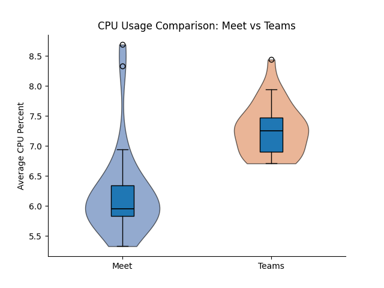

## Introduction

Pick any medium-sized company. Its employees probably spend two to three hours a day on video calls. Multiply that by the number of employees, and then by the number of companies doing the same thing, and you have a workload that runs continuously, at massive scale, on hardware that people rarely think of as having an energy cost.

The choice of platform is usually made once, at the IT level, and then forgotten. But Google Meet and Microsoft Teams are not the same product under the hood. They make different engineering decisions about how to encode video, how to manage call state in the browser, and how much JavaScript runs while you sit in a meeting. Those decisions affect how hard your CPU works. A harder CPU draws more power. More power, over enough users and enough hours, adds up.

Nobody seems to have measured whether this difference is real, or how large it is. That is what this study does. We ran 60 automated, hardware-measured experiments, 30 per platform, recording the energy consumed by a single browser participant in a standard two-minute call. Our research question is simple: **which platform costs more energy per call, and by how much?**

---

## Background

### Software Energy Measurement

The energy a piece of software consumes depends on which hardware resources it exercises and for how long. For a browser-based video call the main contributors are CPU load from video encoding and decoding, JavaScript execution, and DOM rendering, along with network I/O and memory bandwidth.

Measuring this accurately is harder than it sounds. Estimating from CPU utilisation, by multiplying CPU percentage by the chip's rated TDP and time, is unreliable because it ignores frequency scaling and thermal states. Hardware power sensors are the better option: they report what the chip is actually drawing, not what a model predicts.

Miettinen and Nurminen [5] measured eight JavaScript implementations of the same application and found up to 30% difference in energy consumption between them. The implementations were functionally identical; the difference came down to how much work each JS library asked the engine to do. The principle holds: two platforms built on different JS stacks, running in the same browser, can have meaningfully different energy costs.

### Prior Work on Video Call Energy

The closest study to ours is Wattenbach et al. [3], published at MOBILESoft 2022. They compared Google Meet and Zoom on Android using 20 runs per treatment, finding Zoom consumed about 4% less energy than Meet (Cliff's delta = −0.344). Camera use had by far the largest impact, increasing consumption by over 274% compared to camera-off calls.

Their work leaves two gaps our study fills: it targets Android mobile apps rather than desktop browsers, and it does not include Microsoft Teams. We also use EnergiBridge, which reads directly from hardware power sensors, rather than the software-based Batterystats estimator they relied on.

### EnergiBridge

EnergiBridge [4] is a cross-platform energy measurement tool that reads power sensors directly from hardware. On Apple Silicon it reads total system power via Apple's SMC through `powermetrics`; on Intel it uses the RAPL interface for CPU package and DRAM power.

EnergiBridge samples at up to 5 Hz and produces both a power time-series in Watts and a total energy figure in Joules. We use Joules as our primary metric because it combines power draw and duration: a platform that draws slightly more watts but stays active longer can easily outpace one that draws less.

### Why These Two Platforms Might Differ

Both Google Meet and Microsoft Teams (the consumer `teams.live.com` version) run inside Chrome. They share the same browser runtime, JavaScript engine, and WebRTC APIs. They are not equivalent, however.

Google Meet is built to take advantage of Chrome's VP9 integration and WebRTC implementation. Its UI is lean: a call in progress does little beyond rendering video tiles and a control bar.

Teams is built on a heavier frontend stack using React [2], a component and virtual DOM architecture that keeps different parts of the app in sync as the interface changes. A larger JS bundle means more parsing, more execution, and more ongoing framework overhead. Teams also handles the pre-join lobby differently: the browser runs call-related code before the call has technically started.

Prior research supports this. Oliveira et al. [6] found React-based stacks consumed more energy than leaner alternatives in almost every Android scenario tested. Marmelab's Argos tool found the same directional result on the web, with a React.js frontend consuming more energy than a functionally equivalent Vanilla.js implementation [7]. On a two-minute video call with continuous frame processing and state updates, that overhead has more room to compound.

**We expect Teams to consume more energy per session than Meet.** The question is whether the difference is large enough to be meaningful, or whether it gets lost in measurement noise.

---

## Experimental Design

### Overview

We measure the client-side energy consumed by a single browser participant joining a 120-second call alongside five additional participants, on each platform, repeated 30 times in randomised order.

### Experiment Setting

For each platform, five additional participant bots were deployed via automation script to simulate a real-life environment. To avoid interference with the measurement machine, the bots ran on a separate machine. The number of bots was determined by the hardware capacity of the bot-hosting machine.

### Browser Automation

Selenium WebDriver controlled real Chrome browser instances, removing the timing variability of human interaction. Each bot joined the meeting, waited exactly 120 seconds, and left. Between runs, the temporary Chrome profile was deleted so no cached state carried over.

Chrome was configured with `--use-fake-device-for-media-stream`, supplying a synthetic camera and microphone signal. Both platforms received identical media input, so any difference in codec workload reflects how each platform processes that input, not what was in the video.

### Energy Measurement

**EnergiBridge** ran as a background process from just before the bot joined to just after it left, writing a high-frequency power time-series to CSV and printing total energy consumed on exit. A Python thread sampled **`psutil`** every second for CPU%, memory, and network bytes in both directions, giving us hardware-level power data at 5 Hz and a system-level view at 1 Hz.

### Controls

**Randomised run order.** The 60 experiments were split into four batches due to Google Meet's one-hour session limit. Each batch was shuffled to distribute time-of-day effects and thermal drift evenly across platforms.

**Cooldown between runs.** A 60-second pause allowed the CPU to cool. Between batches, reconnecting to Google Meet added an additional ~4-minute delay. All experiments ran within a single four-hour window.

**Isolated Chrome profiles.** Each run used a fresh Chrome profile deleted afterwards to prevent state carryover.

**Zen Mode.** All non-essential applications were closed, external devices disconnected, and the laptop remained plugged in at 100% battery. No interaction occurred during execution, and brightness remained constant.

**System warm-up.** A Fibonacci script ran for five minutes before the first run to stabilise system temperature.

**Consistent meeting setup.** A human host created calls on both platforms and remained connected throughout, along with four bots; only the experimental bot joined and left per run.

### Experimental Matrix

| Parameter | Value |
|---|---|
| Platforms | Google Meet, Microsoft Teams |
| Participants per call | 1 experiment bot + 5 additional participants (1 host and 4 bots)|
| Call duration | 120 seconds |
| Repetitions per platform | 30 |
| Total runs | 60 |
| Cooldown between runs | 60 seconds |
| Browser | Google Chrome (latest), visible mode |
| Media stream | Synthetic (fake device) |
| Run order | Randomised  |
| Energy tool | EnergiBridge |
| OS / Hardware | macOS 26.3, Apple M4, 16 GB RAM |

---

## Threats to Validity

**Fake media streams are a lower bound.** A synthetic camera feed produces a simple, static signal. A real webcam with motion requires more codec work from both platforms. Our results underestimate real-world consumption, and the gap between platforms could differ under realistic conditions.

**Network I/O is system-wide.** `psutil.net_io_counters()` captures all traffic on the machine, not just Chrome's. Background OS processes can inflate the figures. We closed non-essential applications, but cannot eliminate this entirely.

**Single hardware configuration.** All measurements were taken on one machine. Absolute energy figures will differ on different hardware. The relative comparison should hold directionally, but we cannot verify this without testing on additional machines.

---

## Results

After removing outliers more than three standard deviations from the mean, we were left with 27 runs per platform. Since normality assumptions were violated for multiple variables (Shapiro–Wilk p < 0.05), we report Mann–Whitney U tests with α = 0.05.

### Energy Consumption & CPU Usage

#### Results Averaged Over 27 Runs

| Metric         | Google Meet (Mean ± SD) | Microsoft Teams (Mean ± SD) | Google Meet (Median) | Microsoft Teams (Median) | Relative Difference | Mann–Whitney p-value |
| -------------- | ----------------------- | --------------------------- | ------------------- | ----------------------- | ----------------- | ------------------- |
| CPU Energy (J) | 662.98 ± 13.59          | 772.80 ± 14.48              | 662.75              | 772.24                  | **+16.6%**        | < 0.001             |
| Avg Power (W)  | 5.30 ± 0.10             | 5.71 ± 0.11                 | 5.29                | 5.71                    | **+7.7%**         | < 0.001             |
| Avg CPU (%)    | 6.22 ± 0.74             | 7.28 ± 0.43                 | 5.95                | 7.25                    | **+21.8%**        | < 0.001             |


| Energy (J) | Average Power (W) | CPU Usage (%) |
|------------|-------------------|---------------|
|  |  |  |

Each video call lasted 120 seconds on both platforms, ensuring identical workload conditions. However, the overall experiment duration was longer for Teams due to slower loading times, which naturally increased total recorded energy. To ensure a fair comparison, we also examined per-second metrics including average power draw and average CPU usage. Even when normalised per second, Teams consistently consumed more resources.

- Median CPU usage was 5.95% for Meet and 7.25% for Teams, meaning Teams required approximately 17% more CPU utilisation (Mann–Whitney U = 65.5, p < 0.001; r = 0.82).
- Teams consumed on average 109.8 Joules more per run, about 16.6% higher than Meet, with no overlap between distributions (U = 0.0, p < 0.001; rank-biserial r = 1.0): every single Teams run consumed more energy than every Meet run.
- Average power was also significantly higher for Teams (approximately 8% higher; U = 3.0, p < 0.001; r ≈ 0.99).

These results indicate a consistent and substantial energy gap under identical workload conditions.

### Network Traffic

| Metric             | Google Meet (Mean ± SD) | Microsoft Teams (Mean ± SD) | Relative Difference | p-value |
| ------------------ | ----------------------- | --------------------------- | ------------------- | ------- |
| Sent Data (MB)     | 3.47 ± 0.18             | 3.13 ± 0.08                 | **−9.9%**           | < 0.001 |
| Received Data (MB) | 60.18 ± 18.24           | 92.26 ± 4.71                | **+53.3%**          | < 0.001 |

Median received data: Meet 67.38 MB vs. Teams 91.94 MB. Teams consistently received substantially more network data, with a rank-biserial correlation of 1.0 indicating complete separation between platforms.

| Sent Data (Bytes) | Received Data (Bytes) |
|------------------|---------------------|
|  |  |

---

## Discussion

Our results provide strong evidence that Microsoft Teams consumes more energy than Google Meet during browser-based desktop calls under controlled conditions.

The primary reason likely lies in how the two applications are architected. Teams is designed as a comprehensive collaboration platform integrating chat, file management, calendars, and team workspaces. Its React-based frontend uses a component and state-based architecture to keep everything in sync, which carries real computational overhead. Meet, by contrast, is a comparatively lightweight, browser-native service focused primarily on video conferencing, built around WebRTC with a lean UI.

Prior work on frontend framework energy backs this up. Oliveira et al. [6] showed React-based frameworks impose higher resource overhead than leaner alternatives, with the most pronounced gaps under interaction-heavy workloads. A video call fits that profile: the browser is processing incoming frames, updating participant tiles, and managing call state for the entire session. That kind of sustained workload is where framework overhead accumulates.

The 16–17% increase in total CPU energy is substantial, not a marginal statistical artefact. Given that video calls last hours and occur daily across millions of users, a 16% per-session difference scales into a meaningful cumulative impact. The Mann–Whitney U = 0.0 result means every single Teams run consumed more energy than every Meet run, which strengthens the reliability of the findings considerably.

Teams also received over 50% more data than Meet, pointing to differences in encoding strategies, bitrate targets, or buffering mechanisms. Outgoing traffic was slightly lower for Teams, suggesting the primary workload difference lies in receiving and processing video streams rather than transmitting them.

From a sustainable software engineering perspective, these findings highlight how architectural and frontend design decisions carry measurable environmental costs, even when the user-facing functionality appears similar. That said, the relative difference may vary across different hardware configurations or with real webcam feeds.

---

## Conclusion, Limitations and Future Work

Under controlled, repeatable conditions, Microsoft Teams consumed approximately 16% more CPU energy per session than Google Meet, required higher sustained CPU utilisation and power draw, and received substantially more network data. All differences were statistically significant with large effect sizes. Although the absolute energy per session is small at the individual level, video conferencing operates at global scale: even small per-session increases add up across millions of daily meetings. Our findings suggest that, under the tested configuration, Google Meet is the more energy-efficient option for desktop browser-based video calls.

Limitations include the need to restart meetings exceeding 60 minutes due to Google Meet's subscription restrictions, which introduced the possibility of human error, and hardware constraints that limited calls to six participants, which may not represent larger real-world scenarios.

Future work could evaluate real webcam input, longer meeting durations, multiple hardware configurations, mobile devices, and multi-participant scaling effects. Given the 53% difference in received network data between the platforms, investigating whether codec configuration accounts for part of the energy gap would be a particularly concrete next step.

---

## Replication

The full replication package is available at: GH url

```bash
git clone [repo-url]
cd SSE-26
python3 -m venv venv && source venv/bin/activate
pip install -r requirements.txt
cd EnergiBridge && cargo build -r && cd ..
cp .env.example .env  # add your Meet and Teams URLs
cd src
python run_experiment.py --meet-url "$MEET_URL" --teams-url "$TEAMS_URL" \
  --repeats 30 --duration 120 --visible
python analyze.py --data-dir ../data --output-dir ../figures
```

See `README.md` for full prerequisites and troubleshooting.

## Resources

[1] R. Horn et al., "Native vs Web Apps: Comparing the Energy Consumption and Performance of Android Apps and their Web Counterparts," 2023 IEEE/ACM 10th International Conference on Mobile Software Engineering and Systems (MOBILESoft), Melbourne, Australia, 2023, pp. 44-54, doi: 10.1109/MOBILSoft59058.2023.00013.

[2] Sumi_Singh. (2023, June 5). Microsoft Teams: Advantages of the new architecture. TECHCOMMUNITY.MICROSOFT.COM. https://techcommunity.microsoft.com/blog/microsoftteamsblog/microsoft-teams-advantages-of-the-new-architecture/3775704

[3] Wattenbach, L., Aslan, B., Fiore, M. M., Ding, H., Verdecchia, R., & Malavolta, I. (2022). Do You Have the Energy for This Meeting? An Empirical Study on the Energy Consumption of the Google Meet and Zoom Android apps. In MOBILESoft '22: Proceedings of the 9th IEEE/ACM International Conference on Mobile Software Engineering and Systems (pp. 6-16). IEEE. https://doi.org/10.1145/3524613.3527812

[4] Sallou, J., Cruz, L., & Durieux, T. (2023). EnergiBridge: Empowering software sustainability through cross-platform energy measurement (arXiv:2312.13897). arXiv. https://doi.org/10.48550/arXiv.2312.13897

[5] Miettinen, A. P., & Nurminen, J. K. (2010). Analysis of the Energy Consumption of JavaScript Based Mobile Web Applications. In P. Chatzimisios et al. (Eds.), MobiLight 2010, LNICST 45 (pp. 124–135). Springer-Verlag Berlin Heidelberg. https://doi.org/10.1007/978-3-642-16644-0_12

[6] Oliveira, W., Moraes, B., Castor, F., & Fernandes, J. P. (2023). Analyzing the Resource Usage Overhead of Mobile App Development Frameworks. In EASE '23: Proceedings of the 27th International Conference on Evaluation and Assessment in Software Engineering (pp. 152–161). ACM. https://doi.org/10.1145/3593434.3593487

[7] Marmelab. (2021). Argos: Comparing the Energy Consumption of Two Web Stacks. https://marmelab.com/blog/2021/03/04/argos-comparing-the-energy-consumption-of-two-web-stacks.html
