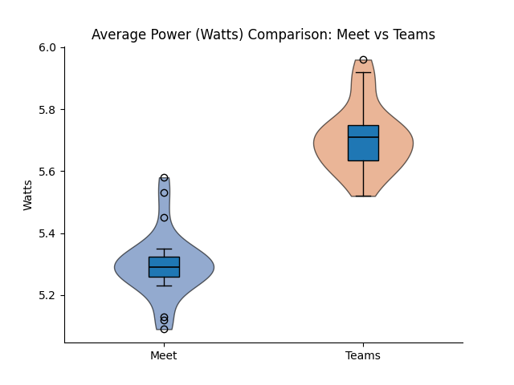

## Introduction

Pick any medium-sized company. Its employees probably spend two to three hours a day on video calls. Multiply that by the number of employees, and then by the number of companies doing the same thing, and you have a workload running continuously, at massive scale, on hardware that people rarely think of as having an energy cost.

The choice of platform is usually made once, at the IT level, and then forgotten. But Google Meet and Microsoft Teams are not the same product under the hood. They make different engineering decisions about how to encode video, how to manage call state in the browser, and how much JavaScript runs during a meeting. Those decisions affect how hard your CPU works. A harder CPU draws more power. More power, over enough users and enough hours, adds up.

Nobody seems to have measured whether this difference is real, or how large it is. That is what this study does. We ran 60 automated, hardware-measured experiments, 30 per platform, recording the energy consumed by a single browser participant in a standard two-minute call. Our research question is simple: **which platform costs more energy per call, and by how much?**

---

## Background

### Software Energy Measurement

For a browser-based video call the main energy contributors are CPU load from video encoding and decoding, JavaScript execution, and DOM rendering, along with network I/O and memory bandwidth. CPU is typically the largest contributor.

Measuring this accurately is harder than it sounds. Estimating from CPU utilisation — multiplying CPU percentage by TDP and time — is unreliable because it ignores frequency scaling, thermal states, and the fact that not all CPU work draws equal power. Hardware power sensors are the better option: they report what the chip is actually drawing, not what a model predicts.

Miettinen and Nurminen [5] measured eight JavaScript implementations of the same application and found up to 30% difference in energy consumption between them despite functionally identical behaviour. The difference came down to how much work each JS library asked the engine to do. Their study used mobile phones and older libraries, but the principle holds: two platforms built on different JS stacks, running in the same browser, can have meaningfully different energy costs. That is precisely the situation with Meet and Teams.

### Prior Work on Video Call Energy

The closest study to ours is Wattenbach et al. [3], published at MOBILESoft 2022. They compared Google Meet and Zoom on Android using 20 automated runs per treatment, measuring energy via Android's Batterystats profiler. Their main finding was that Zoom consumed about 4% less energy than Meet (Cliff's delta = −0.344). They also found that camera use had by far the largest impact on energy, increasing consumption by over 274% compared to a camera-off call, while microphone use had negligible effect.

Their work leaves two gaps our study fills. First, it targets Android mobile apps, not desktop browsers, and mobile energy dynamics differ from laptop CPU workloads. Second, it does not include Microsoft Teams. We also use [EnergiBridge](https://github.com/tdurieux/EnergiBridge), which reads directly from hardware power sensors, rather than the software-based Batterystats estimator Wattenbach et al. used — which they acknowledge is less precise than hardware measurement.

### EnergiBridge

EnergiBridge [4] is a cross-platform energy measurement tool developed by Thomas Durieux. On Apple Silicon it reads total system power via Apple's SMC through `powermetrics`; on Intel chips and Linux it reads CPU package and DRAM power via Intel's RAPL interface; on Windows it uses LibreHardwareMonitor.

EnergiBridge samples at up to 5 Hz, producing both a power time-series in Watts and a total energy figure in Joules. We use Joules as our primary metric because it combines power draw and time: a platform that draws slightly more watts but for a shorter active period could still use less total energy than one that draws less but stays busy longer.

### Why These Two Platforms Might Differ

Both Google Meet and Microsoft Teams (the consumer `teams.live.com` version) run inside Chrome, sharing the same browser runtime, JavaScript engine, and WebRTC APIs for peer-to-peer media. On the surface this makes them look equivalent. They are not.

Google Meet is a Google product running inside a Google browser. Google has direct influence over VP9 codec integration and Chrome's WebRTC implementation, and Meet is built to take advantage of that. Its UI is comparatively lean: a call in progress does little beyond rendering video tiles and a control bar.

Teams is built on a heavier frontend stack. The consumer web client uses React [2], a component and virtual DOM architecture that keeps different parts of the app in sync as the interface changes. A larger JS bundle means more parsing, more execution, and more ongoing framework overhead during the call. Teams also handles the pre-join flow differently: guests wait in a lobby until admitted, so the browser is running call-related code before the call has technically started.

This is not just intuition. Oliveira et al. [6] measured React Native against native Java across a range of Android benchmarks and found React Native consumed more energy in almost every scenario tested. The Teams web client uses browser React rather than React Native, so the numbers do not transfer directly, but the pattern is consistent: React-based stacks carry overhead that leaner alternatives avoid. Marmelab's Argos tool found the same directional result on the web, with a React.js frontend consuming more energy than a functionally equivalent Vanilla.js implementation [7]. The margin was small on a simple app; on a two-minute video call with continuous frame processing and state updates, the gap has more room to compound.

The prior mobile findings from Wattenbach et al. showed Meet consuming more energy than Zoom. Whether that pattern holds when comparing Meet against Teams on desktop is an open question, but the architectural differences above give us a prior expectation: **we expect Teams to consume more energy per session than Meet.** The question is whether the difference is large enough to be meaningful, or whether it gets lost in measurement noise.

---

## Experimental Design

### Overview

We measure the client-side energy consumed by a single browser participant joining a 120-second call alongside five additional participants, on each platform, repeated 30 times in randomised order.

### Experiment Setting

For each platform, five additional participant bots were deployed via automation script to better simulate a real-life environment. To avoid interfering with the measurement machine, the bots ran on a separate machine. The number of bots was determined by the hardware capacity of the bot-hosting machine.

### Browser Automation

We use Selenium WebDriver to control real Chrome browser instances, removing the timing variability of human interaction. Each bot joins the meeting, waits exactly 120 seconds, and leaves. Between runs, the temporary Chrome profile is deleted so no cached state carries over.

Chrome is configured with `--use-fake-device-for-media-stream`, supplying a synthetic camera and microphone signal rather than a real one. Both platforms receive identical media input, so any difference in codec workload comes from how each platform processes that input, not from what was in the video.

### Energy Measurement

**EnergiBridge** runs as a background process from just before the bot joins to just after it leaves, writing a high-frequency power time-series to CSV and printing total energy consumed on exit. Alongside it, a Python thread samples **`psutil`** every second for CPU%, memory, and network bytes in both directions. Together these give us hardware-level power data at 5 Hz and a complete system-level view at 1 Hz.

### Controls

**Randomised run order.** The 60 experiments were split into four batches (8, 9, 9, and 4 runs) due to Google Meet's one-hour session limit. Before each batch, the full sequence was shuffled to distribute time-of-day effects, background activity, and thermal drift evenly across platforms.

**Cooldown between runs.** A 60-second pause allowed the CPU to cool down between runs. Between batches, reconnecting to Google Meet added an additional ~4-minute delay. All experiments were conducted within a single four-hour window.

**Isolated Chrome profiles.** Each run used a fresh Chrome profile deleted afterwards to prevent state carryover.

**Zen Mode.** All non-essential applications and background processes were closed, external devices disconnected, and the laptop remained plugged in at 100% battery. No interaction occurred during execution and brightness remained constant.

**System warm-up.** A Fibonacci script was executed for five minutes before the first run to stabilise system temperature.

**Environment control.** Room temperature was kept constant, with windows closed.

**Consistent meeting setup.** A human host created calls on Google Meet and Microsoft Teams. The host and four bots remained connected throughout; only the experimental bot joined and left per run, ensuring consistent meeting conditions.

### Experimental Matrix

| Parameter | Value |
|---|---|
| Platforms | Google Meet, Microsoft Teams |
| Participants per call | 1 experiment bot + 5 additional participants (1 host and 4 bots) |
| Call duration | 120 seconds |
| Repetitions per platform | 30 |
| Total runs | 60 |
| Cooldown between runs | 60 seconds |
| Browser | Google Chrome (latest), visible mode |
| Media stream | Synthetic (fake device) |
| Run order | Randomised |
| Energy tool | EnergiBridge |
| OS / Hardware | macOS 26.3, M4 Chip 10-core CPU, 8-core GPU, 16-core Neural Engine 2560 x 1664 pixels 60 hz |

---

## Threats to Validity

**Fake media streams are a lower bound.** A synthetic camera feed produces a simple, static signal. A real webcam with motion and lighting variation requires more codec work from both platforms. Our results underestimate real-world consumption, and the gap between platforms could be larger or smaller under realistic conditions.

**Network I/O is system-wide.** `psutil.net_io_counters()` captures all traffic on the machine, not just Chrome's. Background OS processes can inflate the figures. We closed non-essential applications before running, but cannot eliminate this entirely.

**Single hardware configuration.** All measurements were taken on one machine. Absolute energy figures will differ on different hardware. The relative comparison between platforms should hold directionally, but we cannot verify this without testing on additional machines.

---

## Results

Originally we ran 60 experiments. After removing outliers more than three standard deviations from the mean, we were left with 27 repeated runs for each platform. Every video call lasted two minutes with identical hardware and browser conditions. Since normality assumptions were violated for multiple variables (Shapiro–Wilk p < 0.05), we report Mann–Whitney U tests with α = 0.05.

### Energy Consumption & CPU Usage

#### Results Averaged Over 27 Runs

| Metric         | Google Meet (Mean ± SD) | Microsoft Teams (Mean ± SD) | Google Meet (Median) | Microsoft Teams (Median) | Relative Difference | Mann–Whitney p-value |
| -------------- | ----------------------- | --------------------------- | -------------------- | ------------------------ | ------------------- | -------------------- |
| CPU Energy (J) | 662.98 ± 13.59          | 772.80 ± 14.48              | 662.75               | 772.24                   | **+16.6%**          | < 0.001              |
| Avg Power (W)  | 5.30 ± 0.10             | 5.71 ± 0.11                 | 5.29                 | 5.71                     | **+7.7%**           | < 0.001              |
| Avg CPU (%)    | 6.22 ± 0.74             | 7.28 ± 0.43                 | 5.95                 | 7.25                     | **+21.8%**          | < 0.001              |

| Energy (J) | Average Power (W) | CPU Usage (%) |
|------------|-------------------|---------------|
|  |  |  |

Each call lasted 120 seconds on both platforms, ensuring identical workload conditions. However, the overall experiment duration was longer for Teams due to slower loading times, which naturally increased total recorded energy. To ensure a fair comparison, we therefore examined per-second metrics including average power draw and average CPU usage. Even when normalised per second, Teams consistently consumed more resources.

- Median CPU usage was 5.95% for Meet and 7.25% for Teams, meaning Teams required approximately 17% more CPU utilisation (Mann–Whitney U = 65.5, p < 0.001; r = 0.82).
- Teams consumed on average 109.8 Joules more per run, about 16.6% higher than Meet, with no overlap between distributions (U = 0.0, p < 0.001; rank-biserial r = 1.0), meaning every Teams run consumed more energy than every Meet run.
- Average power was also significantly higher for Teams (approximately 8% higher; U = 3.0, p < 0.001; r ≈ 0.99). All differences across CPU usage, total CPU energy, and average power were statistically significant (p < 0.001) with large to near-maximal effect sizes.

These results indicate a consistent and substantial energy gap between the two platforms under identical workload conditions. Consequently, the difference cannot be attributed solely to longer experiment durations.

### Network Traffic

| Metric             | Google Meet (Mean ± SD) | Microsoft Teams (Mean ± SD) | Relative Difference | p-value |
| ------------------ | ----------------------- | --------------------------- | ------------------- | ------- |
| Sent Data (MB)     | 3.47 ± 0.18             | 3.13 ± 0.08                 | **−9.9%**           | < 0.001 |
| Received Data (MB) | 60.18 ± 18.24           | 92.26 ± 4.71                | **+53.3%**          | < 0.001 |

Median received data:
- Meet: 67.38 MB
- Teams: 91.94 MB

Teams consistently received substantially more network data than Meet. The rank-biserial correlation for received bytes was 1.0, indicating complete separation between platforms.

| Sent Data (Bytes) | Received Data (Bytes) |
|------------------|---------------------|
|  |  |

---

## Discussion

Our results provide strong evidence that Microsoft Teams consumes more energy than Google Meet during browser-based desktop calls under controlled conditions. We believe the primary reason lies in how the two applications are architected and delivered.

Microsoft Teams is designed as a comprehensive collaboration platform rather than just a video conferencing tool. In addition to video calls, it integrates chat, file management, calendars, and team workspaces into a single environment. Built on React [2], it uses a component and state-based architecture to keep parts of the app like Chat, Teams lists, and Calendar in sync as things change. This makes the experience feel seamless and integrated, but all that real-time synchronisation carries computational overhead.

In contrast, Google Meet is a comparatively lightweight, browser-native service built around WebRTC — a set of real-time communication APIs embedded in modern web browsers for audio and video streaming. Running directly within an existing browser tab and focusing on video conferencing rather than an extensive collaboration suite, we expected it to consume less energy. Our results strongly support that expectation.

Prior work on frontend framework energy backs this up. Oliveira et al. [6] showed React-based frameworks impose higher resource overhead than leaner alternatives, with the most pronounced gaps under interaction-heavy workloads. A video call fits that profile: the browser processes incoming frames, updates participant tiles, and manages call state for the entire session — exactly where framework overhead accumulates rather than cancels out.

The most important finding is the 16–17% increase in total CPU energy in Microsoft Teams. This magnitude is substantial, not a statistical artefact that is negligible in practice. Given that video calls last hours and occur daily across millions of users, a 16% per-session difference scales into a meaningful cumulative energy impact. The Mann–Whitney U test further reinforces this: for both energy consumption and network reception we obtained U = 0.0, meaning every single Teams run consumed more energy than every Meet run. This level of consistency strengthens the reliability of the findings.

The energy difference aligns with architectural expectations. Prior research has shown that frontend framework complexity [6] and network load [1] are strong predictors of energy consumption. Teams demonstrated higher average CPU utilisation, higher sustained power draw, and higher incoming network traffic. Notably, Teams received over 50% more data than Meet, suggesting differences in encoding strategies, bitrate targets, or buffering mechanisms. Increased decoding workload and additional JavaScript processing overhead likely translate into higher sustained CPU activity. Interestingly, outgoing traffic was slightly lower in Teams than in Meet, indicating that the primary workload difference lies in receiving and processing video streams rather than transmitting them.

From a sustainable software engineering perspective, these findings highlight how architectural and frontend design decisions can significantly influence energy consumption. While functionality and integration provide value to users, they also carry measurable environmental costs. However, the relative difference may vary across different hardware configurations or when using real webcam feeds instead of controlled test inputs.

---

## Conclusion, Limitations and Future Work

This study measured the energy cost of browser-based video calls on Google Meet and Microsoft Teams via EnergiBridge. Under controlled, repeatable conditions, Microsoft Teams consumed approximately 16% more CPU energy per session than Google Meet, required higher sustained CPU utilisation and power draw, and received substantially more network data. All differences were statistically significant with large effect sizes. Although the absolute energy per session is small at the individual level, video conferencing operates at global scale: even small per-session increases add up across millions of daily meetings, which means platform selection has measurable environmental implications. Our findings suggest that, under the tested configuration, Google Meet is the more energy-efficient option for desktop browser-based video calls.

Although we obtained significant results, it is important to acknowledge the limitations. Meetings exceeding 60 minutes had to be restarted due to Google Meet's subscription restrictions, introducing the possibility of human error. Additionally, hardware constraints limited each call to six participants total (one host, four supporting bots, and the measured bot), which may not accurately represent larger, real-world meeting scenarios.

Future work could evaluate real webcam input instead of synthetic streams, longer meeting durations, multiple hardware configurations, mobile devices, and multi-participant scaling effects. Given the 53% difference in received network data between the platforms, investigating whether codec configuration accounts for part of the energy gap would be a particularly concrete next step.

---

## Replication

The full replication package is available at: [GitHub url:](https://github.com/Yuunjisan/Group20-Replication)
See `README.md` for full prerequisites and troubleshooting.

---

## Resources

[1] R. Horn et al., "Native vs Web Apps: Comparing the Energy Consumption and Performance of Android Apps and their Web Counterparts," 2023 IEEE/ACM 10th International Conference on Mobile Software Engineering and Systems (MOBILESoft), Melbourne, Australia, 2023, pp. 44-54, doi: 10.1109/MOBILSoft59058.2023.00013.

[2] Sumi_Singh. (2023, June 5). Microsoft Teams: Advantages of the new architecture. TECHCOMMUNITY.MICROSOFT.COM. https://techcommunity.microsoft.com/blog/microsoftteamsblog/microsoft-teams-advantages-of-the-new-architecture/3775704

[3] Wattenbach, L., Aslan, B., Fiore, M. M., Ding, H., Verdecchia, R., & Malavolta, I. (2022). Do You Have the Energy for This Meeting? An Empirical Study on the Energy Consumption of the Google Meet and Zoom Android apps. In MOBILESoft '22: Proceedings of the 9th IEEE/ACM International Conference on Mobile Software Engineering and Systems (pp. 6-16). IEEE. https://doi.org/10.1145/3524613.3527812

[4] Sallou, J., Cruz, L., & Durieux, T. (2023). EnergiBridge: Empowering software sustainability through cross-platform energy measurement (arXiv:2312.13897). arXiv. https://doi.org/10.48550/arXiv.2312.13897

[5] Miettinen, A. P., & Nurminen, J. K. (2010). Analysis of the Energy Consumption of JavaScript Based Mobile Web Applications. In P. Chatzimisios et al. (Eds.), MobiLight 2010, LNICST 45 (pp. 124–135). Springer-Verlag Berlin Heidelberg. https://doi.org/10.1007/978-3-642-16644-0_12

[6] Oliveira, W., Moraes, B., Castor, F., & Fernandes, J. P. (2023). Analyzing the Resource Usage Overhead of Mobile App Development Frameworks. In EASE '23: Proceedings of the 27th International Conference on Evaluation and Assessment in Software Engineering (pp. 152–161). ACM. https://doi.org/10.1145/3593434.3593487

[7] Marmelab. (2021). Argos: Comparing the Energy Consumption of Two Web Stacks. https://marmelab.com/blog/2021/03/04/argos-comparing-the-energy-consumption-of-two-web-stacks.html
