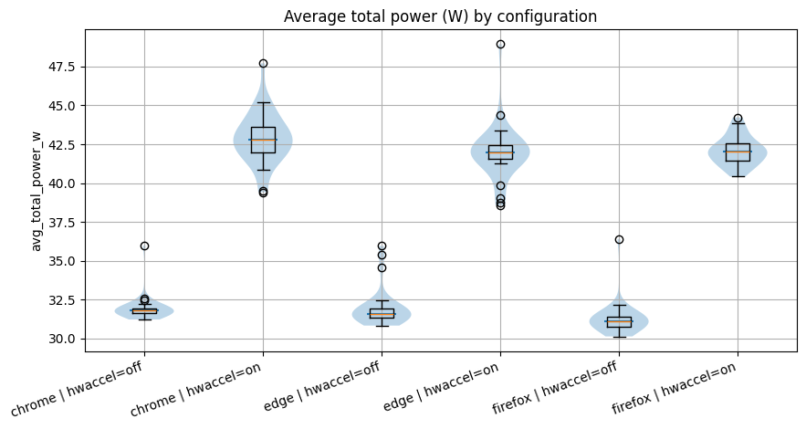
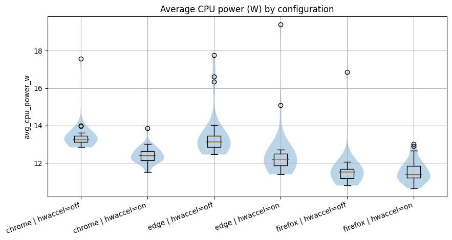
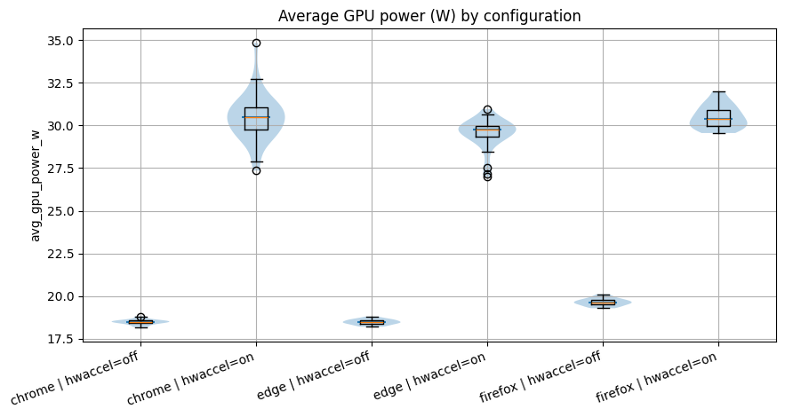

# Youtube Energy Consumption on Different Browsers with or without Hardware Acceleration

## **Introduction**

### Why Energy Efficiency Matters in Browsing?
In the modern digital era, the web browser has evolved from a simple tool into the fundamental infrastructure of our daily lives. Whether for professional productivity or personal leisure, the browser is often the most frequently used and long-running application on any system. In Europe, the prevalence and active usage time of browsers have reached staggering levels, making browser energy consumption a critical factor in digital sustainability.

Because of this massive reach, even a minor improvement in a browser's energy efficiency can yield a significant global impact when multiplied by billions of users. For developers and researchers alike, the pursuit of "Green Software" is not just about extending laptop battery life; it is a vital step toward reducing the carbon footprint left by our digital activities.

### The Hidden Cost of Video Streaming
Among all browsing activities, video playback is arguably the most power-hungry. As the world’s most popular video platform, **YouTube’s** influence extends far beyond entertainment, serving as a global hub for education, skill-sharing, and information exchange. Its massive user base means that every second, millions of pixels are being rendered across diverse devices worldwide.

However, the high-quality decoding and rendering behind these streams carry a hidden environmental cost. Since video playback is one of the most intensive tasks a user performs in a browser, investigating the energy efficiency differences across different browsers under the same YouTube workload is of high practical and scientific value.

### To GPU or Not to GPU?
To optimize video performance, modern browsers utilize "Hardware Acceleration." From a technical perspective, this feature is designed to offload the heavy lifting of video decoding and rendering from the General Purpose Processor (CPU) to a specialized Graphics Processing Unit (GPU).

Theoretically, because GPUs are more efficient at handling parallel computations and dedicated codec logic (such as VP9 or AV1 formats), this should lower the total system energy consumption. However, does the activation of the GPU introduce additional driver overhead, memory copy costs, or scheduling latencies? In a complex web environment like YouTube, whether "Hardware Acceleration" truly achieves a win-win for both performance and energy saving remains a subject of ongoing debate and empirical investigation.

### Our Mission
This study aims to provide empirical evidence on how browser environments truly influence the energy efficiency of video playback. By conducting a comparative analysis of three major browsers—Chrome, Microsoft Edge, and Firefox—we explore the following core questions:

The Reality of Hardware Acceleration: Analyzing the specific impact of enabling vs. disabling GPU acceleration on Total Energy (J) and the Energy-Delay Product (EDP) across four specific YouTube Shorts.

Cross-Kernel Efficiency: Investigating the resource allocation strategies (CPU vs. GPU) between Chromium-based browsers (Chrome, Edge) and the independent Gecko engine (Firefox).

Performance vs. Energy Trade-offs: Verifying whether hardware acceleration increases the system’s electrical burden without providing a significant gain in execution efficiency (Runtime).

Through rigorous automated testing and statistical analysis, we aim to provide clearer configuration recommendations for users and data-driven insights for the development of Green Software.

## **Methodology**

### 1. Experimental Subjects and Variables
#### 1.1 Browser Selection
This experiment selected three representative web browsers: Google Chrome, Microsoft Edge, and Firefox. The selection was based on the following criteria:

Kernel Diversity: Chrome and Edge are based on the Chromium engine, while Firefox utilizes the independent Gecko engine. Comparing different engines under identical workloads provides significant scientific insight into energy optimization strategies.

Market Share: These three browsers account for the vast majority of desktop users globally.

Vendor-Specific Optimizations: Since Edge is deeply integrated with the Windows OS and Chrome is the most popular cross-platform browser, comparing them allows us to observe how different vendors optimize hardware acceleration.

#### 1.2 Hardware Acceleration States
For each browser, we tested two distinct configurations:

Hardware Acceleration Enabled: The default browser state where tasks are offloaded to the GPU.

Hardware Acceleration Disabled: Forced via Selenium startup arguments (e.g., --disable-gpu and --disable-software-rasterizer), requiring the CPU to handle all video decoding and rendering tasks.
This comparison aims to quantify the actual energy efficiency gains (or losses) of hardware offloading in video playback scenarios.

#### 1.3 YouTube Workload
We manually selected four YouTube Shorts, each with an average duration of approximately 30 seconds. These videos were organized into a dedicated playlist and played sequentially during each experimental run. Shorts were chosen because their compact nature and frequent rendering changes better reflect the dynamic energy fluctuations of modern web video content. The youtube videos that we used can be found in [this](https://www.youtube.com/watch?v=Ay8lynMZ4mE&list=PLmSezx7vjyA4vpDfHBdetncvcAlNc2IXs&pp=sAgC) playlist, because the YouTube shorts are added to a playlist, they are played in the normal YouTube player rather than the short player. Since the shorts are played in the normal environment, we could also change the resolution. The resolution of all the shorts were set at 1080p.

### 2. Environmental Control and Fairness
#### 2.1 Hardware Information
The hardware that was used for the experiment is a Windows 11 laptop equipped with an AMD Ryzen 7 4800H CPU and an NVidia GeForce GTX 1650ti GPU.

#### 2.2 Zen Mode
The experiment was conducted with no other (background) applications running other than the ones strictly necessary. The only things running were: A powershell window which was used to launch the automation script, python for running the script which launched a browser with a specific config, energibridge for collecting the energy data, and the browser itself.

#### 2.3 Freeze Settings
To ensure that every test run was conducted under as close as possible to identical conditions, we put the laptop to max brightness, made sure it did not turn of the screen or itself after a certain amount of time, and made sure that the laptop was plugged into both power and ethernet during the entire duration of the experiment. We also tried to keep the room temperature at a constant 18 degrees Celsius to minimize the influence of thermal fluctuations on energy consumption. Finally, all the browsers were set to use the high performance NVidia GPU rather than the integrated one from the CPU.

### 3. Measurement Infrastructure
#### 3.1 Automation: Selenium
This experiment utilized [Selenium](https://www.selenium.dev/) WebDriver for full automation. Compared to manual operation, the key advantages include:

- **Precise Timing:** Ensures that video playback duration is exactly consistent across every run.

- **Elimination of Human Error:** Prevents additional energy spikes caused by unintended mouse movements, clicks, or operational delays.

- **Fairness:** Every browser loads the same set of URLs through identical script logic.

#### 3.2 Energy Monitoring: Energibridge
We utilized [Energibridge](https://github.com/tdurieux/energibridge) for hardware-level data acquisition.

**Integration:** Energibridge was launched and terminated in synchronization with the Selenium script via a master loop script (.ps1 or .sh).

**Data Source:** The tool reads directly from hardware interfaces (such as Intel RAPL) to capture CPU energy counters and instantaneous GPU power draw.

### 4. Data Acquisition Process
#### 4.1 Sampling Strategy and the "N+2" Principle
For each configuration (e.g., Chrome with GPU enabled), we performed 32 independent runs.

**Why 32 runs?** Hardware energy consumption is subject to unavoidable fluctuations caused by thermal changes and minor background system activities.

**Warmup Logic:** We primarily analyze the data from 30 of these runs. The first two runs are treated as "warmup runs" to allow the hardware to reach a stable operating temperature and ensure all browser components are fully loaded, preventing initial spikes from skewing the statistical accuracy.

#### 4.2 Data Structure
The resulting CSV files contain several key metrics used for analysis:
| Metric | Unit | Description | Importance |
| :--- | :--- | :--- | :--- |
| `Time` | ms | Absolute system time | Used for synchronizing data points. |
| `Delta` | ms | Time difference between samples | Validates the stability of the sampling frequency. |
| `CPU_ENERGY` | Joules | Cumulative CPU energy | The primary data for calculating CPU power consumption. |
| `GPU0_POWER` | mWatts | Instantaneous GPU power | Must be integrated over time to calculate total GPU energy. |

## **Result**
Since we are comparing video streaming with a number of configurations, we are going to compare the average wattage consumed per configuration. This is done because video streaming is a continous load on a system rather than some task which eventually reaches the end.

Because we are checking whether ofloading some work to the GPU, we will present three plots, one where the CPU and GPU wattage is combined, and two that show the average wattage per component.

All the plots are acompanied by a table stating some statistical numbers. Some of these numbers compare hardware acceleration on vs off, the way this should be interpreted is that the numbers are for the "on" configs relative to the "off" configs. So when it states that there is 34 percent difference, that means the "on" config scored 34 percent higher on that metric compared to the "off" config.

### Data Cleaning and Outlier Handling
Before performing the core analysis, we ensured the integrity of the dataset by removing "warmup" runs and identifying anomalies. We followed the "N+2" principle, discarding the first two runs of every configuration to allow the hardware to reach a stable thermal state.

#### Special Finding
One Firefox run with hardware acceleration disabled (run 31) was identified as faulty, due to the fact that it produced unrealistically low energy consumption and only had a runtime of 10 seconds. As this run does not represent a valid experimental measurement, it was excluded from all subsequent analyses and visualizations.

---

The final distribution of valid samples is shown below:

*Table 1: Final Sample Counts per Configuration*
| Browser | Hardware Acceleration | Sample Count (n) |
| :--- | :--- | :--- |
| Chrome | Off | 30 |
| Chrome | On | 30 |
| Edge | Off | 30 |
| Edge | On | 30 |
| Firefox | Off | 29 |
| Firefox | On | 30 |

### Average Total Power Consumption

In the above violin plot you can see the average power consumption in wattage per configuration for the CPU and GPU combined. Here you can see that for all browsers the power consumption is higher when hardware acceleration is turned on.

*Table 2: Statistical Comparison of Total Power (HW On vs. HW Off)*
|   | browser | metric              | # runs with GPU on | # runs with GPU off | test          | p_value       | mean_off  | mean_on   | pct_change_on_vs_off | effect_size | effect_size_label     |
|---|---------|--------------------|-----------|----------|--------------|---------------|-----------|-----------|----------------------|-------------|-----------------------|
| 0 | chrome  | avg_total_power_w  | 30        | 30       | Mann–Whitney | 3.019859e-11  | 31.944582 | 42.889812 | 34.263181            | 1.0         | CLES P(on > off)      |
| 1 | edge    | avg_total_power_w  | 30        | 30       | Mann–Whitney | 3.019859e-11  | 31.959125 | 41.972643 | 31.332268            | 1.0         | CLES P(on > off)      |
| 2 | firefox | avg_total_power_w  | 29        | 30       | Mann–Whitney | 4.461750e-11  | 31.269099 | 42.086639 | 34.594986            | 1.0         | CLES P(on > off)      |

### Average CPU Power Consumption

The above violin plot shows the average power consumption in wattage per configuration for just the CPU. As you might notice, they are much closer together than in the previous plot. Yet there is still a small reduction in power consumption from hardware acceleration off to on. This can be simply explained, the CPU is giving some work to the GPU rather than doing it itself.

*Table 3: Statistical Comparison of CPU Power (HW On vs. HW Off)*

|   | browser | metric            | # runs with GPU on | # runs with GPU off | test          | p_value       | mean_off  | mean_on   | pct_change_on_vs_off | effect_size | effect_size_label |
|---|---------|------------------|-----------|----------|--------------|---------------|-----------|-----------|----------------------|-------------|-------------------|
| 0 | chrome  | avg_cpu_power_w  | 30        | 30       | Mann–Whitney | 8.890991e-10  | 13.451759 | 12.427455 | -7.614645            | 0.038889    | CLES P(on > off)  |
| 1 | edge    | avg_cpu_power_w  | 30        | 30       | Mann–Whitney | 2.601511e-08  | 13.476417 | 12.473504 | -7.441979            | 0.081111    | CLES P(on > off)  |
| 2 | firefox | avg_cpu_power_w  | 29        | 30       | Mann–Whitney | 8.615805e-01  | 11.617181 | 11.566381 | -0.437286            | 0.513793    | CLES P(on > off)  |

### Average GPU Power Consumption

This final violin plot shows the average power consumpiton in wattage per configuration for just the GPU. Here we can see where the big difference comes from in the first plot. When hardware acceleration is turned off, all the browsers have almost the same GPU power consumption. This makes sense, because the browsers were the only process that were utalizing the high performance GPU during the experiments. So when the hardware acceleration is turned off, the GPU sits idle doing nothing. Only when the hardware acceleration is turned on, the GPU starts processing the video decoding workload.

*Table 4: Statistical Comparison of GPU Power (HW On vs. HW Off)*

|   | browser | metric            | # runs with GPU on | # runs with GPU off | test          | p_value       | mean_off  | mean_on   | pct_change_on_vs_off | effect_size | effect_size_label |
|---|---------|------------------|-----------|----------|--------------|---------------|-----------|-----------|----------------------|-------------|-------------------|
| 0 | chrome  | avg_gpu_power_w  | 30        | 30       | Mann–Whitney | 3.019859e-11  | 18.492823 | 30.462356 | 64.725293            | 1.0         | CLES P(on > off)  |
| 1 | edge    | avg_gpu_power_w  | 30        | 30       | Mann–Whitney | 3.019859e-11  | 18.482708 | 29.499139 | 59.603987            | 1.0         | CLES P(on > off)  |
| 2 | firefox | avg_gpu_power_w  | 29        | 30       | Mann–Whitney | 4.461750e-11  | 19.651918 | 30.520258 | 55.304224            | 1.0         | CLES P(on > off)  |

### Statistical Significance
To ensure our findings were robust, we conducted normality tests followed by non-parametric comparisons.

#### Special Finding
It can be observed from the results of the Shapiro–Wilk test that several configurations deviate significantly from normality (p < 0.05). Therefore, non-parametric statistical tests are used for subsequent comparisons.

[TODO]
For all three browsers, enabling hardware acceleration leads to a statistically significant increase in total energy consumption and EDP... The mean energy consumption increases by approximately 7–8% for Chrome and Edge, and by over 14% for Firefox, showing that hardware acceleration consistently worsens energy efficiency for this workload.

---

*Table 5: Summary of Statistical Tests*
| Metric | Test Type | Findings |
| :--- | :--- | :--- |
| Normality | Shapiro-Wilk | Most groups failed (p < 0.05), requiring non-parametric tests. |
| Significance | Mann-Whitney U | All power increases were statistically significant (p < 0.05). |
| Effect Size | CLES | Very high probability that HW-On consumes more energy than HW-Off. |

## **Discussion**

TODO
- Why is hardware acc. more power hungry?
- Startup spike

The results of this experiment challenge the conventional wisdom that hardware acceleration is inherently energy-efficient. While GPUs feature dedicated hardware decoders (optimized for formats like VP9 or AV1) that are theoretically more efficient than a general-purpose CPU, the system-wide energy consumption reveals a significant "Offloading Overhead." In a browser environment, data must be frequently transferred between CPU memory and GPU VRAM. This process of cross-hardware synchronization and driver management consumes a non-trivial amount of power. For the YouTube Shorts used in this study (30 seconds), the instantaneous power spike during the initialization of the GPU decoding pipeline is substantial. Due to the short duration, this "startup cost" is never balanced out by the subsequent low-power decoding phase. Consequently, the CPU alone demonstrates superior energy efficiency for lightweight video streams, suggesting an efficiency threshold for hardware acceleration.

From a Green Software perspective, these findings carry important practical implications. The current "one-size-fits-all" approach of browsers—where hardware acceleration is enabled by default—is clearly not the most sustainable choice for short-form videos or low-bitrate content. For mobile or laptop users, the TODO% energy penalty in Firefox translates directly into reduced battery life, which accumulates into significant energy waste over long-term daily use.

## **Limitations and future work**
While our study gives us a clear look at how hardware acceleration hits the different computer components during YouTube Shorts, it’s important to remember that the type of video plays a massive role. Since we only focused on 30-second clips, at a resolution of 1080p, the GPU might not have hit it's crossover point where it is more efficient than the CPU. If users were watching content that was more decode intensive such as 4K or even 8K video, the GPU decoding might be more efficient than the CPU decoding. Even different video codecs could make a difference.

Another thing to keep in mind is that all our data comes from just one specific computer setup. In the real world, the difference between an integrated graphics chip and a beefy dedicated graphics card is huge. Everything from the hardware architecture to your power settings or even your driver version can change how much energy gets used. Future tests across a variety of computers would definitely help us see a broader picture. Also, browsers aren't always transparent about which video "language"—or codec—they choose. One browser might pick VP9 while another goes for AV1, and that choice alone could explain some of the energy gaps we saw.

Finally, let’s talk about the "noise" of modern computers. Even though we tried to stay in "Zen Mode" by killing unnecessary apps, operating systems are always busy behind the scenes. There’s almost always some background task popping up that has nothing to do with the browser but still influences the power consumption. We used a strict 32-run strategy and tossed out the "warmup" runs to smooth things out, but at the end of the day, measuring energy in a real-world environment instead of a sterile lab is always going to have its limits.

## **Conclusion** [TODO]
This study evaluated the energy efficiency of Chrome, Microsoft Edge, and Firefox while playing YouTube shorts, specifically focusing on the impact of hardware acceleration. Our data reveals an important finding: enabling hardware acceleration significantly increases total energy consumption and the Energy-Delay Product (EDP) across all browsers, without providing a meaningful reduction in runtime.

Key findings from our analysis include:

- **Energy Penalty:** Enabling the GPU resulted in a 7–8% energy increase for Chrome and Edge, and a substantial 14.04% increase for Firefox.

- **Firefox Vulnerability:** Firefox's Gecko engine exhibited the highest sensitivity to GPU offloading, suggesting it is currently most energy-efficient when relying on CPU-based decoding for this workload.

In conclusion, while hardware acceleration is a nice feature for high-performance rendering, it is not an "always optimal" solution for energy sustainability. For users looking to maximize battery life during casual video browsing, particularly in Firefox, disabling hardware acceleration may be a highly effective strategy. These insights emphasize the need for context-aware software design that balances performance and power based on the specific nature of the digital workload.

# TODO
# Add code repo link