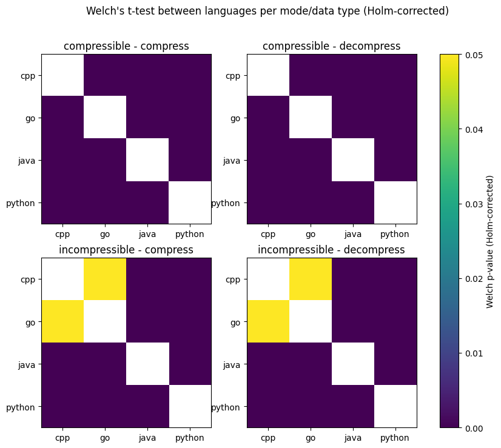

# Introduction

Software powers the world. Every sent message, every stored dataset, and every archived log is processed by layers of software that execute on energy-consuming hardware. As digital infrastructure grows, the environmental impact of software has emerged as a prominent theme in computing research [1]. Data centers account for an increasingly larger portion of global electricity consumption [2], and software design choices influence how effectively hardware resources are used [3]. 

Recent studies suggest that the choice of programming language is one such decision. Pereira *et al.* [4] report substantial differences in runtime and energy consumption for equivalent workloads, which they ascribe to language-specific memory management and compiler optimization. A very simple design choice can have tangible effects on the environment when it is considered over millions of executions. This observation leads to an important question: when software developers choose a language ecosystem for a given task, are they implicitly making an energy choice as well?

This project investigates that question through a controlled case study. We will examine the energy consumption of a typical software engineering task: file compression and decompression using the `gzip` format [5]. Compression is one of the most common tasks in today’s computing world, with measurements showing that 90.5% of websites rely on it, with `gzip` alone accounting for 49.5% of all sites [6]. Therefore, even small differences in its energy efficiency become significant from a sustainability perspective, which makes this a practical study for developers.

We choose to focus on the well-known example of `gzip` in order to examine how different programming languages complete the same exercise. We will compare file compression implementations written in Python, Java, Go, and C++, implemented using each language's standard libraries and typical runtime characteristics as much as possible. That is because, in a real-world setting, developers tend not to write their own low-level algorithms but rely instead on the abstractions provided by the language. Our comparison will thus allow us to realistically analyze the sustainability implications of choosing one language over another for a common task.

# Research Questions

Through this study, we seek to answer a practical question: when two systems perform the same task, how much does the choice of programming language matter for energy efficiency? To that end, we use our case study of `gzip` file compression and decompression to narrow down our scope to three aspects of the problem:

**RQ1.** Do Python, Java, Go, and C++ differ significantly in energy consumption when performing identical `gzip` compression and decompression tasks under controlled conditions?

**RQ2.** Are the observed energy differences consistent across data types (compressible vs. incompressible) and operations (compression vs. decompression), and how practically and statistically significant are these differences?

**RQ3.** Is the language that achieves the lowest runtime also the most energy efficient for `gzip` compression and decompression?


# Methodology

This section explains the experimental design we used to measure and compare the energy consumption of `gzip` compression and decompression for different programming languages.

## Data

We generate fully deterministic synthetic input data both for the purpose of reproducibility and to make sure that the differences in energy consumption can be attributed solely to the language ecosystems and not to the variability of our input datasets. All inputs are created by a custom Python script (`data/generate_input.py`), which takes a fixed seed and a size in megabytes, then produces exactly the same sequence of bytes every time. The script also prints the SHA-256 hash of every file it produces for replication purposes.

We examine two workload types, which represent the extremes of the compression spectrum. The first type of workload contains highly *compressible data*, modeled after unstructured logs and represented as JSONL (JSON Lines) records. The second type contains *incompressible data*, which is generated as a uniform byte stream. This simulates data that has very little redundancy, such as encrypted or already-compressed data. We chose to include both types of workloads so that we could observe how different languages perform under both optimal and worst-case conditions.


## Experimental Setup

This section describes the setup used for the experiments. We took inspiration from the rigorous guide provided by L. Cruz (2021), who argued that energy measurements are determined by a multitude of factors and thus require careful bias control and automation [7].

### Hardware and Software Environment

All experiments are executed on the same machine and OS, with the following specifications:

| Category | Specification |
|---|---|
| Machine / Laptop model | `HP ZBook Power 15.6 inch G9 Mobile Workstation PC` |
| CPU | `i7-12700H` |
| CPU cores / threads | `20 cores / 40 threads` |
| RAM | `16 GB DDR4` |
| Operating system | `Fedora Linux 43 (Workstation Edition)` |
| EnergiBridge version | `0.0.7` |

### Input Preparation

We evaluate four language implementations (C++, Java, Go, Python) under two dataset types (*compressible* and *incompressible*) and two operation modes (*compression* and *decompression*), resulting in 4 experimental groups.

Input files are generated automatically at the start of each experiment using the existing deterministic generator (`data/generate_input.py`). We use one **compressible** dataset (`.jsonl`, SHA: `353eea1dc2dc6774663338846b8a36c38528d0330d22e9fe35138367c45abbdf`) and one **incompressible** dataset (`.bin`, SHA: `21f4a81500d3e55e6ffdc9b42bcc211da17a9490beb39de0a4917c20ac7ebf7d`) with a fixed size of 256MB and a seed of 12345.

For decompression experiments, the script generates a **single reference gzip file per dataset** using **GNU gzip** at compression level 6 with header normalization:

```bash
gzip -6 -n -c INPUT > ref.gz
```

The `-n` option removes filename and timestamp metadata from the gzip header, thus contributing to the project's reproducibility. We do this to ensure that all languages decompress the **same exact `.gz` bytes**.

### Measurement Tooling and Execution Procedure

Energy measurements are collected with **EnergiBridge** [8], as it provides accurate and reliable real-time power consumption data. For each run, the experiment script invokes EnergiBridge as a wrapper around the language-specific command:

```bash
energibridge -o <run.csv> -i <interval_us> --summary -- <language_command>
```

The script records:
- an EnergiBridge summary output in a per-run CSV file (`raw/run_k.csv`)
- stdout/stderr in a log file (`raw/run_k.log`)
- the wall-clock runtime (`wall_time_s`) measured by the Python orchestrator

We use an EnergiBridge sampling interval of 100 µs, which is the default. This interval provides sufficient detail for our short-duration runs, capturing energy fluctuations. After each run, the script parses the EnergiBridge CSV to obtain the total energy.

### Experimental Protocol

An important inspiration for our protocol is the observation made by L. Cruz (2021) [7] that software energy measurements can be strongly affected by thermal state, background processes, and temporal drift. To reduce these sources of bias, the runner implements the following controls.

1. **Warm-up runs.** Before recording measurements, the script performs **3 warm-up runs** for each condition and language. These warm-up runs are discarded; their purpose is to reduce **cold-start effects** by allowing the system to stabilize thermally.

2. **Repeated measurements.** We measure each condition 30 times to achieve statistically significant results.

3. **Rest between runs.** We use rest periods of 60 seconds after each measured run [7].

4. **Shuffled execution order.** The language order is shuffled using a deterministic random seed to reduce the risk of confounding effects.


### Manual Controls and Remaining Sources of Bias

Before running long experiments, we aim to keep the environment stable by:
- closing unnecessary applications and browser tabs,
- disabling notifications and updates,
- keeping hardware peripherals constant,
- maintaining fixed screen brightness/resolution and power settings,
- avoiding unrelated network activity when possible.

These steps align with L. Cruz’s "Zen mode" and "freeze your settings" recommendations to reduce the impact of background tasks and environmental changes on energy measurements [7].


## Implementation Details

We standardize the same algorithm design across all languages. Each implementation provides a small command-line interface of the form `mode input_file output_file`, with the `mode` being either compression or decompression. The `gzip` compression level is fixed at 6 for all languages, which matches the default setting [9]. All files are processed in binary mode, and compression is done using each language's standard library in a streaming fashion, without system calls or external tools, so that the measurements reflect purely the behavior of the language. If applicable, we also use a buffer size of 32 KB to keep memory usage stable across file sizes.

### Java

The Java implementation uses the standard `java.util.zip` package [10], with `GZIPOutputStream` for compression and `GZIPInputStream` for decompression. Files are processed in a streaming manner using buffered I/O and fixed 32 KB chunks.

### C++

The C++ implementation directly uses the `zlib` library [11] for (de)compression through `deflateInit2` and `inflateInit2`, respectively. Data is processed in fixed-size chunks so that we avoid loading the entire file into memory, which also happens to be a typical design for C++ applications.

### Python

The Python implementation uses the built-in `gzip` module [12], which is a wrapper around the C++ `zlib` library. The API is representative of how Python developers would typically perform compression tasks. The three simple methods `open`, `compress`, and `decompress` are used to read and write files in a streaming fashion.

### Go

The Go implementation uses the built-in `compress/gzip` library [13] to (de)compress the input file. For compressing, the library creates a writer pointing to the output file, and the input file is then copied into the writer, thereby writing to the output file. For decompressing, it creates a reader for the input file instead of a regular IO writer.

## Evaluation Metrics

To answer our research question, we use several metrics that allow us to comprehensively compare the energy efficiency and runtime performance of the implementations. 

**Energy consumption (E)** expressed in Joules (J) is our primary metric, measured using EnergiBridge. It represents the total work performed by the hardware to execute the compression and decompression tasks. Minimizing E is the direct goal of reducing software carbon footprint, and measuring it forms the basis for answering all of our research questions, but especially our main question, RQ1.

We will also measure the **energy per megabyte**, in Joules per megabyte (J/MB). This is calculated as the total energy consumed (E) divided by the size of the input file in megabytes, and it provides a normalized measure of energy efficiency which allows us to make comparisons across different workloads (dataset and operation combinations) and therefore to answer RQ1, 2, and 3. Logically, a lower E/MB indicates better energy efficiency per unit of data processed.

**Runtime (T)** is measured in seconds (s) using wall-clock time and, in this project, contributes towards answering RQ3. This metric is often substituted as a proxy for the performance of an implementation, and through its use, we can analyze the trade-offs between energy efficiency and implementation efficiency and determine whether the fastest implementation also consumes the least energy.

Finally, the **compression ratio (CR)** is calculated as the size of the original file divided by the size of the compressed file. A higher CR indicates a better compression. We use this metric as part of RQ3 to confirm that all languages achieve roughly the same compression performance, because if one language had a significantly worse ratio, then it might appear as faster or more energy efficient simply because it has been compressing less aggressively.


## Statistical Analysis

To answer RQ1, we first visualize the distribution of energy consumption across each workload condition (dataset type x operation), then report the mean, standard deviation, and a 95% t-based confidence interval for the mean.

Within each condition, we apply the Shapiro–Wilk test [14] to verify whether the energy measurements are plausibly normal. Then, we compare the languages using a pairwise Welch's two-sample t-test [15] to determine whether the differences in energy consumption are statistically significant, as part of RQ2. Since we test multiple language pairs per condition, we also apply the Holm correction [16] to the p-values to reduce the risk of false positives.

We further conduct an Effect Size analysis by calculating Cohen's *d* [17], along with the percent change and the mean difference, to measure how large and practically significant the differences between languages are. We finally plot the total energy versus runtime per condition to address RQ3, and compute Pearson's correlation coefficient to evaluate their relationship.

# Results

## Evaluation Results

| Dataset            | Mode           | Language | Mean E (J) | Std (J) | 95% CI           |
| ------------------ | -------------- | -------- | ---------- | ------- | ---------------- |
|   Compressible     |   Compress     | C++      | 13.788     | 0.131   | [13.739, 13.837] |
|                    |                | Go       | 31.190     | 0.268   | [31.090, 31.290] |
|                    |                | Java     | 24.928     | 0.611   | [24.700, 25.156] |
|                    |                | Python   | 14.985     | 0.178   | [14.919, 15.051] |
|                    |   Decompress   | C++      | 2.422      | 0.056   | [2.401, 2.443]   |
|                    |                | Go       | 4.354      | 0.097   | [4.318, 4.390]   |
|                    |                | Java     | 3.919      | 0.117   | [3.876, 3.963]   |
|                    |                | Python   | 4.059      | 0.132   | [4.010, 4.108]   |
|   Incompressible   |   Compress     | C++      | 32.909     | 0.206   | [32.833, 32.986] |
|                    |                | Go       | 32.862     | 0.304   | [32.748, 32.975] |
|                    |                | Java     | 46.094     | 0.366   | [45.957, 46.231] |
|                    |                | Python   | 37.906     | 0.227   | [37.821, 37.991] |
|                    |   Decompress   | C++      | 1.288      | 0.047   | [1.270, 1.306]   |
|                    |                | Go       | 1.338      | 0.187   | [1.268, 1.408]   |
|                    |                | Java     | 2.131      | 0.067   | [2.106, 2.156]   |
|                    |                | Python   | 4.885      | 0.146   | [4.831, 4.940]   |

#### Table 1: Energy Consumption for Each Language Across Workloads

| compressible - compress | C++ | Go      | Java   | Python |
|-------------------------|-----|---------|--------|--------|
| C++                     | 0   | +126.2% | +80.8% | +8.7%  |
| Go                      | -   | 0       | -20.1% | -52.0% |
| Java                    | -   | -       | 0      | -39.9% |
| Python                  | -   | -       | -      | 0      |

| compressible - decompress | C++ | Go     | Java   | Python |
|---------------------------|-----|--------|--------|--------|
| C++                       | 0   | +79.8% | +61.8% | +67.6% |
| Go                        | -   | 0      | -10%   | -6.8%  |
| Java                      | -   | -      | 0      | +3.6%  |
| Python                    | -   | -      | -      | 0      |

| incompressible - compress | C++ | Go     | Java   | Python |
|---------------------------|-----|--------|--------|--------|
| C++                       | 0   | -0.15% | +40.1% | +15.2% |
| Go                        | -   | 0      | +40.3% | +15.4% |
| Java                      | -   | -      | 0      | -17.9% |
| Python                    | -   | -      | -      | 0      |

| incompressible - decompress | C++ | Go    | Java   | Python  |
|-----------------------------|-----|-------|--------|---------|
| C++                         | 0   | +3.9% | +65.4% | +279.2% |
| Go                          | -   | 0     | +59.3% | +265.1% |
| Java                        | -   | -     | 0      | +129.2% |
| Python                      | -   | -     | -      | 0       |

#### Table 2: Energy Percent Change between Languages 


#### Figure 1: Energy Distributions


#### Figure 2: Energy over Runtime

|      Dataset       | Language | Mean CR | % Above Best |
| ------------------ | -------- | ------- | ------------ |
|    Compressible    | Java     | 9.814   | 0.0%         |
|                    | C++      | 10.034  | +2.2%        |
|                    | Python   | 10.034  | +2.2%        |
|                    | Go       | 10.117  | +3.1%        |
|   Incompressible   | C++      | 0.99970 | 0.0%         |
|                    | Go       | 0.99970 | 0.0%         |
|                    | Java     | 0.99970 | 0.0%         |
|                    | Python   | 0.99970 | 0.0%         |

#### Table 3: Compression Ratio

## Statistical Results

| Dataset        | Mode       | Language | Pearson r | p-value  |
| -------------- | ---------- | -------- | --------- | -------- |
| Compressible   | Compress   | C++      | 0.399     | 2.88e-02 |
|    |    | Go       | 0.063     | 7.41e-01 |
|    |    | Java     | 0.954     | 3.67e-16 |
|    |    | Python   | 0.341     | 6.53e-02 |
|    | Decompress | C++      | 0.597     | 4.96e-04 |
|    |  | Go       | -0.234    | 2.12e-01 |
|    |  | Java     | 0.779     | 3.91e-07 |
|    |  | Python   | 0.609     | 3.55e-04 |
| Incompressible | Compress   | C++      | 0.671     | 4.97e-05 |
|  |    | Go       | 0.744     | 2.42e-06 |
|  |    | Java     | 0.579     | 8.04e-04 |
|  |    | Python   | 0.670     | 5.09e-05 |
|  | Decompress | C++      | 0.203     | 2.83e-01 |
|  |  | Go       | 0.839     | 7.20e-09 |
|  |  | Java     | 0.416     | 2.23e-02 |
|  |  | Python   | 0.500     | 4.88e-03 |

#### Table 4: Pearson's Correlation Coefficient between Energy Consumption and Time

| Dataset        | Mode       | Language   | W     | p value  | Normal (α<=0.05) |
|----------------|------------|--------|-------|----------|-----------------|
| compressible   | compress   | c++    | 0.942 | 1.03e-01 | True            |
|    |    | Go     | 0.980 | 8.34e-01 | True            |
|    |    | Java   | 0.841 | 4.04e-04 | False           |
|    |    | Python | 0.786 | 3.66e-05 | False           |
|    | decompress | C++    | 0.862 | 1.10e-03 | False           |
|    |  | Go     | 0.976 | 7.17e-01 | True            |
|    |  | Java   | 0.914 | 1.84e-02 | False           |
|    |  | Python | 0.715 | 2.63e-06 | False           |
| incompressible | compress   | C++    | 0.974 | 6.51e-01 | True            |
|  |    | Go     | 0.955 | 2.36e-01 | True            |
|  |    | Java   | 0.863 | 1.19e-03 | False           |
|  |    | Python | 0.978 | 7.75e-01 | True            |
|  | decompress | C++    | 0.888 | 4.23e-03 | False           |
|  |  | Go     | 0.378 | 3.43e-10 | False           |
|  |  | Java   | 0.988 | 9.80e-01 | True            |
|  |  | Python | 0.978 | 7.68e-01 | True            |

#### Table 5: Shapiro-Wilk Test for Normality (Energy Consumption)


#### Figure 3: Welch's t-test Between Languages per Workload after Holm correction

| Dataset        | Mode       | Language A | Language B | p value  | Significant (α=0.05) |
| -------------- | ---------- | ---------- | ---------- | -------- | -------------------- |
| Compressible   | Compress   | Go         | Python     | < 1e-80  | Yes                  |
|                |            | C++        | Go         | < 1e-70  | Yes                  |
|                |            | Java       | Python     | < 1e-39  | Yes                  |
|                |            | C++        | Java       | < 1e-39  | Yes                  |
|                |            | Go         | Java       | < 1e-36  | Yes                  |
|                |            | C++        | Python     | < 1e-34  | Yes                  |
|                | Decompress | C++        | Go         | < 1e-53  | Yes                  |
|                |            | C++        | Java       | < 1e-41  | Yes                  |
|                |            | C++        | Python     | < 1e-39  | Yes                  |
|                |            | Go         | Java       | < 1e-20  | Yes                  |
|                |            | Go         | Python     | < 1e-12  | Yes                  |
|                |            | Java       | Python     | 5.9e-05  | Yes                  |
| Incompressible | Compress   | Go         | Java       | < 1e-73  | Yes                  |
|                |            | C++        | Java       | < 1e-64  | Yes                  |
|                |            | C++        | Python     | < 1e-61  | Yes                  |
|                |            | Java       | Python     | < 1e-57  | Yes                  |
|                |            | Go         | Python     | < 1e-54  | Yes                  |
|                |            | C++        | Go         | 0.48     | No                   |
|                | Decompress | Go         | Python     | < 1e-57  | Yes                  |
|                |            | Java       | Python     | < 1e-47  | Yes                  |
|                |            | C++        | Java       | < 1e-47  | Yes                  |
|                |            | C++        | Python     | < 1e-47  | Yes                  |
|                |            | Go         | Java       | < 1e-21  | Yes                  |
|                |            | C++        | Go         | 0.16     | No                   |

#### Table 6: Pairwise P-Values after Welch's t-test

| Dataset        | Mode       | Language A | Language B | Cohen’s d | Mean Diff (J) | % Change (B vs A) |
| -------------- | ---------- | ---------- | ---------- | --------- | ------------- | ----------------- |
| Compressible   | Compress   | C++        | Go         | 82.52     | +17.403       | +126.2%           |
|    |    | C++        | Java       | 25.20     | +11.140       | +80.8%            |
|    |    | C++        | Python     | 7.67      | +1.197        | +8.7%             |
|    |    | Go         | Java       | -13.27    | -6.262        | -20.1%            |
|    |    | Go         | Python     | -71.29    | -16.206       | -52.0%            |
|    |    | Java       | Python     | -22.08    | -9.943        | -39.9%            |
|    | Decompress | C++        | Go         | 24.29     | +1.932        | +79.8%            |
|    |  | C++        | Java       | 16.37     | +1.497        | +61.8%            |
|    |  | C++        | Python     | 16.15     | +1.637        | +67.6%            |
|    |  | Go         | Java       | -4.05     | -0.435        | -10.0%            |
|    |  | Go         | Python     | -2.55     | -0.295        | -6.8%             |
|    |  | Java       | Python     | 1.12      | +0.139        | +3.6%             |
| Incompressible | Compress   | C++        | Go         | -0.18     | -0.048        | -0.1%             |
|  |    | C++        | Java       | 44.43     | +13.185       | +40.1%            |
|  |    | C++        | Python     | 23.05     | +4.997        | +15.2%            |
|  |    | Go         | Java       | 39.34     | +13.233       | +40.3%            |
|  |    | Go         | Python     | 18.80     | +5.044        | +15.4%            |
|  |    | Java       | Python     | -26.88    | -8.188        | -17.8%            |
|  | Decompress | C++        | Go         | 0.37      | +0.050        | +3.9%             |
|  |  | C++        | Java       | 14.56     | +0.843        | +65.4%            |
|  |  | C++        | Python     | 33.09     | +3.597        | +279.2%           |
|  |  | Go         | Java       | 5.65      | +0.793        | +59.3%            |
|  |  | Go         | Python     | 21.14     | +3.547        | +265.1%           |
|  |  | Java       | Python     | 24.23     | +2.754        | +129.2%           |

#### Table 7: Effect Size Analysis


#### Figure 4: Cohen's d Between Languages per Workload

# Discussion

## Interpretation of Results

Approximately half of the energy distributions fail Shapiro–Wilk at α = 0.05 ([Table 5](#table-5-shapiro-wilk-test-for-normality-energy-consumption)), which indicates that they deviate from normality. However, the distributions in [Figure 1](#figure-1-energy-distributions) show only very mild deviations, and given that each group has n = 30, Welch’s t-test remains robust to them.

### RQ1: Language Effects

The results from Tables [1](#table-1-energy-consumption-for-each-language-across-workloads) and [2](#table-2-energy-percent-change-between-languages) show significant differences in the mean energy between languages. C++ consistently achieves the lowest mean energy consumption, while Python and Java generally consume more energy, with Go varying depending on workload. 

For the most extreme case (incompressible decompression), Python requires approximately 279% more energy than C++ (4.89 J versus 1.29 J). In contrast, the difference between C++ and Go for the incompressible dataset is less than 1% (32.91 J vs 32.86 J for incompressible compression; 1.29 J vs 1.34 J for incompressible decompression), suggesting that when the workload is effectively “copying” (incompressible `gzip`), the implementations have the same behaviour and energy cost. 

These results confirm that the choice of programming languages can indeed lead to a large difference in energy consumption for the same algorithm with the same input.

### RQ2: Consistency Across Workloads

The actual differences between languages seem to depend on the specific workload, as visualized in [Table 2](#table-2-energy-percent-change-between-languages) and [Figure 4](#figure-4-cohens-d-between-languages-per-workload). For instance, Go is as efficient as C++ on incompressible data (-0.15% in compression; +3.9% in decompression), but it's also the slowest on compressible data (+126.2% in compression; 79.8% in decompression), which indicates that its relative efficiency is linked to how much compression work is actually performed or not. Conversely, Python is notably more efficient in compression tasks (+8.7% for compressible; +15.2% for incompressible) and much worse in decompression tasks (+67.6 for compressible; 279.2% for incompressible). 

Moreover, these energy gaps cannot be justified by the difference in algorithm performance, since its proxy, the compression ratio, is the same for incompressible data, and differs by at most 3.1% for the compressible one ([Table 3](#table-3-compression-ratio)). This suggests that the "best" language may simply vary according to the required workload. Yet, some differences remain consistent throughout workloads. Most importantly, C++ consistently performs the best, and Java is consistently on the slower end. Overall, the results demonstrate that the observed energy differences are mostly inconsistent between workloads, thereby disproving the first part of RQ2.


### RQ2: Statistical and Practical Significance

We verify the statistical significance of our results through Welch's t-test, followed by a Holm correction. [Figure 3](#figure-3-welchs-t-test-between-languages-per-workload-after-holm-correction) and [Table 6](#table-6-pairwise-p-values-after-welchs-t-test) both show that nearly all pairwise differences are statistically significant, which confirms that the energy gaps explained in the section above are not caused by random noise. The only consistently non-significant comparisons were the C++ vs. Go on incompressible data (compression p-value = 0.48, incompression p-value = 0.16 > α = 0.05). This behaviour is expected and matches the near-zero percent differences in [Table 2](#table-2-energy-percent-change-between-languages).

Similarly, we verify the practical significance of our results through an Effect Size analysis ([Table 7](#table-7-effect-size-analysis)). We notice that the largest differences also correspond to the largest gaps identified earlier. For example, C++ vs. Go on compressible compression shows a mean difference of +17.4 J (+126.2%) with Cohen's *d* = 82.5, and C++ vs. Python on incompressible decompression shows +3.60 J(+279.2%) with *d* = 33.1, both of which indicate extremely large differences between the distributions. Conversely, the comparisons that were statistically non-significant are also practically insignificant. For example, in the comparison between C++ and Go for incompressible compression, the mean difference is -0.048 J (-0.1%, *d* = -0.18), while for incompressible decompression, the mean difference is +0.05 J (+3.9%, *d* = 0.37).

Overall, the results support the idea that most language differences are both statistically and practically significant. Indeed, in several workloads, the choice of language increases the energy consumption by more than double, which would directly translate into a notably larger impact on the environment in the case of large-scale systems.

### RQ3: Runtime-Energy Relationship

[Figure 2](#figure-2-energy-over-runtime) shows that energy consumption generally increases with runtime, which is expected [8]. However, this relationship is not uniform within a language across workloads. As such, we used Pearson's coefficient to further analyze our results. [Table 4](#table-4-pearsons-correlation-coefficient-between-energy-consumption-and-time) proved that the within-language correlations can range from weak (e.g., Go on compressible compression: r = 0.063, p = 0.741; C++ on incompressible decompression: r = 0.203, p = 0.283) to very strong (e.g., Java on compressible compression: r = 0.954, p << 0.001; Go on incompressible decompression: r = 0.839, p << 0.001). 

This explains why languages with similar runtimes can still have different energies in [Figure 2](#figure-2-energy-over-runtime). Runtime is a strong influence on energy, as faster implementations consume less energy, but that relationship is not always strictly proportional, as there are other factors at play, too, such as differences in average power draw. The interesting case where Go and Python run for the same amount of time, yet have different energy consumptions for the compressible decompression workload, supports this idea that comparable performance (or time) does not guarantee comparable energy. In practical terms, minimizing runtime is often, but not always, equivalent to minimizing the energy consumption. However, the strength of this equivalence depends on the specific language and workload combination.

## Practical Implications

When looking for the most efficient programming language from an environmental standpoint, C++ is the obvious choice because it consistently outperforms the other languages across all workloads. However, the optimal language depends on the characteristics of the workload. For example, if development time is a concern and the program mostly compresses files, then Python is an excellent alternative, with only 9% more consumption. Java and Go are still valid options when (de)compressing data is not the main focus of the program. Therefore, when selecting the programming language, it is important to consider the main tasks and characteristics of the system, as their energy efficiency is not uniform across all use cases.

# Conclusion

This project investigated the effect of different programming languages on energy consumption through the use of a case study, namely `gzip` compression and decompression across Python, Java, C++, and Go. The results show that language choice does indeed affect energy, with C++ being the most energy-efficient language, while Python and Go vary strongly across types of workloads. Statistical testing and an effect size analysis have proven that most differences were both statistically and practically significant, while the few near-equal cases (C++ vs. Go on incompressible data) were neither.

This study evaluates a single use case, namely, `gzip` compression and decompression. Therefore, while it is, indeed, a common and computationally intensive task, our results cannot be generalized across other workloads, as they might use the hardware differently and therefore exhibit different energy readings. Additionally, all measurements were carried out on one machine, so the results may vary from one hardware configuration to another.

As a result, the scope of this paper could be expanded to include other compression algorithms, such as `zstd` [18] or `brotli` [19], which use different types of strategies, to investigate whether our results are truly due to the language itself or if they stem from the language's interactions with its corresponding `gzip` library. More broadly, future work could extend this research to other types of use cases, such as database operations or handling web requests, to determine whether the patterns we observed could potentially be generalized beyond compression.

Alternatively, from a narrower perspective, further research could complement our paper by repeating our experiments on different hardware and runtime environments to explore how sensitive our results are to the underlying configurations. Finally, it could also compare a low-latency implementation of `gzip` with the standard library-based one to examine the trade-offs between energy efficiency and convenience.

# References

[1] P. Pathania, N. Bamby, R. Mehra, S. Sikand, V. S. Sharma, V. Kaulgud, S. Podder, and A. P. Burden, "Calculating software’s energy use and carbon emissions: A survey of the state of art, challenges, and the way ahead," in *Proc. 2025 IEEE/ACM 9th Int. Workshop on Green and Sustainable Software (GREENS)*, Apr. 2025, pp. 92–99, doi: 10.1109/GREENS66463.2025.00018.

[2] International Energy Agency, *What the data centre and AI boom could mean for the energy sector*, IEA, Oct. 18, 2024. Available: https://www.iea.org/commentaries/what-the-data-centre-and-ai-boom-could-mean-for-the-energy-sector

[3] D. Connolly Bree, "The impact of software design on energy performance," Ph.D. dissertation, School of Computer Science, University College Dublin, Dublin, Ireland, 2025.

[4] R. Pereira, M. Couto, F. Ribeiro, R. Rua, J. Cunha, J. P. Fernandes, and J. Saraiva, "Energy efficiency across programming languages: How do energy, time, and memory relate?" in *Proc. 10th ACM SIGPLAN Int. Conf. Software Language Engineering (SLE)*, Vancouver, BC, Canada, 2017, pp. 256–267, doi: 10.1145/3136014.3136031.

[5] Free Software Foundation, "GNU Gzip," *GNU Operating System*. [Online]. Available: https://www.gnu.org/software/gzip/.

[6] W3Techs, "Usage statistics of compression for websites," *W3Techs – Web Technology Surveys* [Online]. Available: https://w3techs.com/technologies/details/ce-compression.

[7] L. Cruz, "Green Software Engineering Done Right: a Scientific Guide to Set Up Energy Efficiency Experiments," blog post, Oct. 10, 2021. [Online]. Available: http://luiscruz.github.io/2021/10/10/scientific-guide.html. doi: 10.6084/m9.figshare.22067846.v1.

[8] Sallou, J., Cruz, L., & Durieux, T. (2023). "EnergiBridge: Empowering Software Sustainability through Cross-Platform Energy Measurement" (Version 1.0.0) [Computer software]. https://doi.org/10.48550/arXiv.2312.13897

[8] J.-L. Gailly and Free Software Foundation, *GNU Gzip Manual*, version 1.14, Feb. 2025. [Online]. Available: https://www.gnu.org/software/gzip/manual/gzip.html.

[10] M. Grand, J. B. Knudsen, and P. Ferguson, *Java Fundamental Classes Reference*, 1st ed. Sebastopol, CA, USA: O’Reilly & Associates, Inc., 1997.

[11] J.-L. Gailly and M. Adler, *zlib.h -- interface of the 'zlib' general purpose compression library*, version 1.3.2, Feb. 2026. [Online]. Available: https://zlib.net.

[12] Python Software Foundation, "gzip — Support for gzip files," *Python 3 Standard Library Documentation*, Python v3.x. [Online]. Available: https://docs.python.org/3/library/gzip.html

[13] Go Programming Language Team, "compress/gzip: Package implementing reading and writing of gzip format compressed files (RFC 1952)," *Go Standard Library Documentation*, Go 1.x. [Online]. Available: https://pkg.go.dev/compress/gzip

[14] Shapiro, S. S., & Wilk, M. B. (1965). An analysis of variance test for normality (complete samples). *Biometrika*, 52(3/4), 591–611, doi: 10.1093/biomet/52.3-4.591.

[15] Welch, B. L. (1947). The generalization of "Student's" problem when several different population variances are involved. *Biometrika*, 34(1/2), 28–35, doi: 10.1093/biomet/34.1-2.28.

[16] Holm, S. (1979). A simple sequentially rejective multiple test procedure. *Scandinavian Journal of Statistics*, 6(2), 65–70, doi: 10.2307/4615733.

[17] J. Cohen, "Statistical power analysis for the behavioral sciences," 2nd ed. Hillsdale, NJ: Lawrence Erlbaum Associates, 1988, ch. 2, pp. 20-27, doi: 10.4324/9780203771587.

[18] Y. Collet et al., "Zstandard – Fast real-time compression algorithm," GitHub, 2015. [Online]. Available: https://github.com/facebook/zstd.

[19] J. Alakuijala and Z. Szabadka, "Brotli: A general-purpose data compressor," *Commun.* ACM, vol. 61, no. 4, pp. 86–95, Apr. 2018, doi: 10.1145/3231935.