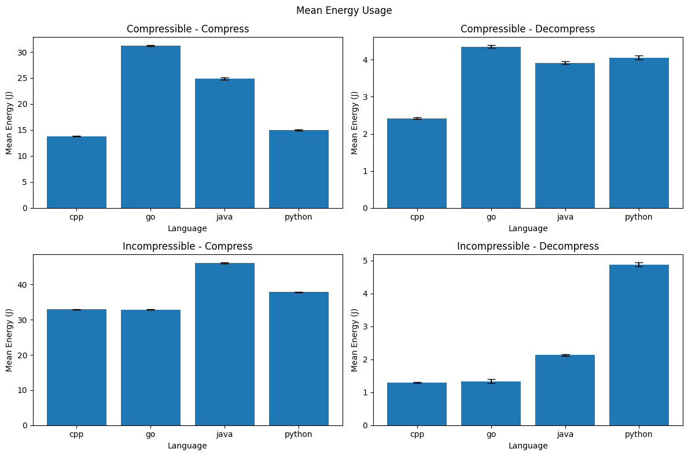
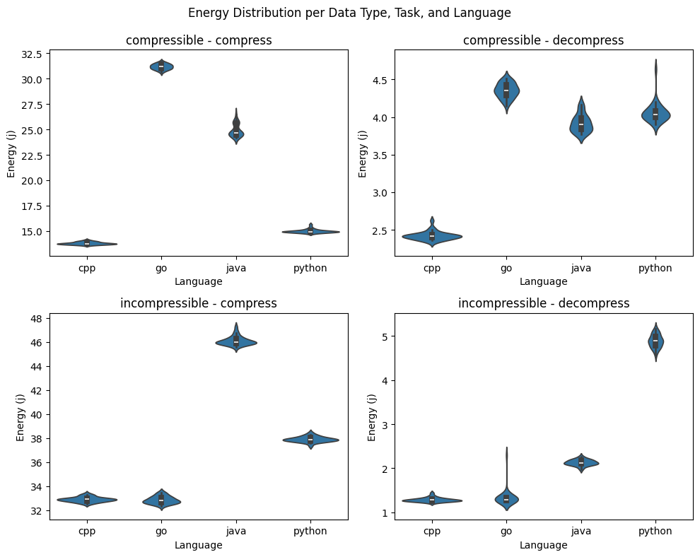
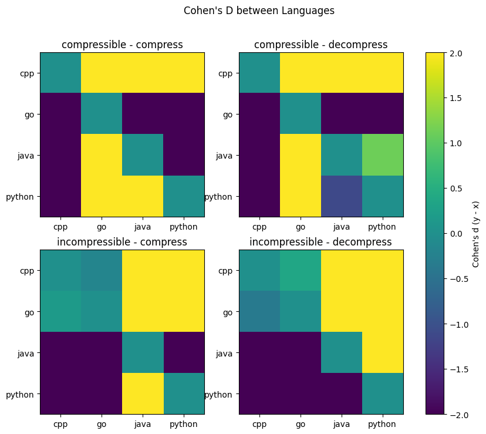

# Introduction

Software powers the world. Every sent message, every stored dataset, and every archived log is processed by layers of software that execute on energy-consuming hardware. As digital infrastructure grows, the environmental impact of software has emerged as a prominent theme in computing research [1]. Data centers account for an increasingly larger portion of global electricity consumption [2], and software design choices influence how effectively hardware resources are used [3]. 

Recent studies suggest that the choice of programming language is one such decision. Pereira *et al.* [4] report substantial differences in runtime and energy consumption for equivalent workloads, which they ascribe to language-specific memory management and compiler optimization. A very simple design choice can have tangible effects on the environment when it is considered over millions of executions. This observation leads to an important question: when software developers choose a language ecosystem for a given task, are they implicitly making an energy choice as well?

This project investigates that question through a controlled case study. We will examine the energy consumption of a typical software engineering task: file compression and decompression using the `gzip` format [5]. Every second, massive amounts of data are compressed and decompressed, measurements showing that 90.5% of websites rely on it, with `gzip` alone accounting for 49.5% of all sites [6]. Web servers compress HTTP responses, databases archive backups, package managers transfer compressed artifacts, and cloud services are constantly moving compressed artifacts between storage and computation tiers. Compression is one of the most common tasks in today’s computing world, which makes even small differences in its energy efficiency significant from a sustainability perspective.

The case study was intentionally chosen so as to be simple and easy to understand. Instead of comparing the relative merits of various compression algorithms, we chose to focus on the well-known example of `gzip` in order to examine how different programming languages complete the same exercise. We will compare file compression implementations written in Python, Java, Go, and C++, implemented using each language's standard libraries and typical runtime characteristics as much as possible. That is because, in a real-world setting, developers tend not to write their own low-level algorithms but rely instead on the abstractions provided by the language. Our comparison will thus allow us to realistically analyze the sustainability implications of choosing one language environment over another for a common task.

This is a practical study for software developers. In a large-scale system where compression is performed millions of times, even small percentage differences per call can result in large total energy costs. On the other hand, if the differences are trivial, then software developers can focus on other factors, such as ease of development, without worrying about sustainability implications. With more and more companies setting sustainability goals and reporting on environmental metrics, software design decisions must be supported by empirical evidence rather than intuition or anecdotal experience, a need underscored by McGuire *et al* [7], who found that the academic literature is surprisingly lacking in this context. To provide such evidence, this study aims to scientifically quantify the impact of language efficiency in a concrete and widely relevant scenario.


# Research Questions

Through this study, we seek to answer a practical question: when two systems perform the same task, how much does the choice of programming language matter for energy efficiency? To that end, we use our case study of `gzip` file compression and decompression to narrow down our scope to three aspects of the problem::

**RQ1.** Do Python, Java, Go, and C++ differ significantly in energy consumption when performing identical `gzip` compression and decompression tasks under controlled conditions?

**RQ2.** Are the observed energy differences consistent across data types (compressible vs. incompressible) and operations (compression vs. decompression), and how statistically significant are these differences?

**RQ3.** Is the language that achieves the lowest runtime also the most energy efficient for `gzip` compression and decompression?


# Methodology

This section explains the experimental design we used to measure and compare the energy consumption of `gzip` compression and decompression for different programming languages.

## Data

We generate fully deterministic synthetic input data both for the purpose of reproducibility and to make sure that the differences in energy consumption can be attributed solely to the language ecosystems and not to the variability of our input datasets. All inputs are created by a custom Python script (`data/generate_input.py`), which takes a fixed seed and a size in megabytes, then produces exactly the same sequence of bytes every time. The script also prints the SHA-256 hash of every file it produces for replication purposes.

We examine two workload types, which represent the extremes of the compression spectrum. The first type of workload contains highly *compressible data*, modeled after unstructured logs. The data is represented as JSONL (JSON Lines) records with the same structure and repeated fields (log level, service, region, action, etc). The values of each field are varied deterministically by using a seeded SHA-256 counter-mode pseudo-random number generator (PRNG). The second type contains *incompressible data*, which is generated as a uniform byte stream using the same deterministic PRNG and stored in a binary file. This simulates data that has very little redundancy, such as encrypted or already-compressed data. We chose to include both types of workloads so that we could observe how different languages perform under both optimal and worst-case conditions.


## Experimental Setup

This section describes the setup used for the experiments. We took inspiration from the rigorous guide provided by L. Cruz (2021), who argued that energy measurements are determined by a multitude of factors, and thus require careful bias control and automation [8].

### Hardware and Software Environment

All experiments are executed on the same machine and OS, with the following specifications:

| Category | Specification |
|---|---|
| Machine / Laptop model | `HP ZBook Power 15.6 inch G9 Mobile Workstation PC` |
| CPU | `i7-12700H` |
| CPU cores / threads | `20 cores / 40 threads` |
| RAM | `16 GB DDR4` |
| Operating system | `Fedora Linux 43 (Workstation Edition)` |
| EnergiBridge version | `0.0.7` |

### Input Preparation

We evaluate four language implementations (`cpp`, `java`, `go`, `python`) under two dataset types (*compressible* and *incompressible*) and two operation modes (*compression* and *decompression*), leading to 4 experimental groups.

Input files are generated automatically at the start of each experiment using the existing deterministic generator (`data/generate_input.py`). We use one **compressible** dataset (`.jsonl`) and one **incompressible** dataset (`.bin`) with a fixed size of 256MB.

For decompression experiments, the script generates a **single reference gzip file per dataset** using **GNU gzip** at compression level 6 with header normalization:

```bash
gzip -6 -n -c INPUT > ref.gz
```

The `-n` option removes filename and timestamp metadata from the gzip header, thus contributing to the project's reproducibility. We do this to ensure that all languages decompress the **same exact `.gz` bytes**.

### Measurement Tooling and Execution Procedure

Energy measurements are collected with **EnergiBridge** [9], as it provides accurate and reliable real-time power consumption data. For each run, the experiment script invokes EnergiBridge as a wrapper around the language-specific command:

```bash
energibridge -o <run.csv> -i <interval_us> --summary -- <language_command>
```

The script records:
- an EnergiBridge summary output in a per-run CSV file (`raw/run_k.csv`)
- stdout/stderr in a log file (`raw/run_k.log`)
- the wall-clock runtime (`wall_time_s`) measured by the Python orchestrator

We use an EnergiBridge sampling interval of 100 µs, which is the default. This interval provides sufficient detail for our short-duration runs, capturing energy fluctuations. After each run, the script parses the EnergiBridge CSV and computes per-column deltas between the first and last recorded values for numeric counters.

### Experimental Protocol

An important inspiration for our protocol is the observation made by L. Cruz (2021) [8] that software energy measurements can be strongly affected by thermal state, background processes, and temporal drift [8]. To reduce these sources of bias, the runner implements the following controls.

1. **Warm-up runs.** Before recording measurements, the script performs **3 warm-up runs** for each condition and language. These warm-up runs are discarded; their purpose is to reduce **cold-start effects** by allowing the system to stabilize thermally.

2. **Repeated measurements.** We measure each condition 30 times, as recommended by L. Cruz (2021) [8], in order to achieve statistically significant results.

3. **Rest between runs.** We use rest periods of 60 seconds after each measured run, again, as recommended by L. Cruz (2021) [8].

4. **Shuffled execution order.** The language order is shuffled using a deterministic random seed to reduce the risk of confounding effects [8].


### Manual Controls and Remaining Sources of Bias

Before running long experiments, we aim to keep the environment stable by:
- closing unnecessary applications and browser tabs,
- disabling notifications and updates,
- keeping hardware peripherals constant,
- maintaining fixed screen brightness/resolution and power settings,
- avoiding unrelated network activity when possible.

These steps align with L. Cruz’s "Zen mode" and "freeze your settings" recommendations to reduce the impact of background tasks and environmental changes on energy measurements [8].


## Implementation Details

We standardize the same algorithm design across all languages. Each implementation provides a small command-line interface of the form `mode input_file output_file`, with the `mode` being either compression or decompression. The `gzip` compression level is fixed at 6 for all languages, which matches the default setting [10]. All files are processed in binary mode, and compression is done using each language's standard library in a streaming fashion, without system calls or external tools, so that the measurements reflect purely the behavior of the language. If applicable, we also use a buffer size of 32 KB to keep memory usage and I/O behavior comparable.

### Java

The Java implementation uses the standard `java.util.zip` package [11], with `GZIPOutputStream` for compression and `GZIPInputStream` for decompression. Files are processed in a streaming manner using buffered I/O and fixed 32 KB chunks, avoiding full-file loads into memory to keep memory usage stable and comparable across input sizes. To enforce **gzip level 6**, we use a small custom subclass of `GZIPOutputStream` that sets the internal `Deflater` level after construction.

### C++

The C++ implementation directly uses the `zlib` library [12] for compression and decompression, both of which are performed with matching parameters through `deflateInit2` and `inflateInit2`, respectively. Data is processed incrementally, in fixed-size chunks, by feeding the input buffers into the stream and writing the output until the stream ends. We chose to use chunked streaming so that we could avoid loading the entire file into memory, and so manage to keep the memory usage stable across file sizes. This also happens to be a typical design for C++ applications.

### Python

The python implementation uses the built-in `gzip` module, which is a wrapper around the `zlib` library you would find in C++. The API is very straightforward, and is representative of how Python developers would typically perform compression and decompression tasks. The three simple methods `open`, `compress`, and `decompress` are used to read and write files in a streaming fashion. The `gzip` module also allows us to set the compression level, which we fix at 6 to match the other implementations.

### Go

The Go implementations utilizes the built-in `compress/gzip` library to (de)compress the input file.
For compressing, the library creates a writer pointing to the output file.
The input file is then copied into the writer thereby writing to the output file.
For decompressing, it takes a similar approach. Here it creates a reader for the input file instead and a regular io writer is used.

## Evaluation Metrics

To evaluate the sustainability and performance of the selected languages, we measure several metrics that capture different aspects of their behavior. These metrics allow us to compare the energy efficiency and runtime performance of the implementations in a comprehensive manner, answering the research questions we posed earlier. 

**Energy consumption (E)** expressed in Joules (J) is our primary metric, measured using EnergiBridge. It represents the total work performed by the hardware to execute the compression and decompression tasks. Minimizing E is the direct goal of reducing carbon footprint of the software, and measuring it forms the basis to answering all of our research questions, but especially our main questions, RQ1.

We will also measure the **energy per megabyte**, in Joules per megabyte (J/MB). This is calculated as the total energy consumed (E) divided by the size of the input file in megabytes and it provides a normalized measure of energy efficiency which allows us to make comparisons across different workloads (dataset and operation combinations) and therefore to answer RQ1, 2 and 3. Logically, a lower E/MB indicates better energy efficiency per unit of data processed.

**Runtime (T)** is measured in seconds (s) using wall-clock time and, in this project, contributes towards answering RQ3. This metric is often substituted as a proxy for the performance of an implementation, and through its use, we can analyze the trade-offs between energy efficiency and implementation efficiency and determine whether the fastest implementation also consumes the least energy.

Finally, the **compression ratio (CR)** is calculated as the size of the compressed file divided by the size of the original file. A lower CR indicates a better compression. We use this metric as part of RQ3 to confirm that all languages achieve roughly the same compression performance, because, if one language had a significantly worse ratio, then it might appear as faster or more energy efficient simply because it has been compressing less aggressively.


## Statistical Analysis
First, we visualize the distribution of energy consumption and the mean with 95% confidence intervals for each combination of language, mode and data type. 
These plots provide initial insight relevant to RQ1 and RQ2.

We perform Welch's t-tests to compare energy consumption between programming languages.
Cohen's d is computed and used to quantify effect sizes.
Additionally, we apply Shapiro-Wilk to assess whether the distributions are normal.

To address RQ3, we plot energy consumption against execution time to visualize the relationship between them.
To evaluate this relationship, we use Pearson's correlation coefficient.

# Results

## Evaluation Results
### Mean Energy + Confidence Intervals


### Energy Distributions


### Energy over Runtime


### Energy Percent Change between languages 

| compressible - compress | cpp | go      | java   | python |
|-------------------------|-----|---------|--------|--------|
| cpp                     | 0   | +126.2% | +80.8% | +8.7%  |
| go                      | -   | 0       | -20.1% | -52.0% |
| java                    | -   | -       | 0      | -39.9% |
| python                  | -   | -       | -      | 0      |

| compressible - decompress | cpp | go     | java   | python |
|---------------------------|-----|--------|--------|--------|
| cpp                       | 0   | +79.8% | +61.8% | +67.6% |
| go                        | -   | 0      | -10%   | -6.8%  |
| java                      | -   | -      | 0      | +3.6%  |
| python                    | -   | -      | -      | 0      |

| incompressible - compress | cpp | go     | java   | python |
|---------------------------|-----|--------|--------|--------|
| cpp                       | 0   | -0.15% | +40.1% | +15.2% |
| go                        | -   | 0      | +40.3% | +15.4% |
| java                      | -   | -      | 0      | -17.9% |
| python                    | -   | -      | -      | 0      |

| incompressible - decompress | cpp | go    | java   | python  |
|-----------------------------|-----|-------|--------|---------|
| cpp                         | 0   | +3.9% | +65.4% | +279.2% |
| go                          | -   | 0     | +59.3% | +265.1% |
| java                        | -   | -     | 0      | +129.2% |
| python                      | -   | -     | -      | 0       |

## Statistical Results

### Shapiro-Wilk
| Dataset        | Mode       | Lang   | W     | p value  | Normal (α=0.05) |
|----------------|------------|--------|-------|----------|-----------------|
| compressible   | compress   | cpp    | 0.942 | 1.03e-01 | True            |
| compressible   | compress   | go     | 0.980 | 8.34e-01 | True            |
| compressible   | compress   | java   | 0.841 | 4.04e-04 | False           |
| compressible   | compress   | python | 0.786 | 3.66e-05 | False           |
| compressible   | decompress | cpp    | 0.862 | 1.10e-03 | False           |
| compressible   | decompress | go     | 0.976 | 7.17e-01 | True            |
| compressible   | decompress | java   | 0.914 | 1.84e-02 | False           |
| compressible   | decompress | python | 0.715 | 2.63e-06 | False           |
| incompressible | compress   | cpp    | 0.974 | 6.51e-01 | True            |
| incompressible | compress   | go     | 0.955 | 2.36e-01 | True            |
| incompressible | compress   | java   | 0.863 | 1.19e-03 | False           |
| incompressible | compress   | python | 0.978 | 7.75e-01 | True            |
| incompressible | decompress | cpp    | 0.888 | 4.23e-03 | False           |
| incompressible | decompress | go     | 0.378 | 3.43e-10 | False           |
| incompressible | decompress | java   | 0.988 | 9.80e-01 | True            |
| incompressible | decompress | python | 0.978 | 7.68e-01 | True            |

### Welch's t-test


### Pearson's
| data type      | mode       | pearson r | p value       |
|----------------|------------|-----------|---------------|
| compressible   | compress   | 0.995502  | 1.246119e-122 |
| compressible   | decompress | 0.975349  | 2.738179e-79  |
| incompressible | compress   | 0.996787  | 3.110406e-131 |
| incompressible | decompress | 0.996859  | 8.266893e-122 |

### Cohen's d between languages


# Discussion

## Interpretation of Results
rqs: 
RQ1. Do Python, Java, Go, and C++ differ significantly in energy consumption
when performing identical gzip compression and decompression 
tasks under controlled conditions?
RQ2. Are the observed energy differences consistent across data types 
(compressible vs. incompressible) and operations 
(compression vs. decompression), and how statistically significant 
are these differences?
RQ3. Is the language that achieves the lowest runtime also 
the most energy efficient for gzip compression and decompression?

observations:
- The data shows that the languages perform significantly different
- C++ consistently performs the best
- python performs about the same as C++ on compressing compressible data. However, it is significantly worse on other tasks. Possibly alluding to a bottleneck in file writing, which would be less noticable for compressing compressible data, but more on other tasks.
- Go surprisingly matches C++ on incompressible data. Which could mean the implementation of gzip itself is less efficient.
- Java consistently uses more energy when compared to C++
- Shapiro-Wilk shows that normality is inconsistent
- There is a clear positive correlation between energy consumption and runtime

rq answers:
rq1: Mostly yes. With the exception of between Go and C++ on incompressible data.
rq2: No. Cohen's d shows that inter-language differences are sometimes exaggerated or even completely reversed under different conditions.
rq3: Yes. There is a strong correlation between 

## Practical Implications

# Conclusion

## Reflection

## Limitations and Future Work

This study evaluates a single use case, namely `gzip` compression and decompression. Therefore, while it is, indeed, a common and computationally intensive task, our results cannot be generalized across other workloads, as they might use the hardware differently and therefore exhibit different energy readings. Additionally, all measurements were carried out on one machine, so the results may vary from one hardware configuration to another.

As a result, the scope of this paper could be expanded to include other compression algorithms, such as `zstd` [13] or `brotli` [14], which use different types of strategies, to investigate whether our results are truly due to the language itself or if they stem from the language's interactions with its corresponding `gzip` library. More broadly, future work could extend this research to other types of use cases, such as database operations or handling web requests, to determine whether the patterns we observed could potentially be generalized beyond compression.

Alternatively, from a narrower perspective, further research could complement our paper by repeating our experiments on different hardware and runtime environments, to explore how sensitive our results are to the underlying configurations. Finally, it could also compare a low-latency implementation of `gzip` with the standard library-based one to examine the trade-offs between energy efficiency and convenience.

# References

[1] P. Pathania, N. Bamby, R. Mehra, S. Sikand, V. S. Sharma, V. Kaulgud, S. Podder, and A. P. Burden, "Calculating software’s energy use and carbon emissions: A survey of the state of art, challenges, and the way ahead," in *Proc. 2025 IEEE/ACM 9th Int. Workshop on Green and Sustainable Software (GREENS)*, Apr. 2025, pp. 92–99, doi: 10.1109/GREENS66463.2025.00018.

[2] International Energy Agency, *What the data centre and AI boom could mean for the energy sector*, IEA, Oct. 18, 2024. Available: https://www.iea.org/commentaries/what-the-data-centre-and-ai-boom-could-mean-for-the-energy-sector

[3] D. Connolly Bree, "The impact of software design on energy performance," Ph.D. dissertation, School of Computer Science, University College Dublin, Dublin, Ireland, 2025.

[4] R. Pereira, M. Couto, F. Ribeiro, R. Rua, J. Cunha, J. P. Fernandes, and J. Saraiva, "Energy efficiency across programming languages: How do energy, time, and memory relate?" in *Proc. 10th ACM SIGPLAN Int. Conf. Software Language Engineering (SLE)*, Vancouver, BC, Canada, 2017, pp. 256–267, doi: 10.1145/3136014.3136031.

[5] Free Software Foundation, "GNU Gzip," *GNU Operating System*. [Online]. Available: https://www.gnu.org/software/gzip/.

[6] W3Techs, "Usage statistics of compression for websites," *W3Techs – Web Technology Surveys* [Online]. Available: https://w3techs.com/technologies/details/ce-compression.

[7] S. McGuire, E. Schultz, B. Ayoola, and P. Ralph, "Sustainability is stratified: Toward a better theory of sustainable software engineering," in *Proc. 2023 IEEE/ACM 45th Int. Conf. Software Engineering (ICSE)*, May 2023, pp. 1996–2008, doi: 10.1109/ICSE48619.2023.00169.

[8] L. Cruz, “Green Software Engineering Done Right: a Scientific Guide to Set Up Energy Efficiency Experiments,” blog post, Oct. 10, 2021. [Online]. Available: http://luiscruz.github.io/2021/10/10/scientific-guide.html. doi: 10.6084/m9.figshare.22067846.v1.

[9] Sallou, J., Cruz, L., & Durieux, T. (2023). EnergiBridge: Empowering Software Sustainability through Cross-Platform Energy Measurement (Version 1.0.0) [Computer software]. https://doi.org/10.48550/arXiv.2312.13897

[10] J.-L. Gailly and Free Software Foundation, *GNU Gzip Manual*, version 1.14, Feb. 2025. [Online]. Available: https://www.gnu.org/software/gzip/manual/gzip.html.

[11] M. Grand, J. B. Knudsen, and P. Ferguson, *Java Fundamental Classes Reference*, 1st ed. Sebastopol, CA, USA: O’Reilly & Associates, Inc., 1997.

[12] J.-L. Gailly and M. Adler, *zlib.h -- interface of the 'zlib' general purpose compression library*, version 1.3.2, Feb. 2026. [Online]. Available: https://zlib.net.

[13] Y. Collet et al., "Zstandard – Fast real-time compression algorithm," GitHub, 2015. [Online]. Available: https://github.com/facebook/zstd.

[14] J. Alakuijala and Z. Szabadka, "Brotli: A general-purpose data compressor," *Commun.* ACM, vol. 61, no. 4, pp. 86–95, Apr. 2018, doi: 10.1145/3231935.
