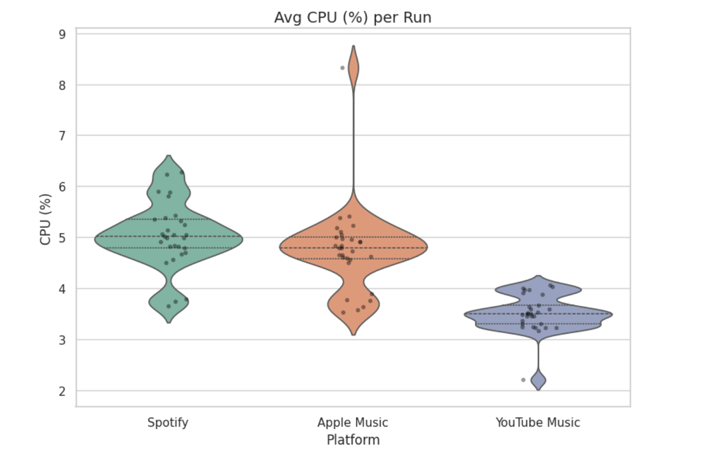
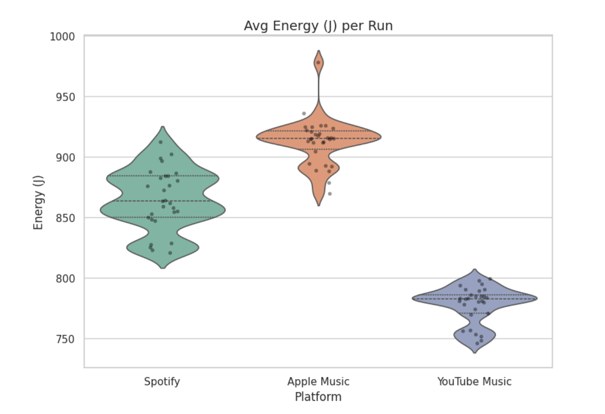

# Group 24: Streaming in the Browser: Measuring Energy Use of Spotify Web Player vs Apple Music Web vs YouTube Music
## Introduction

Music is an important part of our lives, serving as a form of self expression that unites people all over the world. The music industry has quickly evolved throughout the years, from sales of physical copies to the rise of streaming platforms, which allow users to access a vast music library at any time. [^1] Their popularity can also be seen in numbers, as streaming platforms generated 84% of the music industry revenue in 2025. [^2] Spotify is currently the leader in this field, having 31.7% of the market share. Apple Music and YouTube Music are also strong competitors, having a 12.6% and 9.7% share.

As streaming services continue to grow in popularity, a new question arises: how much energy do these platforms consume? Users typically choose a service based on factors such as subscription price, user interface, audio quality, and catalog size, but energy efficiency is rarely considered. Yet music streaming is not “free” in computational terms. It involves continuous network communication, media decoding and playback, and browser execution, often while other applications run in parallel. Together, these processes contribute to device energy use and, at scale, to environmental impact.

Because of the scale of streaming usage, even a small difference in energy consumption between platforms might have a huge impact on the environment or the battery life. In this project, we measure the energy consumption of Spotify, Apple Music and YouTube Music web applications. Our goal is to provide empirical evidence that can inform more sustainable design choices and raise user awareness about the environmental footprint of everyday digital habits.

## Methodology

### Experiment Design

In order to test the energy consumption of the three platforms, we conducted an experiment that mimics the behaviour of a real user. To do this, we picked a song (“Chanakya” by Rishab Rikhiram Sharma) that we played on all three platforms for its entire duration. Since the energy consumption can differ on different occasions, we decided to do 30 runs of the experiment.

One run consists of randomly shuffling the order of the three platforms, and playing the song on each one. To measure the energy consumption, we used EnergiBridge, which collected resource usage data, such as CPU usage, memory usage, system power usage, etc. [^3]

### Experiment Setup

Before the experiment began, we first warmed up the device we used for one hour and a half. We made sure that the battery was at 100% and that the device was always plugged in. We also closed all applications, except for the terminal that ran the script. Then we let the script run, which generated the csv files that we needed for the analysis.

### Automation Process

In order to remove human bias, we decided to automate the experiment. We created a shell script that runs 30 times. It first closes Safari, then randomly picks the order of the three services for each run. It opens the link to the song on the first platform and plays it (either by pressing space for Spotify, or by pressing the play button for Apple Music).

While the song plays, EnergiBridge measures the energy consumption. Then the song is played on the next platform, which generates another csv file. Once all three platforms have been opened, the run finishes, and the entire process repeats 30 times.

### Data Collection

The results are saved in a csv file with the name of the platform and the number of the run. After the experiment was finished, we noticed that a few of the files from Apple music didn’t generate correctly. For the first few rows, the columns were moved to the left one or two spaces. We had to modify the table for these files in order to correctly analyse the energy consumption.

### Replication package

Our replication script, with the data and the code for creating the plots can be found [here](https://github.com/SSE-P1-Group24/p1_measuring_software/tree/main). 

### Hardware Setup

This experiment was conducted on a MacBook Pro laptop with an M4 Pro chip. It has a 14-core CPU and 24GB RAM. The web applications of the three platforms are used for analysis. There are several factors that can affect the measurement of energy consumption. To reduce any bias as much as possible, we did the following before starting the experiment:

- Charged the device's battery to 100% and it was always plugged in.
- The device was warmed up because it had been running for 1.5 hours before starting the experiments.
- All applications were quit (except the terminal running the test script).
- Background services were disabled (e.g. cloud sync, PostgreSQL, etc).
- All notifications were turned off.
- Ensured that no additional hardware is connected to the device (e.g. remove USB mouse), and Bluetooth was turned off.
- Was connected to the same WiFi network across all runs.
- Brightness and volume were kept constant.
- Disabled power-saving mode on the device.
- Logged in to Spotify, Apple Music and YouTube Music web applications beforehand. Applications were closed before starting the experiment.
- Since Apple Music cannot be used without a subscription, we used an account that was subscribed to Apple music. Spotify and YouTube Music were used without subscription.
- No additional settings or preferences were added to each application.

## Results

The experiment yielded many interesting pieces of data, that provides an insight on which platform utilises less resources and is hence more sustainable. Energibridge collects many different types of data, however the most important ones are CPU_USAGE, USED_MEMORY and SYSTEM_POWER.

Considering the experiment is run multiple times, a violin plot with overlaid jittered data points can be made to compare the efficiency of each platform. In addition, with the violin plot, the summary statistics can be analysed along with the density of the data. Besides the violin plots, a one-way ANOVA was performed to determine the statistical significance of the mean usages.

*Figure 1: Average CPU (%) per Run*

Figure 1 consists of a violin plot showing the average CPU usage percentage per run. The figure shows that YouTube Music uses less CPU on average per run. This suggested that it is more efficient. In addition, the violin shape suggests that it runs clustered tightly at 3.5%. Spotify and Apple Music both have greater CPU usage on average.

For Spotify, the median usage is about 5% with most runs spreading between 4.5% and 6.5%. The violin shape for Apple Music suggests that it has high variance. Although its median is lower than Spotify, the data is more spread. In addition, the peak at above 8% suggests that CPU usage spiked to over 8% for at least one run.

The p-value is $6.59 * 10^{-14}$ which is below the 0.05 threshold, suggesting that YouTube Music is lighter on the CPU when compared to the other platforms.

*Figure 2: Average RAM (GB) per Run*

Figure 2 is similar to Figure 1, however it shows the average RAM usage as opposed to CPU usage. Figure 2 shows that all platforms use a comparable amount of RAM. It shows that the RAM usage is generally between 10.5GB and 13.5GB. The violin for the 3 platforms suggest a multi-modal distribution, where the data clusters in three distinct areas.

The median RAM usage for Apple Music is lower than that of the other platforms, this suggests that it uses less RAM on average. In addition, it also has the minimal absolute RAM usage at 10.1GB. On the other hand, Spotify uses more RAM on average.

The p-value for the RAM usage experiment is $1.5256*10^{-1}$, as this is above the 0.05 threshold it shows that the results are not statistically significant. Hence it can not be claimed that a specific platform uses more RAM than others.

*Figure 3: Average Energy (J) per Run*

Similar to the other figures, Figure 3 compares the average Energy usage between platforms in Joules. Figure 3 shows that YouTube Music consumes the least amount of energy at about 780J. Its maximum usage is also near the minimum for Spotify, this shows its energy efficiency compared to the other platforms.

On the other hand Apple Music has the biggest overall energy consumption, with a median of about 915J. Besides the greater median, it also has an outlier spiking at about 980J. Spotify has a median of 865J which positions it in between both platforms.

The p-value for this experiment is $6.9953*10^{-41}$ as the p-value is within the threshold of 0.05 it suggests that Apple Music consumes more energy and that YouTube Music is more energy efficient.

## Discussion

The results show a clear difference in energy consumption between the three platforms. YouTube Music consumed the least energy at around 780J per run, followed by Spotify at 865J, and Apple Music used the most at 915J.

One likely explanation is the complexity of each platform's web interface. YouTube Music's player is relatively lightweight, with a straightforward layout and fewer dynamic elements, which could explain its low and consistent CPU usage at around 3.5%. Spotify, on the other hand, runs a richer interface with features like animated album art, canvas videos, and dynamic UI updates, which would naturally demand more processing power.

Apple Music's higher energy consumption and CPU variance may stem from the fact that Apple introduced its web player well after its native app and has historically given it less development attention, potentially leaving it less optimized for browser-based playback. Research comparing energy consumption across desktop web browsers has demonstrated that software design choices have a measurable impact on client-side energy usage [^4].

It is also worth considering that Apple Music is known to stream at a higher default audio quality compared to the free tiers of Spotify and YouTube Music, which would require more data to decode and could further contribute to its higher energy consumption.

At first glance, a difference of around 100J per session might not seem like much. However, when scaled up the impact becomes significant. For example, assuming 10 million users each stream one session per day, the 135J difference between YouTube Music and Apple Music would amount to roughly 1,350 GJ, or about 375,000 kWh per year.

The significance of client-side energy consumption is further supported by research showing that digital content consumption, including music and video streaming, could account for a substantial share of the per capita carbon budget consistent with limiting global warming to 1.5°C [^5]. The CBC has also reported that streaming of all types of media is now responsible for an estimated three to four per cent of the global carbon footprint [^6]. On an individual level, choosing a more efficient platform could also mean noticeably better battery life on a laptop.

For developers, these findings suggest that optimizing web frontends, such as reducing unnecessary animations, minimizing background scripts, and using efficient audio codecs, can make a real difference in energy consumption. Experiments on progressive web app energy efficiency have shown that frontend choices such as JavaScript execution, rendering complexity, and even the use of WebAssembly directly affect client-side energy consumption [^7].

## Limitations

While our experiment was designed to be as controlled as possible, there are several limitations to consider.

First, all measurements were taken on a single device. Different hardware configurations, such as a different CPU or amount of RAM, could produce different results. Running the experiment on multiple devices would help confirm whether the trends we observed hold more generally.

Second, we only tested playback of a single song. Different genres, song lengths, or albums could lead to different energy usage patterns. Similarly, we did not test playlist playback, which may behave differently as platforms handle track transitions in their own way.

Third, our comparison is limited to web players running on Safari. Using a different browser could change the results, as each browser has its own resource management. Since Safari is developed by Apple, it is possible that Apple Music's web player is better optimized for this browser, which means Apple Music might perform even worse on other browsers. We also did not compare web players to native desktop apps, which may be more optimized for their respective platforms.

Additionally, Apple Music was tested with a paid subscription, while Spotify and YouTube Music were used on free tiers. This may result in different default audio quality settings, which could influence energy consumption. However, Spotify does not allow users to change audio quality settings in its web player, and Apple Music requires a paid subscription to function at all, meaning these were the only configurations available to us for a fair comparison.

Fourth, we only tested over a WiFi connection. Energy usage could differ on a wired or cellular connection due to differences in how data is transmitted.

Finally, while we ran 30 repetitions per platform, increasing the number of runs could improve statistical confidence. We also have no visibility into what happens on the server side, meaning some energy costs are not captured in our measurements.

## Conclusion

In this project, we compared the energy consumption of Spotify, Apple Music, and YouTube Music web players during music playback. Our results show that YouTube Music is the most energy-efficient option, consuming significantly less energy than both Spotify and Apple Music, which had the highest consumption among the three. CPU usage followed a similar pattern, with YouTube Music being the lightest on processing resources, while RAM usage did not differ meaningfully across platforms.

These findings suggest that the design and optimization of a web player can have a noticeable impact on energy consumption. As browser-based players become increasingly common, applying green software principles during frontend development, such as reducing unnecessary animations and minimizing background scripts, could help reduce energy waste across millions of daily sessions. For users who care about sustainability or battery life, the choice of platform matters more than one might expect.

That said, this study focused on a single playback scenario on a single device, so broader testing is needed before drawing universal conclusions. Still, we believe these results highlight the importance of considering energy efficiency as a factor in both software design and user choice, especially as music streaming continues to grow at a global scale. Brennan and Devine's research found that despite a dramatic reduction in plastic use by the recording industry, greenhouse gas emissions from recorded music in the US were estimated to have risen to between 200 and 350 million kg by 2016, up from 157 million kg at the peak of the CD era [^8], making energy-conscious software design more important than ever.

## Future Work

Although the experiment allows for a comparison between the platforms, there are some elements that could be modified to further improve the comparison.

As platforms might implement linking differently, it would be interesting to perform the test for a playlist. In addition, platforms might use different audio codecs and bitrates. Some require more processing power. A possible experiment could be comparing the energy usage between the audio settings. An example is running the experiment with Apple Music at a different audio setting to see if the higher resource usage is because of the audio settings.

Another experiment is comparing resource usage when put in foreground and background. This can be used to see if Spotify uses the same amount of RAM when put in the background. Besides comparing foreground and background, the experiment can be run with different network connectivities, such as Wifi and cellular. This can be used to verify if YouTube is still the most efficient, even when it has to fetch data over cellular.

Besides the one-way ANOVA, a Post-Hoc test could be used to determine which of the platforms are different.

## Resources

[^1]: [Music streaming services: understanding the drivers of customer purchase and intention to recommend](https://pmc.ncbi.nlm.nih.gov/articles/PMC8379453/)

[^2]: [Music Streaming Services Stats (2026)](https://explodingtopics.com/blog/music-streaming-stats)

[^3]: [EnergiBridge](https://github.com/tdurieux/EnergiBridge)

[^4]: [Comparative Analysis of Energy Efficiency in Desktop Web Browsers: Towards Sustainable Software Applications](https://www.researchgate.net/publication/382421953_Comparative_Analysis_of_Energy_Efficiency_in_Desktop_Web_Browsers_Towards_Sustainable_Software_Applications)

[^5]: [The environmental sustainability of digital content consumption](https://www.researchgate.net/publication/380293386_The_environmental_sustainability_of_digital_content_consumption)

[^6]: [The environmental impact of music streaming, explained](https://www.cbc.ca/music/the-environmental-impact-of-music-streaming-explained-1.6843948)

[^7]: [Green Energy Efficient Progressive Web Apps - Sustainable Software](https://devblogs.microsoft.com/sustainable-software/green-energy-efficient-progressive-web-apps/)  

[^8]: [Music streaming has a far worse carbon footprint than the heyday of records and CDs – new findings](https://theconversation.com/music-streaming-has-a-far-worse-carbon-footprint-than-the-heyday-of-records-and-cds-new-findings-114944)

