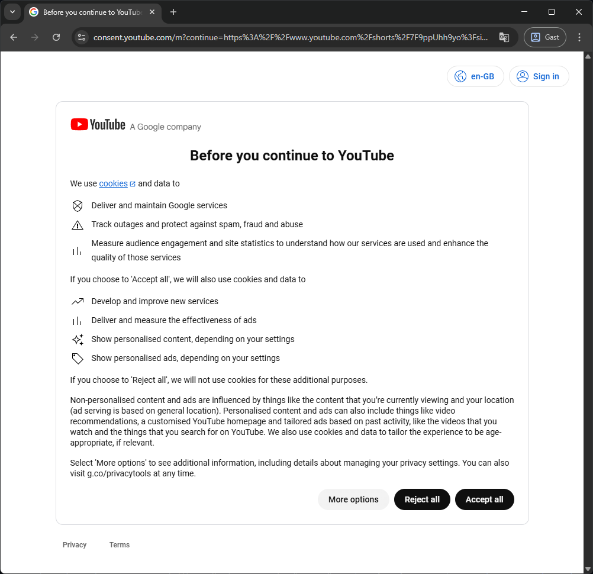
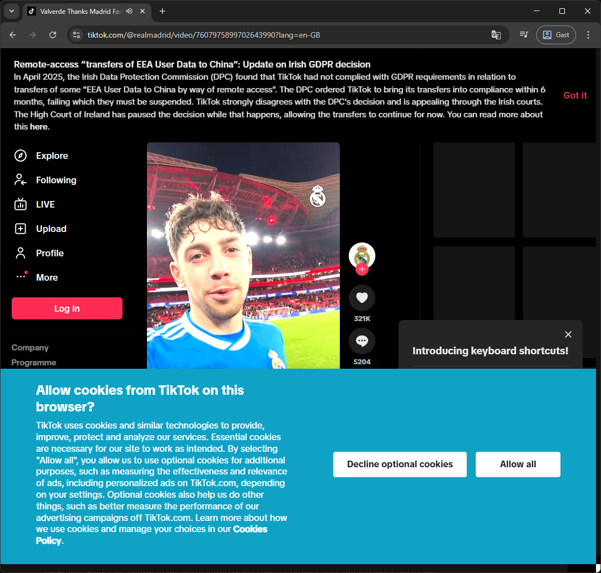
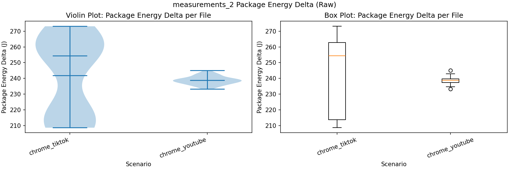
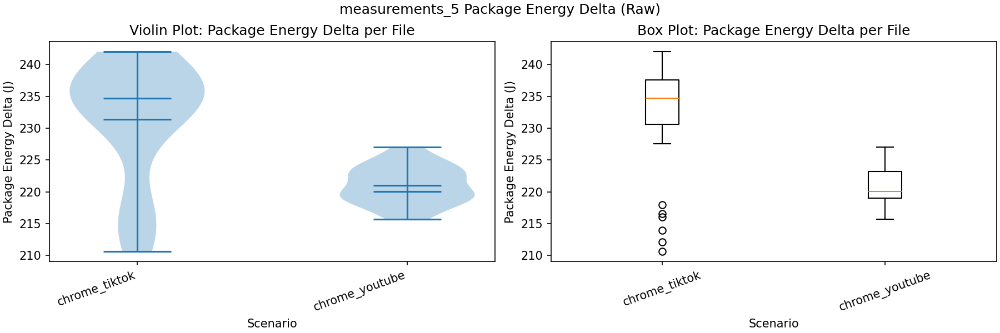
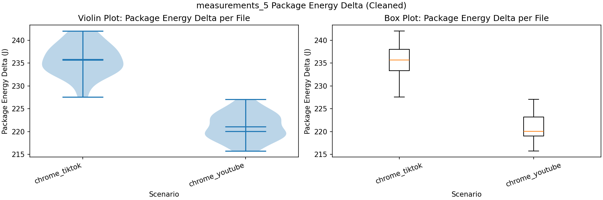
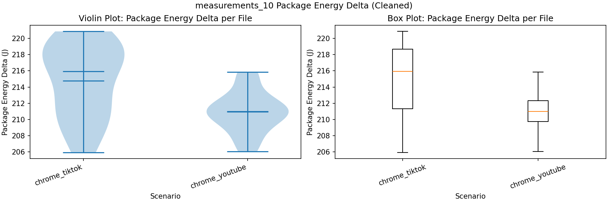

# Introduction
In 2025, people spent on average 141 minutes per day on social media[^time-spent]. That adds up to over 850 hours per person per year, much of it spent watching short-form content. A short break can easily turn into an endless session of watching a stream of recommended videos. This continuous video scrolling is also colloquially dubbed "Doomscrolling".

Every swipe has a cost beyond attention. The energy consumed by our devices to load, decode and play these videos is not something you might think about. In this project, we measure the total system power consumption while doomscrolling Instagram Reels and YouTube Shorts to understand the energy usage of our social media habits.

This research aims to provide insights on which platform to use in order to decrease your energy usage during a doomscrolling session.

Of course, using less energy during doomscrolling will be positive for the environment. However, there are more direct advantages to the community of doomscrollers.

Access to a charger is not always a given while in the midst of our doomscrolling sessions. When your device is low on battery, choosing the more energy-efficient platform might add extra time to keep scrolling. 

However, even if an energy source is available, the cost of energy has only been increasing over the last 5 years [^energy-prices]. Therefore, the findings in this research may allow you to reduce the price of your energy bill as well.

If you're going to doomscroll, you might as well do it in an energy-efficient way.

## Methodology
The aim is to quantify and compare the power consumption associated with doomscrolling. Therefore, we designed a comparative experiment analyzing the energy consumed by both TikTok as well as YouTube.

### Design Choices of the Experiments
The design of the experiment was one of the most important steps of the experimental setup. During the design phase, we contemplated and debated between various approaches to perform the experiment. The choice of approach affects the implementation and results of the experiment, hence they needed to be critically discussed and justified. 

#### <u>Frequency of Scrolling</u>
The design of the experiment also tries to mimic the actions of users, while keeping it consistent so that it's scientifically measurable and reproducible. An example of this choice was the frequency of scrolling - non-randomized (scrolling consistently after every two, five, and ten seconds). In reality, the frequency of scrolling depends on different factors (attention capture of the video, user preference, network constraints, etc.) and is hence naturally random. However, to attain scientific basis for our experiments, we chose to make scrolling consistent. This allows us to evaluate the impact of the pace of the content consumption as well.

#### <u>Platform Selection</u>
Initially, we chose to measure the energy consumption of scrolling Instagram Reels and YouTube Shorts. However, the former was found to not allow an anonymous user to scroll more than four videos on their web application. This is not enough to get reliable measurements. Since each experiment needed to be isolated from the others, we opted to not log in to an account. Therefore, Instagram tests had to be dropped. Instead, we focused on YouTube Shorts and TikTok.

#### <u>Control of Other Environmental Variables</u>
Desktop computers often run numerous background processes that could skew our energy measurements. Therefore, we aimed to create a strictly controlled testing environment. We ensured the following:
- Terminated all background applications, including cloud syncing tools.
- Disabled wireless networks in favour of an Ethernet connection.
- Unplugged all non-essential USB peripherals.
- Fixed laptop at medium brightness level and 40% sound.

With these mitigations, external influences on the stability of the to-be-measured energy consumption of solely the Doomscrolling. Therefore, solely the power consumption of video rendering and network requests is measured. Becasue of this, the expectation is that the measurements will not differ significantly across platforms.

#### <u>Moment of Energy Consumption Measurement</u>
Another key design choice was when we start measuring the energy used by the system. We know energy tests are flaky, and energy measurement had to be malleable to ensure room for error (network issues or delay, start-up time for the browser, warm up time etc.). 

To isolate the tests from each other, we are creating a new browser instance and profile for each run. This ensures that the browser's cache and other stateful data do not influence the results. Static assets such as the JavaScript bundle and CSS files are not cached across runs, which means that each run will have to download and process these assets from scratch.

Energy measurement began after:
- Closing all popups.
- Rejecting "optional cookies" (see [Cookies and Popups](#cookies-and-popups)).
- Closing random popups while scrolling. This is needed since we are not logged into any of the social media apps (see [Cookies and Popups](#cookies-and-popups)).
- Warm up time of 5 seconds so any other browser processes are completed.

Other factors such as brightness, sound of the system, size of the browser window, stable wired WiFi connection, room temperature remained constant during in experiments to not skew the energy consumption of the system.

#### <u>Cookies and Popups</u>
YouTube allows an anonymous user to scroll through Shorts without any limitations, but it does show a cookie consent prompt that pops up before the first video is loaded. Before the measurements are taken, the script clicks the "Reject all" button to ensure that the cookie consent prompt does not influence the results.

    
    

Simmilarly, TikTok also shows a cookie consent prompt, where we again click the "Decline optional cookies" button before the first video is played. TikTok also shows a pop-up asking the user to log in when the page is loaded, but can be dismissed by clicking the X button. Because we do not want to log in to an account, we click the X button whenever the pop-up appears during the measurements.

#### <u>Warm-up Time</u>
We decided to keep a warm-up time of 5 seconds to ensure the CPU reaches a stable thermal state and reducing fluctuations. 

### Experimental Setup
The experiment was conducted separately for each platform — TikTok and YouTube Shorts — using a two-process architecture designed to isolate energy measurement from setup overhead.

Before any measurement begins, a background process navigates the Chromium browser to the target platform, enters fullscreen, and handles platform-specific pop-ups, including TikTok's puzzle, GDPR notice, and cookie banner, as well as YouTube's cookie banner. The video is then unmuted and the browser is left to warm up for a fixed period. This entire setup phase is explicitly excluded from energy measurement to avoid skewing results.

Once setup is complete, the doomscrolling loop begins automatically advancing to the next video at the specified fixed time interval for the full duration of the experiment. Simultaneously, the main process detects that setup has finished and launches the energy measurement tool, which records energy consumption exclusively during this active scrolling window. This ensures that only steady-state doomscrolling behaviour is captured, free from any setup or initialization noise.

Upon completion, the energy data is saved to a results file per platform, the browser is closed, and both processes terminate cleanly.

The experiments consisted of standardized scrolling sessions with a length of 30 seconds. For both platforms, the experiments were repeated 30 times to ensure generalizability.

### Hardware/Software Details
We ran the experiments on a machine with the following hardware specifications:
- Machine model: HP HP ZBook X G1i 16 inch Mobile Workstation PC
- CPU: Intel® Core™ Ultra 7 255H × 16
- GPU: Intel® Graphics (ARL)
- RAM: 32.0 GiB
- Network connection type: Ethernet

All tests were conducted within a standard Linux-based Operating System, using the Google Chrome browser. 

Capturing the energy spent for each experiment was done using EnergiBridge. EnergiBridge is a cross-platform command-line utility that can analyze the performance directly from our machine's low-level hardware sensors.
For the 

Specifically, we ran the experiments with the following software versions:
- OS: Ubuntu 24.04.3 LTS (64-bit)
- Chromium browser: Version 145.0.7632.109 (Official Build) (64-bit)
- Python: 3.12.3
- Energibridge: 

Other software requirements and versions that are used for this project can be found in `requirements.txt` file of our Github Repository which is linked in the [Replication Package](#replication-package) section.

## Analysis
### Exploratory Analysis
Violin + Box plots, expect the shape and outliers of the data.

### Normality
After the measurements are taken, it is important to ensure that data is normal. To measure normality, Shapiro-Wilk's test was performed. If the results do not assume normality, the points of data, deviating by more than 3 standard deviations from the mean were excluded and the Shapiro-Wilk's test was conducted again. If the results still did not indicate normality, the experiment was repeated.

### Statistical Significance
Group differences were evaluated using the Welch’s t-test, which does not assume equal variances between groups. Statistical significance was determined using a α = 0.05.

### Effect Size
To evaluate the practical implication of the observed results, mean difference and percent change were calculated.
Cohen’s d was computed to measure statistical effect size. Effect sizes were interpreted according to conventional benchmarks:

Small effect: d ≈ 0.2

Medium effect: d ≈ 0.5

Large effect: d ≈ 0.8

While statistical difference is unlikely to arise by chance, the practical importance will be further evaluated in the discussion section.

# Results
## Analysis
### Exploratory Analysis

This section presents violin and box plots based on the averages of 30 measurements for each platform on two, five and ten second intervals of scrolling.

“Raw” plots include all observations, while “clean” plots exclude outliers using the 1.5xIQR rule. We found that for some runs on TikTok, the reels were stuck, and the bot script was unable to scroll. We assume that these occurences represent the outliers on the lower end, providing a justification to remove them.

#### 2 second intervals

##### Chrome_TikTok
The distribution is hourglass-shaped, with observations concentrated at the lower and upper ends. It is skewed toward higher values, as the mean is lower than the median. Variability is relatively high.

##### Chrome_YouTube
The distribution is approximately symmetric and resembles a normal shape. The mean and median are nearly identical, and variability is noticeably lower than TikTok.

##### Comparison
On average, energy consumption is similar across platforms. However, TikTok shows greater dispersion, indicating a higher probability of elevated energy consumption in individual runs.

No noticeable difference after outlier removal.

#### 5 second intervals

##### Chrome_TikTok
As in the 2-second case, variability is higher than YouTube. The distribution is more strongly skewed toward higher values, suggesting a greater likelihood of increased energy consumption.

##### Chrome_YouTube
Variability increases compared to the 2-second interval. The distribution shows slight lower-tail skewness, with the median below the mean.

##### Comparison
Both the mean and median are higher for TikTok, indicating greater overall energy consumption relative to YouTube.

After removing the outliers, Chrome_tiktok graph appears to attain a normal distribution. Since outliers were on the lower end, both mean and median are higher.

##### Chrome_TikTok
Variability remains higher than YouTube but the distribution is more evenly spread and appears approximately symmetric. No clear outliers are observed.

##### Chrome_YouTube
Variability increases relative to earlier intervals. The mean and median converge, and the distribution appears approximately normal.

##### Comparison
Unlike previous intervals, the minimum energy consumption is roughly the same across platforms. However, TikTok consistently shows higher average consumption across runs.

##### Conclusion
Accross the runs, TikTok showed more unstable or inconsistent energy consumption across runs with similar or higher mean and average. It can be inferred, that TikTok is less energy efficient in the long run.

### Statistical Significance
The tests were conducted after removing outliers.

| Interval (s) | TikTok Normal |  YouTube Normal | Test Type      | Test Score | Significant  |
|--------------|---------------|-----------------|----------------|------------|--------------|
| 2s           | False         | True            | Mann-Whitney U | 0.2719     | No           |
| 5s           | True          | True            | Welsch's t-test| 1.471e-19  | Yes          |
| 10s          | True          | True            | Welsch's t-test| 0.0002     | Yes          |

### Effect Size
| Interval (s) | Mean difference | Percent difference | Cohen's d |
|--------------|-----------------|--------------------|-----------|
| 2s           | 3.1293          | 1.31%              | 1.174     |
| 5s           | 14.7714         | 6.68%              | 4.5612    |
| 10s          | 3.81185         | 1.81%              | 1.0327    |

## Discussion
### Test Isolation
Whether the described test isolation methods (such as creating a new browser from scratch on each run) is realistic depends on the user behavior and device. 

For example, Chromium allows an origin to use up to 60% of the total disk space for caching, and when disk space is low, evict the least recently visited origins[^storage-for-the-web]. A user could visit the homepage of YouTube, download the static assets once, and then watch Shorts without re-downloading the assets. 

However, modern web applications, including YouTube[^youtube-ab-testing], often use A/B testing to serve different versions of the site to different users, which can lead to variations in energy consumption. Additionally, updates to the application can cause different versions of the static assets to be served, which can also invalidate the cached assets. 

Therefore, we believe that our approach of creating a new browser instance and profile for each run is a reasonable way to isolate the tests and ensure that the results are not influenced by caching or other stateful data.

### Recommendation algorithms
While developing the scripts to automate the Chromium browser, we encountered several challenges. Althrough we start with the same video uploaded to both platforms, the recommendation algorithms of YouTube and Instagram may serve different videos to the user, which can lead to variations in energy consumption.

To attempt to reduce the influence of the recommendation algorithms, all tests are run without a logged in user. Therefore, a scrolling session of one test should not influence the next test, as the recommendation algorithms will not have any user data to personalize the content. However, it is still possible that the platforms use browser fingerprinting techniques to attempt to identify the user and serve personalized content, which could influence the results.

### Automation mitigations
While analyzing the results, we noticed that the energy consumption of TikTok of some test runs was significantly lower than the other runs. After investigating the issue, we found that TikTok was disallowing the automated browser to scroll through the videos, and loaded only the first video. These outlier runs were excluded from the analysis to ensure that the results are not influenced by this issue.

### Practical importance

# Conclusion
Our research is aimed to analyse the differences in energy consumption of "doomscrolling" accross different popular short-form video social media platforms. The motivation for this experiment was to help reduce everyday frustrations of rapid battery drain and increasing electricity costs.

We designed a controlled experimental setup using the EnergiBridge utility to measure the precise power draw of a desktop Chrome browser during automated, 30-second scrolling sessions for both YouTube Shorts and TikTok. The tests were varied between different scrolling frequencies, scrolling every two, five, and ten seconds. Additionally, environmental controls were set like hardwired internet, terminating background tasks and setting a fixed screen brightness and sound. The experiments were ran using fresh browser profiles for every run.

Our findings indicate that there are differences in energy consumption of doomscrolling. Across the tests, YouTube Shorts consistently proved to be more stable and energy-efficient than TikTok. TikTok exhibited a higher overall power consumption and a greater run-to-run variability. This finding was more prominent, and statistically significant, for the five-second and ten-second scrolling intervals. In order for TikTok to maintain a continuous feed, it requires demands noticeably more system resources than YouTube.

The experiments required conquering challenges like recommendation algorithms and anti-automation measures that can impact the findings. These were taken into account in the results but may still have effect on the validity of the experiments. Techniques such as fingerprinting can negate our efforts for test isolation.

Ultimately, these results still provide a clear and practical takeaway for the everyday user. Should you find yourself with a low battery and the urge to scroll, opting for YouTube Shorts over TikTok might just buy you those crucial extra minutes of entertainment.

# Future work
This research establishes a baseline for insight into the energy demands of browser-based doomscrolling. The reality, however, is that the vast majority of social media consumption occurs on mobile devices. Future research can measure these effects for smartphones and tablets.

This may be of even more import because mobile devices often rely on wireless networks (e.g., Wi-Fi and 5G). Investigating the differences between our findings and those for mobile devices can be even more directly applicable to the everyday user's on-the-go experience.

Additionally, our methodology prioritized isolation. We used a fresh browser profile for each experiment for exactly thirty-second sessions. This strips away some of the complexities of real-world use. Future experiments can focus on the energy impact of fully logged-in sessions where targeted advertising and personalized recommendation algorithms are also running in the background. 

Furthermore, extending the scrolling duration from thirty seconds to several minute, or even hours, would provide valuable insights into sustained power draw. Longer sessions would allow insights into how devices handle thermal throttling over time. It can also assert whether platforms optimize managing background resources when a user falls into a prolonged doomscrolling loop.

# Replication Package
For reproducibility of these experiments, we have published all the scripts and measurement files on a public Github Repository: [Energy-experiments-P1](https://github.com/SSE26/energy-experiments-P1).

# References
[^energy-prices]: CBS, "Average energy prices for consumers", Available: [Average energy prices for consumers](https://opendata.cbs.nl/#/CBS/en/dataset/85592ENG/table). [Accessed: Feb. 26, 2026].

[^time-spent]: B. Elad, "Average Time Spent On Social Media By App, Country, Region And Trend (2025)," *ElectroIQ*, Jun. 30, 2025. [Online]. Available: [https://electroiq.com/stats/average-time-spent-on-social-media/](https://electroiq.com/stats/average-time-spent-on-social-media/). [Accessed: Feb. 24, 2026].

[^storage-for-the-web]: P. LePage, "Storage for the web," *web.dev*, Sep. 23, 2024. [Online]. Available: [https://web.dev/articles/storage-for-the-web](https://web.dev/articles/storage-for-the-web). [Accessed: Feb. 26, 2026].

[^youtube-ab-testing]: "YouTube feature experiments & rollouts, *YouTube Help*. [Online]. Available: [https://support.google.com/youtube/answer/7367023?hl=en](https://support.google.com/youtube/answer/7367023?hl=en). [Accessed: Feb. 26, 2026].
