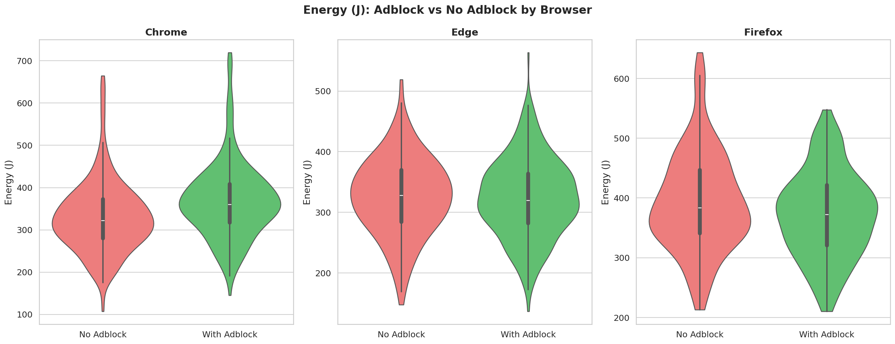
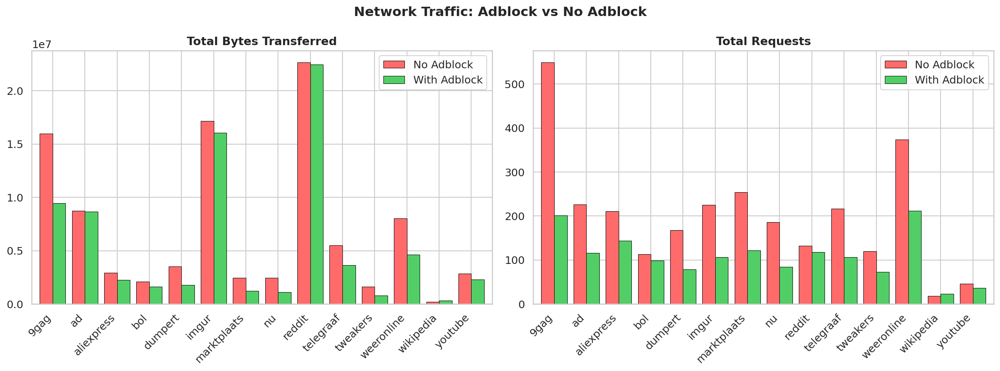
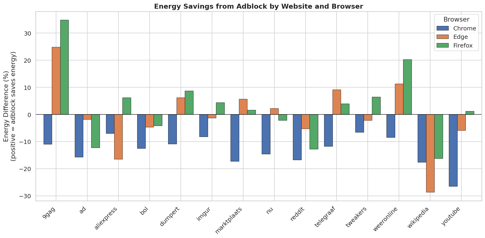

A working POC can be found [here](https://github.com/TheOrange-cmd/course_sustainableSE/tree/adblock/2026/p1_measuring_software/POC).

# Browser Energy Usage: The Effect of Ad Blocking

## Introduction

As of 2024, the average person spends over six hours online every day, contributing to a global data usage of nearly 400 million terabytes per day (Statista, 2024). While much of the sustainability discussions focus on the massive energy influence of data centers, which accounted for example for 4% of US national energy consumption in 2023 (Shehabi et al., 2024), the energy usage by billions of end-user devices still has an essential impact. Every website load requires processing scripts, layout elements, and media.

However, some of the load is dedicated not to the content requested by the user, but to the "invisible" and sometimes not web advertisements and tracking scripts. Previous research suggests that these elements introduce a measurable overhead. For example, advertisements can add several watts of power consumption to a single browsing session (Simons & Pras, 2010). 

Given the size of internet use, reducing the energy cost of loading a webpage can lead to significant savings in energy, as ad blockers like uBlock Origin claim to increase efficiency by preventing these scripts from ever loading. Pearce (2020) demonstrated page load time reductions of up to 28.5% with ad blockers. However, significant architectural changes have occurred since then, including Chrome's transition to Manifest V3 in 2024, which restricts extension capabilities. This study revisits these findings in the current browser ecosystem by comparing the energy consumption of three major browsers (Chrome, Firefox and Edge) on different websites to determine if ads and script filtering can still lower a device's carbon footprint.

### uBlock Origin
uBlock Origin is a free, open-source browser extension designed for advertisement filtering. Unlike many other ad blockers, it is marketed as one that prioritizes CPU and memory efficiency. Via filter lists, it intercepts requests from the browser to ad-related servers and prevents the execution of those scripts. We examine whether this reduction in network requests and script execution results directly in lower hardware use.

### LibreHardwareMonitor
LibreHardwareMonitor is an open-source tool that provides real-time access to the sensors in a Windows-based computer. For this project, it serves as the primary measurement instrument, allowing us to track the CPU Package Power and GPU Power in watts. By isolating these metrics during controlled browsing sessions, we can measure the exact energy cost of rendering specific websites with and without active advertisement filtering.

### Web Browsers
The efficiency of an ad blocker is often tied to the performance and functionality of the browser. In this study, we compare two primary architectures:
1. **Chromium** (Chrome, Edge): An open-source project by Google that powers the majority of modern browsers, which uses the V8 JavaScript engine and the Blink rendering engine.
2. **Gecko** (Firefox): Developed by Mozilla, this engine is known for its independent architecture and different approach to resource management and privacy.

## Expected Effects and Hypothesis

Prior work shows that online advertising introduces measurable overhead in web browsing workloads, which increases device energy consumption. Simons and Pras (2010) demonstrate that advertisements can add several watts of power during browsing sessions. Khan et al. (2024) provide direct measurements showing average power reductions of around 40% on multimedia websites when ad blockers are enabled, though these effects vary substantially by website type (multimedia, news, etc.).

Given this variability and the architectural changes in modern browsers (including Chrome's Manifest V3 restrictions on extension capabilities), the present study expects a mean reduction in power consumption of 15% (SD 10%) when ad blocking is enabled. This conservative estimate accounts for the substantial variation observed across different website categories and browsers in prior research, while remaining consistent with reported ranges.

The study is guided by the following research questions:

1. RQ1: What is the effect of enabling uBlock Origin on power consumption across different web browsers and websites?

2. RQ2: How much of the variation in browser power consumption can be explained by changes in downloaded data volume and processing load when using uBlock Origin?

RQ1 is evaluated using a confirmatory hypothesis test. The main hypothesis is:

1. H0: Enabling uBlock Origin does not significantly change mean browser power consumption.
2. H1: Enabling uBlock Origin reduces mean browser power consumption by 15%.

RQ2 is treated as exploratory. Prior literature provides limited quantitative guidance on the contribution of network and processing factors in modern browsers. Therefore, no formal hypothesis is specified for RQ2.

## Methodology

This section details the experimental setup and data collection protocol used to investigate the effect of ad blocking on browser power consumption. The methodology was designed to ensure reproducibility and to control for extraneous variables that could influence the measurements.

### Experimental Setup

All experiments were conducted on a single, dedicated machine to eliminate hardware variability as a confounding factor.

**Hardware and System Configuration:**
*   **Operating System:** Microsoft Windows, run with administrator privileges to access hardware sensors.
*   **Processor:** AMD Ryzen 7 5700U with Radeon Graphics (APU).
*   **System State:** To ensure a consistent baseline, the machine was prepared before each experimental session according to a strict protocol: all non-essential applications and background processes were closed, a wired Ethernet connection was used, the "High Performance" power plan was selected, and screen brightness was set to a fixed value.

**Software Configuration:**
*   **Browsers:** Three major web browsers were tested: Google Chrome and Microsoft Edge (both Chromium-based) and Mozilla Firefox (Gecko-based).
*   **Ad Blocker:** uBlock Origin was selected for its popularity and efficiency. The standard extension was used for Edge and Firefox, while uBlock Origin Lite was used for Chrome due to automation constraints.
*   **Automation:** Browser interactions were automated using the Playwright framework for Python. To better simulate human browsing and bypass simple bot-detection, the `playwright-stealth` library was applied to each browser instance.

### Collected data

Two primary categories of data were collected concurrently: hardware power consumption and network traffic metrics.

**Power Consumption:**
Hardware sensor data was collected by programmatically interfacing with LibreHardwareMonitor. The primary dependent variable for power consumption was the **CPU Package Power (Watts)**. For this integrated APU, this single metric represents the combined power draw of the CPU cores and the integrated Radeon Graphics, sampled at a frequency of 1 Hz. Unofrtunately, the device does not offer access to individual CPU and GPU power measurements, likely due to the graphics being integrated. 

**Measurement Limitations**
A significant constraint of this measurement approach is that the Ryzen 7 5700U's integrated architecture prevents separate CPU and GPU power measurement. Consequently, observed power changes reflect the combined behavior of both components, and we cannot determine whether energy savings/penalties stem primarily from reduced CPU workload (fewer ad scripts) or GPU rendering (fewer visual elements).

**Network Traffic:**
To address RQ2, a custom monitoring component was integrated into the automation script. This component captured network events for each webpage to quantify:
*   Total data volume (bytes) and the total number of requests.
*   The subset of data volume and requests originating from domains on Peter Lowe's ad-serving blocklist (Lowe, 2026).
*   The number of requests actively intercepted and blocked by the browser extension.

### Experimental Design

The experiment followed a within-subjects factorial design, where each website was subjected to multiple conditions.

**Independent Variables (Factors):**
1.  **Website:** A set of 14 popular, high-traffic websites, primarily focused on the Dutch market: `Telegraaf.nl`, `Nu.nl`, `AD.nl`, `Bol.com`, `Marktplaats.nl`, `Aliexpress.com`, `Youtube.com`, `Reddit.com`, `Imgur.com`, `9gag.com`, `Dumpert.nl`, `Tweakers.net`, `Weeronline.nl`, and `Wikipedia.org` (as a non-ad control).
2.  **Browser:** Google Chrome, Microsoft Edge, Mozilla Firefox.
3.  **Ad Blocking:** Enabled (uBlock Origin active) vs. Disabled (no ad blocker installed).

This resulted in a total of 14 (websites) × 3 (browsers) × 2 (ad block conditions) = 84 unique experimental configurations.

### Data Collection Protocol

A fully automated script executed the experiment to ensure consistency.

1.  **Randomization:** All 84 configurations were replicated 20 times for a total of 1,680 trials. This entire list was then shuffled into a random order to mitigate time-dependent confounding variables (e.g., thermal drift).
2.  **Initialization:** Before the first run, browser user data directories were cleared to prevent caching between conditions. The system was warmed up for five minutes by running multithreaded exponential calculations to reach 80% CPU load to mitigate any startup-related effects.
3.  **Per-Trial Execution:** For each of the 1,680 trials:
    a. A `cooldown` period of 10 seconds was enforced.
    b. The appropriate browser was launched with the specified ad blocker configuration.
    c. The browser navigated to the target URL and executed pre-defined actions to handle elements like cookie banners.
    d. For a duration of 30 seconds, the script simulated a user scrolling the page to trigger lazy-loaded content and ads, except in the case of youtube where the main content is at the top of the page.
    e. During this 30-second interaction, hardware power and network data were recorded once per second and saved to a CSV file with corresponding metadata.
    f. The browser was closed.

### Pilot Study and Sample Size Determination

Prior to the main experiment, a pilot study was conducted with a small sample size (N=3) for each configuration to inform the selection of an appropriate sample size for the main study. An a priori power analysis was performed on this pilot data to calculate the sample size required to achieve a statistical power of 0.80 at a significance level (α) of 0.05.

The analysis revealed a wide variance in the ad blocker's effect size (Cohen's *d*) across configurations. For some configurations (e.g., `nu.nl` on Edge), the required sample size was as low as 3. For others where the effect was negligible (e.g., `youtube.com` on Chrome), the analysis suggested a required N in the thousands, confirming a very small effect. A large number of configurations required a sample size between 10 and 50.

Based on these findings and the practical time constraints of the project, a sample size of **N=20 trials per configuration** was chosen. This number represents a pragmatic balance, providing sufficient statistical power for the majority of configurations exhibiting a medium-to-large effect, while acknowledging that the study may be underpowered for configurations with very small true effect sizes. All 84 configurations were included in the main experiment regardless of their pilot study recommendation to ensure a complete dataset.

### Data Analysis
Energy consumption was calculated by estimating the integral of the CPU Package Power over the 30-second measurement window using the trapezoidal rule. Outliers (defined as having a Z-score > 3) were removed prior to hypothesis testing, resulting in the exclusion of 3 out of 1680 runs (0.2%).

The Shapiro-Wilk test was used to assess normality for each browser-website combination's distribution. For normally distributed groups (72.6% of data), Welch's t-test and Cohen's *d* were used for hypothesis testing. For non-normal groups (27.4%), the non-parametric Mann-Whitney U test and Common Language Effect Size (CLES) were applied. To control the false positive rate while evaluating 42 unique browser-website combinations, the Benjamini-Hochberg False Discovery Rate (FDR) correction was utilized with $q = 0.05$.

## Results

### RQ1: Effect of uBlock Origin on Power Consumption
The primary hypothesis ($H_1$), positing a 15% reduction in mean browser power consumption from enabling uBlock Origin, was **rejected** across all tested browsers. Furthermore, the aggregate results yielded unexpected variations heavily dependent on the browser architecture:
*   **Chrome**: Enabling uBlock Origin resulted in a statistically significant 11.8% energy *increase* (worse efficiency) ($p_{corrected} < 0.001$, CLES = 0.36).
*   **Edge**: Yielded a non-significant 2.6% energy decrease ($p_{corrected} = 1.000$, CLES = 0.52).
*   **Firefox**: Showed a statistically significant but very minor 2.9% energy decrease ($p_{corrected} = 0.032$, CLES = 0.56).

While Chrome and Firefox exhibited statistically significant differences overall (allowing for a partial rejection of the null hypothesis $H_0$), neither browser achieved the 15% hypothesized savings. Note that due to Manifest V3 restrictions, Chrome was forced to use *uBlock Origin Lite*. This lighter extension protocol represents a structural difference compared to the standard extension running on Firefox, and is the likely driver of Chrome's energy penalty.

### Network Traffic Savings
Despite the mixed power outcomes, network payload measurements strongly supported the extension's efficacy in network filtering. Across the board, uBlock Origin significantly reduced both total HTTP requests and transferred bytes, particularly on ad-heavy websites like *weeronline* and *telegraaf*.

### RQ2: Contributors to Browser Power Variation
A multiple linear regression model was constructed with total energy consumption (J) as the dependent variable and four predictors: change in data volume (ΔData MB), change in average CPU load (ΔCPU %), change in average memory usage (ΔMemory %), and change in GPU load (ΔGPU %). The model was fit across all 1,677 valid runs, collapsing across browsers and websites (R² = 0.910, F(4, 1672) = [value], p < 0.001). 

The structural model revealed that differing hardware processing loads heavily dictated the final energy footprint:
*   Changes in Average CPU Load ($\Delta CPU$) and Memory Load ($\Delta Memory$) were both highly significant predictors ($p < 0.001$).
*   Changes in Data Volume ($\Delta Data$ MB) and GPU processing Load ($\Delta GPU$) (note, GPU load is the computation load, not the energy use of the GPU itself) were not statistically significant predictors ($p = 0.346$ and $p = 0.470$, respectively).

This confirms that while ad blockers reduce network payload, it is the net change in CPU processing—either saved from executing ad scripts or expended by running the adblocker's logic—that fundamentally determines the energy outcome.

### Site-Specific Adblock Efficiency (FDR-Corrected)
Analysis of the 42 browser-website pairs revealed a distinct interaction between website ad-density and extension efficiency. Of the 42 pairs, 12 showed statistically significant differences after FDR correction.

Ad-blockers provided significant energy savings primarily on ad-heavy sites. For instance, Firefox saved 34.8% energy on *9gag* ($p < 0.001$, $d = +3.60$) and 20.3% on *weeronline* ($p < 0.001$, $d = +1.50$). Conversely, on ad-light sites, the extension universally cost more energy. On *Wikipedia*, Edge incurred a 28.7% penalty ($p < 0.001$, CLES = 0.16), while on *Youtube*, Chrome incurred a 26.5% penalty ($p = 0.002$, CLES = 0.21).

## Discussion

While Firefox showed consistent energy savings when using adblocker supporting our theory, other browsers such as Chrome showed the opposite. In the analysis we discovered that Firefox achieves an overall of 2.9% in terms of energy savings, while Chrome and Edge show an overall of -11.8% and -2.6% respectively. Firefox's execution environment appears to manage the overhead of filtering rules more efficiently, allowing the energy reclaimed from blocked JavaScript and network requests to result in a net gain. In contrast, the significant energy penalty observed in Chrome (-11.8%) is particularly notable given its forced use of uBlock Origin Lite. Although the Manifest V3 architecture is theoretically designed to improve efficiency by offloading filtering logic to the browser, our regression model confirms that CPU and Memory load—not data volume—are the primary drivers of energy consumption.

Manifest V3's shift from blocking WebRequest API to the declarativeNetRequest API fundamentally limits the extension's ability to dynamically analyze and block ad scripts. While the full uBlock Origin on Firefox can execute complex JavaScript logic to identify ads in real-time, uBlock Origin Lite must rely on pre-compiled rule sets that the browser enforces. This architectural constraint likely allows more ad scripts to slip through, requiring the CPU to process content that the full extension would have blocked at the network layer. Our regression results confirm this: the CPU load increase in Chrome (Δ CPU) is significantly higher than in Firefox, even when network payload (Δ Data) decreases.

The data further reveals that energy efficiency is highly dependent on the "ad-density" of the content being processed. This is enforced by our regression model, which confirms that Changes in Average CPU Load ($\Delta CPU$) and Memory ($ \Delta Memory$) explain the majority of the energy variance (rather than raw data payload size). On ad-heavy platforms like 9gag or Weeronline, the reduction in CPU-intensive scripts led to significant energy savings (up to 34.8%), resulting in a much more favorable footprint. However, on ad-light sites such as Wikipedia, the adblocker provides no benefits, turning the extension into resource overhead. This explains the massive 28.7% energy increase seen on Edge when browsing Wikipedia.

Therefore, these findings suggest that adblockers are not a "one-size-fits-all" solution for sustainable software practices. While they can drastically reduce the energy footprint of browsing ad-saturated media, they can paradoxically increase the energy footprint of a user's digital life if used on a browser with high extension overhead or while visiting minimalist websites.

### Main takeaways
This way, for website owners and advertisers, the data proves that "ad-heavy" design isn't just annoying, it's also ecologically expensive. When a site like 9gag sees a 34.8% energy decrease by simply turning ads off, it creates an additional initiative for users to reach for a blocker. Sustainable web design means finding a middle ground where monetization doesn't compromise the user's battery life. Simultaneously, adblocker developers should take note of the "Chrome penalty." The fact that an extension can increase energy consumption by 11.8% suggests a need for more "passive" filtering algorithms that power down when no ads are detected, or alternatively, dedicated profiling behind Manifest V3's efficiency.

For the everyday user, the most impactful takeaway is that digital sustainability requires a bit of manual tuning. Since adblockers incur a "logic tax" even on minimalistic sites, running them on ad-free domains like Wikipedia or internal company wikis is essentially paying computationally for a service you aren't using. We recommend a "selective blocking" approach: keep your adblocker active for the chaotic, ad-saturated websites, but use the "Power" or "Disable" toggle in your extension toolbar to whitelist sites you know are clean. By turning off uBlock on a site like Wikipedia, you could reduce that page's energy footprint by over 28% on browsers like Edge, proving that sometimes, the most sustainable move is simply doing less.

For Chrome users specifically, consider switching to Firefox for ad-heavy browsing, as Firefox's full uBlock Origin implementation avoids the 11.8% energy penalty observed in Chrome.

## Limitations and Future Work

Several limitations and possible extensions should be considered when interpreting the results of this study. First, the experiments were conducted on one machine and measured using LibreHardwareMonitor. Although this tool provides sensor data, software-based power readings may differ from external power meter measurements. Additionally, the results cannot be generalized for other hardware configurations, where power management behaviour can differ substantially. 

Secondly, the study evaluates a limited set of websites, browsers, ad block extensions, and operating systems. Advertising intensity can vary widely across websites, which may lead to different energy impacts than observed in the current study. Similarly, different effects might be observed with other browsers like Brave, on other operating systems like Mac or Android, or with other ad blocking extensions or approaches like Pi-Hole, which blocks ads at the network level. 

Thirdly, environmental and system factors were controlled, but only to the best of our ability. Variations in network conditions or background processes may introduce noise into the power measurements. While introducing randomization and repeated runs may mitigate some variability, unmeasured factors may still influence the results.

Fourth, the experimental protocol varied between websites. While most sites were subjected to automated scrolling to trigger lazy-loaded content, YouTube was treated differently due to its video-centric layout. This inconsistency may have affected the comparability of measurements, as scrolling behavior can influence CPU load independently of ad blocking. Future work could look into a more natural human browsing behavior model that can be applied to all websites equally.  

Finally, the experimental design utilized a fixed 30-second measurement window for every trial. Because the duration was artificially fixed, time-dependent efficiency metrics like the Energy Delay Product (EDP) could not comprehensively capture time-to-interactive differences. Future experiments should allow page loads to complete naturally rather than cutting them off, accurately assessing if adblocking delivers a tangible user-experience speed improvement that translates into a genuinely lower Energy Delay Product.

Future work may expand the range of websites, browsers, ad blocking tools and hardware configurations, to improve the generalizability of these findings.

## Conclusion
Our experiment reveals that the "green" reputation of adblockers is not a universal truth, but a conditional one. While uBlock Origin serves as a powerful tool for sustainability on ad-heavy platforms, its computational cost of filtering can increase your carbon footprint on cleaner websites. The data clearly shows that Firefox is the best option for efficient extension management, whereas Chrome users may involuntarily trade battery life for a cleaner UI.

Ultimately, for the modern web user, the path to a lower energy footprint isn't through "set and forget" settings, but through intentional browsing and adjusting of extension settings. By whitelisting ad-light sites and choosing browsers with efficient environments, we can ensure that our efforts to have a sustainable web don't end up costing more than the ads themselves.

## Replication package

For readers interested in replicating the experiment, please visit the following github repository. Note, some experience with python is recommended. 

Go here: [Click](https://github.com/TheOrange-cmd/replication_package_SSE_p1)

# References

Khan, K. A., Iqbal, M. T., & Jamil, M. (2024). "Impact of Ad Blockers on Computer Power Consumption while Web Browsing: A Comparative Analysis". European Journal of Electrical Engineering and Computer Science, 8(5), 18–24. https://doi.org/10.24018/ejece.2024.8.5.650

Lowe, P. (2026). “Ad blocking with ad server hostnames and IP addresses.” [Online]. Available: https://pgl.yoyo.org/adservers/. [Accessed: 26 Feb 2026].

Pearce, J. M. (2020). "Energy Conservation with Open Source Ad Blockers. Technologies", 8(2), 18. https://doi.org/10.3390/technologies8020018

Shehabi, A.; Newkirk, A.; Smith, S.; Hubbard, A.; Lei, N.; Siddik, M., et al. (2024). 2024 United States Data Center Energy Usage Report. Lawrence Berkeley National Laboratory. Report #: LBNL-2001637. http://dx.doi.org/10.71468/P1WC7Q Retrieved from https://escholarship.org/uc/item/32d6m0d1

Simons, R. J. G. &  Pras, A. (2010, August) "The Hidden Energy Cost of Web Advertising".

Statista. (2024). "Volume of data created, captured, copied, and consumed worldwide from 2010 to 2025".
