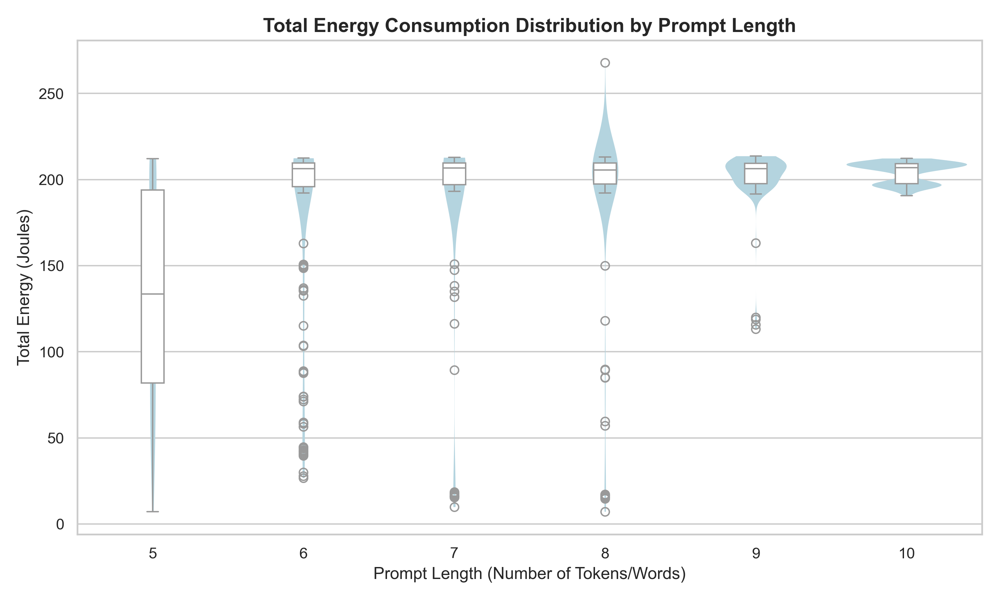
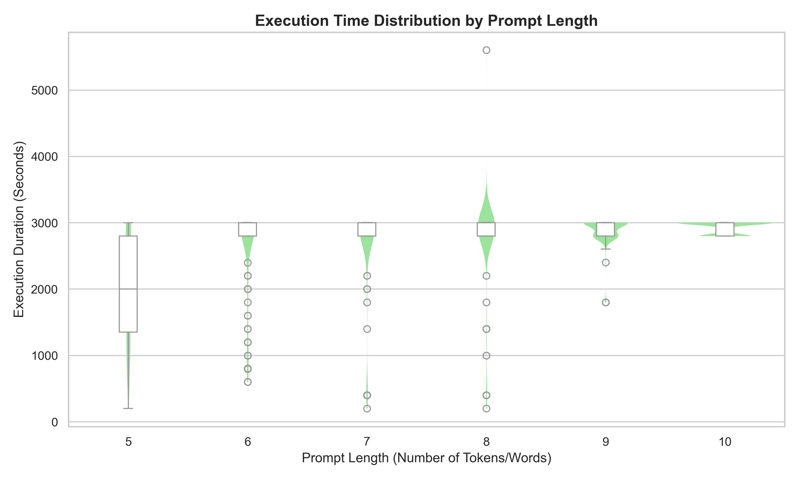
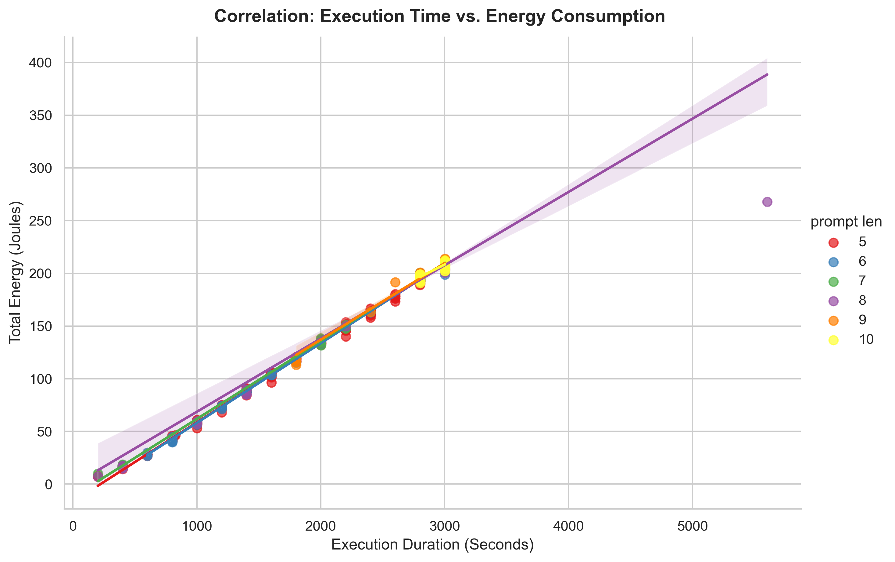
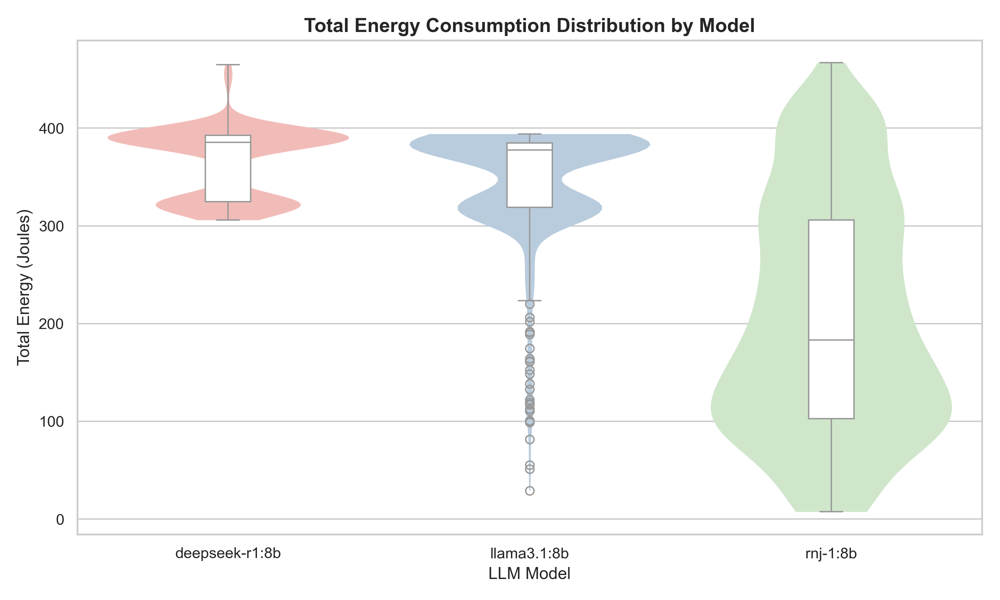

<!--
This problem takes another level if we are counting on these measurements to make **groundbreaking research contributions** in this area. Some research projects in the past have underestimated this issue and failed to produce replicable findings. Hence, this article presents a roadmap on how to properly set up a scientific methodology to run energy efficiency experiments. It mostly stems from my previous work on [doing research and publishing](/publications) on Green Software.

This article is divided into two main parts: 1) how to set up energy measurements with minimum bias, and 2) how to analyse and take scientific conclusions from your energy measurements.
Read on so that we can get your paper accepted in the best scientific conference.
---
<!-- #### 👉 Note 1:

If you are a **software developer** enthusiastic about energy efficiency but you are not particularly interested in scientific experiments, this article is still useful for you. It is not necessary to do "everything by the book" but you may use one or two of these techniques to reduce the likelihood of making wrong decisions regarding the energy efficiency of your software.

---

## Unbiased Energy Data ⚖️

There are a few things that need to be considered to minimise the bias of the energy measurements. Below, I pinpoint the most important strategies to minimise the impact of these biases when collecting the data.

### Zen mode 🧘🏾‍♀️

The first thing we need to make sure of is that the only thing running in our system is the software we want to measure. Unfortunately, this is impossible in practice – our system will always have other tasks and things that it will run at the same time. Still, we must at least minimise all these competing tasks:

- all applications should be closed, notifications should be turned off;
- only the required hardware should be connected (avoid USB drives, external disks, external displays, etc.);
- turn off notifications;
- remove any unnecessary services running in the background (e.g., web server, file sharing, etc.);
- if you do not need an internet or intranet connection, switch off your network;
- prefer cable over wireless – the energy consumption from a cable connection is more stable than from a wireless connection.

### Freeze your settings 🥶

It is not possible to shut off the unnecessary things that run in our system. Still, we need to at least make sure that they will behave the same across all sets of experiments. Thus, we must fix and report some configuration settings. One good example is the brightness and resolution of your screen – report the exact value and make sure it stays the same throughout the experiment. Another common mistake is to keep the automatic brightness adjustment on – this is, for example, an awful source of errors when measuring energy efficiency in mobile apps.

---

Nevertheless, using statistical metrics to measure effect size is not enough – there should be a discussion of the **practical effect size**. More important than demonstrating that we came up with a new version that is more energy efficient, you need to demonstrate that the benefits will actually be reflected in the overall energy efficiency of normal usage of the software. For example, imagine that the results show that a given energy improvement was only able to save one joule of energy throughout a whole day of intensive usage of your cloud software. This perspective can hardly be captured by classic effect-size measures. The statistical approach to effect size (e.g., mean difference, Cohen's-*d*, and so on) is agnostic of the context of the problem at hand.  -->

# LLM Prompting: an energy consumption study

## Introduction

In November 2022, OpenAI released ChatGPT ([Matt Casey, 2023](https://snorkel.ai/large-language-models)) - arguably the first Large Language Model (LLM) available to the general public. This, alongside the recent Artificial Intelligence (AI) revolution, marked a real turn in what we perceive computers to be capable of - no longer could programs only deal with scenarios pre-defined by a programmer; they now also (appeared to) reason for themselves.

However, with subsequent research into the LLM-production pipeline, LLM developers have received a vast amount of criticism for the negative social and environmental impact that LLMs and their production cause. Arguably the most common criticism of LLM developers is the unethical and oftentimes illegal sourcing of training data for their models. These claims often touch base on the infringement of copyright or GDPR to prove the wrong-doings of LLM developers. However, another aspect that must be considered is the environmental impact of LLMs - specifically, the energy consumed to both test and train these LLMs. [Jacob Morrison et al.](https://arxiv.org/pdf/2503.05804) found that training a 13 billion parameter model from the OLMo model family consumed an estimated 230 MWh of electricity - which they state is enough to power the average US home for 21 years.

This study will focus on analysing the energy consumption of prompting LLMs. Specifically, it is our goal to address two specific questions - first, we will study how the length of an input prompt affects the energy consumption of an LLM producing a response. Second, we will compare three different 8 Billion parameter models, rnj-1, Llama 3.1 and Deepseek-r1 (developed by Essential AI, Meta and Deepseek respectively) in terms of their energy consumption to study how much variation in energy efficiency there is between different LLM developers.

## Methodology

Before running the tests, the computer must be warmed up. This is done because higher temperature results in higher energy consumption due to the higher electrical resistance of electrical conductors - thus, for a fair test, we must make sure the computer is sufficiently warmed up for our tests to take place under the same thermal conditions. To accomplish this, we ran a CPU-intensive task (in our case, calculating Fibonacci numbers) for 5 minutes before the start of our tests. Furthermore, a 5-second sleep period is used between measurements, to prevent collateral tasks from previous the measurement from affecting the next measurement. The 5-second duration is a tradeoff between minimizing tail energy consumption of previous measurements and allowing the measurements to be run within a reasonable timeframe.

To further improve the validity of our tests, we must minimise the effect of external factors on our test results. Thus, the following measures have been to reduce confounding variables:

- Adaptive screen brightness disabled
- Monitor set to 50% brightness
- Display sleep disabled
- All applications aside from VS Code and Ollama (used to run our LLMs) closed
- Background services limited as much as possible (constrained by services required by OS)
- Wi-Fi and Bluetooth disabled
- AirDrop disabled (not applicable as we are not using MacOS, but a recommendation if this study is replicated)
- Power Plan set to balanced
- Notifications disabled
- No mouse and keyboard plugged in
- The tests are performed in a room where no human is present to keep the temperature stable as much as possible

Additionally, all of our tests will be run on the same computer with the following hardware:

- **CPU:** Intel Core i7-13650HX
- **GPU:** NVIDIA GeForce RTX 4050
- **RAM:** 24 GB DDR5-4800

The prompts tested were taken from dataset-factoid-webquestions ([Petr Baudis et al.](https://github.com/brmson/dataset-factoid-webquestions/blob/master/main/trainmodel.json)), a dataset licensed under the CC-BY 4.0 License. This dataset was modified to only include each prompt alongside the count of words for said prompt. To perform energy consumption measurements, we will use [EnergiBridge](https://github.com/tdurieux/EnergiBridge), an energy measurement utility, which will record the energy and power used by the CPU and GPU respectively for each prompt, which will then be converted to total energy usage in Joules. All of the evaluated LLMs will be run locally via [Ollama](https://ollama.com/).

### Part 1: The significance of a prompt's length on an LLM's energy efficiency

Our first test will consist of evaluating how much of an effect the length of a prompt has on the energy consumed by an LLM while generating an answer. It is our assumption that a longer prompt will result in an LLM consuming a greater amount of energy, however we are not sure exactly what kind of relation there will be.

For this part, we chose to use Deepseek's deepseek-r1 7 Billion parameter model. This is the only model we will be using for this test to limit the effect of model infrastructure, parameter size and any other confounding variables that could affect this test.

The data for our test will consist of 36 total prompts: six prompts of 5 through 10 words inclusive. Each prompt will be evaluated 30 times to reduce variance and obtain a statistically reliable estimate of energy usage for each prompt length.

### Part 2: How efficient are different developers at producing energy-efficient LLMs?

For this test, we wanted to see how efficient different LLM models made by different companies were. To select our LLMs, we looked for 8B parameter LLMs that were released within at most 1.5 years of each other. We chose three different 'types' of LLM developers - a relatively small LLM developer, Essential AI, a medium-sized developer, Deepseek, and a large developer, Meta AI; we thus chose the 8 Billion rnj-1, deepseek-r1 and llama3.1 models respectively.

To perform this test, we will sample twenty prompts of varying length at random from our dataset (note: we use random_state=0 for reproducibility). For each prompt, 30 executions will be repeated on each of the three chosen LLMs.

## Results

After setting up the code to run the experiment automatically, and making sure the computer was warmed up and all confounding variables were limited, we ran the experiment and obtained the following results.

### Part 1

Running part one of our experiment took a total of 36 prompts (6 prompts for the 6 prompt lengths), each executed 30 times, resulting in1080 total response generations. 

In the plot below, we can see the average energy consumption of the LLM for each prompt length. The main difference we can see is that the spread of the energy consumption for the 5-word prompts is much bigger than the 10-word prompts.

 
When analysing the overall energy consumption of our LLM by prompt length, a clear outlier can be observed at prompt length euqal to 5. This prompt length has produced 

### Part 2

In the comparison of three models with identical parameter counts, The deepseek-r1 and llama3.1 models show similar inter quartile ranges (IQR) regarding the energy consumption. However, Deepseek's proved itself to be less energy-efficient on average. While Meta's distribution -ignoring outliers- has a tail outside the IQR tending towards lower energy usage, DeepSeek's distribution is characterized by a tail of higher energy consumption values, indicating more frequent cases of increased energy usage.

Essential AI's rnj-1 model exhibits a significantly wider spread in energy consumption compared to the other models. This model gravitates to a more uniform distribution across the prompts, as evidenced by the larger IQR.

The aforementioned difference in IQR distance and spread, as well as other statistical metrics have been tabulated below.

| Model         | Max e.c. (J) | Min e.c. (J) | Mean e.c. (J) | Standard Dev e.c. (J) |
|---------------|--------------|--------------|---------------|-----------------------|
| deepseek-r1   |  465.06      |  305.99      |  366.33       | 36.06                 |
| llama3.1      |  394.15      |  29.16       |  345.37       | 59.20                 |
| rnj-1         |  466.90      |  7.405       |  205.44       | 119.34                |

The energy usage of the CPU and the GPU can be seen in the image below. All models show the same trend: the graphics card is the primary driver of energy usage, outpacing the CPU's average demand.

## Analysis

This could be because the LLM has more 'freedom' to generate a response for a shorter prompt, while for a longer prompt, the LLM is more constrained in its response generation - thus, the energy consumption is more consistent across different executions of the same prompt.

## Limitations

Despite our best attempts to make the study as robust as possible, there are certain parts of our research that were limited and could be improved upon. The first limitation we faced is the fact that EnergiBridge captures the total energy consumption of a system - despite our attempts to limit confounding variables (see methodology), certain background operating system processes could not be stopped or the impact of them be measured. Additionally, the tests were only performed on one operating system, Ubuntu Linux - the reliability of our results could be further improved by repeating the tests on different operating systems such as MacOS or Windows and averaging out the result from all the operating systems.

Another limitation is the use of a mere 6 prompts of each length for our first test. The reason for this is because we test six total prompts, of lengths five to ten inclusive, 30 times each. This results in a total of 1080 total response generations, whereas for the second analysis, a total of 1800 responses were generated, totalling roughly 8 hours of measuring time.

Another limitation was the release date of the different LLM compared in part two. We primarily selected our LLMs based on the parameter size, while looking for LLMs that were released roughly within 1.5 years of one another. With LLMs becoming publicly available within the last decade, 1.5 years may still be considered a relatively long time - thus, our experiment could be improved by using newer LLMs released within a shorter timeframe of one another.

## Conclusion

Conclusion goes here.

## Code

All of the code used for this study can be found [here](https://github.com/Fedor-Baryshnikov/SustainableSE-Project1).
