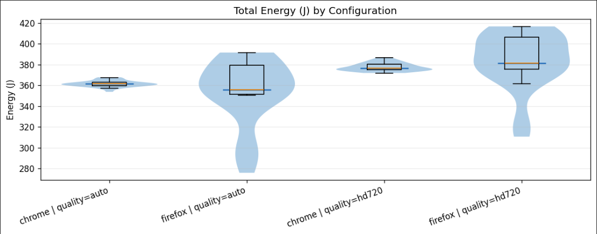
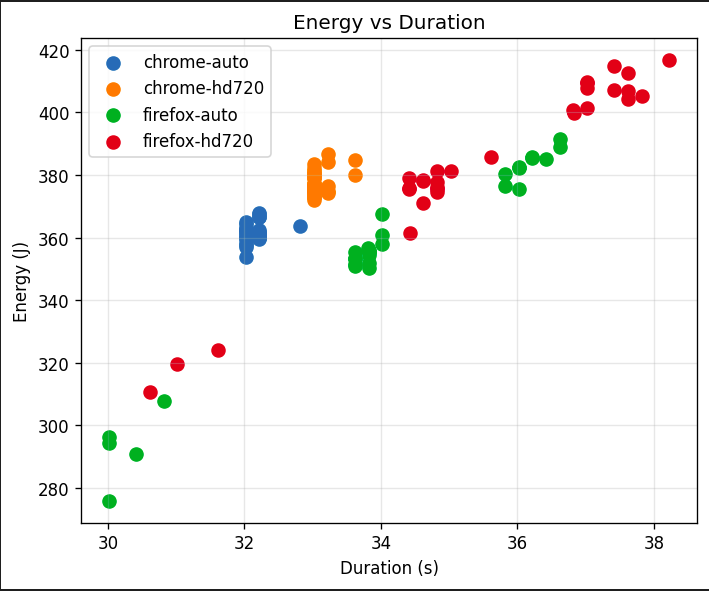
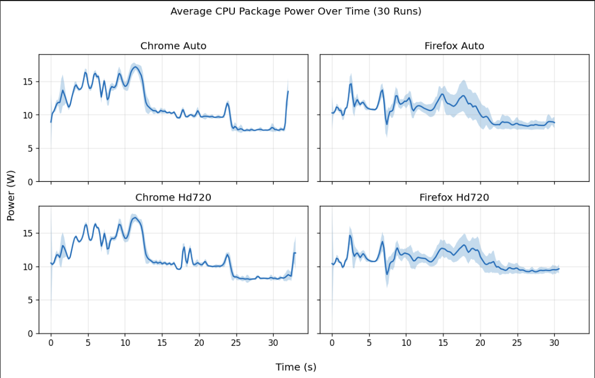

# Energy Consumption of YouTube Short-Form Video Playback  
### Auto vs HD720 on Chrome and Firefox

## Introduction

### Why Energy Efficiency in Browsers Matters

The web browser has become one of the most frequently used and long-running applications on
modern computing systems. From work and communication to entertainment and education,
browsers often remain open for hours at a time, silently consuming energy in the background.
As a result, even small inefficiencies at the browser level can accumulate into a significant
energy footprint when scaled to millions of users.

Video streaming is one of the most energy-intensive activities performed inside a browser.
While users are accustomed to optimizing for visual quality or playback smoothness, the energy
cost of these choices remains largely invisible. In particular, short-form video platforms such
as YouTube Shorts are consumed repeatedly throughout the day, making them an important yet
underexplored contributor to everyday energy usage.

Unlike traditional performance benchmarks, energy efficiency is rarely exposed to users as a
decision factor. Choices such as which browser to use or whether to force a higher playback
quality are often made without awareness of their potential system-level consequences.
Studying these user-facing choices provides insight into how software design and default
settings can influence sustainability at scale.

This project investigates whether two everyday software choices:**browser selection**
(Google Chrome vs Mozilla Firefox) and **video quality selection** (automatic quality vs forced
720p), lead to measurable differences in energy consumption for the same YouTube Short.
We focus on short-form content because it represents a bounded, repeatable task that is
consumed at massive scale, making even small per-play differences relevant when aggregated
across millions of users.

We evaluate four configurations, each executed 30 times under controlled conditions:
- Chrome–Auto
- Chrome–HD720
- Firefox–Auto
- Firefox–HD720

Even modest differences in energy consumption per playback may accumulate into a
substantial energy footprint when scaled to repeated daily interactions.

## Why energy (J) instead of power (W)?

Power and energy answer different questions:

- **Power (W)** describes how much energy is drawn *at a moment*  
- **Energy (J)** captures the *total cost* of completing a task  

Because watching a YouTube Short is a bounded interaction with a clear start and end, **total
energy consumption is the most appropriate primary metric**. Two configurations may draw
similar average power, yet differ substantially in energy if one sustains that power longer or
executes less predictably.

In this study, **energy (J)** is therefore the primary comparison metric. Power is analyzed
secondarily to explain *why* energy differences arise.

---

## Experimental Design

### Factors and conditions

| Factor | Levels |
|---|---|
| Browser | Chrome, Firefox |
| Video quality | Auto, HD720 |

Each configuration is executed 30 times, with randomized execution order to reduce
systematic bias (e.g., thermal or caching effects).

### Environment and controls

| Component | Setting |
|---|---|
| OS | Ubuntu 24.04 LTS |
| CPU | Intel Core i7-14650HX |
| RAM | 16 GB |
| GPUs | Intel Raptor Lake UHD + NVIDIA RTX 4060 (Mobile) |
| Power | Plugged into mains |
| Controls | Fixed window size, aligned playback |
| Noise mitigation | Randomized runs + rest interval |

---

## Methodology

### Browser and Quality Selection

This study focuses on two widely used desktop browsers: **Google Chrome** and **Mozilla Firefox**.
While both browsers provide similar user-facing functionality, they rely on different internal
architectures for rendering, JavaScript execution, and media playback. Comparing these browsers
under identical workloads allows us to observe how implementation-level differences influence
energy consumption.

Rather than modifying low-level hardware acceleration flags, we evaluate two **user-facing video
quality settings**: automatic quality selection and forced 720p playback. These settings reflect
realistic user behavior and directly influence decoding complexity, buffering behavior, and
rendering workload during playback.

### YouTube Workload

To ensure a controlled and repeatable workload, we use a single YouTube Short video across
all experiments. Short-form content is particularly suitable for energy analysis because it
represents a bounded interaction with a well-defined start and end, while still exercising the
full browser media pipeline.

Using the same video across all runs eliminates content-related variability and ensures that
observed differences are attributable to browser and quality settings rather than video
characteristics.

### Playback Control and Alignment

Video playback is fully automated and aligned to the actual playback window, rather than
page load or script execution. Energy measurement begins only after playback is confirmed and
terminates before end-of-video elements or autoplay behavior can introduce additional workload.
This alignment ensures that measurements reflect the energy cost of video playback itself.

Each configuration is executed **30 times**, with randomized run order and a fixed rest period
between runs to mitigate thermal and scheduling effects. This repetition allows us to capture
both average behavior and variability across executions.

---

## Automation and Replication Pipeline

Manually replaying videos, clicking through consent dialogs, or starting and stopping measurements by hand would introduce significant noise and make results difficult to reproduce. To avoid this, we implemented a fully automated measurement pipeline that executes the entire experiment without human intervention.

This pipeline has a scripted campaign runner that orchestrates all experiment runs. A run plan is first generated, specifying the browser, video quality setting, and repetition number for each run. This plan is randomized to avoid systematic bias and then executed sequentially, ensuring that each configuration is tested under comparable system conditions.

For each run:
1. The browser is launched via Playwright
2. The same YouTube Short is loaded
3. Consent dialogs are handled automatically
4. Playback quality is enforced (HD720 when required) and verified
5. Measurement is aligned to **actual video playback**
6. CPU package energy is recorded using EnergiBridge

All runs produce CSV logs, enabling full replication from raw data to plots.

---

## Measurement and Metrics

To quantify the energy cost of short-form video playback, we rely on direct energy measurements collected during each experimental run. All measurements are performed using EnergiBridge, a lightweight tool that records energy consumption at the CPU package level by reading hardware energy counters exposed by the system.

For each run, EnergiBridge is launched alongside the automated playback script and records cumulative energy usage over time. The resulting output is stored as a CSV file containing timestamped energy readings. By measuring cumulative energy rather than instantaneous power alone, we can compute the total energy consumed during the playback of a single YouTube Short.

In the CSV files, the two columns relevant to us were: PACKAGE_ENERGY (J) and Time. The Power is calculated using these two.

From raw measurements, we derive:

| Metric | Meaning |
|---|---|
| Total energy (J) | Energy cost of playback |
| Duration (s) | Runtime of playback |
| Average power (W) | Energy / duration |

Duration and power are used to **explain energy differences**, not as primary optimization goals.

---

## Results

### Summary statistics (n = 30 per configuration)

| Configuration | Mean Energy (J) | Std (J) | Mean Power (W) |
|---|---:|---:|---:|
| Chrome–Auto | 361.6 | 3.1 | 11.25 |
| Chrome–HD720 | 377.7 | 3.9 | 11.41 |
| Firefox–Auto | 354.3 | 31.2 | 10.40 |
| Firefox–HD720 | 384.1 | 27.4 | 10.81 |

---

### Energy distribution across configurations

**Figure 1:** Distribution of total CPU package energy (J).

Chrome exhibits **very tight energy distributions** in both quality modes, indicating stable and
predictable behavior across runs. Firefox, in contrast, shows **substantially wider violin plots**,
particularly under Auto quality.

This suggests that Firefox is more sensitive to transient effects such as adaptive bitrate
decisions, buffering behavior, or scheduling variability. While its *mean* energy may be
competitive, individual runs can be significantly more expensive, which is undesirable from an
efficiency and predictability standpoint.

---

### Energy vs playback duration

**Figure 2:** Energy consumption versus runtime.

Chrome runs cluster tightly around 32–33 seconds, while Firefox runs exhibit much larger spread,
with some executions extending beyond 36–38 seconds. Since energy increases approximately
linearly with runtime, this duration variability directly explains Firefox’s wider energy
distribution.

---

### Power behavior over time

**Figure 3:** Average CPU package power over time (30-run average).

Chrome shows a pronounced initial power burst during startup, followed by a lower, stable
power phase. Firefox exhibits smoother but more sustained power draw across playback.

This sustained load explains why Firefox can consume more total energy despite lower peak
power. Forcing HD720 increases sustained power in both browsers, accounting for the consistent
energy increase observed earlier.

---

## Statistical Validation

To assess whether the observed energy differences are statistically meaningful, we first test
the assumption of normality using the **Shapiro–Wilk test** for each browser–quality group.
The results show that while Chrome energy measurements are approximately normally distributed,
both Firefox configurations significantly deviate from normality (p < 0.01).

Because normality cannot be assumed consistently across groups, we rely on the **non-parametric
Mann–Whitney U test** for all comparisons.

When pooling data across browsers, the comparison between **Auto** and **HD720** playback
reveals a highly significant difference in energy consumption (p ≈ 4.4 × 10⁻¹¹), confirming that
forcing higher video quality leads to increased energy usage.

Comparing browsers within each quality setting yields a more nuanced result. Under **Auto**
quality, the difference between Chrome and Firefox is not statistically significant (p = 0.137),
largely due to Firefox’s high variance. Under **HD720**, however, the difference becomes
statistically significant (p = 0.031), indicating that browser choice has a measurable impact
on energy consumption when higher quality is enforced.

Overall, these statistical tests confirm that the observed trends are not due to random
fluctuations, and that video quality and browser choice both play a systematic role in
energy consumption during short-form video playback.

| Comparison | Test | p-value | Interpretation |
|---|---|---:|---|
| Auto vs HD720 | Mann–Whitney U | 4.4 × 10⁻¹¹ | Significant |
| Chrome vs Firefox (Auto) | Mann–Whitney U | 0.137 | Not significant |
| Chrome vs Firefox (HD720) | Mann–Whitney U | 0.031 | Significant |

---

## Discussion

Two key effects emerge from the results.

First, **forcing HD720 consistently increases energy consumption** on both browsers. Power
analysis shows that this increase is driven by sustained higher load rather than brief spikes,
making quality selection an energy-relevant choice even for short videos.

Second, **browser implementation strongly affects consistency**. Chrome executes the workload
in a highly predictable manner, while Firefox exhibits substantial variability in both runtime and
energy. This suggests differences in how browser engines manage decoding, buffering, and task
scheduling under short, bursty workloads.

Although the energy cost of a single short video is small, these differences scale with repeated
use and massive user populations, making them relevant from a sustainability perspective.

---

## Implications

At the user level, the results show that everyday, seemingly minor choices, such as forcing a
higher playback quality or switching browsers,can influence energy consumption even for short,
casual interactions like watching a YouTube Short. While users typically optimize for visual
quality or smoothness, these results suggest that default settings and browser choice also play a
role in energy efficiency. Making energy costs more visible or better aligned with default
behaviors could help users make more sustainable choices without sacrificing usability.

At the browser level, the contrast between Chrome’s consistency and Firefox’s higher variance
highlights that energy efficiency is not only about average consumption, but also about
predictability. Highly variable energy behavior can lead to disproportionately expensive runs,
which is undesirable at scale. Browser vendors may therefore benefit from treating energy
stability as a first-class optimization goal alongside performance and correctness, particularly
for short, bursty workloads such as short-form video playback.

At the platform and ecosystem level, the consistent increase in energy consumption when
forcing higher video quality suggests that adaptive quality mechanisms are not only beneficial
for buffering and performance, but also for energy efficiency. Platform-level decisions about
default quality heuristics can therefore have a meaningful impact on aggregate energy usage when
applied across millions of users and billions of video views.

---

## Limitations

As with any controlled experiment, this study has several limitations that should be considered when interpreting the results. First, all measurements are conducted on a single machine under a specific hardware and software configuration. Energy consumption patterns may differ on other systems, particularly on mobile devices or systems with discrete GPUs.

Second, the analysis focuses exclusively on CPU package-level energy consumption. While this captures a substantial portion of the workload involved in browser-based video playback, it does not account for energy usage by other components such as the display, GPU, or network interface. As a result, the reported values should be interpreted as relative comparisons rather than absolute system-wide energy costs.

Third, the experiment uses a single YouTube Short video. Although this allows for a controlled and repeatable workload, different content characteristics: such as motion complexity or encoding format, may influence energy consumption differently. Future work could extend this analysis to a broader set of videos and playback scenarios.

Finally, while automation and repeated measurements reduce noise and improve consistency, real-world usage inevitably involves additional variability, including background applications, user interaction, and fluctuating network conditions. These factors are intentionally minimized here to isolate the effects of browser and quality settings.

---

## Conclusion

This project set out to answer a simple but practical question: do everyday software choices (such
as browser selection and video quality settings) have a measurable impact on energy consumption
during short-form video playback? Our results show that they do.

Under controlled experimental conditions, we find that forcing higher video quality (720p)
consistently increases energy consumption on both browsers. Browser choice further influences
not only average energy usage, but also the stability and predictability of playback, with Chrome
exhibiting more consistent behavior across runs and Firefox showing substantially higher
variability. These effects arise primarily from sustained differences in power draw rather than
from isolated performance spikes.

While the energy cost of playing a single YouTube Short is small, short-form content is consumed
repeatedly and at massive scale. When aggregated across millions of users and daily interactions,
even modest per-play differences become relevant from a sustainability perspective.

More broadly, this study highlights the importance of energy-aware software evaluation. Consumer
software is typically optimized for performance and visual quality, while energy consumption
remains largely invisible to users. Treating energy as a first-class metric (both in software design
and in user-facing defaults), can help reduce the environmental footprint of widely used digital
services.

As short-form video continues to dominate online media consumption, understanding and
optimizing its energy cost will become increasingly important. Small efficiency improvements,
when applied at scale, have the potential to produce meaningful environmental benefits.

---

## Link to the repository
https://github.com/uddhav-pisharody/p1-energy-video-analysis
