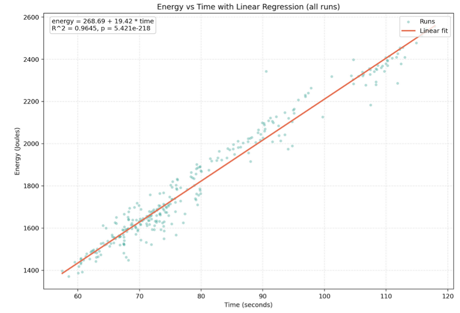
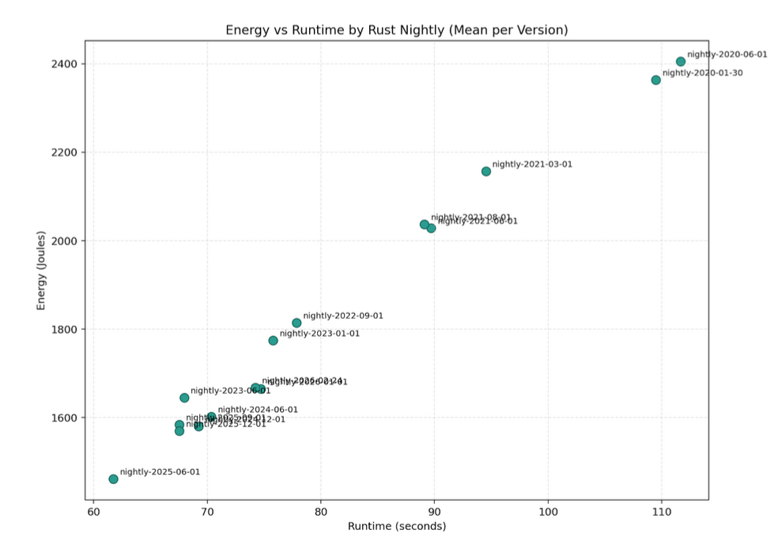

# Comparing the energy consumption of running oxipng benchmarks using different Rust compiler versions

This study examines how energy consumption and execution time have evolved across various versions of the Rust compiler, spanning from early 2020 to early 2026. This analysis is significant from a sustainability perspective, as newer compiler versions often prioritize speed without necessarily optimizing for energy efficiency. Our results show that both execution time and energy consumption significantly decreased with successive Rust versions until mid-2025. Since then, however, we have observed an upward trend in both metrics with each new release. This shift could be caused by performance regressions or introduction of new features that were not yet optimized in the latest versions. These findings open possibilities for further research to investigate the causes behind this change in a performance that had remained consistent for over five years.

## Introduction

It is often assumed that newly released compilers are “better” than the previous ones, but “better” is usually thought of as faster or with smaller binaries. Rarely do we look at how the energy consumption of these new compilers improves and if it improves at all. In this report we benchmark and compare the energy consumption of different nightly compiler builds of the rustc compiler.

Rust is a general-purpose programming language, influenced by functional programming. It is well known for its memory safety as it does not use a garbage collector, but instead memory safety errors are prevented by a borrow checker [1][2]. Rust uses the compiler rustc, which uses LLVM as its compiler backend by default. Because rustc is backed by LLVM, the optimizations of LLVM are leveraged by rustc, possibly extending measured energy efficiency results to other LLVM backed compilers.
These compilers form the backbone for a lot of software with high energy usage [6]. An increase or reduction in energy efficiency of the binaries created by these compilers can have a high impact in worldwide energy consumption, and thereby on carbon emissions.

This leads to our general research question: _How does the energy efficiency of programs produced by the rustc compiler change between compiler releases? What are the trends of energy-speed trade-offs?_


To limit the scope of the research, we choose to only look at the efficiency of one benchmark used in the oxipng project. Oxipng is a multithreaded lossless PNG/APNG compression optimizer [3]. Oxipng is CPU-intensive and performs the same type of work over and over making it easier to spot even small energy efficiency updates. We selected one benchmark reductions, this benchmark was picked based on the running time of the benchmark.

To be sure that a rustc version that was released some years ago, is able to compile the benchmark, we selected a version of Oxipng that was released in 2020. We used 15 rustc nightly versions, the first one being one released shortly after the minimum declared supported rust version [7][8], up to the latest rust nightly version at the time of testing, and 13 other versions evenly distributed in between. 	
To measure the energy consumption of the program, we use the CPU’s RAPL registers, accessed via the perf utility. To reduce the noise on the measurements we reduced the software running in parallel on the hardware to a minimum. 

This leads to additional research question: Did the compilers from 2020 up to 2026 get more energy efficient as well as faster?

This blog consists of six sections. In Introduction we described the problem and added our motivation on why it is interesting to look at this problem. The Background section introduces the tools we describe the tools and compiler versions we used for this project. In the Methodology section we list all the information necessary for replication of our project as well as the collection and further analysis on the collected data. All of our findings are listed in the Results section and further explained and discussed in the Discussion section. The last section Conclusions summarizes the project and its findings and introduces future work.

## Background 

To study how Rust compiler versions affect energy consumption, we use oxipng. We fix the code to oxipng v3.0.1 and run its built‑in reductions benchmark (cargo bench --bench reductions), which is CPU‑bound and repeats the same kind of work across multiple tests. This makes it suitable for comparing energy use across compiler versions without changing the application itself. We measure energy in Joules using the CPU’s RAPL counters via Linux perf and its power/energy-pkg/ counter, which reports the energy used by the CPU package for each run. 

As previously descussed, we consider Rust nightly toolchains in the range from early 2020 up to early 2026; in our experiments we used the following versions: nightly-2020-01-30, nightly-2020-06-01, nightly-2021-03-01, nightly-2021-06-01, nightly-2021-08-01, nightly-2022-09-01, nightly-2023-01-01, nightly-2023-06-01, nightly-2024-06-01, nightly-2024-12-01,  nightly-2025-06-01, nightly-2025-09-01, nightly-2025-12-01, nightly-2026-01-01, and finally nightly-2026-02-24.

## Methodology

To run the tests, we rented a server from Hetzner. Hetzner is a standard cloud provider, hosted from the EU. The electricity for the servers in the Germany Hetzner datacenters are sourced from hydropower. To reduce the environmental impact of our study, we picked a server located in a Germany datacenter[5]. Since the server rented is a dedicated server, there are no other customers using the same CPU, making the CPU power registers relevant. 


## Hardware Environment
We ran everything on one machine to avoid cross-host noise. The host has an Intel Core i7-6700 (4 cores, 8 threads, boosts to 4.0 GHz) with 32 GiB RAM and 15 GiB swap. We kept the default powersave governor and left hyperthreading on so the setup mirrors how a typical user would run the same workload; that makes the comparison across compiler versions more representative even if absolute energy numbers could shift under other governors.

## Software Stack

We used Ubuntu 22.04.5 LTS with kernel 5.15.0-170-generic so the kernel counters match the perf tooling we rely on. Perf is version 5.15.196 with perf_event_paranoid set to -1, which allows access to energy counters without extra kernel tweaks. Rust comes from rustup; we installed the nightlies listed in the Background section to cover the timeline we care about, and we pinned the workload to oxipng v3.0.1 using cargo bench --bench reductions --locked to prevent dependency changes from polluting the comparison.


## Measurement Tools

We wrapped every benchmark run with perf stat -e power/energy-pkg/, which reads the CPU package energy counter and reports Joules plus elapsed seconds. We chose this event because it is directly supported on the i7-6700, gives an integrated energy reading rather than sampled power, and has lower noise than external wattmeters for short, repeatable runs. Using the same event and command line for all toolchains keeps the results comparable.

## Experimental design
Each toolchain gets a warm-up build and run that we ignore, so caches and thermals are steady before we record data. We then run twenty measured iterations per toolchain. For every iteration we build with ```cargo +<toolchain> bench --locked --bench reductions --no-run``` and then measure the actual run with ```sudo perf stat -e power/energy-pkg/ -o results_<toolchain>_runN cargo +<toolchain> bench --locked --bench reductions```. We pause about 120 seconds between iterations to let temperatures fall back toward idle, reducing thermal throttling risk. All outputs land in timestamped ```benchmark_*``` folders and are copied into ```results/```, where we compute per-toolchain means and standard deviations. We keep ```server_info.txt``` alongside the data so anyone can recreate the same environment.

## Statistical Analysis

Once the experiments were executed and the results collected we performed statistical analysis to evaluate the performance of different compiler versions. These tests show that our findings are significant.

We used one-way ANOVA for both energy and time across the toolchains. ANOVA (Analysis of Variance) is a statistical test that compares the means of at least two groups by looking at their variances [4]. It uses F-test to compare the between-group variation with the within-group variation. For this statistical test we compared 15 groups (versions of the compiler) over 300 data points. After confirming p < 0.05 we followed with a post-hoc pairwise Tukey’s HSD (honestly significant difference) comparison for both energy and time. Turkey’s HSD in one step compares pair-wise all the versions of nightly and tells us whether there is a significant difference between them.

We created a linear regression plot for energy vs time, where datapoints represented all test runs independent of the verison of the compiler they were executed on. Linear regression draws a line across all the data points and determines whether there is a linear relationship between the variables. One of the outputs of the regression is a coefficient of determination (R^2) which tells us how accurate the model fits the data. 

From the equation of linear regression (energy_J = a + b * time_s) we obtain slope b and intersect a. The slope in our case represents how much energy the program consumes per second of running. The intercept a tells us the baseline energy cost, so what is the minimum energy the program uses while executing the simplest task.

Following the linear regression we looked at average power consumption (in Joules per second = Watt). This helps us to determine whether the compilers were getting more hardware efficient (using fewer Joules per second) or if the energy savings are just a side effect of the code running faster.

After the results showed up to be almost constant, we performed another ANOVA to see whether the compiler’s power intensity is statistically stable.

## Results

The results from the experiments are presented in the box and violin plots below.


From both plots we can see that time and energy consumption gradually declined from 2020 compiler versions to around mid-2025. After this we can see that both time and energy consumption are rising until the most recent version from the beginning of 2026. We can observe on average higher jumps between years compared to within the same year.

One-way ANOVA  by toolchain resulted in F(14,285) = 282.60 with p < 0.001 and effect size of 0.933 for energy and F(14,285) = 390.91 with p < 0.001 and effect size of 0.951 for time. 

Many of Tukey's tests vere significant so we only list the most interesting ones.

Comparison 1: the baseline (nightly-2020-01-30) and the best (nightly-2025-06-01) compilers with energy and time difference of +901.54 J and +47.27 s. This comparison showed to be significant.
Comparison 2: the best (nightly-2025-06-01) and the newest (nightly-2026-02-24) compilers with energy and time difference of -215.04 J and -12.70 s. This comparison showed to be significant.

Linear regression on all points can be seen on the diagram below. The linear model (energy = 268.69 + 19.42 * time) yielded slope of 19.42 and intercept of 268.69. The coefficient of regression R^2 = 0.9645 with p < 0.001.



The diagram below shows average time and energy consumption per version. We can see they follow (almost) a linear line from oldest (top right cormer) to the newer versions (bottom left corner).


Average power consumption for all versions was quite consistent ranging from 21.5W to 24.2W. ANOVA F-statistics yielded F(14,285) = 6.96 with p < 0.001.

## Discussion
From 2020 through mid-2025, both run time and energy steadily drop, which points to cumulative compiler and LLVM improvements making the CPU-bound oxipng task finish sooner. After mid-2025 we see a bump upward, hinting at either a regression or new features that were not yet optimized in the latest nightlies. Time and energy track together very tightly (R² ≈ 0.9645), meaning energy is almost entirely explained by how fast the binary runs; when the newer nightlies slow slightly, energy climbs in step because the average power draw stays roughly the same.

The large F-statistic value for energy and time indicates that the difference between compiler versions is much larger than the difference within each version. The p-value < 0.05 shows that this change is statistically significant. Furthermore the effect size close to 1 indicates the percentage of observed variation that can be explained by choice of Rust nightly toolchain. 

Comparison 1 of Tukey’s HSD test represents the significant improvement from the baseline version of compiler to its best performance in mid-2025 with high energy consumption and time improvements. This shows that in 5 years the compilers are much faster and energy efficient. Comparison 2 shows the significant decline in both time and energy consumption in less than a  year between the best and the newest Rust compiler versions. This follows the visual discoveries from violin diagrams from the Results section.

The slope of linear regression suggests that for every second our program runs, it consumes approximately 19.42 Joules of additional energy. The intercept represents the baseline energy cost which can be associated with initial system load which occurs regardless of how long the core processing takes. The high value of coefficient of determination near 1 indicates that making the code faster guarantees with high probability to make it more energy efficient.

Average power consumption across the versions shows a relatively consistent trend, which indicates that the energy savings are primarily obtained by faster execution time rather than the code running more efficiently at the hardware level. The low p-value of ANOVA test for average power consumption rejects the null hypothesis that all toolchains have the same average power intensity. This indicates that the power intensity of our benchmarks is not statistically stable across the different Rust nightly toolchains.


## Conclusion
From 2020 through mid-2025 the Rust toolchain steadily made oxipng both faster and less energy hungry, reflecting cumulative rustc and LLVM optimizations. Time and energy almost perfectly track each other (R² ≈ 0.96) while average power stays roughly flat, so for this CPU-bound workload “faster” effectively means “greener.” The late-2025 uptick shows new nightlies can regress, reminding us that fresh releases still need benchmarking when energy efficiency matters.

## Further Work
Upcoming work will include pinpointing which LLVM or rustc changes caused the post–mid‑2025 slowdown, then checking whether the tight time–energy link persists on non‑CPU‑bound workloads (I/O or memory heavy) and on other architectures like ARM or RISC‑V and experimenting with flags such as -C target-cpu=native to see if tuning codegen yields further energy savings beyond the defaults.


## References 
[1]: https://rust-lang.org/
[2]: https://en.wikipedia.org/wiki/Rust_(programming_language)
[3]: https://github.com/oxipng/oxipng
[4]: https://en.wikipedia.org/wiki/Analysis_of_variance
[5]: https://www.hetzner.com/unternehmen/nachhaltigkeit/ 
[6]: https://en.wikipedia.org/w/index.php?title=LLVM&oldid=1338982920
[7]: https://github.com/oxipng/oxipng/blob/v3.0.1/Cargo.tom
