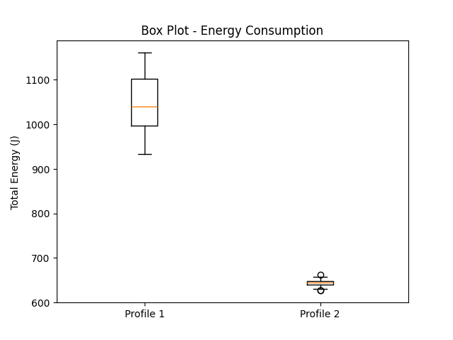
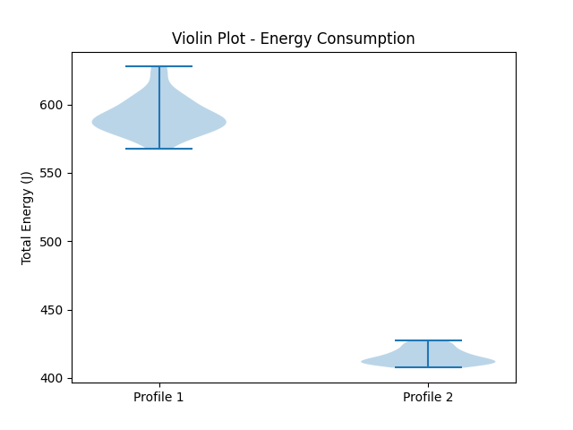

## Introduction

Energy efficiency has become an increasingly important concern in software systems. Even small differences in energy consumption can accumulate significantly when multiplied across millions of users and daily interactions. Web browsing is one of the most common computing activities, yet its energy implications are often overlooked. Ad blockers are widely used tools designed to improve user experience by preventing the display of advertisements and tracking scripts. While their primary purpose is privacy protection and usability, their impact on energy consumption is less well understood.

On the one hand, an ad blocker introduces additional processing inside the browser, which could increase computational overhead. On the other hand, blocking advertisements and third-party scripts may reduce the amount of content loaded and executed, potentially decreasing CPU workload and energy usage. This raises an interesting question: does enabling an ad blocker increase or decrease energy consumption during web browsing?

---

## Motivation

Ad blockers might affect energy efficiency on a larger scale in addition to individual user experience. Millions of people use the internet every day, so even small energy savings per session could add up to significant drops in total energy consumption. Since software-level design decisions can have system-wide energy and environmental effects, it is crucial to comprehend whether widely used technologies like ad blockers increase or decrease energy usage from the standpoint of sustainable software engineering.

In this study, we experimentally evaluate the impact of using an ad blocker on CPU package energy consumption during a simulated news browsing session. By comparing browsing sessions with and without an ad blocker under controlled conditions, we aim to determine whether such a commonly used tool has measurable energy implications.

---

## Methodology

This study investigates the impact of an ad blocker on CPU energy consumption during web browsing. We compare two browser configurations:

* **Profile 1 – Without Ad Blocker**
* **Profile 2 – With Ad Blocker**

Throughout the remainder of this report, these two configurations will be referred to as *Profile 1* (without ad blocker) and *Profile 2* (with ad blocker).

Both configurations were tested under identical conditions using a controlled browsing script.

### Research Question

Does enabling an ad blocker reduce CPU package energy consumption during a simulated news browsing session?

### Hypothesis

We hypothesize that enabling an ad blocker reduces energy consumption by preventing the loading and execution of advertisements.

---

### System Setup

* **Device:** HP ZBook X G1i
* **CPU:** 16 cores
* **Processor:** Intel(R) Core Ultra 7 255H (2.00 GHz)
* **RAM:** 32GB
* **Operating System:** Ubuntu Linux 22.04 LTS

---

### Software Setup

Google Chrome was used as the browser in both configurations. Both browser profiles were newly created and used exclusively for this experiment.

* **Profile 1:** No ad blocker installed
* **Profile 2:** Stands AdBlocker installed and enabled with default filter settings

Energy measurements were collected using Energibridge. The energy of the CPU package was obtained from the `PACKAGE_ENERGY (J)` counter. This metric represents cumulative CPU energy consumption and is appropriate for bounded, one-off workloads.

---

### Browsing Workload

To simulate realistic browsing behavior, we developed an automated script that navigates to a predefined set of news websites:

* [https://www.dailymail.co.uk](https://www.dailymail.co.uk)
* [https://www.bbc.com/news](https://www.bbc.com/news)
* [https://www.theguardian.com](https://www.theguardian.com)

The script uses Chrome DevTools Protocol via a WebSocket connection to navigate to each website, wait for page loading, and scroll the page at fixed intervals. For each website, the script scrolls continuously for 30 seconds, simulating a user reading and browsing content. This results in a fixed browsing session consisting of three sequential news pages.

---

### Experimental Procedure

To reduce external interference and improve measurement reliability, a “zen mode” setup was applied. All unnecessary applications were closed, notifications were disabled, screen brightness was fixed, external monitors were disconnected, and the system was connected to power throughout the experiments.

Before collecting experimental data, a warm-up phase consisting of three complete browsing executions was performed and discarded. This allowed the CPU to reach a stable thermal and frequency state, reducing bias caused by cold starts, initial boost behavior, and cache warming effects.

Each browser configuration was executed 30 times, resulting in 60 total runs. The order of executions was randomized to reduce systematic bias. Randomization was applied independently for each run, ensuring that neither profile consistently benefited from execution order or temporal effects such as gradual temperature changes.

To further reduce interference between executions, a fixed cooldown period was applied. A 15-second rest period was enforced between the two profiles within a run, and an additional 30-second rest period was applied after completing both profiles before starting the next run. These pauses helped mitigate tail energy effects and thermal carry-over between measurements.

For each execution, total CPU package energy was computed as the difference between the final and initial cumulative `PACKAGE_ENERGY (J)` values. This produced one energy value per run.

---

## Results

We collected 30 independent executions for each profile, resulting in two samples of equal size. For each execution, total `PACKAGE_ENERGY (J)` was computed as the difference between final and initial cumulative energy values. This produced one energy value per run, which served as the unit of analysis.

---

Perfect — then we’ll place them **one under the other**, exactly where they appeared in the LaTeX document (inside the *Exploratory Data Analysis* section, immediately after the explanatory sentence).

Here is the corrected section:

---

### Exploratory Data Analysis

The histogram, boxplot and violin plots obtained from the results are shown below. The two distributions are clearly separated, with Profile 2 exhibiting consistently lower energy values.

**Figure 1.** Comparison of total energy consumption for Profile 1 and Profile 2.
Top: Histogram. Middle: Boxplot. Bottom: Violin plot.

---

### Normality Assessment

Following the procedure described in the course slides, we tested normality using the Shapiro–Wilk test.

* Profile 1: The test did not reject normality (p = 0.27172).
* Profile 2: The test did not reject normality (p = 0.61508).

Since both distributions were assumed normal, we proceeded with a parametric statistical test.

---

### Statistical Significance

Given that both samples satisfied the normality assumption, we applied Welch’s t-test to compare the two independent samples. The test indicated a statistically significant difference between the profiles (p < 0.001).

The mean energy consumption was:

* **Profile 1:** 1050.959 J
* **Profile 2:** 644.179 J

The mean difference was **406.780 J**, corresponding to a **38.71% reduction** in energy consumption for Profile 2 relative to Profile 1.

The magnitude of this reduction exceeded initial expectations, indicating that the effect of blocking advertisement-related content on energy consumption is not only statistically detectable but also substantial in practice.

---

### Practical Significance

In addition to statistical significance, the magnitude of the observed difference suggests a practically meaningful improvement under the tested workload. Since both samples followed an approximately normal distribution and no extreme outliers were observed, the assumptions for the parametric test were satisfied. Overall, the results provide consistent evidence that Profile 2 consumes less energy than Profile 1 under the experimental conditions.

---

## Discussion

The results show that the browsing profile with the ad blocker enabled consumed considerably less energy than the profile without the ad blocker. On average, the ad blocker reduced total CPU package energy consumption by approximately 30% per browsing session.

This difference is likely related to the amount of content loaded by modern websites. News pages often include advertisements, tracking scripts, animations, and additional network requests. These elements require extra CPU processing and script execution. When the ad blocker is enabled, part of this content is prevented from loading, which reduces computational work and therefore energy consumption.

The energy values for the ad blocker profile were also more tightly clustered, suggesting reduced variability across executions. Advertising systems frequently load dynamic and asynchronous content, which can introduce fluctuations in CPU activity. Removing part of this behavior may lead to more stable runs.

Part of the energy reduction may also be explained by differences in runtime. If pages load faster when advertisements are blocked, total execution time decreases, which directly reduces total energy consumption. In this sense, the lower energy usage reflects both reduced computational load and potentially shorter browsing sessions.

While the measurements focus on a single browsing session, the observed energy savings become significant when considered at scale. Web browsing is one of the most frequent daily computing activities, and ad blockers are used by millions of users. A consistent reduction in CPU energy consumption per session suggests that content blocking mechanisms can contribute meaningfully to reducing overall energy demand on end-user devices.

---

## Conclusion

In this study, we investigated the impact of enabling an ad blocker on CPU package energy consumption during a simulated news browsing session. Using 30 independent executions per configuration and following the statistical analysis procedure, we compared browsing sessions with and without an ad blocker.

Our results indicate that enabling the ad blocker reduced total CPU energy consumption per session. The difference was statistically significant under the tested workload.

These findings suggest that, in the evaluated scenario, blocking advertisements and third-party scripts reduces computational work and therefore lowers energy consumption. While the results are specific to the selected websites and experimental setup, they indicate that ad blockers may have energy efficiency implications beyond usability and privacy considerations.

Future work could extend this analysis to other browsing scenarios, different websites, and additional hardware platforms to assess generalizability.

---

