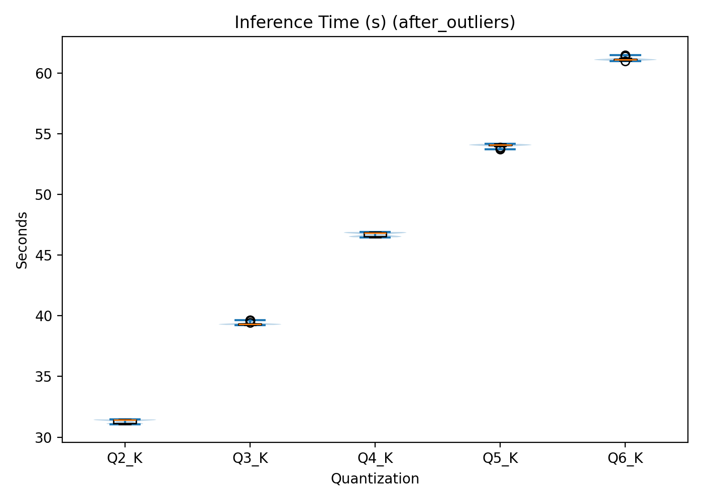
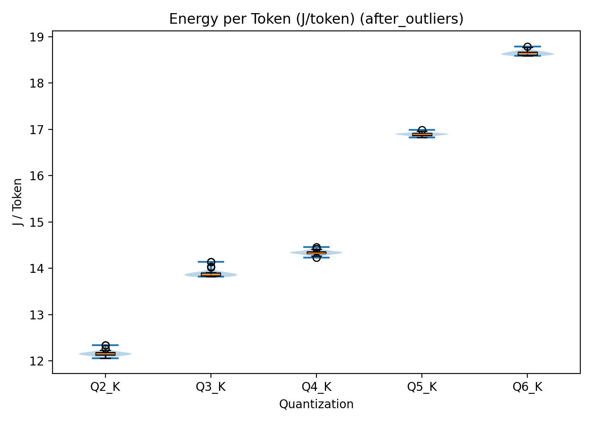
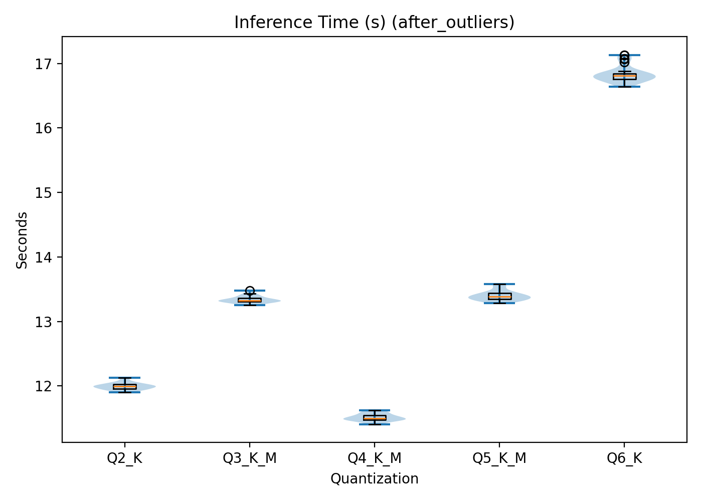
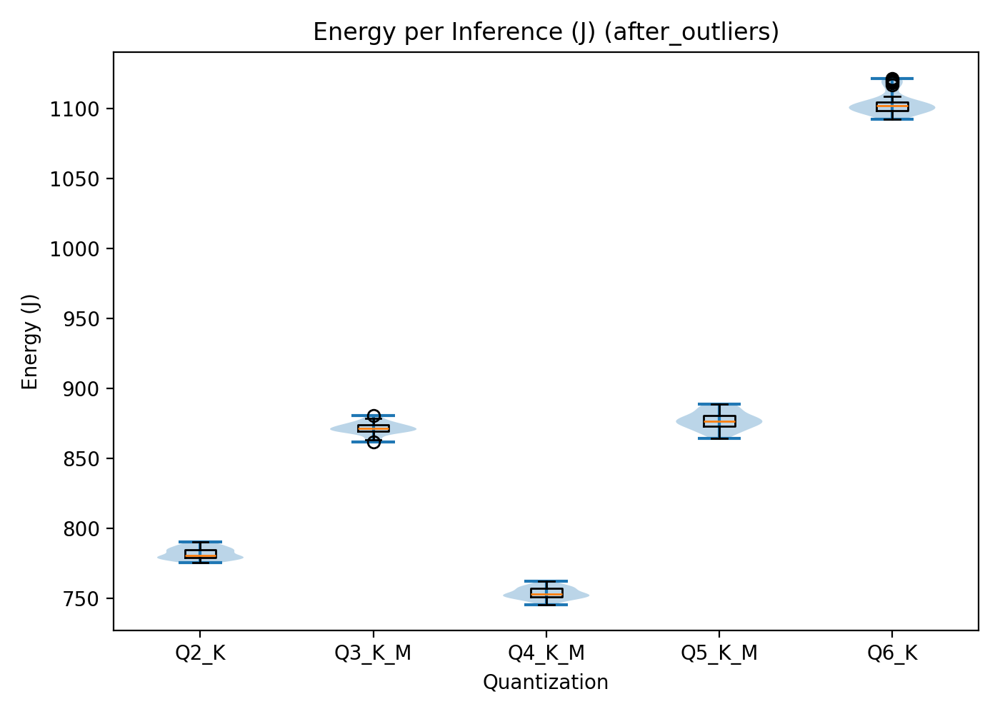

# **Does Compressing Your AI Model Actually Save Energy?** 

Imagine you're an engineer in a big company committed to sustainability. Leadership has decided to deploy an internal LLM assistant to help employees draft emails, summarise documents, and answer questions. Sounds useful, however, how to set it up responsibly and effectively?

Large language models have quietly become a staple of modern software, but their energy footprint is largely invisible in public discourse. As usage grows, even small reductions in energy consumption per inference add up.

One strategy to reduce the cost of running an LLM is quantisation. Quantisation compresses model weights by representing them in lower numerical precision formats. This reduces memory usage and increases inference speed, but at the cost of precision and output quality.

That leaves companies with a practical dilemma: firstly, *how to deploy an internal LLM assistant? Should it run locally on employees’ machines or centrally on a GPU in the cloud?* And secondly, *how does quantisation affect energy consumption and performance?*

## **Methodology** 

### **The two environments**

Measurements were taken on two deployment configurations to compare distributed CPU-based inference with centralised GPU-based inference:

1. **Local CPU:** Custom desktop running Ubuntu Linux, representing local cpu deployment  
2. **Cloud GPU:** Google Colab with NVIDIA T4, representing a centralised GPU-accelerated deployment

**Local CPU setup (Ubuntu Linux)**

* **CPU:** Intel Core i7-10700KF

* **Cores:** 8 cores, 16 threads

* **RAM:** 32 GB DDR4 4400 MHz

* **Power supply:** Gigabyte P850GM 850W 80+ Gold

**Cloud GPU setup (Google Colab)** 

* **GPU:** NVIDIA Tesla T4 (16 GB GDDR6, 2560 CUDA cores) [1](https://www.nvidia.com/content/dam/en-zz/Solutions/Data-Center/tesla-t4/t4-tensor-core-datasheet-951643.pdf)

* **Platform:** Google Colab

* **RAM:** \~12 GB allocated by Colab

### **Software stack (kept consistent)**

* **llama-cpp-python:** 0.3.16 (both environments)

* **Python:** 3.12.3 (CPU), 3.10 (GPU)

### **Energy measuring**

**Local CPU:** EnergiBridge was used to wrap each inference run, measuring total CPU package energy via RAPL hardware counters by recording the difference in the CPU\_ENERGY counter between the start and end of each run.

**Cloud GPU:**  NVIDIA Management Library (NVML) via pynvml was used to sample GPU power draw at 100ms intervals. Energy consumption is computed by integrating power samples over time.

The choice to measure energy (Joules) rather than power (Watts) was made based on the fact that LLM inference is a discrete computational task with a defined start and end point, making total energy consumption the more appropriate metric.

**Note on comparability:** Local CPU measurements capture total CPU package energy via RAPL, while cloud GPU measurements capture only GPU energy via NVML. The cloud measurements do not include host CPU overhead, cooling, or infrastructure costs. 

### **Quantisation levels tested**

Five quantised versions of the same model were evaluated:

| Quantization | Description | Model Size | Bits per Weight |
| ----- | ----- | ----- | ----- |
| Q2\_K | 2-bit quantization | \~2.5 GB | 2.5 |
| Q3\_K\_M | 3-bit (medium) | \~3.5 GB | 3.5 |
| Q4\_K\_M | 4-bit (medium) | \~4.5 GB | 4.5 |
| Q5\_K\_M | 5-bit (medium) | \~5.5 GB | 5.5 |
| Q6\_K | 6-bit quantization | \~6.5 GB | 6.0 |

All models came from the `llama.cpp` ecosystem.

### **Inference settings**

To make runs comparable and reproducible:

* temperature \= 0.0 (greedy decoding)

* top\_p \= 1.0 (no nucleus sampling)

* seed \= 42

* n\_ctx \= 1024

* max\_tokens \= 256

* n\_threads \= 16 on CPU

* n\_gpu\_layers \= 0 on CPU, \-1 on GPU (full GPU offload)

Prompt (fixed for every run):

**"Explain quantisation tradeoffs in LLMs in 6 bullet points."**

### **Testing procedure**

An interleaved design was used to avoid bias from thermal drift, frequency scaling, and other system state changes.

**Warmup**

* Full cycle run 3 times (all five models)

* Warmup results discarded  
   This stabilizes temperature, warms caches, and completes any lazy initialization.

**Measured runs**

* **30 measured runs per model** (150 inferences total)

* Execution order interleaved each round:  
   Q2 → Q3 → Q4 → Q5 → Q6  
   repeated for 30 rounds  
* Rest 1 minute between models

For each inference:

1. Load model

2. Start energy monitoring

3. Run inference with fixed parameters

4. Stop monitoring and record energy \+ time

5. Unload model

### **Recorded values**

For each run we logged:

* inference time (s)

* tokens generated (count)

* throughput (tokens/s)

* energy (J)

* energy efficiency (J/token)

# Results and Analysis 

## Local CPU-based Results

Let’s start with the local deployment scenario: running the model on a CPU.

### Descriptive metrics

The primary performance metrics evaluated were inference time and energy consumption per inference. Inference time represents the duration required to generate a complete response for a given prompt. Total energy consumption reflects the cumulative electrical energy required during this inference process. Together, these metrics allow for the quantification of time efficiency and energy efficiency across different quantisation levels. 

Since every run reached the maximum token limit, the metrics were not normalised per token. Outliers were removed using z-score filtering (values beyond 3 standard deviations).

#### Inference time 

On the CPU, inference time shows a clear linear relationship with quantisation level, as seen in Figure 1\.

Q2 has the shortest mean inference time (31.310.16 s), followed sequentially by Q3, Q4, and Q5. Q6 exhibits the longest mean inference time (61.170.13 s). In other words, as weight representation precision increases, so does computational cost.

**Figure 1:** Local CPU inference time per quantisation level.  
X-axis: quantisation level. Y-axis: time in seconds.

#### Energy per inference

As seen in Figure 2, energy consumption follows the same pattern. Energy usage increases with quantisation level.  Q2 requires the lowest mean energy per inference (311516 J), while Q6  reaches the highest value (477313J).  

**Figure 2:** Total energy consumption per inference across quantisation levels in the local CPU setup. 
X‑axis: quantisation level. Y‑axis: energy consumption in joules.

### Statistical significance 

To verify whether these observed differences were statistically meaningful, several inferential tests were conducted. The selection of tests was based on the distributional properties of the data and the methodological recommendations by the Sustainable Software Engineering course. 

Normality was assessed using the Shapiro–Wilk test [2](https://surfdrive.surf.nl/s/gtzGbBZnkLNHm3e?dir=/&editing=false&openfile=true). Inference time deviated from normality across all groups. For energy consumption, Q4 and Q5 were normally distributed, while the remaining groups were not.

Because normality assumptions were frequently violated, the non-parametric Kruskal–Wallis test was used to assess overall differences. For pairwise comparisons, Welch’s t-tests were applied where normality held, and Mann–Whitney U tests were used otherwise [3](https://surfdrive.surf.nl/s/gtzGbBZnkLNHm3e?dir=/&editing=false&openfile=true).

The Kruskal–Wallis test showed significant differences across quantisation levels for inference time and energy consumption (H(4)=135.35, p\<0.001).

Pairwise comparisons confirmed that Q4 and Q5 differed significantly in energy consumption (adjusted p \= 4.72e-76). Rank-biserial correlations reached 1 across comparisons, indicating complete separation between distributions. Cohen’s d for Q4 vs Q5 energy consumption was −58.51, reflecting a very large effect size.

The statistical results show that there are clear differences between the data and that they are statistically robust. 

### Quality metrics 

Each model configuration was evaluated on coherence, technical accuracy, and lexical diversity. Coherence examined the amount of repetition and contradictions within the output. The technical accuracy evaluated the extent to which the explanation aligned with factual knowledge. Lastly, lexical diversity assessed the amount of variation in vocabulary and sentence structure. Each metric was scored comparatively across quantisation levels using a relative scale (– / \+), indicating lower or higher performance in relation to the other configurations rather than assigning absolute numerical values. The results of this evaluation are shown in Table 1\. Since every response reached the maximum token limit, all outputs were truncated. The evaluation was structured but remains partially interpretative. GPT-5 supported the assessment, and factual correctness was manually verified.

Higher quantisation levels generally produce better outputs. Q5 achieved the strongest overall qualitative performance, slightly outperforming Q6. Lower quantisation levels, particularly Q2, showed weaker coherence and accuracy.

| *Quantization* | *Coherence* | *Technical Accuracy* | *Lexical Diversity* | *Overall* |
| ----- | ----- | ----- | ----- | ----- |
| **Q2** | \-- | \-- | \-- | \-- |
| **Q3** | \- | \- | \- | \- |
| **Q4** | \+ | \+ | \+ | \+ |
| **Q5** | \++ | \++ | \++ | \+++ |
| **Q6** | \+ | \+ | \+ | \++ |

	Table 1: Quality results of the local CPU-Based system

### CPU Summary 

Table 2 shows a summary of all the main metrics. Running the model locally on a CPU showed that increasing quantisation precision improves output quality but increases inference time and energy consumption.

| *Quantisation*  | *Inference Time \[s\]* | *Energy \[J\]*  | *Performance*  |
| :---- | :---- | :---- | :---- |
| **Q2** |  310.16  | 311516 | \-- |
| **Q3** |  390.13  | 355622 | \+ |
| **Q4** |  460.17  | 367112 | \- |
| **Q5** |  540.12 | 432510 | \+++ |
| **Q6** | 610.13 | 477313 | \++ |

Table 2: Summary of the energy and performance results for a local CPU-Based system

## Cloud GPU-based results

Now let’s look at the alternative: centralised deployment on a cloud GPU. The same metrics were evaluated. 

### Descriptive metrics 

Outlier removal was also applied, but no outliers were found, hence no data points were excluded. 

#### Inference time

Unlike the CPU results, inference time on the GPU does not follow a linear pattern. Q4 exhibits the shortest mean inference time (11.51 ± 0.06 s), followed closely by Q2 (12.00 ± 0.05 s). Q3 (13.34  0.06 s) and Q5(13.40 0.08 s) display slightly higher values, and Q6 shows the highest inference time (16.84 ± 0.12 s). This is visualised in Figure 3\.

**Figure 3:** Cloud-based GPU inference time per quantisation level 
 X‑axis: quantisation level. Y‑axis: time in seconds. 

#### Energy per inference

Energy consumption, as seen in Figure 4, mirrors this non-linear pattern.

Q4 requires the lowest energy (781.994.2 j), followed closely by Q2, Q3, then Q5 and finally Q6  (1103.49 7.8 j).  

**Figure 4:** Total energy consumption per inference across quantisation levels in the Cloud-based GPU setup.
X‑axis: quantisation level. Y‑axis: energy consumption in. 

### Statistical significance 

Normality testing showed that most GPU inference time groups were normally distributed, except Q5 and Q6. For energy consumption, only Q6 deviated from normality.

The Kruskal–Wallis test revealed significant differences across quantisation levels for inference time (H(4)=137.68, p\<0.001) and energy consumption (H(4)=137.96, p\<0.001).

For the normally distributed data, the pairwise comparison showed that these quantisation levels differed significantly from each other. For inference time, adjusted p-values ranged from 6.15e-72 to 6.70e-4 and for energy consumption, from 3.13e-68 to 1.71e-4.

For comparing the non-normally distributed groups, Mann–Whitney U tests were performed.

For inference time, rank-biserial correlations were 1.0 for all comparisons except Q3 vs Q5, which showed a value of 0.5. This shows that Q3 and Q5 exhibit similar inference time behaviour.

For energy consumption, Q6 was the only non-normally distributed group and differed significantly from all other quantisation levels.

The effect size was compared between the normally distributed groups and ranged from d \= 2.5 to d \= 8.8 for inference time and from d \= 1.0 to d \= 6.9 for energy consumption, indicating a large effect.

These results thus also show statistically meaningful separation between quantisation levels.

### Quality metric 

Qualitative evaluation followed the same procedure as in the CPU setup. The overall scoring can be seen in Table 3\.

Q5 achieved the highest overall score. Q6 followed closely, while Q2 again showed the weakest performance. Interestingly, Q4 performed lower than expected.

| *Quantization* | *Coherence* | *Technical Accuracy* | *Lexical Diversity* | *Overall* |
| ----- | ----- | ----- | ----- | ----- |
| **Q2** | \-- | \-- | \-- | \-- |
| **Q3** | \+ | \+ | \- | \+ |
| **Q4** | \- | \- | \+ | \- |
| **Q5** | \++ | \++ | \++ | \+++ |
| **Q6** | \++ | \++ | \+ | \++ |

	Table 3: Quality results of the Cloud-based GPU system

## Summary 

The GPU results are summarised in Table 4\. In the GPU setup, quantisation affects performance and energy consumption, but the scaling behaviour differs from the CPU scenario. The trend that higher energy consumption and inference time result in better quality performance is, however, upheld. 

| *Quantisation*  | *Inference Time \[s\]* | *Energy \[J\]*  | *Performance*  |
| :---- | :---- | :---- | :---- |
| **Q2** | 12.00  0.05 | 781.99  4.2 | \-- |
| **Q3** | 13.34  0.05 | 871.37  4.2 | \+ |
| **Q4** | 11.51 0.06 | 753.52  4.0 | \- |
| **Q5** | 13.40 0.08 | 877.04  6.4 | \+++ |
| **Q6** | 16.84 0.13 | 1103.49  7.8 | \++ |

Table 4: Summary of the energy and performance results for a Cloud-Based GPU system

Discussion

After analysing the results, it can be seen that quantisation does not behave uniformly across hardware platforms. 

## CPU Results: Near-Linear Scaling

On the CPU, both inference time and energy consumption follow a near-linear trend across quantisation levels. Q2 is the fastest and most energy-efficient configuration, and each successive level introduces incremental cost. 

This linearity can be explained by the memory-bound nature of large language model (LLM) inference on CPUs. The main bottleneck is not arithmetic throughput, but memory bandwidth. During inference, large volumes of weight data must be transferred from main memory into cache. Lower quantisation levels reduce the number of bits per weight, hence reducing traffic, which is faster and requires less energy. 

The energy metric of Q4 does stand out a bit from this trend, but this is likely due to disturbances in energy measurements. 

GPU Results: A Non-Linear Relationship

In contrast to the CPU, the GPU results do not follow a linear pattern. Instead, Q4 achieves the lowest inference time and lowest energy consumption, outperforming the more aggressively compressed (Q2, Q3).

This outcome is explained by GPU architectural characteristics. GPUs are massively parallel processors built around native FP16 operations. Extremely low-bit quantisation levels such as Q2 and Q3 cannot be directly executed in their compressed representation. Instead, weights must be unpacked and rescaled before computation can occur. This unpacking introduces computational overhead that partially offsets the memory savings gained through stronger compression. Q4 appears to have hit a balance point. Conversely, Q5 and Q6 suffer from increased memory traffic and computational cost due to the higher precision, resulting in the worst efficiency performance on both platforms.

## Statistical Validation

The statistical analysis showed that some of the acquired data was not normally distributed. 

First, the statistical analysis showed that not all data groups were normally distributed. This is likely caused by system-level processes influencing performance. Background operating system tasks and minor scheduling variations can introduce latency and power measurements. Additionally, during the experiments, Bluetooth and Wi-Fi were not disabled, and external I/O devices remained connected. These components may periodically consume energy or trigger background processes, contributing small but systematic fluctuations in energy consumption and inference time. Such effects can increase variance and distort normality assumptions, and is probably also the cause of the slide Q4 deviation in the CPU energy measurements. 

A related observation is the strong separation between most quantisation levels. In nearly all comparisons, distributions showed minimal overlap, resulting in very large effect sizes and, in rank-biserial correlations, close to 1.0. This highlights that lower-bit quantisations significantly reduce arithmetic precision and memory transfer requirements, leading to lower energy and inference time. The only noticeable overlap occurred between GPU Q3 and Q5 for inference time, where rank-biserial correlation indicated partial similarity. This is probably because of the architectural characteristics of the GPU: once computation becomes memory-bound rather than compute-bound, certain intermediate quantisation levels may converge in performance.

Another noticeable measurement was the unusually large Cohen’s d value of −58.51 in the CPU comparison. When standard deviations are very small, effect size calculations can inflate dramatically. This does not invalidate the difference, but shows that magnitudes should be analysed carefully.

The observed anomalies are consistent with hardware and system-level influences. 

## Quality Trade-Offs

For both the CPU and GPU setups, the overall quality results indicate a trade-off between computational efficiency (inference time and energy consumption) and output quality. Lower quantisation levels generally produced weaker outputs.

However, in the discussion of these results, it's important to acknowledge that all generated responses were truncated. This was due to the maximum token constraints, which caused the responses to be incomplete. Due to the short and truncated answers, it was challenging to identify serious differences between the answers, making the quality scoring difficult. As a result, the quality assessment, while structured, remains partly interpretative.

On the CPU, the relationship between precision, energy consumption, and inference time was nearly linear. Increasing quantisation precision consistently led to higher energy use and longer inference times, accompanied by improved output quality. The observation that Q5 slightly outperformed Q6 in quality despite lower energy consumption suggests diminishing returns at the highest precision level.

On the GPU, inference time and energy consumption did not scale linearly with quantisation level. Nevertheless, the overall trade-off between quality and computational cost remained visible. Q4 achieved the lowest energy consumption and fastest inference time, but did not deliver the strongest qualitative performance. This suggests that GPU-specific optimisation effects can improve computational efficiency without improving linguistic quality.

Overall, higher precision tends to improve output quality in both setups, revealing a clearer energy–quality trade-off. 

Limitations

Hardware limitations

The experiments were conducted on one hardware configuration for each deployment scenario. While these setups reflect realistic deployment conditions, the absolute energy measurements are specific to these machines. The overall trends, such as linear scaling on CPU and the Q4 optimum on GPU, are likely to hold on similar architectures.

LLM limitation

In these experiments, only Meta’s Meta-Llama-3.1-8B-Instruct was evaluated. Other models may produce different results when quantised.

RAPL limitations

RAPL has its own inherent limitations. While RAPL provides convenient hardware-level energy readings, it reports energy at the package level rather than at the individual core level. Therefore, it aggregates active-core energy, idle-core energy, and shared subsystem energy [4](https://projectexigence.eu/green-ict-digest/running-average-power-limit-rapl/). This limits fine-grained analysis of how quantisation affects core utilisation. Although comparisons between quantisation levels remain valid since it is measured under identical conditions. The lack of core-level granularity reduces the explanatory depth and precision of the results.

## Conclusion

This study set out to determine how quantisation affects energy consumption during LLM inference, and whether a single optimal quantisation level exists across deployment contexts. The experimental results demonstrate that the optimal quantisation level is hardware-dependent and objective-dependent. Selecting an appropriate quantisation level, therefore, requires balancing efficiency and response quality within the constraints of the target deployment environment.

The results showed that maximum compression does not universally minimise energy consumption, particularly on GPUs. At the same time, improving quality generally requires increased computational cost.

When a company chooses a cloud-based GPU deployment, Q5 and Q3 offer the most balanced trade-offs between energy efficiency and output quality. While Q4 achieved the lowest energy consumption and fastest inference time, its reduced qualitative performance makes it a less optimal choice. If quality is prioritised, Q5 is the strongest option. However, if slightly reduced quality is acceptable in exchange for improved sustainability, Q3 is the best option.

When a company selects a local CPU deployment, the selection is easier. Lower quantisation levels consistently reduced computational cost but degraded output quality. This clearer energy–quality gradient makes the selection of a quantisation level easier. Organisations can directly select a quantisation level according to their desired balance between sustainability and linguistic performance.

Finally, this paper highlights that reducing energy consumption does not automatically yield the most sustainable LLM deployment. True sustainability also depends on alignment with user needs, quality expectations, and organisational priorities. Efficiency and usability must go hand in hand for true sustainability.

# [COLAB](https://colab.research.google.com/drive/1J7mrIl-dAunW-u7bXcmZlGAxqSJkZj4n?usp=sharing)