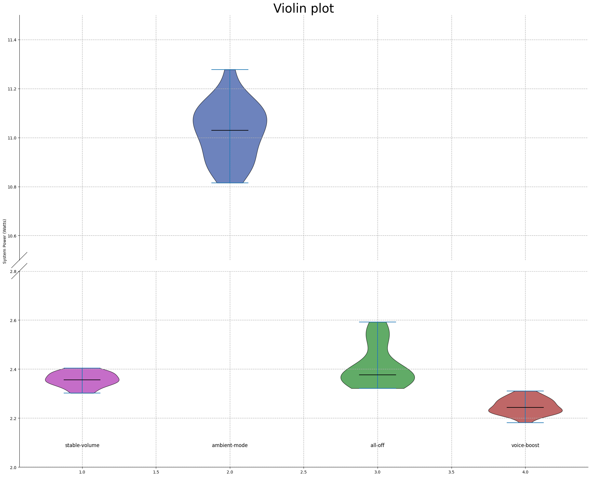
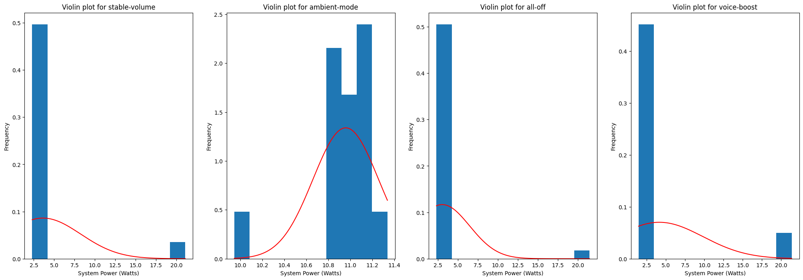
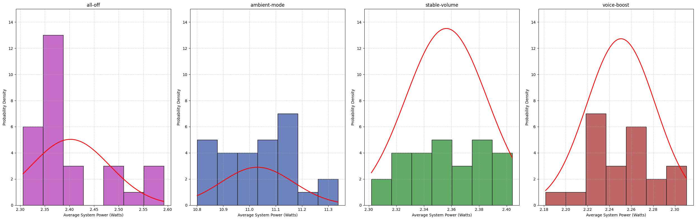
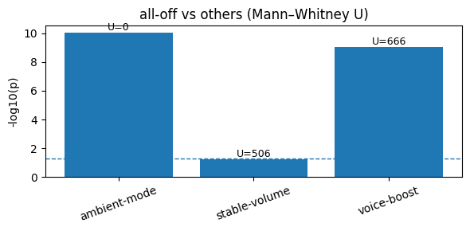

# Introduction

YouTube is one of the most widely used online video platforms in the world. According to Global Media Insight, the
platform attracts approximately 122 million daily active users, collectively watching over 1 billion hours of video each
day [1]. This scale of consumption translates into a significant and growing energy footprint, spread across data
centers, network infrastructure, and the client devices of viewers worldwide.

In addition to the established YouTube settings, such as video quality, playback speed, and subtitles, YouTube has
recently
introduced several optional player features to improve user experience: Ambient Mode, Stable Volume, and Voice Boost.
However, these features are far less familiar to users than traditional ones.
Notably, two of these (Ambient Mode and Stable Volume) are enabled by default, regardless of whether the users are
aware of or want these features. Many viewers may therefore be consuming additional computational resources without
consciously opting in.

In this blog post, we investigate whether these non-essential YouTube settings have a measurable effect on client-side
energy consumption. We conducted a controlled experiment in which each feature was enabled in isolation and energy
consumption was recorded over repeated trials. **Our hypothesis is that each of these features introduces additional
computational work and therefore increases energy consumption relative to the baseline, where all those features are
disabled.**

If this hypothesis holds, it raises a broader and important question: should non-essential features that increase energy
consumption be enabled by default — particularly at the scale of billions of viewing hours per day? Even marginal
increases per device could translate into significant aggregate energy costs. In this case, the platform designers
should reconsider these defaults in the interest of energy efficiency and sustainability. We approach this research question through a series of replicable experiments outlined in our Methodology. We then further discuss the analysis of our results, their discussion, and last the limitations we had as well as future possible work.

# Methodology
Our method of exploring this hypothesis was to first outline the explored settings, then automating the workflow of the EnergiBridge measurements, and lastly analyzing our results.

## Explored YouTube settings

YouTube offers several optional settings that can be toggled in the settings menu. Since we wanted to measure each of these features' additional consumption, we measured each setting in isolation in order to be able to reach more specific conclusions.
For this experiment, we isolated
three
non-essential features, testing each individually against a common baseline.

**Ambient Mode** extends the video's color onto the surrounding page background, creating a soft glow effect
that mirrors the on-screen content in real time, dynamically adjusting when scenes change [2]. This feature is only
active in dark mode and is enabled by default.

**Stable Volume** automatically normalises audio levels during playback, dynamically adjusting the volume to reduce
sudden loudness spikes and flatten the dynamic range within a video [3]. This setting is also enabled by default.

**Voice Boost** enhances the clarity of speech in videos by using AI to identify vocal frequencies and amplify spoken
dialogue relative to background sounds such as music or ambient noise, with all processing occurring in real time on the
client side [4]. Unlike the other two settings, Voice Boost is disabled by default, but remains relevant to our
experiment as it represents a feature that a significant portion of users may choose to enable.

The baseline condition (all-off) disables all three features simultaneously and serves as our reference point for energy
consumption.

## Experiment procedure

We defined four conditions (one per setting plus the baseline) and conducted 30 trials per condition, running 120
trials in total. To minimize human error and ensure consistency across trials, the entire experiment was automated using
Python and Playwright [2]. The hardware and software details of the machine on which we conducted the
experiment are provided below in section [Hardware/Software Details](#hardwaresoftware-details). The video used throughout all trials was a fixed,
publicly available [YouTube video](https://www.youtube.com/watch?v=d4u4cgxTShU) with no ads and streamed at a consistent quality (480p).
### Zen Mode
Before the experiment began, we prepared the machine by closing all applications, disabling
all notifications, disabling brightness adjusting. Display brightness and system volume were both fixed at 30% for the duration
of the experiment, this is discussed further in the [Limitations section](#limitations-and-future-work). Although a wired ethernet connection would have been preferable for network stability, it was not
not feasible throughout the timeline of the project, so all trials were conducted over the same Wi-Fi network. We acknowledge this as a potential source of variance in our
measurements.

### Workflow
With our computer in "_zen mode_", we started a 5-minute warm-up phase in which we ran a Fibonacci sequence computation
to bring the CPU to a stable temperature and avoid cold-start effects in the early trials. After the warm-up,
we executed 120 trials (30 per condition) in a randomly shuffled order to mitigate any temporal correlations between
trials.

Between each trial, the system was left idle for 30 seconds to allow it to stabilize before the next measurement began.

Each trial proceeded the workflow as follows:

1. Opening Chrome browser in incognito mode with dark mode enabled via a pre-set YouTube cookie.
2. Navigating to the chosen YouTube video, accepting the cookies, and temporarily pausing playback.
3. Applying the designated YouTube setting for that trial.
4. Resuming playback and recording energy consumption using
   EnergiBridge [5] for 60 seconds of video playback.
5. Closing the browser and waiting 30 seconds before the next trial.

### Hardware/Software Details
Below we outline the specifications we used to run the experiments for replicability.
- Model Name:	MacBook Air
- Model Identifier:	Mac14,2
- Chip:	Apple M2
- Total Number of Cores:	8 (4 performance and 4 efficiency)
- Memory:	8 GB
- Resolution:	2560x1664 Retina
- Refresh Rate:	60Hz

## Data Analysis

For each trial, energy consumption was recorded with EnergiBridge continuously over a 60-second playback window. The primary metric
extracted from these measurements was System Power (Watts). To obtain a single representative value per trial, we
averaged all recorded timestamps within the interval. This resulted in one aggregate value per trial, which we
refer to as **Average System Power (Watts)** and use as the key metric in our data analysis.

### Outlier Removal

Initially, outliers were considered for removal using a Z-score threshold of 3.0. However, this approach proved
unreliable and not sufficiently robust for our case, as multiple extreme values inflated the standard deviation, leaving some outliers undetected. To address
this, outliers were identified using the **Interquartile range (IQR) method**:

$$
IQR = Q_3 - Q_1
$$

Observations were considered outliers if they lay outside:

$$
[Q_1 - 1.5 \cdot IQR,\; Q_3 + 1.5 \cdot IQR]
$$

Detected outliers were removed prior to further analysis.

### Statistical Analysis

The cleaned data were visualized using boxplots, violin plots, and histograms to inspect distribution and variability.
Normality was assessed using the **Shapiro–Wilk test**. Since the distributions did not consistently satisfy normality
assumptions, we used the non-parametric **Mann–Whitney U test** to evaluate statistical significance.
The test evaluates whether the probability that an observation from one group exceeds an observation from the other
differs from 0.5:

$$
H_0: P(X > Y) = 0.5
$$

for two independent samples \(X\) and \(Y\).

### Effect Size Analysis

To quantify the magnitude of differences, we computed:

- **Median Difference**
  $$
  \Delta_{median} = \text{median}(X) - \text{median}(Y)
  $$

- **Median-Based Percentage Change**
  $$
  \%\Delta =
  \frac{\text{median}(X) - \text{median}(Y)}
  {\text{median}(Y)} \times 100
  $$

  where \(Y\) denotes the baseline condition.

- **Percentage of Pairs**
  $$
  \frac{\#\{(x_i, y_j) \mid x_i > y_j\}}{n_X \cdot n_Y}
  $$

  where \(n_X\) and \(n_Y\) are the sample sizes of the two groups.

Together, these measures provided us with a solid foundation for evaluating whether the examined features meaningfully
influence client-side energy consumption.

# Results
Our results have quite a few outliers. In total we have 13 outliers, with `voice boost` being the largest offender. In the [outlier removal section](#outlier-removal) we explain why we decided to use the IQR to remove outliers, and this table shows how the ranges are fitted around the valid data without too much information loss. Many of the outliers were consuming around 20 Watts of power, which can possibly be attributed to YouTube's content downloading for smoother playback, to heavier power consumption as a result of battery levels or due to network issues. However, we have no clear way of pinpointing the exact cause. 

| Category      | Outliers Removed |   Valid Range  | Total Runs |
|---------------|------------------|----------------|------------|
| Stable Volume | 3                | [2.25, 2.47]   | 30         |
| Ambient Mode  | 2                | [10.56, 11.46] | 30         |
| All off       | 1                | [2.18, 2.65]   | 30         |
| Voice Boost   | 7                | [2.12, 2.40]   | 30         |

Further insights can be found in the outlier removed plot. We can see that our results for `all-off` there is still a distinct tail that rises above the other two plots on the lower end of the graph. This result is unexpected as our baseline should be the graph with the least energy consumption. Most of these outliers can be attributed to what was mentioned above, there is also a possibility that the computer had to pull more power due to the battery level, as described in [Limitations and Future Work](#limitations-and-future-work). Later in the section [Statistical Significance](#statistical-significance) we discuss that although this difference exists, on a statistical level these differences are negligible. 

  

The histograms below give us an insight into the type of statistical tests we can run, as they highlight the normality of our data. We can see that all classes on the lower end of the violin plot have a right tail indicating outliers with high wattage, while the `ambient mode` has a left tail indicating low wattage outliers. After the outlier removal every class can be considered a normal distribution except for `all-off` which as mentioned above seems to have outliers within a smaller range as well. We can clearly see this with the gap between the lower end and the upper end of the graph. 

  
  

## Statistical Significance
Because the energy consumption data did not consistently satisfy normality assumptions after outlier removal, we used the Mann–Whitney U test to compare each feature condition against the baseline (all-off). This non-parametric test does not assume normally distributed data and is therefore appropriate for comparing the central tendency of skewed or irregular distributions.

The figure below shows the statistical significance of each comparison, expressed as −log10(p), with the dashed horizontal line indicating the significance threshold of p = 0.05.

  

 

Ambient Mode shows a highly significant difference compared to the baseline (U = 0, p ≪ 0.001), indicating that system power consumption under Ambient Mode is consistently higher than in the all-off condition.

Voice Boost also shows a statistically significant difference relative to the baseline (U = 666, p < 0.001). However, as discussed later in the effect size analysis, this significance does not translate into a practically meaningful decrease in energy consumption.

Stable Volume does not show a statistically significant difference compared to the baseline (U = 506, p ≈ 0.05), suggesting that its effect on system power consumption is negligible under the tested conditions.

## Effect Sizes

Statistical significance alone is not sufficient to judge the impact of a feature on energy consumption. To assess whether the observed differences are relevant in practice, we examined effect sizes using three measures: the median difference, the median-based percentage change, and the percentage of pairs.

| Effect Size Metric        | Stable Volume | Ambient Mode | Voice Boost |
|---------------------------|---------------|--------------|-------------|
| Median Difference (W)     | -0.019        | 8.671        | -0.130      |
| Percentage Change (%)     | -0.782 %      | 365.328 %    | -5.478 %    |
| Percentage of Pairs (%)   | 35.38 %       | 100.00 %     | 0.15 %      |

For Ambient Mode, all three metrics indicate a clear and consistent increase in system power usage compared to the baseline. The median power draw increases by 8.67 W, corresponding to a 365% median-based increase, and 100% of Ambient Mode trials consume more power than baseline trials. This pattern indicates a sustained increase in energy consumption rather than an effect driven by a small number of extreme measurements.

In contrast, Voice Boost and Stable Volume show negligible effect sizes. Median differences are close to zero (−0.13 W and −0.02 W, respectively), relative changes are small (−5.48% and −0.78%), and the percentage-of-pairs values remain low (0.15% and 35.38%). This substantial overlap with the baseline distribution suggests that, despite statistical significance for the Voice Boost, the features do not meaningfully affect energy consumption under the tested conditions.

# Discussion
From our results, we observed that voice-boost and ambient-mode have a statistically significant difference in their energy consumption compared to the baseline. However, from a practical significance perspective, we observe that for voice-boost the effect size is significantly lower than that of ambient-mode, to the point where it can be considered negligible for a user as it promotes the understandability of a video. In this case, the voice-boost setting is possibly compensating for its marginal energy consumption by reducing the need for additional features that also promote understandability. This can be the use of a higher volume, subtitles, or re-watching that also consume additional energy. Therefore, we only reach conclusions on the ambient-mode setting in this study and discuss the rest further in [Limitations and Future Work](#limitations-and-future-work).

For ambient-mode, we have observed that it does consume significantly more energy compared to the baseline. This is in line with several sources on the internet, such as a post by Henry Van Megen [6]. These sources attempt to warn that it is consuming energy and resulting in extra C02 while both its environmental impact and added benefit to the user going unnoticed. Considering that Ambient Mode is active by default for dark mode users, many of whom may have chosen dark mode for its energy-efficiency benefits, YouTube has a responsibility to address this design choice more carefully when treating its 2.5 billion users [7]. The company should either clearly inform users about the potential energy implications before enabling it by default or disable the feature by default and allow users to make an informed decision themselves. This is especially important because the feature’s existence is not widely known, and its benefits are generally considered negligible [6].

# Limitations and Future Work
We faced several limitations due to the short timespan of the project and our hardware. We outline them below.

First of all, as mentioned in the discussion section, we did not see a significant difference in the use of energy consumption for Voice Boost and Stable Volume. A possible reason for this is that these features heavily rely on dynamic voice ranges and background noises in a video [2] [3]. The content that we used was a story-time video that had stable levels of narration and background music throughout the video, possibly not triggering the use of these voice correction features fully. Unfortunately, we did not have the time to re-run our experiment to address this, but the effect of Voice Boost and stable volume can be explored further by replicating the experiment with different kinds of videos in the future.

Secondly, since the settings are concerned with display and sound, the initial version of the experiment included 100% brightness and volume to better observe the effects. However, since the execution of 4 different cases took several hours, the full-battery of the hardware we used did not last enough to finish the experiment. This is why we used 30% for both brightness and sound to be able to finish the full execution. We decided against the charging of the hardware throughout the experiment since we had assumed that connection of an external device would have an uncontrollable effect on the results. However, reflecting on our experiment, the receding battery might have also affected our results negatively throughout the runs. Therefore, the experiment could be replicated with higher levels of brightness and sound while being plugged to a power outlet, while assessing if this would affect the results or not. 

Finally, although we used outlier detection procedures, our results still contain samples that disrupt normality. We have mentioned that a possible cause for this could be the unstable wireless internet connection and the resulting buffering of the video. Since the EnergiBridge tool that we used does not distinguish between energy usage of different processes, we did not have a systematic way of addressing this in our analysis. To address this, the experiment can be replicated with a bigger sample size. Furthermore, a tool can be developed to distinguish and measure the energy consumption of different processes to better observe these external effects to support sustainability research in the future. 

# Replication 
[Source Code](https://github.com/g34-sustainable-software/p1_dev/tree/dev) \
The link takes you to our github repository. Follow the instructions to fully replicate our experimentation.

# Referencess

[1] Global Media Insight. YouTube Users
Statistics. https://www.globalmediainsight.com/blog/youtube-users-statistics/#Daily_Active_Users_on_YouTube

[2] Tactiq. What is Ambient Mode on YouTube. https://tactiq.io/learn/what-is-ambient-mode-youtube

[3] Epic Lab. How YouTube's New Stable Volume Feature Destroys Your Carefully Crafted Audio
Mix. https://epic-lab.com/how-youtubes-new-stable-volume-feature-destroys-your-carefully-crafted-audio-mix/

[4] Nymynet. Voice Boost YouTube Explained: When and Why You Should Use
It. https://nymynet.com/voice-boost-youtube-explained-when-and-why-you-should-use-it/

[5] T. Durieux. EnergiBridge. GitHub. https://github.com/tdurieux/EnergiBridge/tree/main/src

[6] Change.org. Reduce energy waste — Help turn off YouTube’s power-hungry default ambient mode. https://www.change.org/p/reduce-energy-waste-help-turn-off-youtube-s-power-hungry-default-ambient-mode

[7] Brian Dean. YouTube Stats: How Many People Use YouTube? Backlinko. Last updated Dec. 29, 2025. https://backlinko.com/youtube-users
