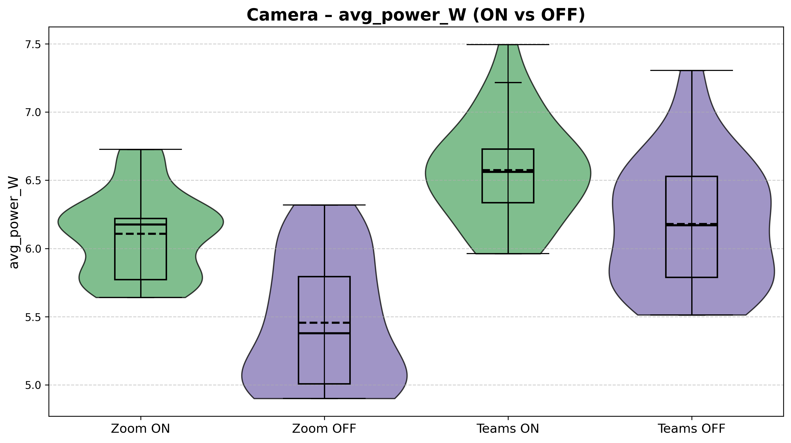
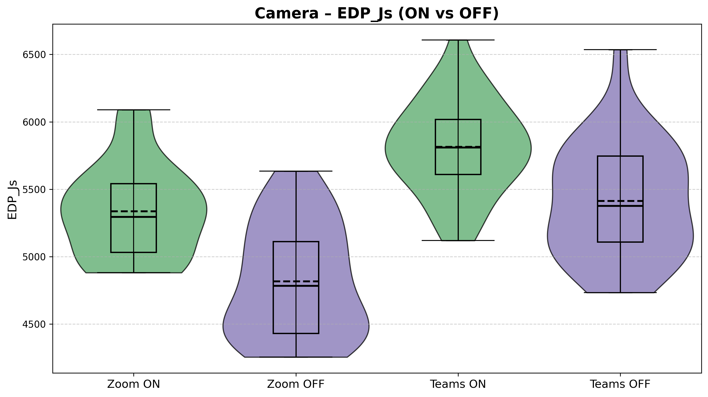
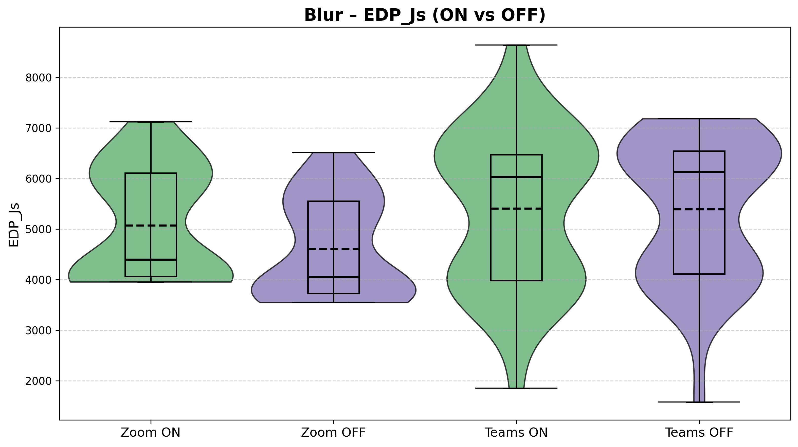

# Introduction
## Context and Motivation
Six years ago, the COVID-19 pandemic began, prompting nations around the world to enforce a lockdown with the intention of reducing virus transmission. People were strongly advised to stay home and as a consequence, this led to a considerable increase in work from home (WFH) arrangements with **video conferencing** becoming a core part of daily work. 

According to Adrjan et al., WFH job postings have quadrupled across 20 countries from 2020 to 2023, with these kind of postings still remaining popular despite a lifting of pandemic restrictions. Naturally, video conference applications rose in popularity and because of this, it is imperative to consider the energy usages of these applications as the number of people transitioning to remote working during this time increases significantly. 

From a user perspective, the energy efficiency of video conferencing software matters because it directly affects the experience of working on a laptop. Online meetings can be long and frequent, and if an application draw more power, the **laptop will drain faster**. This would require more frequent charging, and may force users to adapt their workday around power availability by, for example, staying near outlets or carrying chargers. Higher power draw can also increase heat and fan activity, impacting comfort and potentially influencing audio quality if fan noise is captured by the microphones. Over time, frequent high-power usage by contribute to **faster battery wear**, reducing the lifespan of a device. 

Beyond individual devices, energy usage also has **system-level implications**. Video conferencing can be used at **massive scale across organizations**, with even modest per-hour difference in power consumption accumulating across users. Understanding how application choice and feature configuration affects power demand can support recommendations for more sustainable digital work practices. 

While the number of people transitioning to remote working has recently seemed to stabilized in Europe and in other places around the world, as reported by Eurofound researcher Oscar Vargas Llave, "The possibility of working from home hasn’t [been] sedimented in European workplaces". Thus, research into the energy usages of video conference applications remains relevant in this day and age.

For the purposes of this research, the video conference applications to be investigated for energy usage are **Zoom Workplace** and **Microsoft Teams**. Both applications have native apps, and share similar features that will be experimented on, namely, the turning on and off of the camera, the sharing of screens, and the blurring of the background. 

## Research Objectives

The primary research objective of this piece is to compare the two aforementioned applications in power usage.

The more specific objectives of this study are to:
- Measure and analyze the baseline power consumption of Zoom Workplace and Microsoft Teams during a video call with the camera turned off. 
- Compare the difference in power usage of Zoom Workplace and Microsoft Teams with the camera turned off versus with the camera turned on. 
- Evaluate the impact of screen sharing on the power consumption across the two different platforms. 
- Evaluate the impact of background blurring on the power consumption across the two different platforms.
- And lastly, identify which of the two applications is more energy-efficient under different feature configurations and provide insights into how specific features affect the energy consumption of of video conference applications and their implications for sustainable work from home practices.

# Methodology 

## Experimental setup

The experiment was conducted in a controlled environment on a single computer with the following device specifications:

- **Processor:** AMD Ryzen 7 7730U with Radeon Graphics (2.00 GHz) 
- **Installed RAM:** 16.0 GB
- **System Type:** 64-bit operating system, x64-based processor
- **Operating System:** Windows 11 home, version 25H2

Moreover, the following sofware was used to run the experiment:

- **Automation Environment:** Python, version 3.14
- **Applications Under Test:** Microsoft Teams, version 26032.208.4399.5; Zoom Workplace, version 6.6.11 (23272)
- **Monitoring Tool:** Energibridge, version 0.0.7

## Variables and Metrics

We categorize the experimental parameters into dependent and independent variables, in order to measure how toggling different video-call features influences the power demands of the system.

**Independent Variables:**

- **Applications:** Microsoft Teams vs. Zoom Workplace.
- **Feature States:** Camera On/Off, Blur On/Off, Screen-share On/Off.

**Dependent Variables:**

- **Mean Power (W):** the rate of energy consumption during the trial.
- **Total Energy (J):** the total amount of energy consumed in 30 seconds.
- **Energy Delay Product (J·s):** trade-off between energy efficiency and the time taken to complete the task.

Next, we establish a controlled testing environment, to achieve as accurate and reproducible results as possible.

## Controlled Testing Environment
The experiment was conducted in "Zen mode" to minimize bias.

All non-essential applications were stopped, and device notifications disabled. The only application open on the device was ``cmd.exe`` terminal with administrative power. The computer used wireless internet connection, and was plugged into a power source throughout the experiment. The brightness of the screen was set to 100%, and the volume to 30%.

In the following subsection, we describe the step-by-step testing procedure and the automation of the experiment.

## Automation & Testing Procedure 

The experiment is driven by a single automation script that imports two platform-specific automation modules. Once started, it requires no manual intervention.

**Warm-up.** A 5-minute CPU-intensive task (Fibonacci sequence) stabilises CPU thermals before any measurement begins, reducing cold-start variance.

**Randomised scheduling.** For each task, the script must complete 15 iterations per platform. Instead of running them sequentially, it randomly selects which platform to test next from whichever still has remaining iterations. This shuffling mitigates ordering effects such as room temperature changes or background OS activity, that could systematically bias one platform's results.

**Iteration lifecycle.** Each iteration follows a fixed sequence:

1. **Launch**: the selected application opens and joins a pre-configured meeting automatically.
2. **Baseline measurement**: EnergiBridge records system-level energy consumption for 30 seconds under the baseline condition (e.g., camera off, no blur, no screen share).
3. **Feature measurement**: the script toggles the feature (e.g., enables camera, blur, or screen sharing) and EnergiBridge records for another 30 seconds.
4. **Restart**: the application is force-killed to ensure a clean state for the next iteration.
5. **Cooldown**: a 60-second waiting period is executed to prevent tail energy consumption between iterations.

### Replication Package

For the experiments, the replication package can be found in the following [repository](https://github.com/ayushhhkha/SSE_TeamsVsZoom).

## Data Collection & Processing 
Each 30-second EnergiBridge run creates a CSV containing timestamped energy readings, producing 360 files across all iterations. From each reading we derive the dependent variable values: mean power (W), total energy (J), and the Energy Delay Product (J·s). Outliers are removed using a z-score filter, and the appropriate statistical test (Welch t-test or Mann–Whitney U) is selected based on a Shapiro-Wilk normality check.

# Results

This section will present the findings of the different power consumption and energy delay product values across the different video conference applications and features.

As mentioned previously, EnergiBridge was used to measure energy consumption. The tool provides the following relevant metrics:
- *Delta*
- *CPU_Energy (J)*

With the metrics above, the key metrics to be calculated per trial were:
1. *Total Energy Consumption (J)*: Calculated by computing the difference of the cumulative energy metric. 
2. *Average Power Consumption (W)*: Calculated by dividing the total energy consumption over the duration of the trial.
3. *Energy Delay Product (J * s)*: Calculated by multiplying energy by the total duration of the trial.

Average Power Consumption was chosen as we are reporting on the consumption of a continuous use case rather than a one-off use case. Energy Delay Product was chosen to evaluate the overall efficiency of by balancing energy consumption against performance.

## Outlier detection

Before diving into the experimental results we removed anomalies to improve data reliability. We used a Z-Score threshold of 3.0 to determine the outliers. The reason why we picked 3 is due to how it covers 99.7% of normal data which lies within 3 standard deviations. Another reason why we picked 3.0 is because a thereshold of 3.0 ensures that only extreme measurements error are removed while it keeps normal variability intact. Based on the application, our experiment flagged outliers between 0 and 1 per group of 30 iterations. In total, only 5 outliers were removed. Based on this it confirms that our data was generally stable and that only extreme measurement errors were detected. Since the number of identified outliers were negligible, we decided that we will not demonstrate visualization or data processing with outliers since these outliers were negligible and will do not demonstrate a significant reflection of our data.

## Experimental results

After the removal of outliers, the results can be seen illustrated below. Each figure compares Zoom and Microsoft Teams under the specified feature ON vs OFF conditions. The violin plots show the full distribution of the measurements across the 30 runs, while the embedded box plots indicate the mean and interquartile range.

### Power and EDP Comparison for camera on vs camera off

  

    <strong>Power</strong> 
    
    

    <strong>Figure 1</strong>: Average Power Consumption values for features camera on vs camera off.
    

  

  

    <strong>EDP</strong> 
    
    

    <strong>Figure 2</strong>: EDP values for features camera on vs camera off.    
    

  

### Power and EDP Comparison for background blurring on vs off

  

    <strong>Power</strong> 
    
    

    <strong>Figure 3</strong>: Average Power Consumption values for features background blurring on vs off.
    

  

  

    <strong>EDP</strong> 
    
    

    <strong>Figure 4</strong>: EDP values for features background blurring on vs off.
    

  

### Power and EDP Comparison for screen sharing on vs off

  

    <strong>Power</strong> 
    
    

    <strong>Figure 5</strong>: Average Power Consumption values for features screen sharing on vs off.
    

  

  

    <strong>EDP</strong> 
    
    

    <strong>Figure 6</strong>: EDP values for features screen sharing on vs off.
    

  

Across all the features, it can be observed that enabling the feature generally results in higher average power consumption compared to disabling it. This effect can be seen for both applications, with the exact magnitude and variability differing between Zoom and Microsoft Teams. Note that the width and shape of the violins show that feature-enabled conditions often exhibit greater variability, suggesting less stable energy behaviour when additional processing, such as video effects and sharing, is active. 

## Statistical Analysis

### Normality testing
To determine the kind of statistical tests to conduct, the normality of the data destribution was evaluated using the **Shapiro-Wilk test**.

The test was applied separately to each group, with a significance level of `a = 0.05` being used:
- if `p >= 0.05`: the data was normally distributed
- if `p < 0.05`: the data was not normally distributed

Generally speaking, most of the groups revealed to have data that is not normally distributed.

Depending on the result, the choice of statistical test was made as described below.

*Table 1: Shapiro-Wilk p-values for the power values of the different features*
| **Platform** | **Feature** | **Shapiro-Wilk p-value (ON)** | **Shapiro-Wilk p-value (OFF)** | **Both normal** |
|:--------:|:-------:|------------:|-------------:|-------------:|
| TEAMS    | CAM     | 0.656        | 0.222         | True |
| ZOOM     | CAM     | 0.004        | 0.006         | False |
| TEAMS    | BLUR    | 0.014        | 0.003         | False |
| ZOOM     | BLUR    | 0.001        | 0.000         | False |
| TEAMS    | SHARE   | 0.091        | 0.007         | False | 
| ZOOM     | SHARE   | 0.005        | 0.001         | False |

*Table 2: Shapiro-Wilk p-values for the EDP values of the different features*
| **Platform** | **Feature** | **Shapiro-Wilk p-value (ON)** | **Shapiro-Wilk p-value (OFF)** | **Both normal** |
|:--------:|:-------:|------------:|-------------:|-------------:|
| TEAMS    | CAM     | 0.963        | 0.375         | True |
| ZOOM     | CAM     | 0.064        | 0.027         | False |
| TEAMS    | BLUR    | 0.004        | 0.000         | False |
| ZOOM     | BLUR    | 0.000        | 0.000         | False |
| TEAMS    | SHARE   | 0.001        | 0.000         | False | 
| ZOOM     | SHARE   | 0.000        | 0.000         | False |

### Significance Testing
Two independent-sample significance tests were considered in this case. 

**Welch's t-test** was used in the case both groups passed the normality test. This is because this test compares mean differences, making it appropriate for when distributional assumptions are met. 

When at least one group violated the normality assumptions, the **Mann-Whitney U test** was used instead because this test does not rely on distributional assumptions and compares rank other, making it more robust to skewed distributions and outliers. 

*Table 3: Significance test p-values for the power values of the different features*
| **Platform** | **Feature** | **Test Used**           | **Test p-value** |
|:--------:|:-------:|:-------------------:|:------------:|
| TEAMS    | CAM     | Welch t-test        | 0.001 |
| ZOOM     | CAM     | Mann–Whitney U      | 0.000 |
| TEAMS    | BLUR    | Mann–Whitney U      | 0.490 |
| ZOOM     | BLUR    | Mann–Whitney U      | 0.007 |
| TEAMS    | SHARE   | Mann–Whitney U      | 0.001 |
| ZOOM     | SHARE   | Mann–Whitney U      | 0.444 |

*Table 4: Significance test p-values for the EDP values of the different features*
| **Platform** | **Feature** | **Test Used**           | **Test p-value** |
|:--------:|:-------:|:-------------------:|:------------:|
| TEAMS    | CAM     | Welch t-test        | 0.000 |
| ZOOM     | CAM     | Mann–Whitney U      | 0.000 |
| TEAMS    | BLUR    | Mann–Whitney U      | 0.371 |
| ZOOM     | BLUR    | Mann–Whitney U      | 0.001 |
| TEAMS    | SHARE   | Mann–Whitney U      | 0.027 |
| ZOOM     | SHARE   | Mann–Whitney U      | 0.429 |

Both platforms appear to have *camera activation consistently produce statistically significant differences* in power consumption and EDP values. The same can be said for screen sharing, particularly for Microsoft Teams. On the other hand, background blurring seemed to yield mixed or non-significant results. 

*Table 5: Significance test p-values for the power values of the different applications and their features*
| **Feature** | **Condition** | **Test Used**           | **Test p-value** |
|:--------:|:---------:|:-------------------:|:------------:|
| CAM      | ON        | Mann-Whitney U      | 0.000 |
| CAM      | OFF       | Mann–Whitney U      | 0.000 |
| BLUR     | ON        | Mann–Whitney U      | 0.363 |
| BLUR     | OFF       | Mann–Whitney U      | 0.033 |
| SHARE    | ON        | Mann–Whitney U      | 0.001 |
| SHARE    | OFF       | Mann–Whitney U      | 0.051 |

*Table 6: Significance test p-values for the EDP values of the different applications and their features*
| **Feature** | **Condition** | **Test Used**           | **Test p-value** |
|:--------:|:---------:|:-------------------:|:------------:|
| CAM      | ON        | Welch t-test        | 0.000 |
| CAM      | OFF       | Mann–Whitney U      | 0.000 |
| BLUR     | ON        | Mann–Whitney U      | 0.569 |
| BLUR     | OFF       | Mann–Whitney U      | 0.000 |
| SHARE    | ON        | Mann–Whitney U      | 0.072 |
| SHARE    | OFF       | Mann–Whitney U      | 0.599 |

When comparing the two application directly with each other, we can see that the camera *ON* and *OFF* conditions show significant differences ~(`p < 0.001`), indicating *clear platform-level distinctions*. Screen sharing differences are also *significant in the ON conditions*, while background blurring showed less consistent and weaker differences between the applications. 

### Effect size estimation
In addition to statistical significance, **effect sizes** should be computed to help indicate the practical relevance of an observed difference. 

For Welch's t-test, **Cohen's d** was used to quantify standardized mean differences. For the Mann-Whitney U test, the **common language effect size** was computed, representing the probability that a randomly selected observation from one group exceeds an observation from another group. 

These measures are meant to provide insight into the magnitude of observed effects, independent of sample size. 

*Table 7: Effect size for the power values of the different features*
| **Platform** | **Feature** | **Effect size Used**    | **Value** |
|:--------:|:-------:|:-------------------:|:------------:|
| TEAMS    | CAM     | Cohen's d           | -0.935 |
| ZOOM     | CAM     | Common Language     | 0.864 |
| TEAMS    | BLUR    | Common Language     | 0.447 |
| ZOOM     | BLUR    | Common Language     | 0.706 |
| TEAMS    | SHARE   | Common Language     | 0.761 |
| ZOOM     | SHARE   | Common Language     | 0.441 |

*Table 8: Effect size for the EDP values of the different features*
| **Platform** | **Feature** | **Effect size Used**    | **Value** |
|:--------:|:-------:|:-------------------:|:------------:|
| TEAMS    | CAM     | Cohen's d           | -1.03 |
| ZOOM     | CAM     | Common Language     | 0.819 |
| TEAMS    | BLUR    | Common Language     | 0.432 |
| ZOOM     | BLUR    | Common Language     | 0.699 |
| TEAMS    | SHARE   | Common Language     | 0.666 |
| ZOOM     | SHARE   | Common Language     | 0.560 |

Effect size results confirm the *large practical impact* that camera activation has on the power consumption and EDP values across platforms. Screen sharing shows moderate effects while blur generally showcased moderate to small effects.

*Table 9: Effect size for the power values of the different applications and their features*
| **Feature** | **Condition** | **Effect size Used**     | **Value** |
|:--------:|:---------:|:-------------------:|:------------:|
| CAM      | ON        | Common Language     | 0.173 |
| CAM      | OFF       | Common Language     | 0.146 |
| BLUR     | ON        | Common Language     | 0.569 |
| BLUR     | OFF       | Common Language     | 0.336 |
| SHARE    | ON        | Common Language     | 0.257 |
| SHARE    | OFF       | Common Language     | 0.649 |

*Table 10: Effect size for the EDP values of the different applications and their features*
| **Feature** | **Condition** | **Effect size Used**     | **Value** |
|:--------:|:---------:|:-------------------:|:------------:|
| CAM      | ON        | Cohen's d           | 1.279 |
| CAM      | OFF       | Common Language     | 0.162 |
| BLUR     | ON        | Common Language     | 0.457 |
| BLUR     | OFF       | Common Language     | 0.237 |
| SHARE    | ON        | Common Language     | 0.365 |
| SHARE    | OFF       | Common Language     | 0.540 |

Between applications, camera ON produced large EDP effect size, indicating *practical differences* under active video conditions. For blur and screen sharing, effect sizes were generally small, suggesting that the platform differences are less pronounced. Thus, the most significant cross-application difference concerns the camera usage rather than the other features. 

Overall, the statistical analysis shows that *camera activation is the dominant factor* influencing both the power consumption and EDP values, producing significant results and large effect sizes across platforms. Screen sharing has moderate but platform-dependent impact, while background blurring demonstrates generally weaker and less consistent effects. 

# Discussion
## Interpretation of Results

Across all three features, the data reveals a consistent but nuanced picture: **enabling a feature generally raises power consumption**, but the magnitude and consistency of that increase varies considerably depending on both the feature and the application.

**Camera (Figures 1–2):** The camera feature yields the most stable and interpretable results. Both applications show a clear power increase when the camera is turned on, with relatively tight distributions. Zoom rises from a median of roughly 5.4 W (OFF) to about 6.1 W (ON), while Teams goes from approximately 6.2 W to 6.6 W. Notably, Teams draws more power than Zoom in both the ON and OFF conditions, and in fact, the Teams baseline with camera off is already higher than Zoom with the camera on. The EDP values in Figure 2 further showcase this, with Teams ON reaching a median around 5800 J·s compared to Zoom ON at roughly 5300 J·s.

**Background Blur (Figures 3–4):** Blur introduces the **highest variability** of any feature tested. Power values span from below 3 W to above 11 W for both applications. For Zoom, enabling blur does produce a visible median increase (from ~5.8 W to ~7.0 W). For Teams, however, the ON and OFF distributions are nearly indistinguishable, with both centering around 6.9–7.0 W with wide, overlapping violin shapes. The EDP plots tell a similar story: large spreads and heavy overlap, particularly for Teams. This high variability makes it difficult to draw strong conclusions about the blur feature's energy impact without further investigation.

**Screen Sharing (Figures 5–6):** Screen sharing produces the most **asymmetric result between applications**. For Zoom, the ON and OFF conditions are fairly close (medians around 5.3 W vs. 5.5 W), with moderate variability. For Teams, however, enabling screen share causes a pronounced jump, where the median rises from roughly 4.9 W to about 7.0 W, and the distribution stretches up to 12.5 W. The Teams ON violin is visibly wider and shifted upward compared to every other condition in this feature pair, making screen sharing the feature where the two applications diverge the most.

**Overall comparison:** Teams consistently shows **higher baseline power draw** across most conditions, while Zoom tends to produce tighter, more predictable distributions. The two applications respond differently to each feature toggle, showing a pattern that warrants further examination of the underlying causes and what it means in practice.

## Potential Explanations
TODO
## Implications
TODO
# Limitations

There are some limitations that will be briefly discussed in this section:

### Limited Test Duration: 

In an actual conference call, it usually lasts more then 10 minutes. However, the experiment was conducted with a 30 second duration in which this interval is quite short and does not reflect the real life usage of the application. Based on this we cannot clearly have results that can have system wide implications in order for certain companies to pick the most energy efficient application.

### Singular Hardware System: 
Another limitation is that this experiment was conducted in a single machine in which results could vary in different machines. The energy consumption can vary depending on the computers, CPU architecture, GPU, the battery health and power management.

### Operating Systems:
Only the Windows OS was used in which compared to MacOS and Linux, it can have different power management policies and task scheduling mechanism which can influence the energy consumption. Depending on the OS, certain background processes can be running which can impact the energy consumptions. Depending on the OS, certain features tested can have optimizations made for that specific OS. 

# Future Work

For additional work, it would be interesting to observe the experimentation being conducted on a Windows laptop and a MacOS which can lead to an interesting analysis of cross platforms and to determine which application is the most energy efficient in both OS. Another interesting work that can be done is testing out more application in demand such as Google Meet and Slack in order to effectively analyse each video conferencing application and determine the most energy efficient. One more additional work that can be conducted would be to increase the intervals which will increase experimentation time but this will align better with real life situations were video conferencing application are meant for longer usage. With our replication package, the future work can immediately begin.

# Conclusion

Our paper discusses the energy usage between **Zoom Workplace** and **Microsoft Teams**. The features that are being experimented on are turning on/off camera, blur and screen share.

# References

1. Sweigart, Al. “Welcome to PyAutoGUI’s Documentation! — PyAutoGUI 1.0.0 Documentation.” Readthedocs.io, 2014, pyautogui.readthedocs.io/en/latest/.
2. “The Empirical Rule (68-95-99.7).” Dmaic.com, 2 Oct. 2025, www.dmaic.com/faq/empirical-rule/. Accessed 26 Feb. 2026.
3. “Z-Score (Standard Score).” Dmaic.com, 8 Oct. 2025, www.dmaic.com/faq/z-score-standard-score/. Accessed 26 Feb. 2026.
4. Adrjan, P., Ciminelli, G., Judes, A., Koelle, M., Schwellnus, C., & Sinclair, T. M. (2025). Working from home after COVID-19: Evidence from job postings in 20 countries. Labour Economics, 96, 102751. https://doi.org/10.1016/j.labeco.2025.102751
5. Desmarais, A. (2025, March 22). Why remote work is not the lasting COVID legacy some may have hoped. Euronews; Euronews.com. https://www.euronews.com/next/2025/03/22/how-did-the-covid-19-pandemic-affect-remote-work-in-europe

