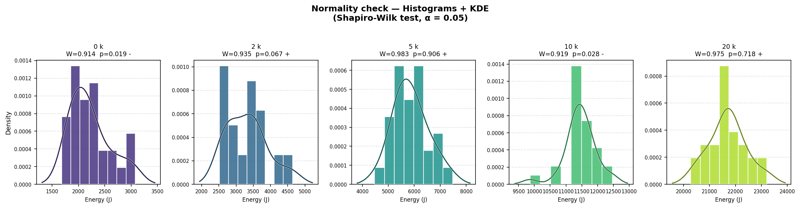
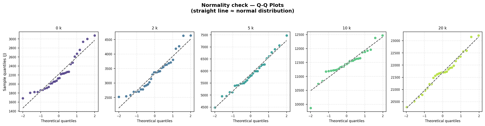
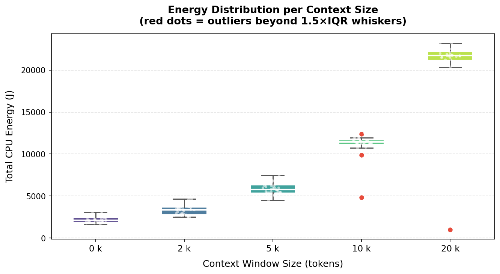
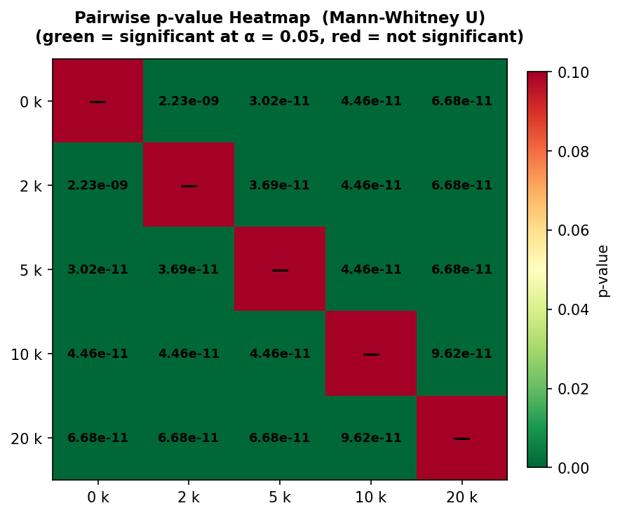
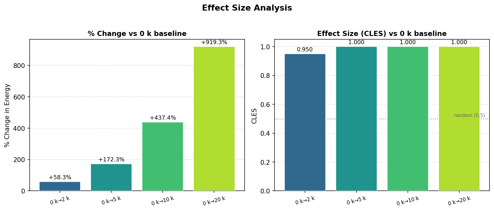
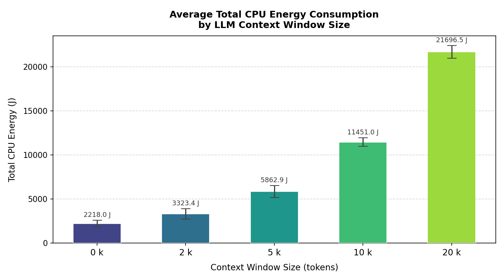
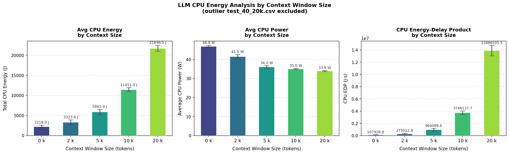
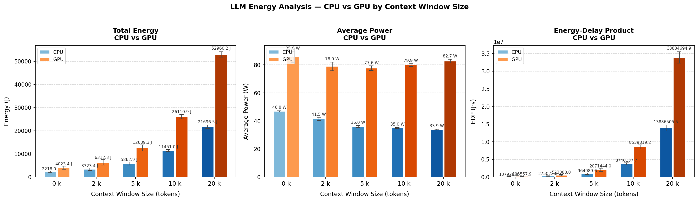
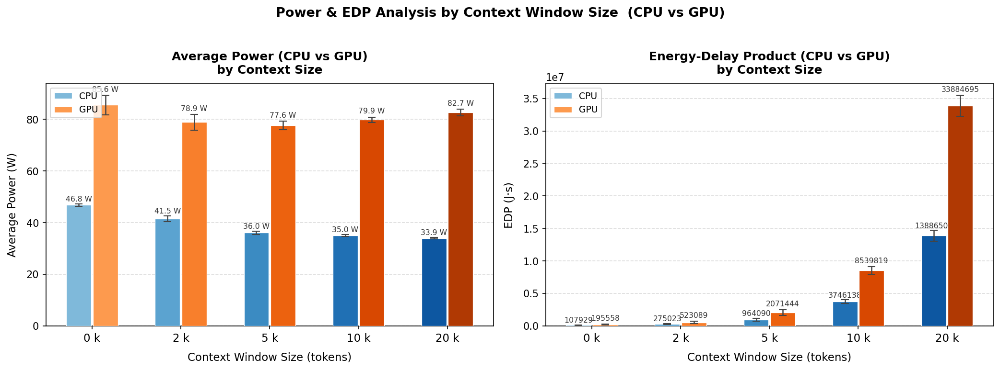

<!-- 
---

Body lorem ipsum dolor sit amet, consectetur adipisicing elit, sed do eiusmod tempor incididunt ut labore et dolore magna aliqua. Ut enim ad minim veniam, quis nostrud exercitation ullamco laboris nisi ut aliquip ex ea commodo consequat. Duis aute irure dolor in reprehenderit in voluptate velit esse cillum dolore eu fugiat nulla pariatur. Excepteur sint occaecat cupidatat non proident, sunt in culpa qui officia deserunt mollit anim id est laborum.

This problem takes another level if we are counting on these measurements to make **groundbreaking research contributions** in this area. Some research projects in the past have underestimated this issue and failed to produce replicable findings. Hence, this article presents a roadmap on how to properly set up a scientific methodology to run energy efficiency experiments. It mostly stems from my previous work on [doing research and publishing](/publications) on Green Software.

This article is divided into two main parts: 1) how to set up energy measurements with minimum bias, and 2) how to analyse and take scientific conclusions from your energy measurements.
Read on so that we can get your paper accepted in the best scientific conference.

--- 
#### 👉 Note 1:
If you are a **software developer** enthusiastic about energy efficiency but you are not particularly interested in scientific experiments, this article is still useful for you. It is not necessary to do "everything by the book" but you may use one or two of these techniques to reduce the likelihood of making wrong decisions regarding the energy efficiency of your software.

--- 

## Unbiased Energy Data ⚖️

There are a few things that need to be considered to minimise the bias of the energy measurements. Below, I pinpoint the most important strategies to minimise the impact of these biases when collecting the data.

### Zen mode 🧘🏾‍♀️

The first thing we need to make sure of is that the only thing running in our system is the software we want to measure. Unfortunately, this is impossible in practice – our system will always have other tasks and things that it will run at the same time. Still, we must at least minimise all these competing tasks:

- all applications should be closed, notifications should be turned off;
- only the required hardware should be connected (avoid USB drives, external disks, external displays, etc.);
- turn off notifications;
- remove any unnecessary services running in the background (e.g., web server, file sharing, etc.);
- if you do not need an internet or intranet connection, switch off your network;
- prefer cable over wireless – the energy consumption from a cable connection is more stable than from a wireless connection.

### Freeze your settings 🥶

It is not possible to shut off the unnecessary things that run in our system. Still, we need to at least make sure that they will behave the same across all sets of experiments. Thus, we must fix and report some configuration settings. One good example is the brightness and resolution of your screen – report the exact value and make sure it stays the same throughout the experiment. Another common mistake is to keep the automatic brightness adjustment on – this is, for example, an awful source of errors when measuring energy efficiency in mobile apps.

---

### 

Nevertheless, using statistical metrics to measure effect size is not enough – there should be a discussion of the **practical effect size**. More important than demonstrating that we came up with a new version that is more energy efficient, you need to demonstrate that the benefits will actually be reflected in the overall energy efficiency of normal usage of the software. For example, imagine that the results show that a given energy improvement was only able to save one joule of energy throughout a whole day of intensive usage of your cloud software. This perspective can hardly be captured by classic effect-size measures. The statistical approach to effect size (e.g., mean difference, Cohen's-*d*, and so on) is agnostic of the context of the problem at hand. -->

# Introduction

Large Language Models (LLMs) have been prominent for years, and users from different fields want to get the best performance from their models. Now that agentic LLMs are increasingly powerful, many users do not realise what the cost is of running high-reasoning models. There is a cost that often goes unnoticed: energy consumption. This is a hidden cost since most LLMs are not locally run but hosted in the cloud. Users also try to optimise their interactions with LLMs by providing context in the form of text, images, and files, assuming this will yield more accurate and relevant outputs. However, the energy implications of processing increasingly large context windows during inference remain poorly understood, particularly for locally deployed models.

## Background and Related Work

Strubell et al. [2] demonstrated that training a single large NLP model can emit as much carbon as five automobiles over their lifetimes, sparking discourse on sustainable AI. Patterson et al. [3] quantified the carbon emissions of training GPT-3 and T5, while Luccioni et al. [4] estimated the full lifecycle carbon footprint of BLOOM.

These studies focus on the *training* phase, yet the *inference* phase is an increasingly significant contributor to total energy consumption. Desislavov et al. [5] noted that inference costs can dominate over training when models serve millions of users. However, systematic measurements of how input characteristics, such as context window size can affect inference energy remain scarce. This gap is especially pronounced for local inference, where users run models on consumer hardware without the energy optimisations of cloud data centres.

## Motivation

Consider a student facing a difficult graded assignment who wants to use an LLM for assistance. They must decide whether to provide no context, only relevant lecture slides, or the entire course material. The assumption is that more context yields better answers but at what energy cost? The transformer self-attention mechanism has quadratic complexity O(N²) with respect to sequence length [6], suggesting that increasing context size yields a super-linear increase in energy. However, the actual energy profile on consumer hardware also depends on memory bandwidth, cache behaviour, and CPU-GPU data transfer overhead.

## Research Question and Hypotheses

This study addresses the following research question:

> **RQ:** *How does context window size affect the energy consumption of local LLM inference?*

We formulate two hypotheses:

- **H1:** Larger context windows lead to significantly higher total energy consumption due to increased computational demand.
- **H2:** The relationship between context size and energy consumption is non-linear, exhibiting super-linear growth consistent with the quadratic complexity of transformer self-attention.

## Hardware and Software Environment

All experiments ran on a single dedicated machine to eliminate hardware variability:

| Component | Specification |
|-----------|--------------|
| Processor | AMD Ryzen 7 5700X3D @ 3.00 GHz |
| GPU | AMD Radeon RX 9070 XT 16 GB |
| Memory | 32 GB DDR4 3200 MT/s |
| Operating System | Ubuntu 24.04.3 LTS |
| CPU Energy Monitoring | EnergiBridge [7] |
| GPU Power Monitoring | amd-smi |
| LLM Runtime | LM Studio (daemon mode) |

The entire experiment ran in one execution to reduce external factors. All non-essential programs were closed; only bare-minimum OS services, an ethernet connection, the experiment terminal, and LM Studio remained active. Room temperature was kept approximately constant.

## Model Selection and Context Configurations

We selected a single model for consistency: **gpt-oss-20b** (11.28 GB), which supports agentic capabilities and full chain-of-thought reasoning, reflecting contemporary LLM usage. The model was loaded in LM Studio with a maximum context window of 30,000 tokens.

The task consists of multiple-choice exam questions from CSE1305 (Algorithms and Data Structures) paired with course summaries of varying length. Five context sizes were tested:

| Context Size | File Size | Description |
|-------------|-----------|-------------|
| 0k tokens | 0 kB | No context provided |
| 2k tokens | 12 kB | Brief course summary |
| 5k tokens | 31 kB | Moderate summary |
| 10k tokens | 61 kB | Detailed summary |
| 20k tokens | 121 kB | Comprehensive summary |

## Experiment Procedure

The experiment was executed as a single automated session using the following protocol:

1. **Warmup phase:** One preliminary run with a 2k-token context to bring the system to a steady thermal state, followed by a 5-minute idle period.
2. **Main phase:** 150 inference runs (30 per context size) executed in an interleaved order. The run cycles through all five context sizes sequentially. This is to prevent temporal drift from systematically biasing any single condition.
3. **Cooldown:** A 10-second idle period between consecutive runs to allow thermal dissipation and prevent energy measurement carryover.
4. **Measurement:** For each run, EnergiBridge recorded CPU energy consumption (Joules) at millisecond granularity, while amd-smi sampled GPU socket power (Watts) at one-second intervals in a background process.

# Results

Across 150 inference runs spanning five context sizes, the data shows a coherent picture that largely confirms our expectations while surfacing a few counterintuitive findings.

## Data Validation

### Normality Testing

Before drawing any statistical conclusions, we first characterised the shape of the energy distributions. We applied the Shapiro-Wilk test [8] to the CPU energy measurements for each context size; Figures 1 and 2 illustrate the resulting distributions.

Normality was rejected for the 0k (W = 0.914, p = 0.019) and 10k (W = 0.919, p = 0.028) groups, while the 2k, 5k, and 20k groups passed. Given that not all groups satisfy the normality assumption, we applied the non-parametric Mann-Whitney U test [9] consistently across all pairwise comparisons.

### Outlier Detection and Exclusion

A small number of runs produced anomaly measurements. We identified outliers using both IQR (1.5×) and Z-score (|Z| > 2) criteria; Figure 3 highlights the affected data points.

Three runs were excluded: `test_40_20k.csv` (1,161 J, Z = 5.25), `test_95_20k.csv` (1,004 J, Z = 5.20), and `test_94_10k.csv` (4,855 J, Z = 5.00). Their energy values were an order of magnitude below their group medians, most likely the result of silent process failures or out-of-memory conditions causing premature termination rather than genuinely low energy use. The cleaned dataset comprises 147 valid runs.

## Statistical Significance

With a validated dataset in place, we ran Mann-Whitney U tests across all ten pairwise context-size combinations. The heatmap in Figure 4 summarises the outcomes.

Every pairwise comparison returned p < 2.23 × 10⁻⁹, confirming that all energy differences are highly statistically significant without exception. Statistical significance, however, says nothing about magnitude, so we also computed the Common Language Effect Size (CLES) [10] relative to the 0k baseline (Figure 5).

The effect sizes are substantial. Relative to the 0k baseline, CPU energy increases by +58% at 2k tokens, +172% at 5k, +437% at 10k, and **+919%** at 20k — nearly a tenfold increase for the largest context. The CLES values reinforce this: 0.950 for the 0k→2k comparison and 1.000 for all others, indicating that virtually every run at a larger context consumed more energy than any run at a smaller one. **H1 is strongly confirmed.**

## Energy Consumption Trends

With the statistical picture established, we turn to the energy trends themselves. Figures 6 and 7 present total CPU energy, average power draw, and the energy-delay product (EDP) across all five context sizes.

Total CPU energy rises from 2,218 J at 0k context to 21,697 J at 20k — a 9.8× increase for a 20× larger input. The growth is clearly super-linear yet falls short of the theoretical quadratic bound, which is consistent with attention complexity applying only to the context portion of each run,thus **H2 is supported.**

Perhaps the most counterintuitive finding is that average CPU power *decreases* with larger contexts — from 46.8 W at 0k to 33.9 W at 20k. This apparent paradox is resolved by the EDP metric, which grows from 107,929 J·s at 0k to over 13.8 million J·s at 20k. Since EDP = energy × time, the rising EDP alongside falling power indicates a dramatic increase in execution time: the processor runs at lower utilisation for much longer rather than operating at full capacity for a shorter period. This behavior is characteristic of a memory bottleneck, where the CPU is waiting for data rather than being compute-bound.

## CPU versus GPU Observations

CPU and GPU energy were measured concurrently throughout every run. Figures 8 and 9 compare both components across context sizes.

The GPU is the dominant energy consumer across all conditions, drawing approximately 78–83 W compared to the CPU's 34–47 W range. At 20k tokens, GPU total energy reaches 52,960 J versus 21,697 J for the CPU, with GPU EDP (~33.9 million J·s) approximately 2.4× higher. Notably, while CPU power decreases with growing context size, GPU power remains stable at around 80 W throughout — suggesting persistent VRAM and memory bus activity that keeps the GPU occupied regardless of the computational intensity of the inference itself.

# Discussion

## Non-Linear Growth of Energy Consumption
The +919% energy increase was expected due to the quadratic complexity of the self-attention mechanism in transformers as shown by Vaswani et al [6]. However, the observed growth does not seem to be quadratic. This is because the attention mechanism is only quadratic over the context and this is only a part of the compute during inference. We thus cannot state that the computational complexity of the self-attention mechanism over context directly translates to a quadratic relation with the energy consumption.

## Memory Wall Effect Causes Increased Energy Consumption
The decrease in CPU power from 46.8 W to 33.9 W due to larger contexts is due to the memory wall effect, as described by W. A. Wulf and S. A. McKee [11]. During inference, the key-value cache grows with the increase in sequence length which in turn requires frequent RAM access when it exceeds the CPU's cache capacity. This forces the CPU to wait and even though this 'idle' time causes lower wattage on average, the increase in program duration causes a significant increase in energy consumption when compared to a scenario where the CPU wouldn't encounter the memory wall effect.

## CPU and GPU Efficiency
The GPU's higher energy consumption is due to the fact that a GPU's idle energy consumption is a lot higher than a CPU's. So when the GPU has to wait for data transfers, as per the memory wall, it consumes a lot more 'idle' energy than a CPU. Thus inference using the CPU only configuration may be more energy efficient in some cases.

## Outlier Analysis
The three excluded runs showed energy values around an order of magnitude below their respective medians. This was most likely due to premature termination which occured due to errors during inference. These errors likely occured due to out-of-memory conditions or silent process failures.

## Threats to Validity

**Internal validity:** We ran all experiments on one machine in a single session, which helps keep things consistent but does mean the results might be hard to replicate on other setups. One limitation is that GPU power was sampled every second via amd-smi, which is much coarser than the millisecond-level CPU measurements from EnergiBridge. We tried to keep conditions stable by having the room temperature set to 18°C and running the entire experiment in one go, but there could still be fluctuations that affect energy use.

**External validity:** Our results only apply to this specific model, task type (multiple-choice questions), and hardware. Other models, quantisation settings, or different types of tasks like open-ended generation could behave quite differently.

**Construct validity:** EDP treats energy and time as equally important, but depending on the use case you might care more about one than the other. Also, we had to handle CPU energy counter wraparound using a threshold-based fix, which could introduce small inaccuracies.

# Conclusion

To wrap things up: yes, context size really does matter for energy consumption, and the effect is bigger than you might expect. Going from 0k to 20k tokens increases CPU energy by 919%, and all pairwise differences are statistically significant (p < 2.23 × 10⁻⁹, CLES ≥ 0.95). The growth is super-linear but not quite quadratic, which lines up with how transformer attention works in practice.

One of the more surprising findings is that the CPU actually draws less power at larger context sizes, even though total energy goes way up. This points to a memory-bandwidth bottleneck. The CPU is mostly waiting on data rather than crunching numbers. On the GPU side, energy was consistently 2.4× higher in EDP terms, likely due to partial VRAM offloading over PCIe.

The takeaway for anyone using LLMs locally: don't just dump as much context as possible. Techniques like Retrieval-Augmented Generation (RAG) [1] let you be selective about what context you include, saving both energy and avoiding crashes at the hardware limits. Future work could look at multiple models and hardware setups, and also measure whether more context actually improves answer quality. Right now we only measured the energy cost, not whether it was worth it.

# References

[1] P. Lewis et al., "Retrieval-Augmented Generation for Knowledge-Intensive NLP Tasks," in *Advances in Neural Information Processing Systems (NeurIPS)*, 2020.

[2] E. Strubell, A. Ganesh, and A. McCallum, "Energy and Policy Considerations for Deep Learning in NLP," in *Proc. ACL*, 2019.

[3] D. Patterson et al., "Carbon Emissions and Large Neural Network Training," *arXiv preprint arXiv:2104.10350*, 2021.

[4] A. S. Luccioni, S. Viguier, and A.-L. Ligozat, "Estimating the Carbon Footprint of BLOOM, a 176B Parameter Language Model," *Journal of Machine Learning Research*, vol. 24, 2023.

[5] R. Desislavov, F. Martínez-Plumed, and J. Hernández-Orallo, "Trends in AI Inference Energy Consumption: Beyond the Performance-vs-Parameter Laws of Deep Learning," *Sustainable Computing: Informatics and Systems*, vol. 38, 2023.

[6] A. Vaswani et al., "Attention Is All You Need," in *Advances in Neural Information Processing Systems (NeurIPS)*, 2017.

[7] J. Sallou, L. Cruz, and T. Durieux, "EnergiBridge: Empowering Software Sustainability through Cross-Platform Energy Measurement," in *Proc. MSR*, 2024.

[8] S. S. Shapiro and M. B. Wilk, "An Analysis of Variance Test for Normality (Complete Samples)," *Biometrika*, vol. 52, no. 3–4, pp. 591–611, 1965.

[9] H. B. Mann and D. R. Whitney, "On a Test of Whether one of Two Random Variables is Stochastically Larger than the Other," *The Annals of Mathematical Statistics*, vol. 18, no. 1, pp. 50–60, 1947.

[10] K. O. McGraw and S. P. Wong, "A Common Language Effect Size Statistic," *Psychological Bulletin*, vol. 111, no. 2, pp. 361–365, 1992.

[11] W. A. Wulf and S. A. McKee, "Hitting the Memory Wall: Implications of the Obvious," *ACM SIGARCH Computer Architecture News*, vol. 23, no. 1, pp. 20–24, 1995.

[12] A. Ivanov et al., "Data Movement Is All You Need: A Case Study on Optimizing Transformers," in *Proc. MLSys*, 2021.

