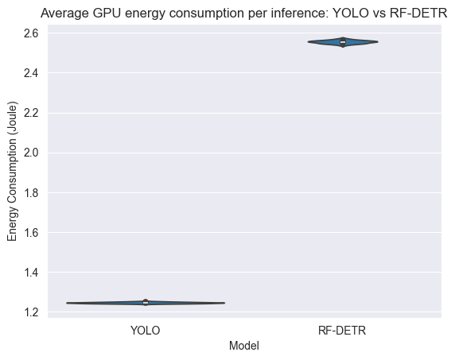
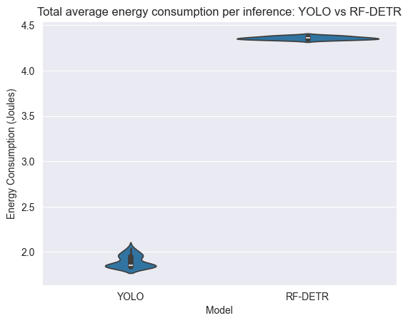
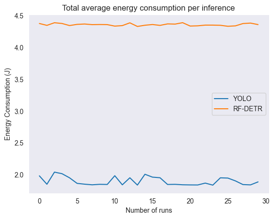
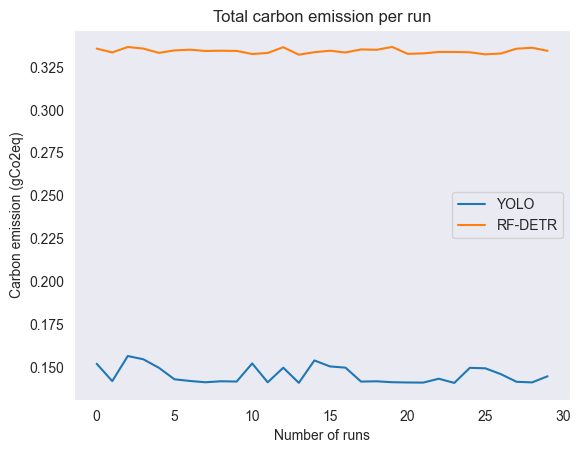

# Introduction

Object detection using computer vision AI models is becoming increasingly common in modern technologies, including autonomous vehicles, medical imaging systems, warehouse robotics, and traffic monitoring. Continuous improvements to these models have led to higher detection accuracy and overall performance. However, these performance gains come with increased computational cost. Training and deploying large neural networks requires substantial energy resources, and as AI adoption scales across industries, understanding the energy implications of model design becomes increasingly important for developers, organizations, and sustainability-focused research.

In this study, we focus on two prominent object detection models that represent different architectural paradigms: YOLOv8 (You Only Look Once version 8) and RF-DETR (Roboflow Detection Transformer). These two models were chosen because they are widely used, represent distinct architectural approaches, and allow comparisons at similar model scales to isolate the effect of architecture on energy consumption.

YOLOv8 is an open-source computer vision model developed by Ultralytics introduced in early 2023. It is used for object detection tasks and image classification. The architecture consists of two major parts. The first part is the backbone, which consists of sequential convolutional layers that extract features from the input image. The second part is the head, which uses convolutional layers to estimate bounding boxes and class probabilities using the features extracted by the backbone.[^2] The model is available in multiple parameter sizes, ranging from Nano (3.2 million parameters) to Extra Large (68.2 million parameters).[^1] 

RF-DETR is an open-source computer vision model designed by Roboflow and introduced in 2025. Similar to the YOLOv8 model, the RF-DETR model has two main parts. The backbone uses DINOv2 pre-trained weights to extract features of the input image.[^4] DINOv2 is a pre-trained self-supervised visual model trained using a Vision Transformer.[^5] The second part is the head, which uses a set of learned query tokens that attend to the features from the backbone through a Transformer decoder. Each query predicts the location of an object, its class, and optionally a segmentation mask.[^4] The model is available in multiple parameter sizes, ranging from Nano (30.5 million parameters) to 2XL (126.9 million parameters).[^3]

In this study, energy consumption is measured using the same set of images to evaluate how different model architectures affect energy usage. Comparing RF-DETR and YOLOv8 at similar model sizes allows us to isolate the impact of architectural design on energy efficiency while keeping parameter counts roughly consistent. Energy usage is measured using EnergiBridge on the same hardware with identical software settings to ensure a fair comparison. We specifically focus on energy consumption during inference rather than training, because training typically occurs less frequently, while inference happens continuously once the model is deployed in real-world applications.

Based on the experimental setup, we pose the following research questions:
1. How does model architecture affect energy consumption in object detection under similar model sizes?
2. Is there a significant difference in energy consumption between CNN-based and transformer-based architectures during inference under identical conditions?

We hypothesize that RF-DETR and YOLOv8 will differ in energy consumption even when their model sizes are similar, due to differences in architectural design and computational patterns.

# Methodology
To understand how different computer vision architectures influence energy consumption we conducted an experiment comparing YOLOv8m[^6] (CNN-based) and RF-DETR[^7] Medium (transformer-based). For the experiment, we chose the medium size of both models to represent a mid-range design within each architecture family. The models differ slightly in parameter count (25.9M vs 33.7M), but this is expected as their architectural design is different and thus we treat it as part of the comparison. 

Both models are evaluated on the same set of images drawn from the COCO val2017[^8] dataset, a very popular benchmark in object detection research. This dataset contains 5,000 images but we decided to run our experiment on a randomly selected subset, choosing 500 images for warmup purposes and 1500 for energy measurements due to the limited resources and timeframe of the project. We used the same 1500 images and in the same order for both models to guarantee that each model processed the exact same workload under the same conditions. 

Before running any measurements, the pretrained weights for both models were downloaded to ensure that the energy measurements would not be influenced.

### Experiment Setup
All experiments were conducted on the same hardware and software environment to avoid confounding effects related to system configuration. 

#### Hardware and Software Specifications:
- **CPU:** Intel(R) Core(TM) i7-10750H CPU @ 2.60GHz
- **GPU:** NVIDIA Quadro T1000 Max-Q, 4GB VRAM (TDP 35W)
- **Memory:** 16GB RAM
- **Operating System**: Ubuntu 24.04.4
- **NVIDIA Driver:** 580.126.09 - CUDA 13.0

We measured energy consumption using Energibridge [^9]. Energibridge is an energy profiler that collects CPU and GPU energy usage data during program execution.

Before running the experiment, we had to minimize any confounding factors that could influence the energy measurements. For this we followed the "Zen mode" [^10] strategy. We closed any applications or unnecessary background services that were running and made sure to turn off all notifications. Additionally, we disconnected all external hardware and turned off the wifi. Moreover, we froze our settings [^10] by disabling automatic brightness adjustment, idle dimming and setting the brightness to the lowest end. 
We kept the machine plugged into an external power source throughout the experiment to avoid power fluctuations. Lastly, we performed all experiments at a stable temperature of 23.5℃.

### Experiment Procedure
To avoid cold-start effects, we warmed up both the CPU and GPU for 5min each. For warming up the CPU we repeatedly ran a Fibonacci sequence and for warming up the GPU we ran the two models on the warmup dataset.

During the experiment, both YOLOv8m and RF-DETR Medium processed images one at a time rather than in batches. This decision was made to avoid computational costs across multiple images and to allow precise measurements of energy consumption and execution time per-image. 

We executed the experiment using a fixed sequence of inference  runs. We generated a shuffled list of 60 runs in advance, consisting of 30 executions of YOLOv8m and 30 executions of RF-DETR Medium to distribute the bias more evenly across the two executions. Before each execution run, the system was put to sleep for 30 seconds to prevent tail energy consumption from previous measurements. We chose a sleep of 30 seconds since each energy test for each model was less than 3min. For each interference run, energy was measured using EnergiBridge. Once the measurements were complete, the results were saved to a CSV file for later analysis.

### Replication Package  
A replication package can be found [here](https://github.com/riritz/Sustainable_SE). 

# Results
Before results could be extracted from the experiment, we had to perform pre-processing and data analysis. This involved converting GPU power measurements to energy consumption and calculating instant energy consumption from the monotonic CPU measurements. We decided to focus the data analysis on the following:

1. **Averaged GPU energy consumption per inference:** As the GPU handles a majority of the work, we focus on its energy usage per inference.
2. **Total averaged energy consumption per inference (including the CPU's energy usage):** Once the CPU energy consumption is added, we can analyze the stability of the models per image inference. This metric might be helpful to developers that want to run the model for one image at a time.
3. **Total energy consumption per run:** This enables us to review the overall impact of running the model on the complete dataset, which gives an approximation for using the model in practice.

First, we use violin and box plots to give a glimpse of the experiment's data distribution. As can be seen in Figure 1, the averaged GPU energy consumption per inference seems to be normally distributed. This is expected since the GPU is dedicated to model inference without lots of other interfering processes. Note that YOLOv8 seems to be more consistent in its energy consumption than RF-DETR, and that majority energy seems to be consumed by the GPU. On the other hand, for the total (i.e., GPU and CPU combined) energy per inference, the CPU has introduced non-normality into the combined energy consumption (see Figure 2). We suspect the CPU energy measurements being non-normal due to possible interferences like the operating system activity, or CPU inactivity while waiting for the GPU.

|  |  |
| :---: | :---: |
| Figure 1: Violin-box plot of GPU average energy consumption per inference | Figure 2: Violin-box plot of total average energy consumption per inference |

Since not all measurements are normally distributed, different statistical tests are performed based on the Shapiro-Wilk normality test.

Since the GPU energy consumption was found to be normally distributed, Welch's T-test was used as statistical significance test and effect size analysis was done using the mean difference, percentage change, and Cohen's d statistic. Welch's T-test found a significant p-value of 1.065e-84, meaning we can confidently reject the null hypothesis of YOLOv8 and RF-DETR having the same mean GPU energy consumption per inference. A mean difference of 1.31J was found, which corresponds to RF-DETR using 105.30% (2.05 times) more energy per inference than YOLOv8. Finally, the Cohen's d statistic resulted in an extremely high value of 321.53, which is thought to be caused due to the remarkably low variance between runs.

When we look at both the averaged total energy per inference and the total energy consumption per run, different statistical tests were used because of non-normality. The Mann-Whitney U test was used for statistical significance and resulted in 0 for both cases, showing that there was zero overlap in energy consumption between RF-DETR and YOLOv8. In turn, the Common Language Effect Size (CLES) was 0 as well, meaning measurements from YOLOv8 had 0% chance of being higher than for RF-DETR. Lastly, through the median difference, we found that YOLOv8 consumed 2.5J less energy than RF-DETR per inference and around 3757J less energy overall, which both correspond to a **57.45 reduction**.

When plotting the total energy consumption per inference and per run (see Figures 3 and 4), we can visualize both the lack of overlap between the measurements and the double energy consumption of RF-DETR.

|  |  |
| :---: | :---: |
|Figure 3: Graph of total average energy consumption per inference|Figure 4: Graph of total energy consumption per run |

Finally, we appreciated having an indication of the carbon emission that corresponds to using each model, to highlight the environmental impact caused by these energy differences. To this end, we used $C = E * CI$, where _C_ is the carbon emission in gCo2eq, _E_ is the energy in kWh, and _CI_ is the carbon intensity in gCo2eq/kWh. We obtained a carbon intensity value of 184 gCo2eq/kWh for the Netherlands at 6 feb 2026, 11:45 CET from Electricity Maps.[^11] Eventually, this resulted in the carbon emission values in Figure 5. Note that using RF-DETR would have resulted in more than double the carbon emission, in comparison to YOLOv8. 

<figure>
  
  <figcaption>Figure 5: Graph of carbon emission per run.</figcaption>
</figure>

# Discussion

The results show a significant difference in energy consumption between the two models, YOLOv8m and RF-DETR Medium. This supports our hypothesis as stated in the introduction: *We hypothesize that RF-DETR and YOLOv8 will differ in energy consumption even when their model sizes are similar, due to differences in architectural design and computational patterns*. Although the models have a relatively similar number of parameters, the transformer-based model RF-DETR consumes approximately twice the total energy per inference than the CNN-based model YOLOv8. Most of the observed increase in energy consumption for RF-DETR is attributable to GPU usage, reflecting the computational intensity of the self-attention layers. Although CPU differences are smaller, they are consistent, suggesting that the transformer architecture imposes a higher computational load across the system. This suggests that parameter count alone is not a reliable predictor of energy efficiency. Instead, architectural design appears to be a key factor influencing computational cost and energy usage.

As mentioned in the introduction, both models share a similar high-level structure, composed of a backbone for feature extraction and a head for bounding box estimation or segmentation. However, they differ in how they process features. Convolutional neural networks, such as the backbone in YOLOv8, operate by applying localized filters across small spatial regions of an image. These filters are reused across the entire image, reducing the total number of computations required while effectively capturing spatial features. In contrast, transformer-based architectures, such as RF-DETR, rely on self-attention mechanisms to model relationships between features. Instead of focusing only on local regions, attention layers compute interactions between all tokens in the input representation. This allows the model to capture global dependencies but increases computational complexity. Self-attention involves large matrix multiplications and frequent data movement between memory and processing units.[^12] This difference in architecture could explain why the YOLO model has a lower energy consumption than the RF-DETR model.

Other notable observations from the results are the low variance between experimental runs and the low p-value. The consistency of the measurements suggests that external influences, such as background processes, were effectively minimized. This strengthens the validity of the results and indicates that the observed energy differences are attributable to the models’ architectures rather than to environmental noise or measurement instability.

From a broader perspective, these findings have implications for sustainable AI deployment. In many real-world applications, object detection models operate continuously. Even modest differences in energy consumption per inference can accumulate significantly when scaled to thousands or millions of predictions. Therefore, architectural choices are not only technical decisions but also sustainability decisions. Selecting a more energy-efficient model can reduce operational costs and environmental impact, particularly in large-scale or long-term deployments. Model comparisons in both the literature and industry often prioritize accuracy and speed as the primary performance indicators. While these metrics are essential, energy consumption represents an additional and practically significant consideration, especially as AI systems become more widely deployed.

Several limitations should be considered when interpreting these findings. First, the experiments were conducted on a single hardware configuration with a mid-range GPU. Different hardware, particularly modern GPUs optimized for transformer workloads, could affect energy consumption patterns and potentially reduce the observed gap between CNN- and transformer-based models. Second, due to time and resource constraints, only the medium-sized variants of each architecture were evaluated. While the parameter counts are relatively similar, energy efficiency may scale differently across model sizes. Smaller or larger models could show different trends. Lastly, the carbon emission estimates should be interpreted as illustrative and context-dependent rather than universally generalizable.

Future work should address these limitations to provide a more comprehensive understanding of the energy implications of different architectures. Experiments across multiple hardware platforms, including GPUs optimized for attention mechanisms, would clarify whether the observed energy differences generalize across environments. Evaluating multiple model sizes, from Nano to Extra Large variants, would help determine how energy efficiency scales within each architecture type. 

# Conclusion

Our study compares the energy consumption of two object detection models during inference: the CNN-based YOLOv8m and the transformer-based RF-DETR Medium, under otherwise identical conditions. Our results show that the different model architectures do indeed have a significant difference in energy consumption. RF-DETR Medium consumed both twice as much GPU and total energy per inference than YOLOv8m, which supports our hypothesis that the differing architectures and computational patterns result in significantly different energy consumption levels (which remained consistent across multiple runs), and that parameter count alone does not determine energy efficiency. In particular, we point to the use of self-attention layers in transformer architectures as playing a major role in determining energy consumption. Since object detection systems often run continuously or in real-time when implemented for real-world applications, even moderate inference energy differences can accumulate and result in significant operational and environmental consequences. The substantial energy gap observed in this study highlights the importance of considering and benchmarking energy efficiency alongside other evaluation metrics like accuracy and latency, and the need for increased awareness that architectural decisions do not only represent purely technical trade-offs, but also sustainability considerations.

# References
[^1]: Ultralytics. (n.d.). YOLOv8 models documentation. Retrieved February 22, 2026, from https://docs.ultralytics.com/models/yolov8/

[^2]: Sohan, M., Sai Ram, T., Rami Reddy, C.V. (2024). A Review on YOLOv8 and Its Advancements. In: Jacob, I.J., Piramuthu, S., Falkowski-Gilski, P. (eds) Data Intelligence and Cognitive Informatics. ICDICI 2023. Algorithms for Intelligent Systems. Springer, Singapore. https://doi.org/10.1007/978-981-99-7962-2_39

[^3]: Roboflow. (n.d.). rf-detr [Computer software]. GitHub. Retrieved February 22, 2026, from https://github.com/roboflow/rf-detr

[^4]: Isaac Robinson, P. Robicheaux, M. Popov, Deva Ramanan, & N. Peri. (2026). RF-DETR: Neural architecture search for real-time detection transformers. arXiv. https://arxiv.org/abs/2511.09554

[^5]: Maxime Oquab, T. Darcet, T. Moutakanni, H. Vo, M. Szafraniec, V. Khalidov, P. Fernandez, D. Haziza, F. Massa, A. El-Nouby, M. Assran, N. Ballas, W. Galuba, R. Howes, P.-Y. Huang, S.-W. Li, I. Misra, M. Rabbat, V. Sharma, G. Synnaeve, H. Xu, H. Jégou, J. Mairal, P. Labatut, A. Joulin, & P. Bojanowski. (2024). DINOv2: Learning robust visual features without supervision. arXiv. https://arxiv.org/abs/2304.07193

[^6]: Jocher, G., Chaurasia, A., & Qiu, J. (2023). Ultralytics YOLOv8 (Version 8.0.0) [Computer software]. GitHub. https://github.com/ultralytics/ultralytics

[^7]: Robinson, I., Robicheaux, P., Popov, M., Ramanan, D., & Peri, N. (2025). RF-DETR: Neural architecture search for real-time detection transformers. arXiv. https://arxiv.org/abs/2511.09554

[^8]: Lin, T.-Y., Maire, M., Belongie, S. J., Bourdev, L. D., Girshick, R. B., Hays, J., Perona, P., Ramanan, D., Dollár, P., & Zitnick, C. L. (2014). Microsoft COCO: Common objects in context. CoRR, abs/1405.0312. http://arxiv.org/abs/1405.0312

[^9]: Durieux, T. (n.d.). EnergiBridge [Computer software]. GitHub. https://github.com/tdurieux/EnergiBridge

[^10]: Cruz, L. (2021). Green software engineering done right: A scientific guide to set up energy efficiency experiments [Blog post]. https://luiscruz.github.io/2021/10/10/scientific-guide.html

[^11]: Interactive App, Electricity Maps. (2025). Electricitymaps.com. https://app.electricitymaps.com/map/live/fifteen_minutes

[^12]: Moutik, O., Sekkat, H., Tigani, S., Chehri, A., Saadane, R., Tchakoucht, T. A., & Paul, A. (2023). Convolutional Neural Networks or Vision Transformers: Who Will Win the Race for Action Recognitions in Visual Data? Sensors, 23(2), 734. https://doi.org/10.3390/s23020734