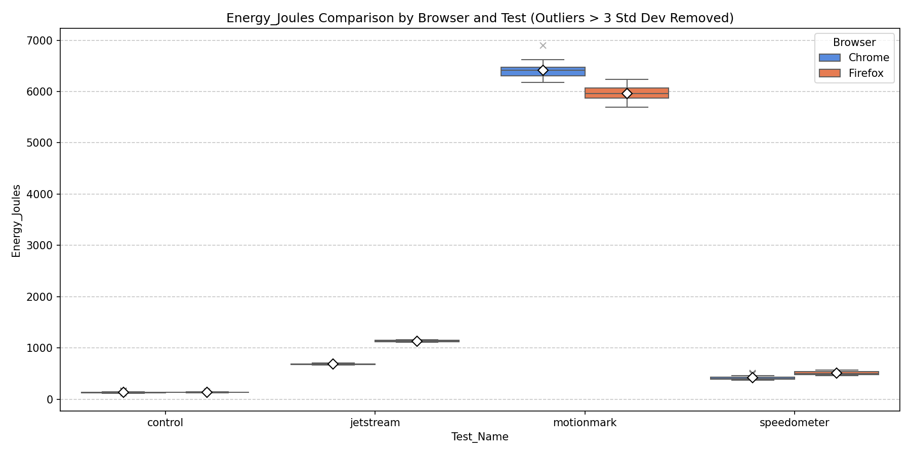
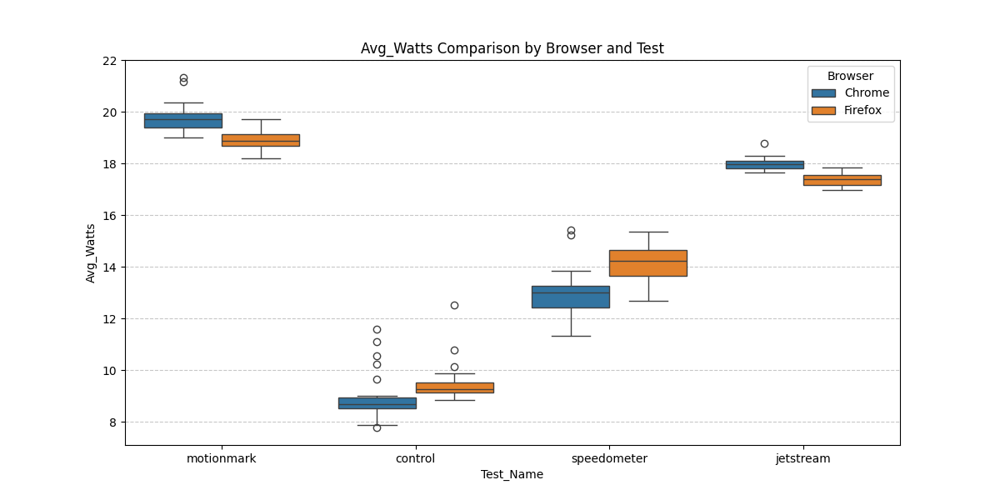
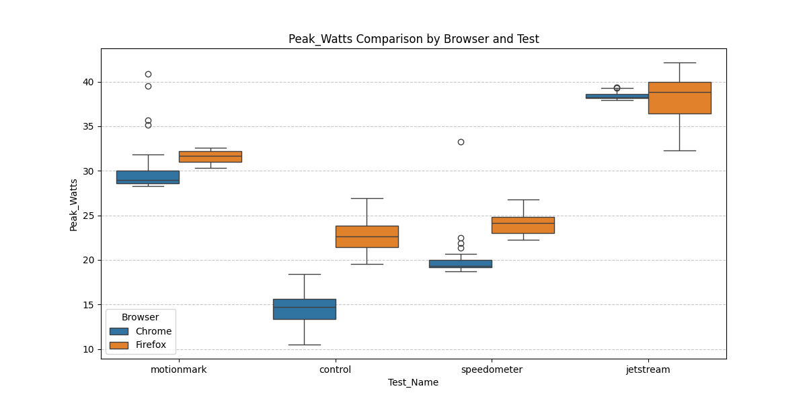
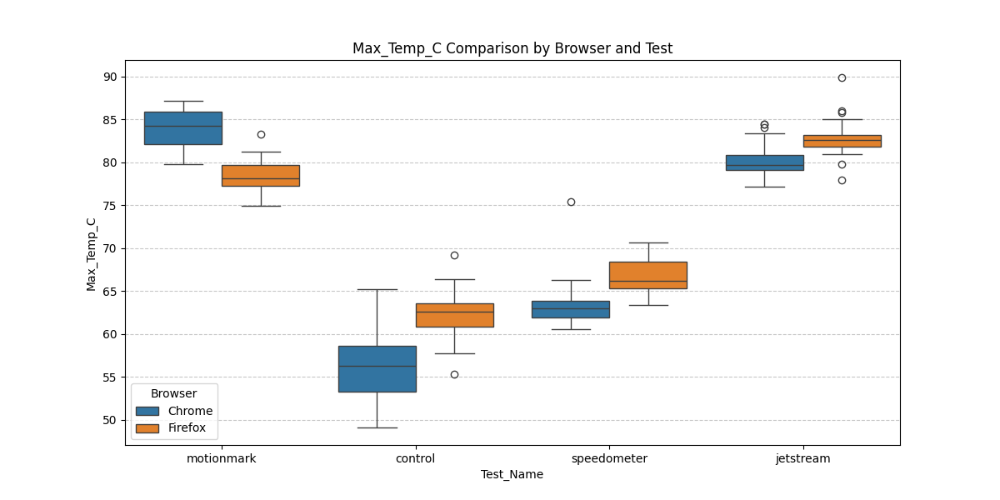
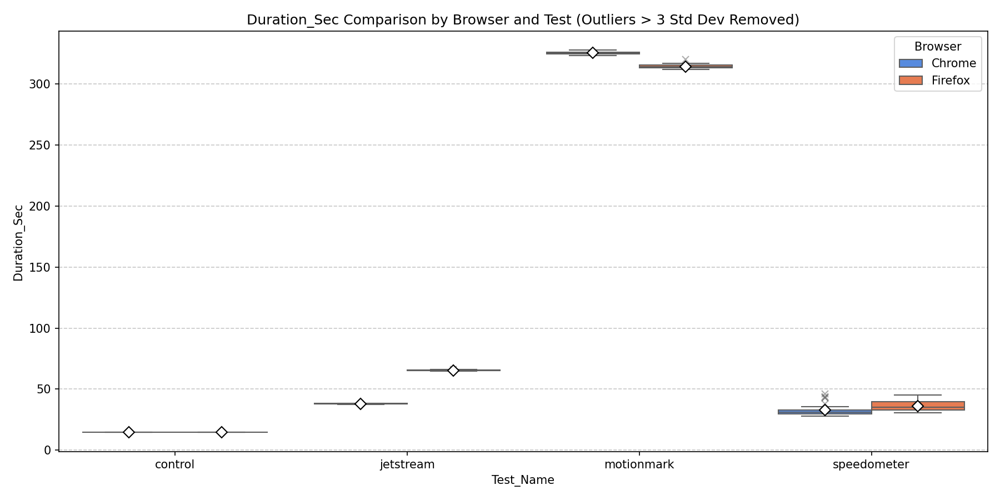
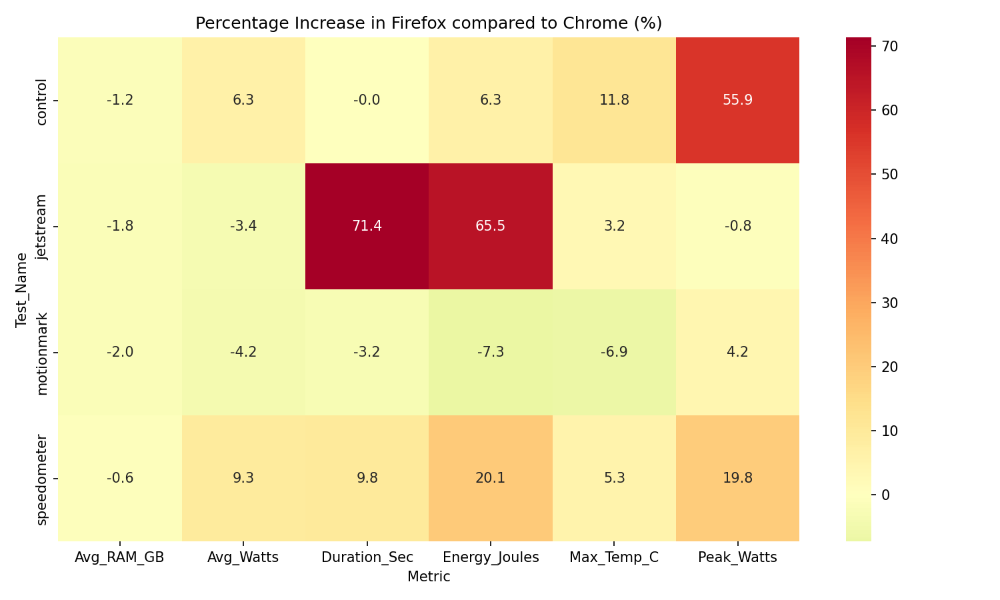
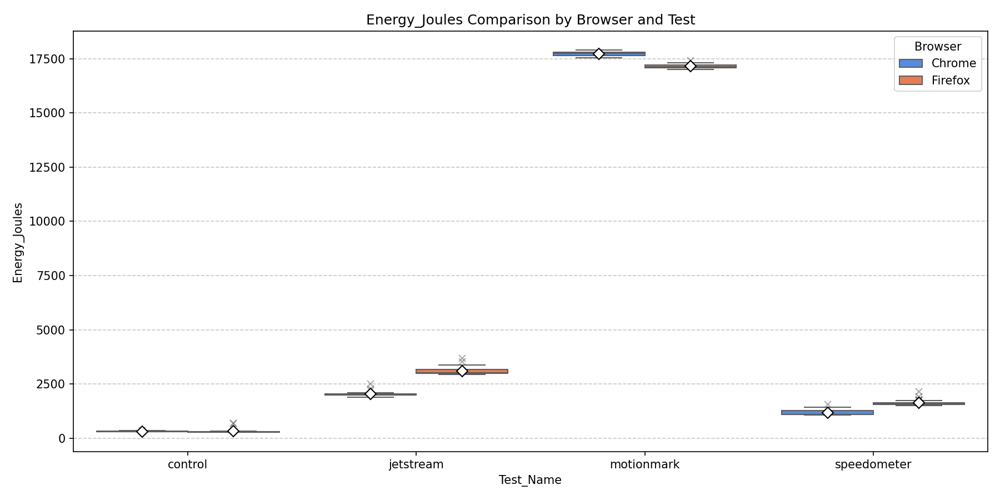
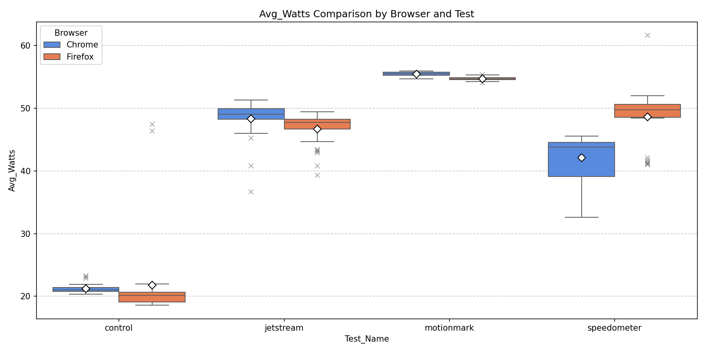
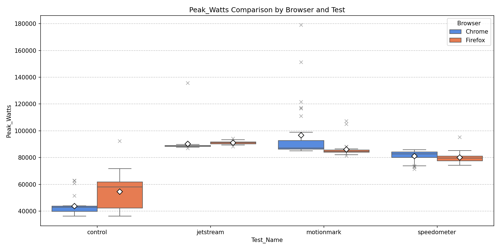
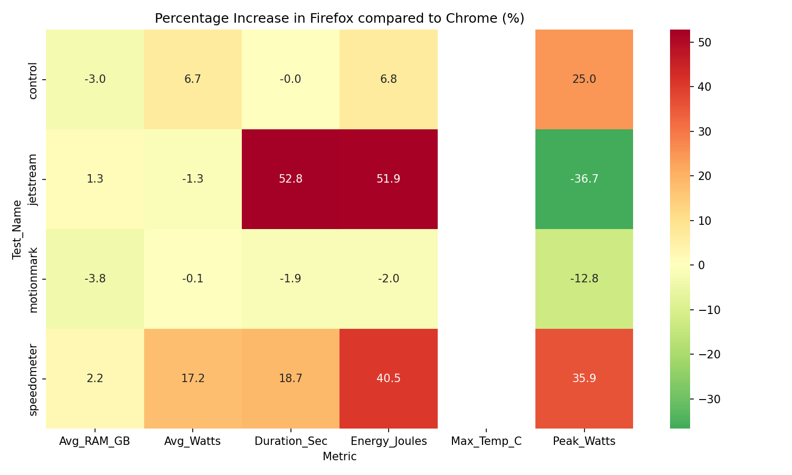

### **Introduction**

Web browsers are among the most widely used software applications today, yet we know surprisingly little about how much energy they actually consume. The ICT sector accounts for roughly 5% of global energy consumption, and browsers sit at the center of that since they run on nearly every device and handle everything from simple pages to complex web applications. Despite this, most energy estimates for software still rely on "constant-power" models that assume hardware draws the same wattage no matter what task is running. These models tend to overestimate actual usage and miss the differences between browser engines and operating systems.

This matters to several groups. IT managers need accurate per-application energy data to report carbon footprints, web developers want to know whether their framework choices affect battery life, and policy makers are starting to set efficiency standards for software, thus needing real measurements to base those on. Finally, for everyday users, the difference between browsers can mean the difference between a laptop lasting a full day or needing a charge by lunch.

To get concrete numbers, we use **EnergiBridge**, a cross-platform tool that measures power draw on Windows, Linux, and macOS. We run three standardized BrowserBench benchmarks — **MotionMark** (graphics), **Speedometer** (interactivity), and **JetStream 2** (computation) — on both Google Chrome and Firefox, and compare their energy consumption, power draw, temperature, and execution time across operating systems.

---

### **macOS**

The macOS testing phase involved 30 measurement rounds and 5 warmup rounds per benchmark. Warmup rounds ensured hardware temperatures were stabilized and background processes settled, eliminating "tail energy" artifacts that could skew results. Brightness was set to 50% for all tests (auto-brightness disabled) refresh rate was set to 60Hz, with screen saver, auto-lock and display-sleep disabled. The order of the actual test rounds was randomized to prevent systematic bias from ordering effects, and a 30-second cooldown period was enforced between consecutive runs to allow the CPU to return to a stable thermal state.

#### **Comparative Results Summary**

The table below presents the metrics collected across the three BrowserBench benchmarks. Positive difference values indicate Firefox consumed or scored higher, whereas negative values indicate Chrome did. Cohen's D quantifies practical significance, while the Mann-Whitney U and T-Test p-values establish statistical significance (p < 0.05).

| Test Category | Metric | Chrome Mean | Firefox Mean | Diff (%) | Cohen's D | Mann-Whitney p | T-Test p |
| --- | --- | --- | --- | --- | --- | --- | --- |
| **MotionMark** | Energy (J) | 6429.62 | 5962.65 | −7.26% | 2.878 | 4.98e-11 | 4.78e-16 |
| | Avg Watts | 19.75 | 18.93 | −4.18% | 1.781 | 2.83e-08 | 4.37e-09 |
| | Peak Watts | 30.30 | 31.58 | +4.25% | −0.547 | 2.00e-05 | 0.038 |
| | Max Temp (°C) | 84.02 | 78.25 | −6.86% | 2.864 | 2.37e-10 | 5.78e-16 |
| | Avg RAM (GB) | 19.90 | 19.50 | −2.02% | 0.681 | 1.61e-06 | 0.011 |
| | Duration (s) | 325.52 | 315.05 | −3.22% | 3.819 | 5.57e-10 | 2.43e-21 |
| **Speedometer** | Energy (J) | 424.20 | 509.53 | +20.12% | −2.057 | 8.35e-08 | 6.98e-11 |
| | Avg Watts | 12.96 | 14.17 | +9.29% | −1.502 | 7.60e-07 | 2.74e-07 |
| | Peak Watts | 20.14 | 24.12 | +19.78% | −1.923 | 8.89e-10 | 5.15e-10 |
| | Max Temp (°C) | 63.38 | 66.74 | +5.29% | −1.449 | 4.82e-08 | 5.90e-07 |
| | Avg RAM (GB) | 19.83 | 19.71 | −0.62% | 0.232 | 9.21e-05 | 0.372 |
| | Duration (s) | 32.91 | 36.13 | +9.77% | −0.725 | 2.13e-04 | 0.007 |
| **JetStream 2** | Energy (J) | 685.64 | 1134.40 | +65.45% | −33.882 | 3.02e-11 | 1.87e-73 |
| | Avg Watts | 17.99 | 17.37 | −3.44% | 2.629 | 1.21e-10 | 1.59e-14 |
| | Peak Watts | 38.41 | 38.10 | −0.80% | 0.172 | 0.464 | 0.508 |
| | Max Temp (°C) | 80.24 | 82.77 | +3.15% | −1.266 | 1.75e-05 | 7.95e-06 |
| | Avg RAM (GB) | 20.09 | 19.74 | −1.76% | 1.025 | 1.20e-08 | 2.02e-04 |
| | Duration (s) | 38.10 | 65.29 | +71.35% | −69.757 | 3.02e-11 | 1.30e-91 |

#### **Visualizations**

In JetStream 2, Firefox consumed 65% more total energy than Chrome, whereas in MotionMark Firefox uses about 7% less energy.

Average wattage is similar between browsers for most benchmarks, with the exception of Speedometer where Firefox draws consistently higher average power, which lines up with its longer execution time.

Peak wattage is similar in JetStream 2, but Firefox shows higher spikes in Speedometer and MotionMark, pointing to more intensive short-burst GPU or CPU usage during those workloads.

During MotionMark, Firefox keeps the machine about 6°C cooler, but it runs hotter in JetStream 2 and Speedometer. The lower temperature in MotionMark is likely related to Firefox's compositing pipeline being more efficient for graphics-heavy tasks.

Chrome completes JetStream 2 in almost half the time Firefox needs, due to V8's compilation strategy. MotionMark durations are close, though Chrome runs slightly longer.

The heatmap summarizes the relative differences across all metrics. Red cells indicate where Firefox is less efficient (computation), while cooler tones show where it has the advantage (graphics).

#### **Analysis**

The results show a workload-dependent trade-off between Blink (Chrome) and Gecko (Firefox). Chrome's V8 JavaScript engine uses a multi-tier compilation pipeline built for high throughput. In JetStream 2, this approach lets Chrome finish 71% faster, so the CPU returns to idle sooner and total energy consumption ends up 65% lower, even though average wattage is similar.

Firefox excels in graphics-intensive work. During MotionMark it consumed 7.26% less energy and kept the CPU about 6°C cooler than Chrome. This is a result of Firefox's integration with macOS Core Animation. Instead of redrawing the entire screen on every frame, Firefox uses the native layer system (CALayers) to update only the parts that changed, and it shares texture memory directly with the GPU through IOSurfaces rather than copying pixel data back and forth.

Memory consumption was similar between browsers across all benchmarks, with differences staying below 2%. Neither engine has a clear RAM-efficiency advantage on macOS.

In summary, browser choice on macOS should be workload-driven. Firefox is the better option for visually intensive browsing where thermal management matters, while Chrome is preferable for computation-heavy tasks and interactive responsiveness.

---

### **Windows**

The Windows experiments followed the same structure as macOS: 5 warmup rounds and 30 measured rounds per benchmark. Warmup runs were used to stabilize CPU frequency scaling, thermal conditions, and background OS activity. All unnecessary background applications were closed, and system updates, indexing, and power-saving features were disabled where possible to reduce noise.

Unlike macOS, Windows relies on the RAPL (Running Average Power Limit) interface exposed via a kernel driver (used by EnergiBridge). This introduces slightly higher variability due to OS-level scheduling and driver interaction, which is reflected in some of the observed outliers.

#### **Comparative Results Summary**

The table below presents the metrics collected across the three BrowserBench benchmarks and the control run. Positive difference values indicate Firefox consumed/scored higher than Chrome, whereas negative values indicate Chrome did. Cohen's D captures practical significance, while Mann–Whitney U and independent t-test p-values indicate statistical significance (p < 0.05).

| Test Category | Metric | Chrome Mean | Firefox Mean | Diff (%) | Cohen's D | Mann-Whitney p | T-Test p |
| --- | --- | --- | --- | --- | --- | --- | --- |
| **MotionMark** | Energy (J) | 17721.30 | 17360.92 | -2.03% | 0.448 | 5.57e-10 | 0.0881 |
|  | Avg Watts | 55.44 | 55.37 | -0.12% | 0.026 | 1.85e-08 | 0.92 |
|  | Peak Watts | 100520.44 | 87626.17 | -12.83% | 0.577 | 5.09e-06 | 0.0293 |
|  | Max Temp (°C) | 0.00 | 0.00 | — | 0.000 | 1 | — |
|  | Avg RAM (GB) | 9.46 | 9.10 | -3.76% | 3.944 | 1.83e-17 | 4.56e-43 |
|  | Duration (s) | 319.67 | 313.51 | -1.93% | 2.111 | 1.83e-17 | 1.33e-26 |
| **Speedometer** | Energy (J) | 1232.26 | 1720.69 | +39.64% | -4.934 | 1.83e-17 | 1.69e-40 |
|  | Avg Watts | 42.19 | 49.22 | +16.65% | -1.982 | 9.76e-16 | 2.97e-25 |
|  | Peak Watts | 79562.26 | 81280.72 | +2.16% | -0.183 | 0.00537 | 0.441 |
|  | Max Temp (°C) | 0.00 | 0.00 | — | 0.000 | 1 | — |
|  | Avg RAM (GB) | 9.52 | 9.73 | +2.16% | -1.212 | 1.91e-07 | 0.000221 |
|  | Duration (s) | 29.62 | 35.31 | +19.20% | -2.573 | 2.1e-11 | 7.02e-25 |
| **JetStream 2** | Energy (J) | 2031.55 | 3088.30 | +52.01% | -14.983 | 1.83e-17 | 8.72e-63 |
|  | Avg Watts | 49.17 | 48.55 | -1.25% | 0.303 | 0.00106 | 0.231 |
|  | Peak Watts | 114189.52 | 95827.65 | -16.08% | 0.711 | 4.99e-05 | 0.00577 |
|  | Max Temp (°C) | 0.00 | 0.00 | — | 0.000 | 1 | — |
|  | Avg RAM (GB) | 9.66 | 9.78 | +1.26% | -0.445 | 4.04e-05 | 0.0434 |
|  | Duration (s) | 41.31 | 63.18 | +52.93% | -14.847 | 1.83e-17 | 2.63e-61 |
| **Control** | Energy (J) | 319.01 | 340.64 | +6.78% | -0.401 | 3.35e-06 | 0.112 |
|  | Avg Watts | 21.23 | 20.95 | -1.32% | 0.457 | 3.61e-11 | 0.0681 |
|  | Peak Watts | 43337.59 | 46271.79 | +6.77% | -0.316 | 0.00133 | 0.211 |
|  | Max Temp (°C) | 0.00 | 0.00 | — | 0.000 | 1 | — |
|  | Avg RAM (GB) | 9.17 | 8.83 | -3.01% | 1.944 | 5.68e-13 | 5.18e-24 |
|  | Duration (s) | 15.03 | 15.03 | -0.00% | 0.000 | 1 | — |
> Note: Temperature values are zero due to lack of reliable sensor exposure via EnergiBridge on Windows.
#### **Visualizations**

Energy usage is consistently higher for Firefox in JetStream and Speedometer. MotionMark is the only benchmark where Firefox slightly outperforms Chrome.

Average wattage is similar across browsers, but Firefox tends to draw slightly more power in Speedometer and control scenarios, indicating less efficient idle and interactive behavior.

Peak power shows high variance, especially in JetStream and Speedometer. Chrome exhibits larger spikes in some runs, likely due to aggressive boosting behavior from the Windows scheduler.

Firefox takes significantly longer in JetStream and Speedometer, which directly explains its higher total energy consumption despite similar average power.

The heatmap highlights a clear pattern: Firefox is less efficient in computation-heavy and interactive workloads, while differences in graphics workloads are minimal.

Temperature data is effectively zero due to lack of reliable temperature reporting via EnergiBridge on this setup, so no conclusions can be drawn here.

#### **Analysis**

The Windows results reveal a consistent pattern, that **execution time dominates energy consumption**.

In JetStream, Firefox takes over 50% longer to complete the benchmark, leading to a corresponding ~52% increase in total energy usage. This is the same in the macOS findings but is even more pronounced on Windows. Chrome’s V8 engine benefits from aggressive just-in-time (JIT) optimizations and faster execution pipelines, allowing it to complete workloads quickly and return the CPU to idle sooner.

Speedometer shows a similar trend. Firefox consumes ~40% more energy and runs ~19% longer, while also drawing slightly higher average power. This suggests that Firefox’s event handling and DOM update pipeline is less optimized under Windows, possibly due to differences in how Gecko interacts with the Windows graphics and scheduling subsystems.

MotionMark, however, shows different results. Firefox is slightly more efficient (~2% less energy), indicating that its graphics pipeline performs competitively on Windows. Unlike macOS, where Firefox benefits from Core Animation, Windows relies on DirectX, and both browsers appear similarly optimized for this stack.

The control benchmark reveals that Firefox consumes more power even when idle (~6–7% higher). This suggests higher background activity or less aggressive power-saving behavior compared to Chrome.

Peak power behavior is more erratic on Windows, with large outliers in both browsers. This is likely due to:
- Windows CPU boosting (Turbo Boost / Precision Boost)
- OS scheduler variability
- Driver-level measurement noise from RAPL

In summary, on Windows, Chrome is consistently more energy-efficient for computation-heavy tasks (JetStream), and Interactive workloads (Speedometer). Firefox only shows a marginal advantage in graphics workloads (MotionMark). The results indicate that Windows amplifies performance differences between browser engines. Chrome’s faster execution leads to significantly lower energy consumption, making it the more energy-efficient choice for most workloads on this platform.

---

### **Linux**
To be added

---

### **Conclusion**
To be added

**Our Code**

Our code for the replication of the experiments is available at [https://github.com/SSE-Group-5/browser-bench](https://github.com/SSE-Group-5/browser-bench)