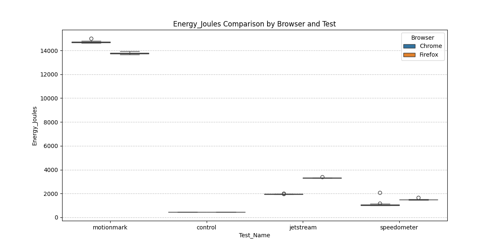
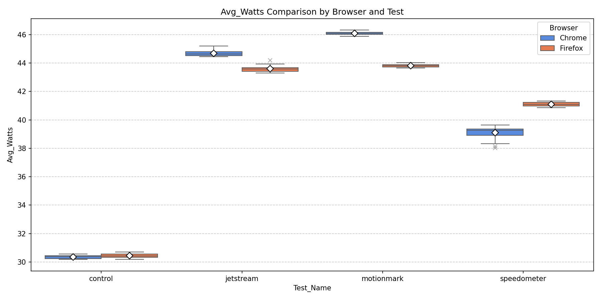
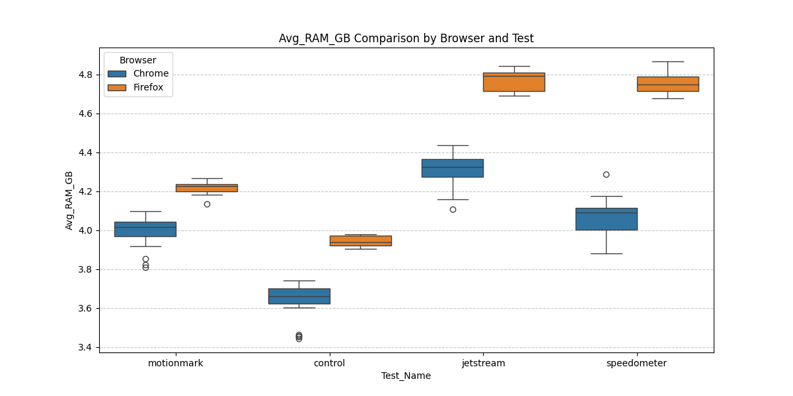
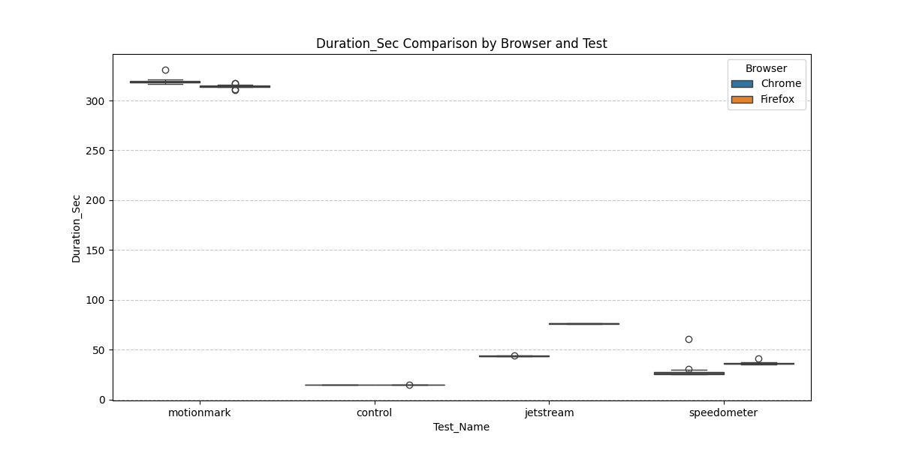
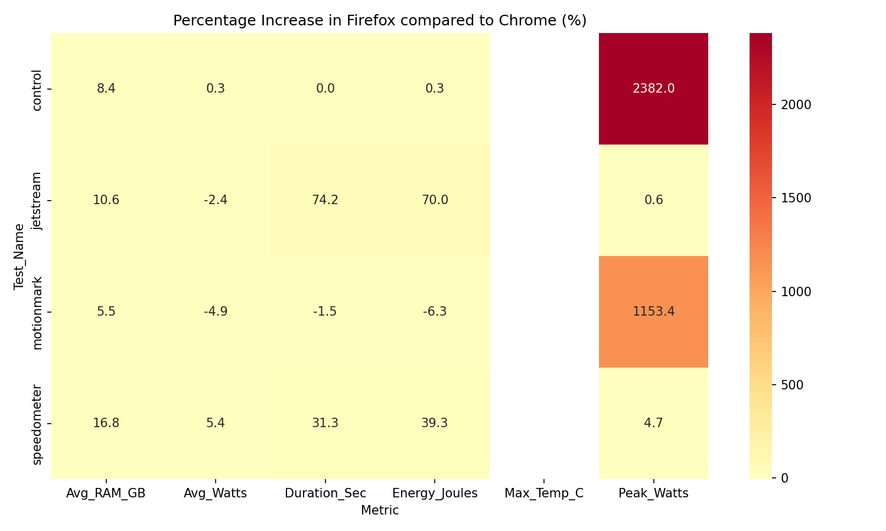
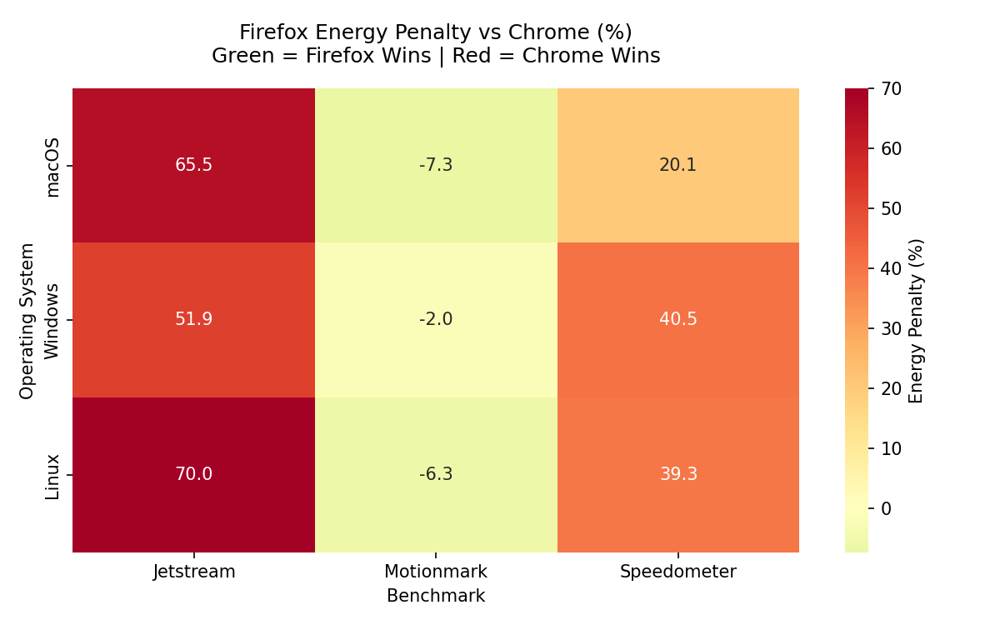
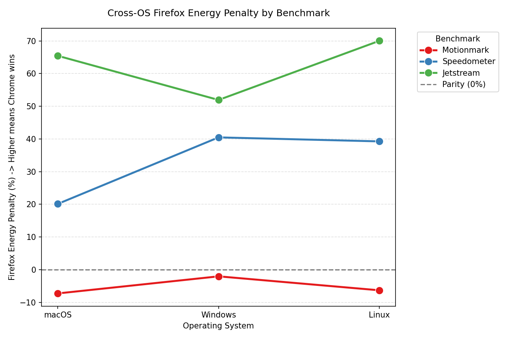

## 1. Introduction

The ICT sector accounts for roughly 5% of global energy consumption, and browsers sit at the centre of it, running on virtually every device, handling everything from static pages to complex web applications. Yet most energy estimates for software still rely on "constant-power" models that miss the differences between browser engines and operating systems.

This matters concretely: IT managers need per-application energy data for carbon reporting, developers want to know whether framework choices affect battery life, and for everyday users the difference between browsers can mean a full day of battery versus an early charge. This study provides real measurements across platforms to answer a simple question: **does your choice of browser and OS meaningfully affect energy consumption, and by how much?**

We use **EnergiBridge** to measure power draw on Windows, Linux, and macOS, running three BrowserBench benchmarks: **MotionMark** (graphics), **Speedometer** (interactivity), and **JetStream 2** (computation), on Google Chrome and Firefox.

---

## 2. Experimental Setup

### 2.1 Benchmarks

| Benchmark | What it stresses | Relevance |
|---|---|---|
| **MotionMark** | GPU compositing, 2D/WebGL rendering | Media-heavy and graphical browsing |
| **Speedometer** | DOM updates, event handling | Typical productivity web apps |
| **JetStream 2** | JavaScript/WASM JIT compilation | Computation-heavy pages |

### 2.2 Methodology

Each browser–benchmark combination ran for **30 measured rounds** preceded by **5 warmup rounds** (to stabilise CPU temperature and background OS activity), with a **30-second cooldown** between runs. Run order was randomised to prevent ordering bias. Display settings were fixed across all platforms: 50% brightness, 60 Hz, screen saver and auto-lock disabled. Unnecessary background processes were closed; on Windows, system updates and power-saving features were additionally disabled.

Energy was measured via **RAPL** on all platforms (kernel driver on Windows, MSR on Linux, IOKit on macOS).

### 2.3 Metrics and Statistics

Metrics collected per run: Energy (J), Avg/Peak Watts, Max Temperature (°C), Avg RAM (GB), Duration (s). Significance was assessed with Mann-Whitney U and independent t-tests (p < 0.05); practical effect size via Cohen's D.

### 2.4 Limitations

- **No temperature data on Windows or Linux**. EnergiBridge does not reliably expose CPU sensors on these platforms.
- **Windows RAPL variability**. Kernel driver measurement introduces noise visible in peak power outliers.
- **Different hardware per OS**. Absolute cross-OS energy comparisons are indicative only. The primary unit of analysis is the within-OS browser-to-browser comparison.

---

## 3. Results by Operating System

### 3.1 macOS

The table below presents the metrics collected across the three BrowserBench benchmarks. Positive difference values indicate Firefox consumed or scored higher, whereas negative values indicate Chrome did. Cohen's D quantifies practical significance, while the Mann-Whitney U and T-Test p-values establish statistical significance (p < 0.05).

| Test Category | Metric | Chrome Mean | Firefox Mean | Diff (%) | Cohen's D | Mann-Whitney p | T-Test p |
| --- | --- | --- | --- | --- | --- | --- | --- |
| **MotionMark** | Energy (J) | 6429.62 | 5962.65 | −7.26% | 2.878 | 4.98e-11 | 4.78e-16 |
| | Avg Watts | 19.75 | 18.93 | −4.18% | 1.781 | 2.83e-08 | 4.37e-09 |
| | Peak Watts | 30.30 | 31.58 | +4.25% | −0.547 | 2.00e-05 | 0.038 |
| | Max Temp (°C) | 84.02 | 78.25 | −6.86% | 2.864 | 2.37e-10 | 5.78e-16 |
| | Avg RAM (GB) | 19.90 | 19.50 | −2.02% | 0.681 | 1.61e-06 | 0.011 |
| | Duration (s) | 325.52 | 315.05 | −3.22% | 3.819 | 5.57e-10 | 2.43e-21 |
| **Speedometer** | Energy (J) | 424.20 | 509.53 | +20.12% | −2.057 | 8.35e-08 | 6.98e-11 |
| | Avg Watts | 12.96 | 14.17 | +9.29% | −1.502 | 7.60e-07 | 2.74e-07 |
| | Peak Watts | 20.14 | 24.12 | +19.78% | −1.923 | 8.89e-10 | 5.15e-10 |
| | Max Temp (°C) | 63.38 | 66.74 | +5.29% | −1.449 | 4.82e-08 | 5.90e-07 |
| | Avg RAM (GB) | 19.83 | 19.71 | −0.62% | 0.232 | 9.21e-05 | 0.372 |
| | Duration (s) | 32.91 | 36.13 | +9.77% | −0.725 | 2.13e-04 | 0.007 |
| **JetStream 2** | Energy (J) | 685.64 | 1134.40 | +65.45% | −33.882 | 3.02e-11 | 1.87e-73 |
| | Avg Watts | 17.99 | 17.37 | −3.44% | 2.629 | 1.21e-10 | 1.59e-14 |
| | Peak Watts | 38.41 | 38.10 | −0.80% | 0.172 | 0.464 | 0.508 |
| | Max Temp (°C) | 80.24 | 82.77 | +3.15% | −1.266 | 1.75e-05 | 7.95e-06 |
| | Avg RAM (GB) | 20.09 | 19.74 | −1.76% | 1.025 | 1.20e-08 | 2.02e-04 |
| | Duration (s) | 38.10 | 65.29 | +71.35% | −69.757 | 3.02e-11 | 1.30e-91 |

In JetStream 2, Firefox consumed 65% more total energy than Chrome, whereas in MotionMark Firefox uses about 7% less energy.

Average wattage is similar between browsers for most benchmarks, with the exception of Speedometer where Firefox draws consistently higher average power, which lines up with its longer execution time.

Peak wattage is similar in JetStream 2, but Firefox shows higher spikes in Speedometer and MotionMark, pointing to more intensive short-burst GPU or CPU usage during those workloads.

During MotionMark, Firefox keeps the machine about 6°C cooler, but it runs hotter in JetStream 2 and Speedometer. The lower temperature in MotionMark is likely related to Firefox's compositing pipeline being more efficient for graphics-heavy tasks.

Chrome completes JetStream 2 in almost half the time Firefox needs, due to V8's compilation strategy. MotionMark durations are close, though Chrome runs slightly longer.

The heatmap summarizes the relative differences across all metrics. Red cells indicate where Firefox is less efficient (computation), while cooler tones show where it has the advantage (graphics).

#### **Analysis**

Chrome's V8 finishes JetStream 2 **71% faster**, keeping the CPU idle longer and cutting total energy by 65%, despite near-identical average wattage. The story flips for graphics: Firefox uses Core Animation (CALayers + IOSurfaces) to perform partial redraws instead of full-screen refreshes, which saves 7.3% energy and keeps the CPU **6°C cooler** during MotionMark. RAM usage is within 2% across all benchmarks, no clear advantage for either engine.

**Bottom line:** on macOS, browser choice is workload-dependent. Chrome for computation; Firefox for graphics.

---

### 3.2 Windows

> Temperature data unavailable, no reliable sensor exposure via EnergiBridge on this setup

| Test Category | Metric | Chrome Mean | Firefox Mean | Diff (%) | Cohen's D | Mann-Whitney p | T-Test p |
| --- | --- | --- | --- | --- | --- | --- | --- |
| **MotionMark** | Energy (J) | 17721.30 | 17360.92 | -2.03% | 0.448 | 5.57e-10 | 0.0881 |
|  | Avg Watts | 55.44 | 55.37 | -0.12% | 0.026 | 1.85e-08 | 0.92 |
|  | Peak Watts | 100520.44 | 87626.17 | -12.83% | 0.577 | 5.09e-06 | 0.0293 |
|  | Max Temp (°C) | 0.00 | 0.00 | - | 0.000 | 1 | - |
|  | Avg RAM (GB) | 9.46 | 9.10 | -3.76% | 3.944 | 1.83e-17 | 4.56e-43 |
|  | Duration (s) | 319.67 | 313.51 | -1.93% | 2.111 | 1.83e-17 | 1.33e-26 |
| **Speedometer** | Energy (J) | 1232.26 | 1720.69 | +39.64% | -4.934 | 1.83e-17 | 1.69e-40 |
|  | Avg Watts | 42.19 | 49.22 | +16.65% | -1.982 | 9.76e-16 | 2.97e-25 |
|  | Peak Watts | 79562.26 | 81280.72 | +2.16% | -0.183 | 0.00537 | 0.441 |
|  | Max Temp (°C) | 0.00 | 0.00 | - | 0.000 | 1 | - |
|  | Avg RAM (GB) | 9.52 | 9.73 | +2.16% | -1.212 | 1.91e-07 | 0.000221 |
|  | Duration (s) | 29.62 | 35.31 | +19.20% | -2.573 | 2.1e-11 | 7.02e-25 |
| **JetStream 2** | Energy (J) | 2031.55 | 3088.30 | +52.01% | -14.983 | 1.83e-17 | 8.72e-63 |
|  | Avg Watts | 49.17 | 48.55 | -1.25% | 0.303 | 0.00106 | 0.231 |
|  | Peak Watts | 114189.52 | 95827.65 | -16.08% | 0.711 | 4.99e-05 | 0.00577 |
|  | Max Temp (°C) | 0.00 | 0.00 | - | 0.000 | 1 | - |
|  | Avg RAM (GB) | 9.66 | 9.78 | +1.26% | -0.445 | 4.04e-05 | 0.0434 |
|  | Duration (s) | 41.31 | 63.18 | +52.93% | -14.847 | 1.83e-17 | 2.63e-61 |
| **Control** | Energy (J) | 319.01 | 340.64 | +6.78% | -0.401 | 3.35e-06 | 0.112 |
|  | Avg Watts | 21.23 | 20.95 | -1.32% | 0.457 | 3.61e-11 | 0.0681 |
|  | Peak Watts | 43337.59 | 46271.79 | +6.77% | -0.316 | 0.00133 | 0.211 |
|  | Max Temp (°C) | 0.00 | 0.00 | - | 0.000 | 1 | - |
|  | Avg RAM (GB) | 9.17 | 8.83 | -3.01% | 1.944 | 5.68e-13 | 5.18e-24 |
|  | Duration (s) | 15.03 | 15.03 | -0.00% | 0.000 | 1 | - |

Energy usage is consistently higher for Firefox in JetStream and Speedometer. MotionMark is the only benchmark where Firefox slightly outperforms Chrome.

Average wattage is similar across browsers, but Firefox tends to draw slightly more power in Speedometer and control scenarios, indicating less efficient idle and interactive behavior.

Peak power shows high variance, especially in JetStream and Speedometer. Chrome exhibits larger spikes in some runs, likely due to aggressive boosting behavior from the Windows scheduler.

Firefox takes significantly longer in JetStream and Speedometer, which directly explains its higher total energy consumption despite similar average power.

The heatmap highlights a clear pattern: Firefox is less efficient in computation-heavy and interactive workloads, while differences in graphics workloads are minimal.

Temperature data is effectively zero due to lack of reliable temperature reporting via EnergiBridge on this setup, so no conclusions can be drawn here.

#### **Analysis**

The pattern from macOS holds, but is more pronounced. JetStream 2 and Speedometer both show Firefox consuming 40–52% more energy, again tracking execution time almost exactly. Firefox also uses ~7% more energy at idle (control run), suggesting less aggressive power-saving behaviour. MotionMark is effectively a draw (−2%), as DirectX largely levels Gecko and Blink's graphics implementations. Peak power variance is high on Windows, driven by CPU boost behaviour and RAPL driver noise rather than browser differences.

**Bottom line:** Chrome is the clear choice on Windows for all workloads except pure graphics, where the difference is negligible.

---

### 3.3 Linux

> Temperature data unavailable - CPU MSRs did not expose temperature readings on this setup.

| Test Category | Metric | Chrome Mean | Firefox Mean | Diff (%) | Cohen's D | Mann-Whitney p | T-Test p |
| --- | --- | --- | --- | --- | --- | --- | --- |
| **MotionMark** | Energy (J) | 14700.94 | 13774.30 | −6.30% | 11.884 | 8.91e-07 | 1.26e-29 |
| | Avg Watts | 46.06 | 43.82 | −4.86% | 13.786 | 8.91e-07 | 5.97e-32 |
| | Peak Watts | 58088.51 | 728089.43 | +1153.41% | −0.530 | 0.0156 | 0.135 |
| | Max Temp (°C) | 0.0 | 0.0 | - | - | - | - |
| | Avg RAM (GB) | 3.995 | 4.215 | +5.49% | −3.311 | 8.91e-07 | 1.61e-11 |
| | Duration (s) | 319.19 | 314.33 | −1.52% | 1.969 | 4.03e-06 | 1.73e-06 |
| **Speedometer** | Energy (J) | 1076.34 | 1498.89 | +39.26% | −2.508 | 7.05e-07 | 1.10e-09 |
| | Avg Watts | 38.93 | 41.04 | +5.43% | −2.620 | 7.68e-08 | 3.70e-10 |
| | Peak Watts | 52010.72 | 54434.22 | +4.66% | −2.324 | 1.05e-06 | 6.87e-09 |
| | Max Temp (°C) | 0.0 | 0.0 | - | - | - | - |
| | Avg RAM (GB) | 4.071 | 4.756 | +16.84% | −8.486 | 7.68e-08 | 4.10e-27 |
| | Duration (s) | 27.81 | 36.53 | +31.34% | −1.602 | 7.05e-07 | 1.03e-05 |
| **JetStream 2** | Energy (J) | 1953.25 | 3321.23 | +70.04% | −81.037 | 1.46e-06 | 2.86e-61 |
| | Avg Watts | 44.68 | 43.60 | −2.41% | 5.263 | 1.46e-06 | 2.03e-17 |
| | Peak Watts | 77252.55 | 77731.97 | +0.62% | −0.614 | 0.289 | 0.091 |
| | Max Temp (°C) | 0.0 | 0.0 | - | - | - | - |
| | Avg RAM (GB) | 4.313 | 4.769 | +10.56% | −6.449 | 1.46e-06 | 2.28e-20 |
| | Duration (s) | 43.72 | 76.17 | +74.23% | −190.692 | 1.46e-06 | 2.18e-75 |

Firefox consumed 70% more total energy than Chrome in JetStream 2, compared to only 6% less in MotionMark. The Speedometer gap is also significant, with Firefox using 39% more energy despite similar average power draw, which is a clear sign that execution time dominates the energy difference.

Chrome draws slightly less average power in MotionMark (4.86% less), while Firefox draws more in Speedometer (5.43% more) and JetStream 2 (slightly less, −2.41%). This reveals that the energy differences are not primarily driven by power spikes but by how long each browser takes to complete the work.

Firefox consistently uses more RAM across all benchmarks: 5.5% more in MotionMark, 16.8% more in Speedometer, and 10.6% more in JetStream 2. This suggests Firefox's memory model is less efficient on Linux, possibly due to differences in garbage collection tuning or heap fragmentation compared to macOS.

Chrome is significantly faster: 1.5% faster in MotionMark, 31% faster in Speedometer, and 74% faster in JetStream 2. These speed differences directly translate to energy savings, since the CPU can return to idle sooner when work completes faster.

The heatmap illustrates Chrome's advantage in computation-heavy workloads (deep red in JetStream) and Firefox's modest advantage in graphics (light color in MotionMark). Overall, Firefox tends to draw less power despite some usage spikes in RAM.

#### **Analysis**

Linux is where the gap is widest. Firefox's JetStream 2 penalty grows to **70% more energy** (vs 65% on macOS, 52% on Windows), and it is 74% slower. Linux's simpler scheduler and lower-level hardware access appear to expose V8's JIT advantages most directly. Firefox's RAM usage is also notably worse here - 5–17% above Chrome - suggesting its garbage collector and dependency on system libraries (glibc, GTK, fontconfig) is least well-tuned for this platform. Chrome bundles its dependencies, ensuring consistent behaviour regardless of the system configuration. Firefox's 6.3% graphics advantage in MotionMark is its only win, and comparable to its macOS advantage.

**Bottom line:** Chrome is strongly preferred on Linux across all workload types.

---

## 4. Cross-Platform Analysis

### 4.1 The Energy Gap at a Glance

### 4.2 Time Is the Culprit

Average power draw between the two browsers is similar in almost every condition - the energy difference comes down to **how long Firefox runs**. The table below makes this stark:

| Benchmark | macOS: FF slower | Windows: FF slower | Linux: FF slower |
|---|---|---|---|
| MotionMark | −3.2% | −1.9% | −1.5% |
| Speedometer | +9.8% | +19.2% | +31.3% |
| JetStream 2 | +71.4% | +52.9% | +74.2% |

Chrome's V8 uses a multi-tier JIT pipeline optimised for throughput. SpiderMonkey is faster to start up but generates slower-executing code for sustained workloads. The CPU returns to idle sooner with Chrome, and total energy follows almost linearly.

### 4.3 What Is Consistent

- Chrome wins computation and interactivity **on every platform**.
- Firefox wins graphics **on every platform** -- modestly, but consistently.
- The energy gap tracks execution time, not power draw.

### 4.4 What Changes by OS

- **Linux amplifies Chrome's advantage the most**. JetStream 2 penalty is worst here (70%), Speedometer gap is widest (31% slower).
- **macOS narrows the interactivity gap**. Firefox is only 10% slower in Speedometer on macOS vs 19–31% on other platforms, likely due to macOS's more balanced I/O subsystem.
- **Windows nearly eliminates Firefox's graphics edge**. DirectX equalises the compositing implementations (2% vs 6–7% on Unix).
- **Firefox's RAM overhead is platform-dependent**. Negligible on macOS (<2%), moderate on Windows (1–4%), largest on Linux (5–17%).

---

## 5. Recommendations

**End users:**
- Default to Chrome on Linux and Windows, the energy savings are substantial and apply to most workloads.
- On macOS, both browsers are viable; pick based on use case (graphics → Firefox, everything else → Chrome).

**IT and organisations:**
- Mixed-use fleets on Windows or Linux should standardise on Chrome. Firefox's 6–7% graphics advantage cannot offset a 40–70% computation penalty at scale.

**Browser developers:**
- Mozilla's most impactful target is SpiderMonkey JIT performance on Linux, where the execution gap is largest. Firefox's Linux RAM overhead (5–17%) also warrants dedicated attention.
- Google could close the graphics gap by adopting partial-redraw compositing strategies comparable to Firefox's Core Animation approach.

---

## 6. Environmental Impact of This Study

### 6.1 Estimating Experimental Energy

Total energy consumed by the experiments can be calculated directly from collected data:

$$E_{\text{total}} = \sum_{\text{OS, browser, benchmark}} \bar{E}_{\text{run}} \times N_{\text{runs}}$$

where $N_{\text{runs}} = 35$ (30 measured + 5 warmup). Equivalently from power and time:

$$E_{\text{J}} = \bar{P}_{\text{W}} \times t_{\text{s}}$$

### 6.2 CO₂ Footprint

Using the Netherlands grid carbon intensity of **0.273 kg CO₂/kWh**:

$$E_{\text{kWh}} = \frac{E_{\text{J}}}{3{,}600{,}000}$$

$$C\ [\text{g CO}_2] = \frac{\bar{P} \times t}{3{,}600{,}000} \times 273$$

| OS | Browser | Benchmark | $\bar{E}$ (J) | $E_{\text{total}}$ (J) | $E_{\text{kWh}}$ | CO₂ (g) |
|---|---|---|---|---|---|---|
| macOS | Chrome | MotionMark | 6429.62 | 225,036.70 | 0.062510 | 17.07 |
| macOS | Firefox | MotionMark | 5962.65 | 208,692.75 | 0.057970 | 15.83 |
| macOS | Chrome | Speedometer | 424.20 | 14,847.00 | 0.004124 | 1.13 |
| macOS | Firefox | Speedometer | 509.53 | 17,833.55 | 0.004954 | 1.35 |
| macOS | Chrome | JetStream 2 | 685.64 | 23,997.40 | 0.006666 | 1.82 |
| macOS | Firefox | JetStream 2 | 1134.40 | 39,704.00 | 0.011029 | 3.01 |
| Windows | Chrome | MotionMark | 17721.30 | 620,245.50 | 0.172290 | 47.04 |
| Windows | Firefox | MotionMark | 17360.92 | 607,632.20 | 0.168787 | 46.08 |
| Windows | Chrome | Speedometer | 1232.26 | 43,129.10 | 0.011980 | 3.27 |
| Windows | Firefox | Speedometer | 1720.69 | 60,224.15 | 0.016729 | 4.57 |
| Windows | Chrome | JetStream 2 | 2031.55 | 71,104.25 | 0.019751 | 5.39 |
| Windows | Firefox | JetStream 2 | 3088.30 | 108,090.50 | 0.030025 | 8.20 |
| Linux | Chrome | MotionMark | 14700.94 | 514,532.90 | 0.142926 | 39.02 |
| Linux | Firefox | MotionMark | 13774.30 | 482,100.50 | 0.133917 | 36.56 |
| Linux | Chrome | Speedometer | 1076.34 | 37,671.90 | 0.010464 | 2.86 |
| Linux | Firefox | Speedometer | 1498.89 | 52,461.15 | 0.014573 | 3.98 |
| Linux | Chrome | JetStream 2 | 1953.25 | 68,363.75 | 0.018990 | 5.18 |
| Linux | Firefox | JetStream 2 | 3321.23 | 116,243.05 | 0.032290 | 8.82 |
| **Total** | | | | **3,311,910.35** | **0.919975** | **251.15** |

The entire experimental study emitted approximately 251 g CO₂ — equivalent to driving a petrol car roughly 2.1 km, or about 7 hours of LED bulb usage.

---

## 7. Conclusion

Browser choice is a measurable sustainability lever. Across all three platforms, Chrome is more energy-efficient for computation and interactivity (the workloads that dominate real-world browsing) while Firefox holds a consistent but modest advantage in graphics. The OS amplifies or dampens these differences: Linux exposes the widest gap, macOS the narrowest. For large deployments, standardising on the right browser per platform is a zero-cost action with a real energy and CO₂ impact.

**Our Code**

Our code for the replication of the experiments is available at [https://github.com/SSE-Group-5/browser-bench](https://github.com/SSE-Group-5/browser-bench)

**References**
- [pyEnergiBridge](https://github.com/luiscruz/pyEnergiBridge)
