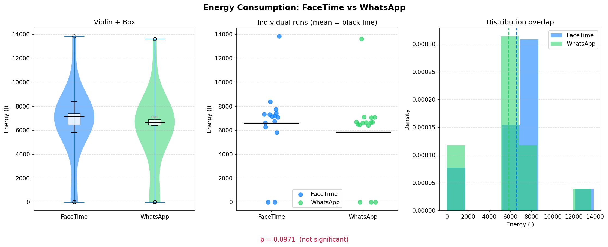
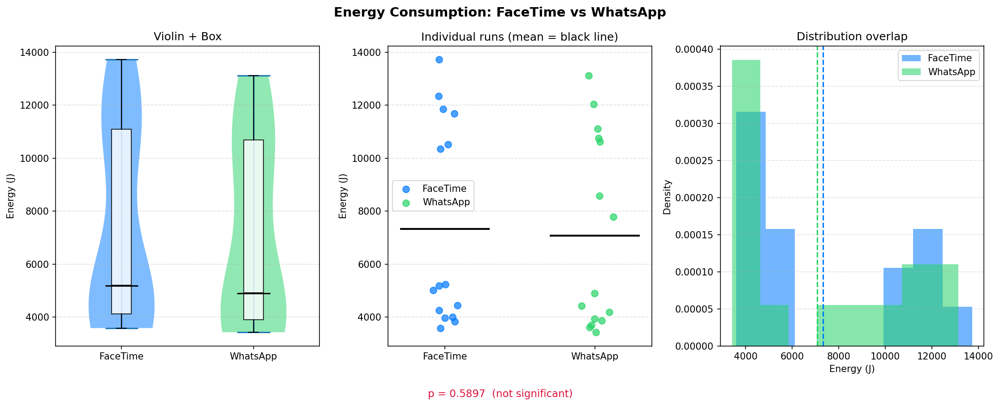

# Introduction
When thinking about energy consumption,  it is easy to picture data centers and industrial hardware. Software, by contrast, feels invisible. A running application leaves no obvious physical trace, which makes its environmental cost easy to overlook. Yet every piece of software relies on hardware resources such as CPU cycles, memory, networking, and display processing, all of which consume power. At scale, even small differences in software efficiency can translate into meaningful energy use.

This is especially relevant for communication software. Video calling applications have become a normal part of daily life, used for work, study, and personal communication. Although the energy cost of a single video call may seem negligible, repeated use across many devices and many users can make software efficiency an important consideration. Because of this, the design and implementation choices behind seemingly similar applications may have measurable consequences for energy consumption.
In this project, we investigate a simple question: does it matter which video-calling application you use? More specifically, we compare the energy consumption of Apple FaceTime and WhatsApp Video Calling during a standardised 20-minute video call on MacBook hardware. Both applications provide the same core functionality, real-time video communication, but they differ in how they are built and integrated into the operating system.

FaceTime is a native Apple application, developed specifically for Apple devices and tightly integrated with macOS. In contrast, WhatsApp Video Calling on desktop is provided through the WhatsApp desktop application, which is not as deeply integrated into Apple’s software ecosystem. This difference makes the comparison interesting from an energy-efficiency perspective: if native applications benefit from platform-specific optimisation, they may be able to deliver the same user-facing functionality while using less power.

Our hypothesis is therefore straightforward: because FaceTime is a native application optimised for Apple hardware and macOS, we expect it to consume less energy than WhatsApp Video Calling during an equivalent 20-minute call.
To test this hypothesis, we conducted a controlled experiment using repeated measurements on MacBook devices. By standardising the call duration, controlling for external variables, and repeating the experiment across multiple runs, we aim to determine whether the choice of video-calling application has a measurable effect on energy consumption.

---

# Experimental Setup
To compare the energy consumption of FaceTime and WhatsApp Video Calling, we designed a controlled experiment focused on repeated, standardised video-call sessions. Our goal was to measure the power usage of each application under comparable conditions while minimising interference from unrelated system activity. 

We used EnergiBridge, which is a cross-platform energy profiling tool, to collect power and energy measurements. EnergiBridge reads energy-related data from system-level hardware interfaces and makes it possible to record software energy consumption in a structured and reproducible way. In this project, it was used to measure the energy consumed by the MacBooks while each device was actively engaged in a video call. 

## Experimental Design

The experiment used two MacBooks. Instead of calling a separate receiving device, each MacBook participated in a video call with itself using the tested application. In other words, MacBook 1 called itself and MacBook 2 called itself, both for FaceTime and for WhatsApp Video Calling. This allowed us to create a consistent and repeatable test environment without relying on additional external devices. 


Each application was tested in the same scenario: a 20-minute one-to-one video call running on a single MacBook. We repeated this process 30 times for FaceTime and 30 times for WhatsApp Video Calling, resulting in a total of 60 experimental runs. 


To improve efficiency, the two MacBooks were used to conduct measurements in parallel. This approach allowed multiple runs to be completed in the same testing window, but it also introduced a possible hardware-related source of variation, since the two laptops were not identical measurement environments. We therefore acknowledge that device-specific differences may have influenced the results to some extent. 


## Controlled Conditions
To reduce measurement noise and improve consistency across runs, we followed a strict protocol before each experiment. The goal was to ensure that differences in recorded energy consumption were caused primarily by the video-calling application itself, rather than by unrelated background processes or changing hardware conditions. 

Before every run, we applied the following controls
All unnecessary applications were closed. 
Display brightness was fixed at a constant level.
The charger remained plugged in at all times.
Disconnected all external devices (USB drives, monitors).
Enforced a one-minute rest period between runs to let the hardware cool down.
The order in which the experiments were held, was randomised.
The camera view during each call was pointed at a white wall to keep the visual input as consistent as possible.
The microphone was muted to ensure no interruptions from the surrounding noises would affect the energy consumption.

These controls were intended to minimise variability caused by multitasking, thermal buildup and differences in camera scene complexity. In particular, keeping the camera pointed at the same plain background helped reduce fluctuations in image-processing workload across calls.

## Measurement Procedure
For each run the tested MacBook launched either FaceTime or WhatsApp and initiated a video call to itself. Once the call was established, the session was maintained for exactly 20 minutes. During this time, EnergiBridge recorded the relevant energy metrics on the MacBook. 

The procedure was repeated until 30 runs had been completed for each application. The resulting dataset therefore consists of repeated energy measurements for two comparable software conditions: 

1. FaceTime on MacOS
2. WhatsApp Video Calling on MacOS


## Hardware/Software Configurations

The experiments were conducted on MacBook hardware running the newest version of macOS (26.3). 

```
Laptop 1: 2024 Macbook pro, m4 chip, 24 gb ram
Laptop 2: 2020 Macbook pro, m1 chip, 16 gb ram 

EnergiBridge version: release v0.0.7
FaceTime version/IOS version: version 36, macOs: version 26.3
WhatsApp desktop version: version 26.8.21
```


# Results
As mentioned before, energy consumption during 20-minute video calls was analyzed separately for two devices. We decided on such an approach as it would allow us to check if the difference in hardware has an impact on the energy consumption. The graphical summaries for Device 1 and Device 2 are shown in Figure 1 and Figure 2 respectively. 

```Figure 1, FaceTime vs WhatsApp on Device 1```


```Figure 2, FaceTime vs WhatsApp on Device 2```


Device 1 

For Device 1, 15 runs were analyzed for each application, with no outliers removed. Figure 1 shows the results for FaceTime, in blue, and WhatsApp, in green. Looking at the Violin+Box a clear area of high density can be observed on both experiments with some runs having energy consumption levels beyond both lower and upper ends. The second graph might give us a more clear view to where the points outside of the high density area are, the points can be seen to not be fairly distributed. As one can observe its densities in the right-most graph.
On this device, FaceTime had a mean energy consumption of 6118.81J with standard deviation of 2554.77J and a median of 7076.37J. The observed values were ranging from 4.63 to 8385.00J. WhatsApp presented a mean of 7482.88J with standard deviation 4925.61J and median of 6606.92J. In this case, values were between  3.16J to 7101.88J. Although the Z-score did not conclude there were outliers (outlier removal |z| > 3.0), the range shows a strange result where some values seem to be too low. 

Shapiro-Wilk tests indicate that neither distribution satisfied the assumption of normality with p-score for FaceTime equal to 0.0001 and for WhatsApp: 0.0000. Consequently, a Mann-Whitney U test was performed. The median difference (WhatsApp - Facetime) was -469.45J, corresponding to -6.63% relative decrease. The common-language effect size was 0.729, suggesting a 72.9% probability that a randomly selected FaceTime run would consume more energy than a randomly selected WhatsApp run. 

Device 2

For Device 2, 15 runs were analyzed for each application, again with no outliers removed. As shown in Figure 2, both applications displayed substantial spread in energy consumption values. The Violin and Box plots (Figure 2 Violin + Box Plot) reveal wide distributions, and the individual data points in Figure 2 (Individual runs) demonstrate notable variability across trials. The histogram presented in Figure 2 (Distribution Overlap) similarly indicates overlapping density patterns. 
On this device, FaceTime had a mean energy consumption of 7740.24J with standard deviation of 4042.53J and a median of 5211.04J. The observed values were ranging from 3588.92J to 13845.04J. WhatsApp presented a mean of 7482.88J with standard deviation 3858.82J and median of 6341.53J. In this case, values were between 3430.82J to 13613.61J. Unlike on Device 1, the observed differences in central tendency were modest relative to the overall dispersion. 

Shapiro-Wilk tests indicate that neither distribution satisfied the assumption of normality with p-score for FaceTime equal to 0.0035 and for WhatsApp: 0.0107. Consequently, a Mann-Whitney U test was performed. The median difference (WhatsApp - Facetime) was 1130.48J, corresponding to 21.69% relative increase. The common-language effect size was 0.559, suggesting a 55.9% probability that a randomly selected WhatsApp run would consume more energy than a randomly selected FaceTime run. 

---

```Figure 3, FaceTime vs WhatsApp combined on both devices```


Combined results

In total we have analyzed 30 runs per application, with no outliers removed. The distributions for FaceTime and WhatsApp are shown in Figure 3, where substantial overlap can be observed across the violin plots, individual runs and histograms. Facetime showed a mean energy consumption of 6963.92J (SD = 3507.62J), while WhatsApp displayed a mean of 6453.57J (SD = 3554.86J). Shapiro-wilk tests indicated that both distributions satisfied the assumption of normality (FaceTime: p = 0.2229; WhatsApp: p = 0.1463). This allowed us to perform a parametric comparison using Welch’s t-test which revealed no statistically significant difference between applications (p = 0.5778). The mean difference (WhatsApp - FaceTime) was -510.35J, corresponding to a -7.33% lower average energy usage for WhatsApp. However, the effect size was negligible (Cohen’s d = 0.145), indicating that the observed difference was minimal compared to the spread of the data.

# Discussion

The aim of this experiment was to determine whether FaceTime and WhatsApp differ in their energy consumption during 20-minute video calls under controlled conditions. Across two independent devices, no statistically significant differences were observed between the applications. Although slight differences in mean and median energy consumption were observed across both devices, these differences were small compared to the substantial variability within each application. 

Importantly, neither device showed a statistically significant difference between the applications. However, the direction and magnitude of median differences varied between devices. On Device 1, WhatsApp showed lower median energy consumption than Facetime -6.63%,  whereas on Device 2 WhatsApp showed a higher median energy consumption than FaceTime (+21.69%), though still statistically non-significant. This suggests that device specific characteristics may influence the energy consumption more strongly than the choice of application itself. 

A notable finding across both devices was the substantial variability within each application. Standard deviations were large relative to the means, and the distribution showed wide ranges. This indicates that factors beyond the application likely contributed meaningfully to the energy consumption. Several potential influences may help explain the variability in the results.  First, background system processes may have affected the power usage. Although we closed unnecessary applications during testing, modern systems continuously run background services that cannot be fully disabled, and these processes could have influenced the measurements. 

The second factor is thermal regulation behaviour and hardware differences. We were using 2 macbooks where one of them had an M1 chip inside and the other M4 chip. Differences in the device age and processor architecture, energy management strategies, and hardware optimisation could also influence the energy usage. Newer chip designs are typically more energy-efficient and dynamically responsive to changing computational requirements, which could contribute to variation between devices. Additionally, during testing it was observed that successive and repetitive runs resulted in lower energy consumption. This may be related to system stabilisation effect, thermal equilibrium, or adaptive resource allocation mechanisms within the operating systems. 

Another factor to consider for newer Apple Macbooks, applicable to Device 1, is the Center Stage function. This feature uses machine learning to track the user's face, keeping it centered with the help of the built-in wide lens camera. While our experiments were conducted at a blank wall, this realistically would impact the energy consumption due to the continuous change of the user's background as well as running software. This feature is used by FaceTime by default, while tests on Device 1 showed WhatsApp did not utilise this feature.

Network conditions could also play a role in the energy consumption. Fluctuations in connection quality during video calls could lead to increased power usage as the system adjusts transmission strength or processing effort to maintain call stability. Additionally, visual input captured by the camera may have introduced variability. Although both laptops were positioned facing a white wall to standardise the visual scene, lighting conditions changed over the course of the experiment. As natural light decreased and artificial lighting was introduced, variations in brightness may have influenced image processing demands, thereby affecting energy consumption.

Despite efforts to control experimental conditions by limiting active applications to the video call software and the EnergiBridge measurement tool, complete isolation of system-level and environmental factors is not possible in practical settings. 

The lack of statistically significant differences, combined with effect size close to 0.5 in both devices, suggests that from a practical perspective, the two applications perform similarly in terms of energy consumption under the tested conditions. The common-language effect sizes indicated approximately equal probabilities that either application would consume more energy in a given run, reinforcing the conclusion that neither app consistently outperforms the other in energy efficiency. 

Several limitations should be acknowledged. First, the sample sizes were relatively modest, which may have limited the statistical power to detect small effects. Secondly, measurements were conducted under specific environmental and network conditions, which may limit generalizability. Thirdly, the experiment focused exclusively on 20-minute calls; different call durations may yield different results. Additionally, one extremely low value in Device 1 (4.68J) suggests the possibility of incomplete measurement, which could have influenced descriptive statistics despite not being classified as an outlier. 

Future research could extend this work by increasing the number of runs or standardizing network conditions. Furthermore, investigating energy consumption under different usage scenarios (e.g. varying video quality, more movement captured by the camera, more colours, microphone usage, screen brightness, or multitasking conditions) could provide a more comprehensive understanding of application-level energy efficiency. 

# Conclusion 

While the combined data shows us that there is no statistical significant difference between the energy consumption between FaceTime and WhatsApp. We still cannot draw any conclusion due to the data distribution when observed to each individual device. The two datasets had contradicting results, showing that there were variables unaccounted for. Many variables should be considered when giving this experiment another attempt as we have extensively discussed in our Discussion section.
