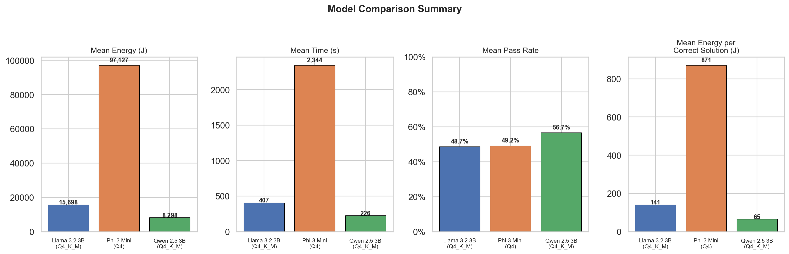
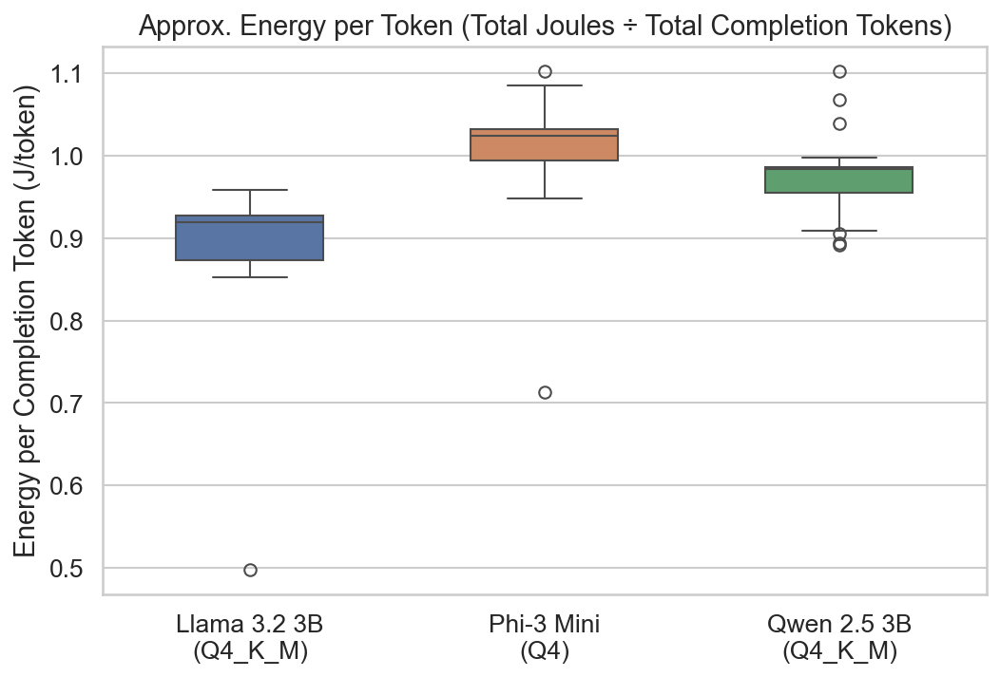
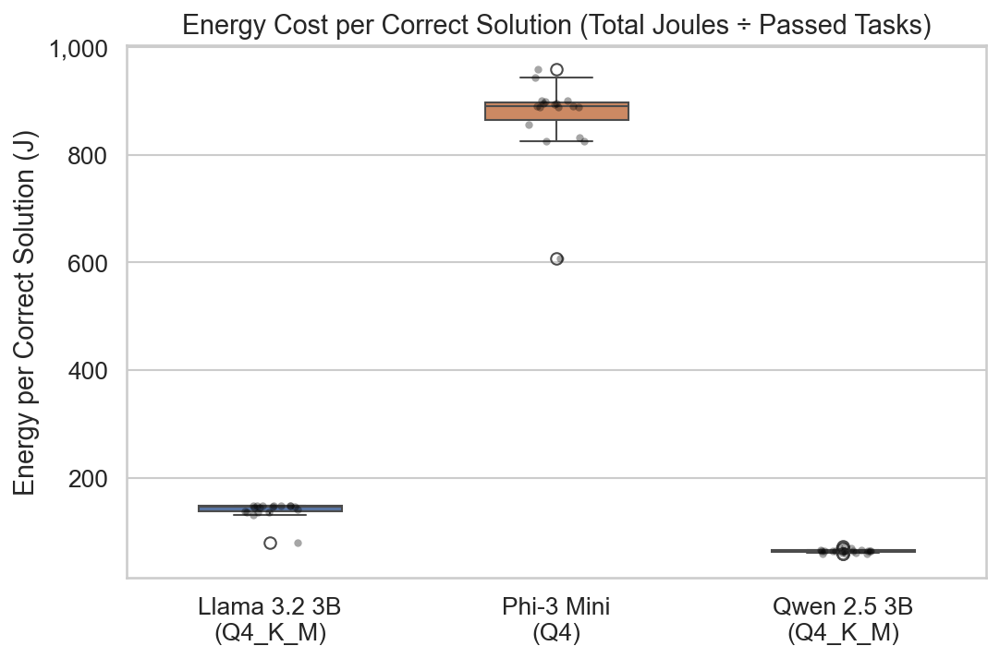
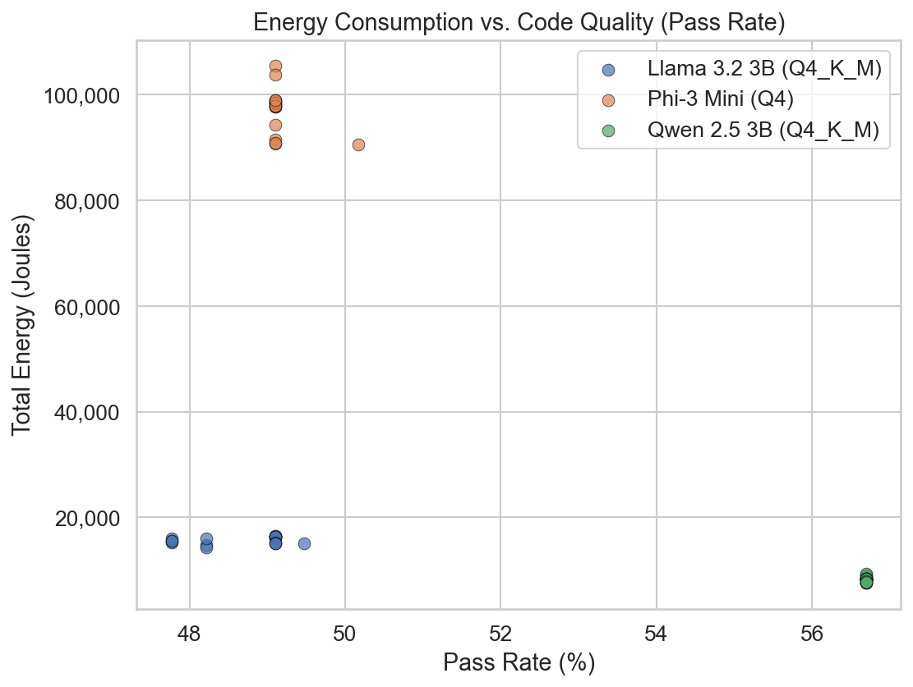

## Project Topic: Measuring the True Energy Cost of Correct LLM Inference

### Introduction
Large Language Models (LLMs) have become embedded in nearly every layer of modern software, from code assistants to customer-facing chatbots. Yet every inference call carries a hidden energy cost — one that scales with the billions of daily queries these models serve. According to the International Energy Agency, data-centre electricity demand is projected to more than double by 2030, with AI workloads as a leading driver [(IEA, 2024)](https://www.iea.org/reports/electricity-2024). While much attention has been paid to the enormous cost of training large models, inference — the phase where a model is actually used — accounts for the vast majority of a model's lifetime energy footprint. As Ji et al. note, "the electricity demand associated with inference, in contrast to that of training, has garnered relatively little attention, and suffers from a lack of standardized, formulaic approaches" [(Ji, 2025)](https://www.sciencedirect.com/science/article/pii/S1364032125008329). This matters because practitioners choosing between models rarely have energy data to guide them. Leaderboards rank accuracy; benchmarks report tokens-per-second; but almost none report Joules per correct answer. A model that scores 2% higher on a benchmark may cost 13× more energy per correct output — a trade-off invisible to anyone who only looks at accuracy tables. 

All three models in this study use **4-bit quantization**; a technique that reduces the numerical precision of weights and activations to make LLMs cheaper and faster to run on consumer hardware. By fixing the quantization level, we focus on a different question: given that all models are already quantized, **which architecture delivers the most correct answers per Joule?** Standard benchmarks do not answer this because they report energy or accuracy in isolation. This project bridges that gap by measuring **energy per correct solution** across three architecturally distinct ~3B parameter LLMs on a real coding benchmark. 

Research question: *Among architecturally distinct small LLMs all running at 4-bit quantization, how does the choice of model affect the energy cost of producing correct solutions?*

### Hypothesis
We hypothesize that models with higher pass rates will also consume more energy per correct solution, since achieving better task performance likely requires more computation per inference. In other words, we expect an energy–accuracy trade-off: the most accurate model will be the most expensive per correct answer.

### Methodology

#### **Models**
We select three general-purpose instruction-tuned models from distinct model families: 
- [Qwen 2.5](https://huggingface.co/Qwen/Qwen2.5-3B-Instruct-GGUF) - Q4_K_M quantization
- [Llama 3.2](https://huggingface.co/bartowski/Llama-3.2-3B-Instruct-GGUF) - Q4_K_M quantization
- [Ministral 3](https://huggingface.co/bartowski/mistralai_Ministral-3-3B-Instruct-2512-GGUF) - Q4 quantization 

All three are approximately 3 billion parameters and run in 4-bit GGUF format via [llama.cpp](https://github.com/ggml-org/llama.cpp).

These models represent architecturally distinct families from three different organizations, all released
within a similar timeframe. By fixing the parameter scale (~3B), task type (general instruction
following), and inference backend (llama.cpp), we isolate architectural differences as the primary
variable. We selected the best-available 4-bit GGUF file for each model: for Qwen 2.5 and Llama 3.2
this happened to be the newer Q4_K_M (K-quant mixed) format, while for Phi-3 Mini only the older
standard Q4 format was available. Because the quantization method was not controlled, it
constitutes a **confounding variable** (discussed further in Limitations & Future Work).

#### **Dataset**
We use the MBPP (Mostly Basic Python Problems) benchmark, specifically the sanitized MBPP+
variant, which provides cleaner unit tests than the original. MBPP consists of approximately 500
entry-level Python programming problems, each accompanied by a natural-language description and
unit tests enabling objective binary pass/fail assessment. We select a representative subset of 224
tasks to keep the total experiment runtime feasible on consumer hardware while maintaining
statistical validity.

MBPP is well-suited for this study because its unit tests provide an unambiguous pass/fail signal per
problem — the foundation of our energy-per-correct-solution metric. Unlike open-ended generation
tasks, coding benchmarks with automated tests allow correctness to be measured objectively and at
scale without human evaluation.

#### **Hardware**
Apple MacBook Pro (2021) with an M1 Pro chip and 16 GB of unified memory. All models run via llama.cpp with Metal acceleration enabled. Experiments run as root to allow [EnergiBridge](https://github.com/tdurieux/EnergiBridge) access to system energy counters via PowerMetrics on macOS.

#### **Experimental Setup**
Each model configuration is run for 20 trials of the full 224-task benchmark, yielding 20 × 224 =
4,480 inference measurements per model. We follow established best practices for energy
measurement experiments:

- Warm-up: One full iteration per model before recording, to stabilize caches and thermal state (~5–6 min).
- Cooldown: 2-minute idle period between consecutive trials to mitigate thermal carry-over.
- Fixed execution order: Models are run in the same order across all iterations (note: task order is not shuffled, see Limitations).
- Controlled environment: 
    - Internet and Bluetooth disabled. 
    - Code executed from the terminal (no IDE overhead)
    - Room temperature set to 19 °C; laptop not placed near heat sources
    - Laptop plugged into mains power throughout
- Energy measurement: EnergiBridge samples system-level energy counters at ~200 ms intervals during each inference call, recording Joules consumed.

With 20 trials per model, the full experiment took approximately 13 hours

#### **Correctness assessment**
Each model's output is evaluated against MBPP's unit tests. A solution passes if and only if all
associated tests pass. This yields a binary pass/fail per task, from which we compute:
- Pass rate = (passed tasks) / (total tasks)
- Energy per correct solution = (total energy) / (number of passed tasks)

### Results
- Total energy consumption (J) (after outlier removal):
    - Qwen 2.5: 8,298 ± 468
    - Llama 3.2: 15,680 ± 661
    - Phi-3: 97,502 ± 4,356
- Total energy consumption per token (J) (energy/token) (after outlier removal):
    - Qwen 2.5: 0.98 ± 0.06
    - Llama 3.2: 0.89 ± 0.10
    - Phi-3: 1.00 ± 0.08
- Total energy consumption per correct output (J):
    - Qwen 2.5: 65.3 ± 3.7
    - Llama 3.2: 140.9 ± 15.9
    - Phi-3: 871.0 ± 74.3

    Outlier removal: We applied z-score–based outlier removal (|z| > 3) independently to each
    metric before computing summary statistics, to guard against measurement anomalies from
    background OS activity or thermal throttling

The detailed statistical analysis and all visualizations can be found in the [FINDINGS_REPORT.md](https://github.com/ceylin-ece/sustainableSE-A1/blob/main/FINDINGS_REPORT.md)

The figure above summarizes the four key measurements: total energy, mean inference time, pass
rate, and energy per correct solution. Phi-3 consumes roughly **12× more total energy** than Qwen, yet
all three models achieve similar pass rates (50–57%), meaning Phi-3's extra energy yields almost no
correctness advantage.

The boxplot above shows the approximate energy cost per completion token. Despite the 12× gap in
total energy, per-token costs are remarkably similar across all three models (~0.9–1.0 J/token). This
confirms that the energy gaps are driven by how many tokens each model generates, not by how
much energy each token costs.

This boxplot shows the energy cost per correct solution. Qwen is the clear winner at ~65 J per
correct answer, while Phi-3 costs ~871 J — over **13× more energy for each correct solution**. The
boxes are well-separated with no overlap, indicating these differences are robust.

This scatter plot demonstrates that the results are both precise (low variance within each model
cluster) and reliable (clear separation between model clusters). Notably, Qwen achieves the highest
pass rate while consuming the least energy — there is no positive correlation between energy and
correctness, directly contradicting our initial hypothesis

Before choosing a statistical test, we checked whether the data follow a normal distribution using the
**Shapiro-Wilk test** on each model × metric combination. While a few groups passed (e.g., Llama's
execution time and average power after outlier removal), at least one group in every pairwise
comparison was non-normal (p < 0.05). Since Welch's t-test requires normality in both groups, we
use the **Mann-Whitney U test** (non-parametric) for all pairwise comparisons.
- All pairwise comparisons across all five metrics showed **p < 0.001**, indicating that every
difference between models is highly statistically significant.
- Effect sizes (Cohen's d) for total energy and energy per correct solution were large (|d| > 0.8) for
all pairs, confirming that the observed differences are not just statistically significant but
practically meaningful. Percentage differences range from ~47% (Qwen vs Llama on total energy)
to over 500% (Qwen/Llama vs Phi-3).

### Discussion
The results demonstrate that **Qwen 2.5 is the most energy-effective model** in this experiment. It
consumes the least total energy, runs the fastest, and achieves the highest accuracy.

As the per-token boxplot shows, the energy cost of producing a single token is nearly identical across
all three models. The dramatic gap in total energy therefore comes down to verbosity: Phi-3
generates far more tokens per problem without gaining a correctness advantage, inflating both its
runtime and its energy bill.

CPU utilization remained stable throughout the experiment:

| Model         | Avg Total CPU Load |
|--------------|--------------------|
| Qwen 2.5 3B  | ~135%              |
| Llama 3.2 3B | ~132%              |
| Phi-3 Mini 4K| ~113%              |

This stability confirms that the energy differences are not caused by irregular CPU/GPU scheduling or
context-switching artifacts.

An important observation is that Qwen and Llama both use the newer Q4_K_M (K-quant mixed)
quantization format, while Phi-3 uses the older standard Q4 format. The K-quant methods use mixed
precision across different weight groups, potentially preserving model quality at the same average
bit-width. This means the dramatic performance gap observed for Phi-3 could be partially attributable
to the quantization method rather than (or in addition to) the model architecture itself.

Beyond statistical significance, these results carry practical implications for deployment decisions.
A developer choosing between these three models for a code-generation task would save
approximately 90% of inference energy by selecting Qwen 2.5 over Phi-3, while achieving
comparable-or-better correctness. At scale — thousands of queries per day — this translates to
meaningful reductions in energy cost and carbon footprint. These findings suggest that energy per
correct output should be a standard metric on model leaderboards and platforms such as Hugging
Face, alongside accuracy and throughput.

### Limitations & Future Work
- **Single dataset / task type**: We used only the MBPP Python coding benchmark. Results may not
generalize to other task types (summarization, translation, reasoning). Future work should test on
diverse benchmarks, though objective correctness metrics are needed.
- **No task shuffling**: Tasks were presented in the same order across all trials. While this ensures
reproducibility, it means any order-dependent effects (e.g., thermal buildup on later tasks) are not
randomized out. Future experiments should shuffle task order across trials.
- **Quantization as a confound**: Phi-3 uses Q4 while the other two use Q4_K_M. We cannot fully
separate the effect of quantization method from architectural differences. Future work should
compare the same model under both Q4 and Q4_K_M to isolate the quantization effect.
- **Apple Silicon only**: The experiment ran on an M1 Pro with Metal acceleration. Phi-3 may be
optimized for NVIDIA GPUs, which could disadvantage it in this setup. Desktop systems with
dedicated GPUs could yield more stable and comparable results.
- **20 trials instead of 30**: Due to the ~13-hour runtime, we ran 20 iterations instead of the
recommended 30. While our results show tight variance and strong statistical significance,
additional trials would increase confidence.
- **No training-phase comparison**: We only measured inference energy. A full lifecycle analysis
including training costs would provide a more complete picture

### Conclusion
We benchmarked three 4-bit quantized LLMs — Qwen 2.5, Llama 3.2, and Phi-3 Mini — on the
MBPP coding benchmark. All three achieved similar pass rates (50–57%), but Phi-3 consumed ~12×
more total energy and **13× more energy per correct solution** than Qwen 2.5 — despite nearly
identical per-token costs.
This contradicts our hypothesis that higher accuracy comes at a higher energy cost per correct
solution. Architecture and quantization method proved to be far stronger determinants of energy cost
than correctness, with Qwen 2.5 emerging as both the most efficient and the most accurate model.
These findings reinforce that energy per correct solution, not energy per token, should be the
standard metric for evaluating LLM efficiency.

### Reproducibility
The full code, data, and analysis pipeline for this experiment are available [here](https://github.com/ceylin-ece/sustainableSE-A1).