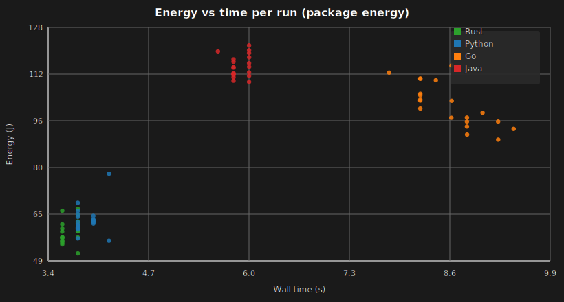

## Why compare language energy for ingestion pipelines?

Data ingestion is a “hidden” but ubiquitous workload: ETL jobs, observability pipelines, log processing, feature generation, and data lake compaction. The same pipeline can be implemented in many languages, and the choice often comes down to ecosystem or developer experience. However, ingestion is also **compute- and IO-intensive**, so small differences in runtime behavior (parsing, allocations, GC, compression libraries, Parquet writers) can translate into non-trivial energy differences at scale.

This project investigates a focused question:

- **RQ**: *For the same ingestion pipeline and the same dataset slice, how do Python, Go, Java, and Rust differ in energy consumption, execution time, and power behavior?*

Our goal is not to declare a universal “winner”, but to provide **actionable intuition**: are the differences mainly about doing the work faster (lower time), or about drawing less power while doing it?

---

## Workload definition (same task across languages)

All four implementations perform the same high-level pipeline:

**`JSONL(.gz) → validate → transform → aggregate → Parquet + checksum`**

For each JSON record we:
- **Validate (strict)** required fields: `id`, `type`, `repo.id`, `created_at`
- **Transform**: normalize `type` to lowercase; derive `event_day = YYYY-MM-DD` from `created_at`
- **Aggregate** by `(event_day, event_type)`:
  - `record_count`
  - `sum_repo_id`
- **Write** the aggregate table as Parquet (fixed schema/column order) and emit a deterministic checksum over sorted rows.

### Dataset slice
- **Dataset**: GH Archive events, hourly `.json.gz`
- **Date**: **2026-02-19**
- **Hours**: **1**
- **Mode**: **cpu** (**strict validation enabled**)
- **Input strategy**: **auto-download inside each language** using the hardcoded `download_date` + `download_hours`.

The single-hour slice is small enough to run many repetitions, while still being representative of messy real-world JSON lines with nested fields.

---

## Implementations

We implemented the same pipeline in four languages:
- **Python**: CPython, JSON parsing via stdlib `json`, Parquet output via `pyarrow`.
- **Go**: stdlib JSON + Parquet writer library (with ZSTD compression enabled).
- **Rust**: `serde_json` + Arrow/Parquet writer stack.
- **Java**: OpenJDK + Jackson + Parquet libraries via Maven.

All implementations download from the same GH Archive endpoint and write outputs into a shared `data/` directory when run under Docker.

---

## Measurement methodology

### What we measured
Per run, we report:
- **Energy (J)**: **CPU package energy** ($E_{pkg}$) derived from the `PACKAGE_ENERGY (J)` counter.
- **Time (s)**: wall-clock runtime of the benchmark command.
- **Average power (W)**: $P_{avg} = E_{pkg} / T$
- **Energy–Delay Product (EDP)**: $EDP = E_{pkg} \\times T$ (lower is better if you care about both energy and latency)

### What we did *not* measure (and why it matters)
It is important to distinguish *where* energy is being measured:
- **We did not measure whole-system wall power** (e.g., from a plug-level meter). That would include SSD, networking, fans, display, and PSU losses.
- Instead, we used **CPU package energy** (RAPL domain), which is often the best-available *repeatable* signal for CPU-bound workloads, but it is not the full-machine footprint.

This distinction matters most when the workload is IO-heavy (storage/network dominated). In our experiment we deliberately used **cpu/strict validation** to keep the workload more compute-heavy and make package energy a meaningful proxy.

### Tooling
We used **EnergiBridge** (invoked as `energibridge`) to sample energy counters at a high frequency and output time-series CSV files. Each per-run CSV contains cumulative energy readings; we compute per-run energy as:

$$E_{run} = E_{last} - E_{first}$$

We also compute per-run time from the same CSV:

$$T_{run} = (t_{last} - t_{first}) / 1000$$

where timestamps are in milliseconds.

### Protocol
- **Warmups**: 1 per language
- **Measured runs**: 20 per language (80 total)
- **Sampling interval**: 200 µs
- **Run order**: in each measured round, the language order is randomized (fixed seed for repeatability).

### Environment notes
The recorded CSVs include energy counters like `PACKAGE_ENERGY (J)` and `DRAM_ENERGY (J)`, which typically come from Intel RAPL domains. We report **package energy**, which is closer to “CPU + uncore” energy than whole-system energy (i.e., it does not include everything the PSU would see).

From the measurement CSV metadata, the system had **8 logical CPUs** (per-core frequency/utilization columns) and **~33.36 GB total memory** (reported as `TOTAL_MEMORY=33360306176` bytes).

---

## Results

### Summary table (package energy)

Below we summarize **mean ± 95% CI** across 20 measured runs per language:

| Language | Mean energy (J) | Mean time (s) | Mean power (W) | Mean EDP (J·s) |
|---|---:|---:|---:|---:|
| **Rust** | **58.69** ± 1.86 | **3.692** ± 0.048 | 15.90 ± 1.03 | **216.83** ± 17.50 |
| **Python** | 62.42 ± 2.23 | 3.902 ± 0.064 | 16.00 ± 1.15 | 243.77 ± 23.43 |
| **Go** | 101.86 ± 3.46 | 8.574 ± 0.200 | 11.94 ± 1.36 | 871.10 ± 42.41 |
| **Java** | 114.94 ± 1.73 | 5.883 ± 0.056 | 19.54 ± 0.70 | 676.24 ± 27.35 |

**Ranking by mean energy (lower is better):** Rust < Python << Go < Java.

### Relative differences (practical effect size)
Sometimes “statistically different” is less important than “how big is the difference in practice?”. Using Rust as the lowest-energy baseline:

- **Python** used **~6.3% more** package energy than Rust on average.
- **Go** used **~73.5% more** package energy than Rust on average.
- **Java** used **~95.8% more** package energy than Rust on average.

Even with just a one-hour slice, these gaps are large enough to matter if this pipeline is executed frequently (e.g., hourly ingestion jobs across many datasets).

### Stability across repetitions
Energy and time naturally vary due to OS scheduling, background load, and thermal state. Across 20 runs we observed:
- **Energy coefficient of variation (CV)** around **6–8%** for Rust/Python/Go, and **~3.2%** for Java.
- **Time CV** around **2–5%**.

This is one reason we ran 20 measured repetitions and randomized run order: it makes the averages more robust to run-to-run noise.

### Visualizations

**Mean energy with 95% CI**:

**Energy vs time per run** (each dot is one measured run):

---

## Discussion: where do the differences come from?

### 1) Fast can be energy efficient (but not always)
Rust and Python finish the workload in ~3.7–3.9 seconds on average and also show the lowest package energy. This suggests the dominant driver here is **time-to-complete**: finishing earlier reduces the time the CPU package stays in a high-activity state.

However, Java is an instructive counterexample: it completes faster than Go (5.9s vs 8.6s) but still consumes *more* package energy (114.9J vs 101.9J). The scatter plot shows Java points at **higher power** and moderate time: Java tends to “go harder” (higher average W), whereas Go tends to run longer at lower average W.

### 2) Power behavior differs significantly by runtime
The mean power numbers show two clusters:
- **High-power cluster**: Java (~19.5W), Python/Rust (~15.9–16.0W)
- **Lower-power cluster**: Go (~11.9W)

So Go’s energy is not high because it draws high power; it’s high because it runs longer. Java’s energy is high because even though it’s not the slowest, it runs at higher power.

### 3) EDP favors Rust/Python strongly
If your decision metric is “save energy *and* finish quickly” (e.g., latency-sensitive pipelines), EDP highlights the same story:
- **Rust** is best (lowest EDP).
- **Python** is close behind.
- **Java** and **Go** are much worse due to either high power (Java) or long runtime (Go).

### 4) Likely causes (hypotheses)
We did not instrument the pipeline into fine-grained phases in this iteration, but based on typical ingestion behavior we expect:
- **JSON parsing and validation** to dominate CPU time in strict mode. Languages with faster parsing and fewer allocations can reduce both runtime and CPU energy.
- **Memory management strategy** to matter:
  - Java’s GC and JIT compilation can improve steady-state throughput but may increase instantaneous power draw.
  - Rust’s ahead-of-time compilation and explicit memory ownership can reduce runtime overhead at the cost of more complex code.
  - Python’s interpreter overhead often makes it slower on CPU-bound tasks, but in this specific workload the Parquet writer and I/O patterns may dominate, allowing Python to remain competitive.
- **Parquet + compression libraries** to influence both time and energy. Different default buffer sizes, compression implementations, and vectorization can change CPU utilization significantly.

---

## Threats to validity (what could bias these results?)

- **Package vs whole-system energy**: we used CPU package energy (RAPL domain). Whole-system energy (including RAM, SSD, network, fans, and PSU losses) may change the absolute values and potentially the ranking for IO-heavy workloads.
- **Single dataset slice**: results are for **one hour** on **one date**. Another hour/day may differ in event mix and record count.
- **Implementation differences**: even with a “fairness contract”, language ecosystems differ (JSON parsing, Parquet writer implementation, compression defaults). These are *real* differences a practitioner experiences, but they also mean the comparison is not purely “language runtime” in isolation.
- **Containerization**: running under Docker adds some overhead. We used the same container approach for all languages to keep conditions comparable.
- **Hardware and OS configuration**: CPU governor, background load, thermal state, and power limits can shift both time and energy. We mitigate this by using 20 repetitions and randomized run order.

---

## Reproducibility checklist (what to report in your own replication)
If you replicate or extend our experiment, we recommend recording:
- **Hardware**: CPU model, number of cores/threads, RAM size, storage type.
- **OS**: distribution + kernel version.
- **Tool versions**: EnergiBridge commit/version; Docker version; language runtimes (Python/Go/Rust/Java).
- **Exact dataset slice**: GH Archive date/hour list and whether files were already cached.
- **Run parameters**: warmups, measured runs, sampling interval, and run order randomization seed.

---

## Replication package

We provide a replication package with Dockerfiles, scripts, and the measurement outputs used in this report:

- **Repository**: [Programming-Language-Data-Ingestion-Comparison](https://github.com/yuvrajtudelft/Programming-Language-Data-Ingestion-Comparison)
- **Branch used for this report**: `python-test`

At a high level, you can reproduce the measurement matrix by:
- building the four Docker images, and
- running the cross-language EnergiBridge script (which creates per-run CSVs and a summary report).

### Minimal reproduction steps
From the repo root:
- build and run the dockerized benchmark once for sanity (any language), then
- run the cross-language EnergiBridge script (warmup + measured runs).

To ensure you use the same dataset slice as this report, set the hardcoded download date in each language to:
- **2026-02-19**, **hours=1**, **mode=cpu** (strict validation)

---

## Conclusion

For a strict-validation ingestion pipeline on a one-hour GH Archive slice (2026-02-19), we observed large differences in **package energy** across languages:

- **Rust and Python** were both fast and energy-efficient in our setup.
- **Go** tended to use less power but ran much longer, resulting in higher energy.
- **Java** ran at higher average power and ended up consuming the most package energy despite being faster than Go.

The practical takeaway is that language choice affects both *how quickly* the pipeline finishes and *how much power* it draws while doing so. For teams operating large-scale ingestion workloads, these differences can compound, making language/runtime decisions relevant not only for performance but also for energy and sustainability goals.

