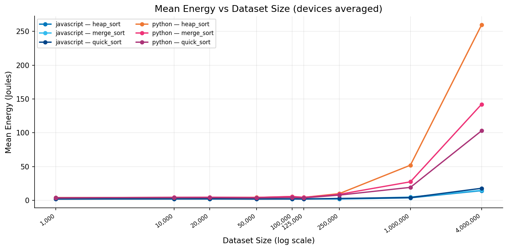
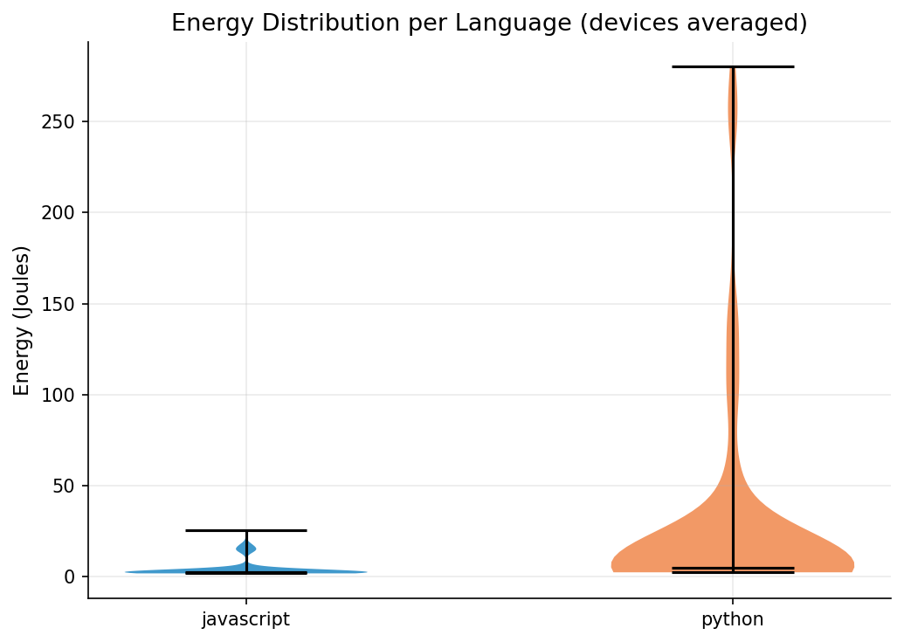
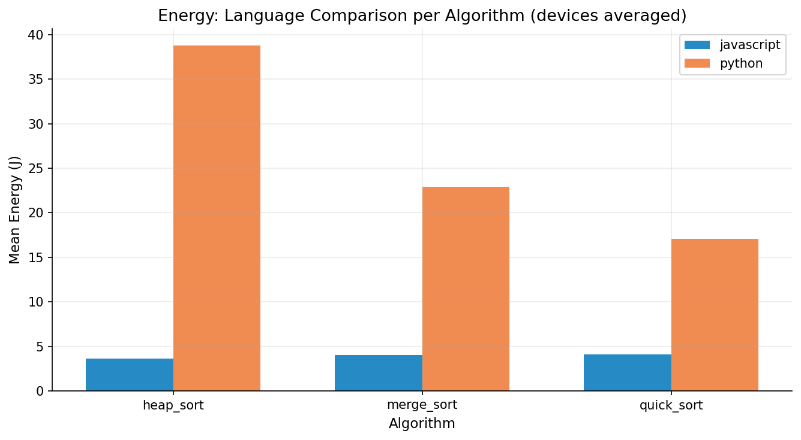
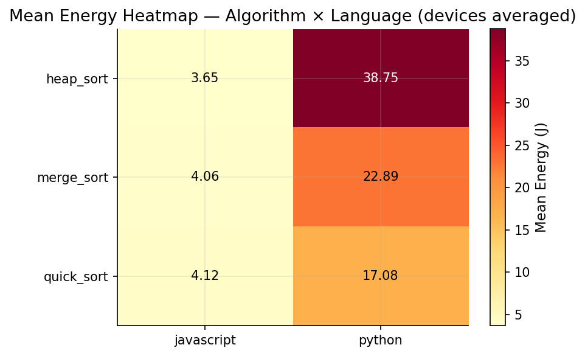
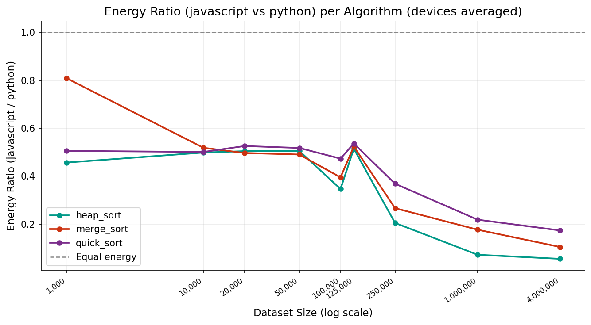
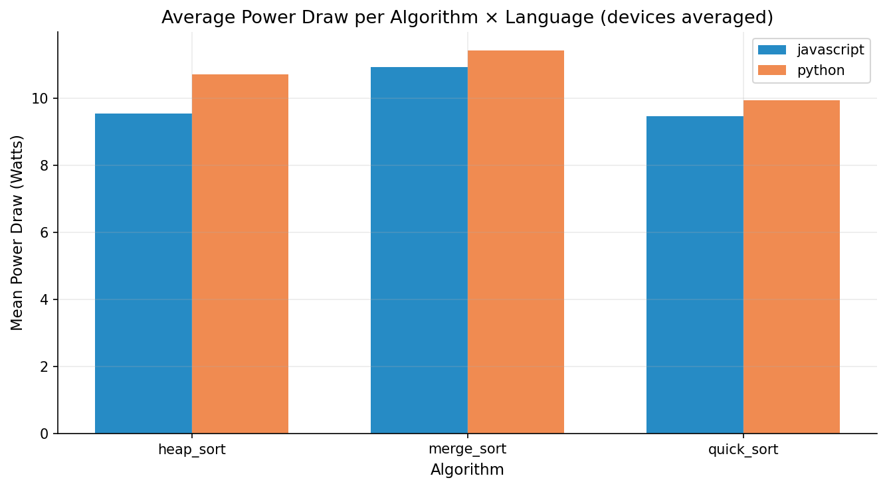

## Energy Efficiency in Serverless Computing
Cloud computing has fundamentally reshaped how software is deployed. Among its forms, serverless computing - also known as Function as a Service (FaaS) - has gained significant traction [^hellerstein2019]. Services such as AWS Lambda, Azure Functions, and Google Cloud Functions enable developers to execute code on-demand without managing any underlying infrastructure. There exists a clear duopoly in the serverless computing market, where Python and JavaScript (Node.js) are the dominant programming languages [^eismann2022]. This makes the choice between them a routine decision for cloud developers worldwide.

This decision is almost never made with energy consumption in mind, yet the environmental impact of software is becoming increasingly important. As serverless functions are used at massive scale, even small differences in energy usage can become a significant cumulative power draw. As companies seek to reduce their carbon footprints, understanding the energy implications of their software is crucial for achieving their sustainability goals. This process starts with the choice of what programming language is used to develop their software, as prior research has shown this choice can have a measurable effect on energy consumption. Pereira et al. [^pereira2017] compared 27 languages and found that Node.js was considerably more energy efficient than Python. However, their study used general micro-benchmarks and did not examine specific algorithms or the serverless context.

Sorting is among the most fundamental operations in computer science [^cormen2009]. It is a common task performed in various applications, including serverless functions where they are especially used at scale for data processing: ingesting events, ETL pipelines, ranking records before storage, etc. Furthermore, sorting is a computationally intensive task that puts direct pressure on the language runtime, which makes it a good candidate for comparing energy efficiency across languages. By directly comparing the energy usage of sorting algorithms - merge sort, quicksort, and heapsort - in Python and JavaScript we aim to provide insights into how language choice in serverless functions can impact the energy consumption of cloud applications.

## Why Merge Sort, Quick Sort, and Heap Sort?
Merge sort, quick sort, and heap sort are among the most recognized and used sorting algorithms [^pizarrovasquez2020]. These three all share the same average time complexity of O(n log n), which makes their performance more comparable as the algorithmic efficiency is similar. However, the three algorithms also have different computational profiles as you can see in the table below. By controlling for time complexity, we can better isolate the differences between the computational profiles of the algorithms to see whether Python or Node.js affect them equally or favour specific ones.

<figure>
<table>
  <thead>
    <tr>
      <th>Algorithm</th>
      <th>Best Case</th>
      <th>Average Case</th>
      <th>Worst Case</th>
      <th>Memory</th>
      <th>Computational Profile</th>
    </tr>
  </thead>
  <tbody>
    <tr>
      <td>Merge Sort</td>
      <td>O(n log n)</td>
      <td>O(n log n)</td>
      <td>O(n log n)</td>
      <td>O(n)</td>
      <td>Divide-and-conquer, recursive</td>
    </tr>
    <tr>
      <td>Quick Sort</td>
      <td>O(n log n)</td>
      <td>O(n log n)</td>
      <td>O(n²)</td>
      <td>O(log n)</td>
      <td>Divide-and-conquer, in-place</td>
    </tr>
    <tr>
      <td>Heap Sort</td>
      <td>O(n log n)</td>
      <td>O(n log n)</td>
      <td>O(n log n)</td>
      <td>O(1)</td>
      <td>In-place, binary heap</td>
    </tr>
  </tbody>
</table>
<figcaption><b>Figure 1.</b> Time complexity, memory complexity, and computational profile of merge sort, quick sort, and heap sort.</figcaption>
</figure>

## Methodology
Having chosen these algorithms, we then created a repository[^repo] in which we developed our experiment. The experiment can be ran automatically by executing the ‘run_experiment.sh’ script. It is important to note that to replicate our experiment, the only input required from the experimenter is to change the name of the algorithm used in the script, specifically the value of the variables 'PYTHON_SCRIPT' and 'JS_SCRIPT'. The user may also be required to change the 'ENERGIBRIDGE_CMD' variable to only 'energibridge' or another value depending on the Energibridge installation. 

The script measures the energy consumption for different sizes of datasets, with configurable aspects such as iteration count per dataset size and the sorting algorithm to be tested. Specifically, the script runs energibridge and measures the energy consumption of each implementation of the sorting algorithms, for both python and javascript.

To ensure that differences in energy consumption reflect the language runtime rather than implementation choices, all three algorithms were implemented starting from pseudocode definitions provided in the repository README[^repo]. Both the Python and JavaScript versions follow the pseudocodes as closely as the respective languages permit — preserving the same control flow, variable roles, and recursive structure — so that the only factor varying between the two implementations is the runtime executing them.

While setting up and conducting our experiment, we followed the Scientific Guide to Set Up Energy Efficiency Experiments in order to ensure the accuracy, correctness and appropriateness of our results, and to reduce bias as much as possible. Whenever running the experiments, all other software, notifications and services was turned off. Settings of the machines running the experiment that might affect power consumption, such as screen brightness, were also frozen. The machines ran dummy tasks before the experiments were conducted as warm up. Due to the amount of time the experiments take, the number of repetitions were kept at 10 for each sorting algorithm. With 9 different dataset sizes, 2 different languages, and 3 different algorithms, this totals to 540 experiments per machine. The order of the sorting algorithms being subject to the experiment were also randomized, and the room temperature was kept stable. Once all these conditions were met, the automated script was run on the machines, once for each of the three sorting algorithms. Finally, the datasets being used in the experiment as the input for the sorting algorithms are simple input-n.txt files, which contain numbers in each row,going from 1 to n-1. The algorithms take these files, and sort their contents. They were sourced from kaggle [^akay2025].

To ensure that we actually measure the energy consumption, and therefore the difference in amount of energy consumed, between python and javascript while minimizing all other factors that might affect energy consumption, our experimental variables were determined as follows:
- Independent: Programming languages (Python and JavaScript)
- Dependent: Energy consumption
- Controlled: Implementation of the sort algorithms, specs of the machines running the experiment, versions of the tools used in running the experiment

  - Python version: 3.13.7
  - Node version: v22.22.0
  - Specs: Apple M2, 16GB RAM + Apple M1, 16GB; macOS Tahoe 26.3
  

## Results & Statistical Analysis

A total of 1,080 controlled experimental runs were performed across two devices, and the resulting energy and performance measurements were aggregated and subjected to statistical analysis.

### *Language Comparison*

The most prominent finding is the large energy gap between Python and JavaScript. Averaged across all algorithms and dataset sizes, JavaScript consumed a mean of 3.75 J while Python consumed 26.86 J, a 7.2× difference. This gap is confirmed as statistically significant by a Mann-Whitney U test (U = 640, p < 0.0001), with a large effect size (rank-biserial r = −0.76, where \|r\| > 0.5 indicates a large effect). The Mann-Whitney test was chosen over a t-test because the energy distributions are right-skewed and span several orders of magnitude, violating the normality assumption. Figure 2 shows the mean energy growth across dataset sizes for each language–algorithm combination, and Figure 3 provides the overall distribution comparison.

  <figure>
    
    <figcaption><b>Figure 2.</b> Mean energy consumption vs dataset size (log scale), averaged across both devices. Lines represent each language–algorithm combination.</figcaption>
  </figure>

 

  <figure style="text-align: center; margin: 0;">
    
    <figcaption><b>Figure 3.</b> Energy distribution per language.</figcaption>
  </figure>
  <figure style="text-align: center; margin: 0;">
    
    <figcaption><b>Figure 4.</b> Mean energy per language grouped by algorithm.</figcaption>
  </figure>

 

Table 1 shows the headline aggregated figures. The language gap is consistent across all three algorithms, with Python always consuming more energy regardless of the sorting strategy used.

<table style="width:100%;border-collapse:collapse;font-family:monospace;font-size:0.85em;margin-bottom:0.5em;">
  <thead>
    <tr style="background:#f8f9fa;border-bottom:2px solid #dee2e6;">
      <th style="padding:10px 14px;text-align:left;color:#555555;font-size:0.75em;letter-spacing:0.08em;text-transform:uppercase;">Language</th>
      <th style="padding:10px 14px;text-align:right;color:#555555;font-size:0.75em;letter-spacing:0.08em;text-transform:uppercase;">Mean (J)</th>
      <th style="padding:10px 14px;text-align:right;color:#555555;font-size:0.75em;letter-spacing:0.08em;text-transform:uppercase;">Std (J)</th>
    </tr>
  </thead>
  <tbody>
    <tr style="border-bottom:1px solid #e5e7eb;">
      <td style="padding:10px 14px;font-weight:700;color:#f59e0b;border-left:3px solid #f59e0b;">JavaScript</td>
      <td style="padding:10px 14px;text-align:right;color:#10b981;font-weight:700;">3.75</td>
      <td style="padding:10px 14px;text-align:right;color:#374151;">4.03</td>
    </tr>
    <tr>
      <td style="padding:10px 14px;font-weight:700;color:#3b82f6;border-left:3px solid #3b82f6;">Python</td>
      <td style="padding:10px 14px;text-align:right;color:#ef4444;font-weight:700;">26.86</td>
      <td style="padding:10px 14px;text-align:right;color:#374151;">63.03</td>
    </tr>
  </tbody>
</table>

  <strong style="color:#374151;">Table 1.</strong> Mean energy aggregated across all dataset sizes and algorithms (both devices averaged).

The energy gap grows non-linearly with dataset size. At small sizes (<= 125,000 elements) both languages remain below 10 J, but beyond 250,000 elements Python's energy diverges sharply. At 4,000,000 elements, Python Heapsort consumed 298.5 J compared to just 13.2 J for its JavaScript equivalent: a 23× difference at that scale. This divergence reflects Python's interpreted execution model, where each sorting operation incurs interpreter overhead that compounds at scale, whereas JavaScript's V8 JIT compiler optimises hot loops at runtime.

### *Algorithm Comparison*

When aggregated across both languages, mean energy consumption ranked as: Heapsort (23.39 J) > Mergesort (12.76 J) > Quicksort (9.77 J). However, a Kruskal-Wallis test found no statistically significant difference between the three algorithms (H = 1.77, p = 0.41), and all pairwise Mann-Whitney comparisons between algorithms were also non-significant (all p > 0.24). This means the algorithm choice alone does not reliably predict energy consumption: the effect is dominated by the language.

  

    <figure style="text-align: center; margin: 0;">
      
      <figcaption><b>Figure 5.</b> Mean energy heatmap (algorithm x language).</figcaption>
    </figure>
    <figure style="text-align: center; margin: 0;">
      
      <figcaption><b>Figure 6.</b> Energy ratio (Python / JavaScript) per algorithm across dataset sizes.</figcaption>
    </figure>
  

   

Table 2 shows per-algorithm means. While the ranking is visible, the high standard deviations — driven by Python's steep scaling at large sizes — explain why no statistically significant difference was found between algorithms.

<table style="width:100%;border-collapse:collapse;font-family:monospace;font-size:0.85em;margin-bottom:0.5em;">
  <thead>
    <tr style="background:#f8f9fa;border-bottom:2px solid #dee2e6;">
      <th style="padding:10px 14px;text-align:left;color:#555555;font-size:0.75em;letter-spacing:0.08em;text-transform:uppercase;">Algorithm</th>
      <th style="padding:10px 14px;text-align:right;color:#555555;font-size:0.75em;letter-spacing:0.08em;text-transform:uppercase;">Mean (J)</th>
      <th style="padding:10px 14px;text-align:right;color:#555555;font-size:0.75em;letter-spacing:0.08em;text-transform:uppercase;">Std (J)</th>
      <th style="padding:10px 14px;text-align:right;color:#555555;font-size:0.75em;letter-spacing:0.08em;text-transform:uppercase;">Rank</th>
    </tr>
  </thead>
  <tbody>
    <tr style="border-bottom:1px solid #e5e7eb;">
      <td style="padding:10px 14px;color:#111827;border-left:3px solid #ef4444;">Heapsort</td>
      <td style="padding:10px 14px;text-align:right;color:#ef4444;font-weight:700;">23.39</td>
      <td style="padding:10px 14px;text-align:right;color:#374151;">68.81</td>
      <td style="padding:10px 14px;text-align:right;color:#374151;">3rd</td>
    </tr>
    <tr style="border-bottom:1px solid #e5e7eb;">
      <td style="padding:10px 14px;color:#111827;border-left:3px solid #a855f7;">Mergesort</td>
      <td style="padding:10px 14px;text-align:right;color:#a855f7;font-weight:700;">12.76</td>
      <td style="padding:10px 14px;text-align:right;color:#374151;">32.76</td>
      <td style="padding:10px 14px;text-align:right;color:#374151;">2nd</td>
    </tr>
    <tr>
      <td style="padding:10px 14px;color:#111827;border-left:3px solid #10b981;">Quicksort</td>
      <td style="padding:10px 14px;text-align:right;color:#10b981;font-weight:700;">9.77</td>
      <td style="padding:10px 14px;text-align:right;color:#374151;">21.88</td>
      <td style="padding:10px 14px;text-align:right;color:#374151;">1st</td>
    </tr>
  </tbody>
</table>

  <strong style="color:#374151;">Table 2.</strong> Mean energy aggregated across both languages and all dataset sizes (both devices averaged). Algorithm differences were not statistically significant (Kruskal-Wallis, p = 0.41).

Notably, the algorithm rankings reverse between languages at large scales. Within Python, Quicksort was the most efficient at 4M elements (97.3 J), followed by Mergesort (145.5 J) and Heapsort (298.5 J). Within JavaScript, Mergesort and Heapsort were nearly identical (13.0 J and 13.2 J), while Quicksort was the least efficient (17.5 J). This inversion is visible in Figure 6, where Quicksort's ratio dips below Heapsort's at large sizes, and suggests that JavaScript's JIT compiler benefits more from Heapsort's regular memory access patterns, whereas Python's interpreter penalises Heapsort's cache-unfriendly access pattern severely at scale.

The full per-configuration breakdown is presented in Table 3 below. Values are means of 10 runs per size, averaged across both devices.

<table style="width:100%;border-collapse:collapse;font-family:monospace;font-size:0.82em;margin-bottom:0.5em;">
  <thead>
    <tr style="background:#f8f9fa;border-bottom:2px solid #dee2e6;">
      <th style="padding:9px 12px;text-align:left;color:#555555;font-size:0.72em;letter-spacing:0.08em;text-transform:uppercase;">Language</th>
      <th style="padding:9px 12px;text-align:left;color:#555555;font-size:0.72em;letter-spacing:0.08em;text-transform:uppercase;">Algorithm</th>
      <th style="padding:9px 12px;text-align:right;color:#555555;font-size:0.72em;letter-spacing:0.08em;text-transform:uppercase;">1K</th>
      <th style="padding:9px 12px;text-align:right;color:#555555;font-size:0.72em;letter-spacing:0.08em;text-transform:uppercase;">10K</th>
      <th style="padding:9px 12px;text-align:right;color:#555555;font-size:0.72em;letter-spacing:0.08em;text-transform:uppercase;">50K</th>
      <th style="padding:9px 12px;text-align:right;color:#555555;font-size:0.72em;letter-spacing:0.08em;text-transform:uppercase;">250K</th>
      <th style="padding:9px 12px;text-align:right;color:#555555;font-size:0.72em;letter-spacing:0.08em;text-transform:uppercase;">1M</th>
      <th style="padding:9px 12px;text-align:right;color:#555555;font-size:0.72em;letter-spacing:0.08em;text-transform:uppercase;">4M</th>
    </tr>
  </thead>
  <tbody>
    <!-- JavaScript -->
    <tr style="border-bottom:1px solid #e5e7eb;">
      <td rowspan="3" style="padding:9px 12px;font-weight:700;color:#f59e0b;border-left:3px solid #f59e0b;vertical-align:middle;">JavaScript</td>
      <td style="padding:9px 12px;color:#111827;">Heapsort</td>
      <td style="padding:9px 12px;text-align:right;color:#374151;">1.94</td>
      <td style="padding:9px 12px;text-align:right;color:#374151;">2.09</td>
      <td style="padding:9px 12px;text-align:right;color:#374151;">2.05</td>
      <td style="padding:9px 12px;text-align:right;color:#374151;">2.35</td>
      <td style="padding:9px 12px;text-align:right;color:#374151;">3.80</td>
      <td style="padding:9px 12px;text-align:right;color:#374151;">13.19</td>
    </tr>
    <tr style="border-bottom:1px solid #e5e7eb;">
      <td style="padding:9px 12px;color:#111827;">Mergesort</td>
      <td style="padding:9px 12px;text-align:right;color:#374151;">2.47</td>
      <td style="padding:9px 12px;text-align:right;color:#374151;">2.16</td>
      <td style="padding:9px 12px;text-align:right;color:#374151;">2.09</td>
      <td style="padding:9px 12px;text-align:right;color:#374151;">2.15</td>
      <td style="padding:9px 12px;text-align:right;color:#374151;">4.39</td>
      <td style="padding:9px 12px;text-align:right;color:#374151;">13.03</td>
    </tr>
    <tr style="border-bottom:2px solid #dee2e6;">
      <td style="padding:9px 12px;color:#111827;">Quicksort</td>
      <td style="padding:9px 12px;text-align:right;color:#374151;">2.02</td>
      <td style="padding:9px 12px;text-align:right;color:#374151;">2.25</td>
      <td style="padding:9px 12px;text-align:right;color:#374151;">2.10</td>
      <td style="padding:9px 12px;text-align:right;color:#374151;">2.51</td>
      <td style="padding:9px 12px;text-align:right;color:#374151;">4.18</td>
      <td style="padding:9px 12px;text-align:right;color:#374151;">17.48</td>
    </tr>
    <!-- Python -->
    <tr style="border-bottom:1px solid #e5e7eb;">
      <td rowspan="3" style="padding:9px 12px;font-weight:700;color:#3b82f6;border-left:3px solid #3b82f6;vertical-align:middle;">Python</td>
      <td style="padding:9px 12px;color:#111827;">Heapsort</td>
      <td style="padding:9px 12px;text-align:right;color:#374151;">3.07</td>
      <td style="padding:9px 12px;text-align:right;color:#374151;">3.18</td>
      <td style="padding:9px 12px;text-align:right;color:#374151;">3.21</td>
      <td style="padding:9px 12px;text-align:right;color:#374151;">10.08</td>
      <td style="padding:9px 12px;text-align:right;color:#374151;">60.10</td>
      <td style="padding:9px 12px;text-align:right;color:#374151;">298.51</td>
    </tr>
    <tr style="border-bottom:1px solid #e5e7eb;">
      <td style="padding:9px 12px;color:#111827;">Mergesort</td>
      <td style="padding:9px 12px;text-align:right;color:#374151;">2.90</td>
      <td style="padding:9px 12px;text-align:right;color:#374151;">3.25</td>
      <td style="padding:9px 12px;text-align:right;color:#374151;">3.25</td>
      <td style="padding:9px 12px;text-align:right;color:#374151;">7.31</td>
      <td style="padding:9px 12px;text-align:right;color:#374151;">23.99</td>
      <td style="padding:9px 12px;text-align:right;color:#374151;">145.48</td>
    </tr>
    <tr>
      <td style="padding:9px 12px;color:#111827;">Quicksort</td>
      <td style="padding:9px 12px;text-align:right;color:#374151;">3.02</td>
      <td style="padding:9px 12px;text-align:right;color:#374151;">3.28</td>
      <td style="padding:9px 12px;text-align:right;color:#374151;">3.01</td>
      <td style="padding:9px 12px;text-align:right;color:#374151;">5.98</td>
      <td style="padding:9px 12px;text-align:right;color:#374151;">17.47</td>
      <td style="padding:9px 12px;text-align:right;color:#374151;">97.33</td>
    </tr>
  </tbody>
</table>

  <strong style="color:#374151;">Table 3.</strong> Mean energy (Joules) per language–algorithm–size, averaged across both devices (M1 and M2).

#### **Energy vs Execution Time**

Power draw analysis (Figure 7) reveals that Python not only runs longer but also draws more power per second than JavaScript across all algorithms, meaning both dimensions contribute independently to its higher total energy.

  <figure>
    
    <figcaption><b>Figure 7.</b> Mean power draw (Watts) per algorithm and language. Python sustains a higher instantaneous power draw in addition to longer execution times.</figcaption>
  </figure>

### *Why Does This Happen?*

Before we dig in, a quick reminder of what we're actually measuring, because power and energy are not the same thing:

Power (Watts) is the instantaneous rate at which the CPU is consuming electricity. Energy (Joules) is the total electricity consumed over the entire execution. 

We compute it as:

E = Σ P(t) × Δt

where P(t) is the power sampled at each timestep and Δt is the interval in seconds. Energibridge samples system power at ~200ms intervals.

So why does Python consume so much more of both? It comes down to how each runtime executes the code. CPython (Python's default interpreter) executes bytecode instruction-by-instruction, dynamic-typing every variable at every step. Each comparison in the sort loop goes through multiple layers of indirection. JavaScript's V8 engine watches that same loop, identifies it as "hot", and JIT-compiles it to optimised native machine code mid-execution. The result is that V8 runs the inner sort loop at near-native speed, CPython does not.

The algorithm differences are rooted in complexity and memory access patterns[^cormen2009]:

- Heapsort thrashes the CPU cache: its heap operations jump non-sequentially through memory, triggering frequent cache misses. This is cheap in JavaScript (V8 handles it gracefully) but devastating in Python, where each miss multiplies the interpreter overhead.
- Mergesort allocates O(n) auxiliary memory per merge, which means more heap allocations and GC pressure, this shows up in Python's higher variance at large sizes.
- Quicksort's in-place, cache-friendly partitioning is why it wins in Python at scale. Fewer memory jumps means fewer expensive interpreter round-trips.

If you're running Python and sorting millions of records, Quicksort can be a good choice. But if energy efficiency is a hard requirement, the runtime choice matters far more than the algorithm: switching languages saves 7.2x on average, regardless of the chosen sorting algorithm.

## Limitations and Future Work

This study has a few limitations worth noting. The experiments were run on only two Apple machines, one M1 and one M2, both running macOS. While two devices help reduce single machine bias, the results may not generalize to other hardware architectures or operating systems like Linux and Windows, which are commonly used in cloud environments.

We made the Python and JavaScript implementations as functionally similar as possible, but some differences were unavoidable given that each language has its own idioms and standard libraries. These differences could have a small effect on the results independently of the runtime itself.

We also ran each configuration 10 times per dataset size. More repetitions would give more reliable estimates, especially at the larger dataset sizes where variance was noticeably higher.

For future work, testing more programming languages such as Java, Go, or Rust would broaden the comparison. Testing more sorting algorithms and running experiments on Linux machines or actual cloud infrastructure would also improve the generalizability of the findings.

## Conclusion

This study compared the energy consumption of Mergesort, Quicksort, and Heapsort in Python and JavaScript across nine dataset sizes and two Apple Silicon machines. The results are clear: JavaScript consumed on average 7.2× less energy than Python, and this gap grows substantially at larger dataset sizes, reaching 23× at 4 million elements. Statistical testing confirmed that the language effect is significant (Mann-Whitney U, p < 0.0001), while algorithm choice alone had no statistically meaningful effect on energy consumption (Kruskal-Wallis, p = 0.41).

For developers building data-intensive or serverless applications, the practical takeaway is straightforward: the runtime matters more than the algorithm. For teams already committed to Python, Quicksort offers a meaningful advantage at large scales due to its cache-friendly, in-place access patterns — consuming 97.3 J versus 298.5 J for Heapsort at 4 million elements — but even that cannot close the gap with JavaScript.

These findings align with prior work by Pereira et al. [^pereira2017], while extending it to a specific algorithmic context across varying dataset scales. Our results add to the growing body of evidence that programming language choice carries real environmental weight, and that as cloud functions are executed at massive scale, runtime design decisions have consequences that developers and organisations should factor in alongside correctness and performance.

# References

[^akay2025]: Akay, B. E. (2025). *Benchmark dataset for sorting algorithms* [Benchmark Dataset for Sorting Algorithms]. Kaggle. https://www.kaggle.com/datasets/bekiremirhanakay/benchmark-dataset-for-sorting-algorithms

[^hellerstein2019]: Hellerstein, J. M., Faleiro, J., Gonzalez, J., Schleier-Smith, J., Sreekanti, V., Tumanov, A., & Wu, C. (2019). Serverless computing: One step forward, two steps back. *9th Biennial Conference on Innovative Data Systems Research (CIDR '19)*. [https://arxiv.org/abs/1812.03651](https://arxiv.org/abs/1812.03651)

[^eismann2022]: Eismann, S., Scheuner, J., van Eyk, E., Schwinger, M., Grohmann, J., Herbst, N., Abad, C. L., & Iosup, A. (2022). The state of serverless applications: Collection, characterization, and community consensus. *IEEE Transactions on Software Engineering*, *48*(10), 4152–4166. [https://doi.org/10.1109/TSE.2021.3113940](https://doi.org/10.1109/TSE.2021.3113940)

[^pereira2017]: Pereira, R., Couto, M., Ribeiro, F., Rua, R., Cunha, J., Fernandes, J. P., & Saraiva, J. (2021). Ranking programming languages by energy efficiency. *Science of Computer Programming*, *205*, 102609. [https://doi.org/10.1016/j.scico.2021.102609](https://doi.org/10.1016/j.scico.2021.102609)

[^cormen2009]: Cormen, T. H., Leiserson, C. E., Rivest, R. L., & Stein, C. (2009). *Introduction to Algorithms* (3rd ed.). MIT Press.

[^pizarrovasquez2020]: Pizarro-Vasquez, G. O., Mejia Morales, F., Galvez Minervini, P., & Botto-Tobar, M. (2020). Sorting algorithms and their execution times: An empirical evaluation. In *Advances in Emerging Trends and Technologies — Proceedings of ICAETT 2020* (pp. 335–348). Springer. [https://doi.org/10.1007/978-3-030-63665-4_27](https://doi.org/10.1007/978-3-030-63665-4_27)

[^repo]:Milanesi, N.E., Nassiri, M., Oei, J., Turanlı, G.. https://github.com/JimmyOei/sse_group_9
