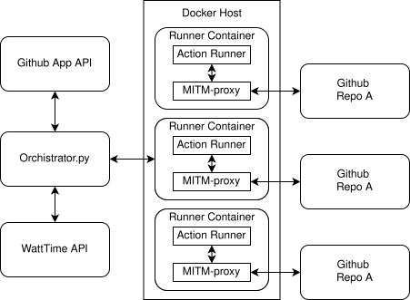
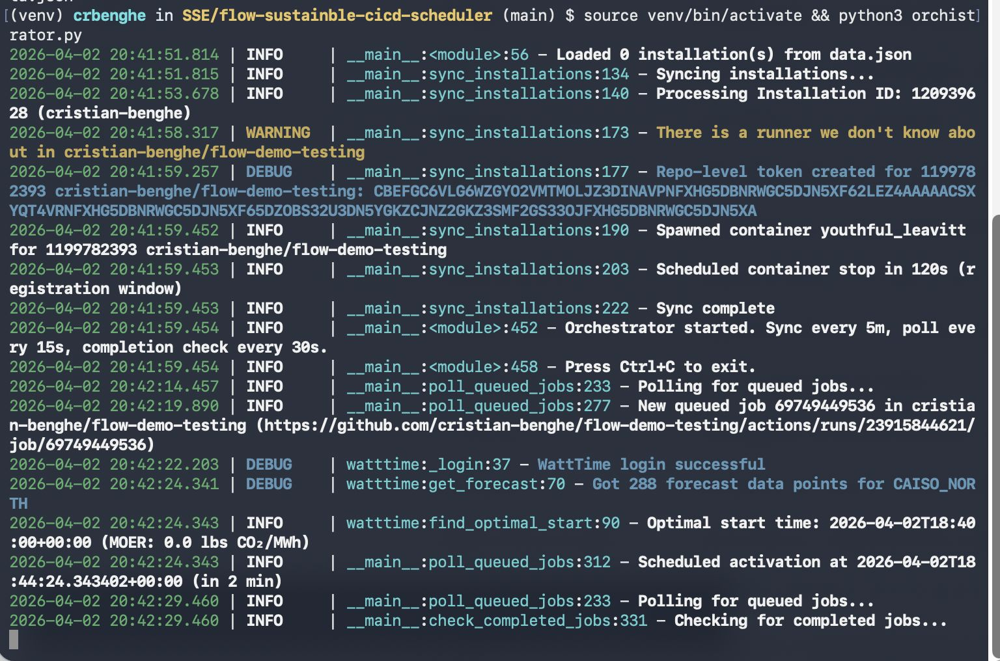
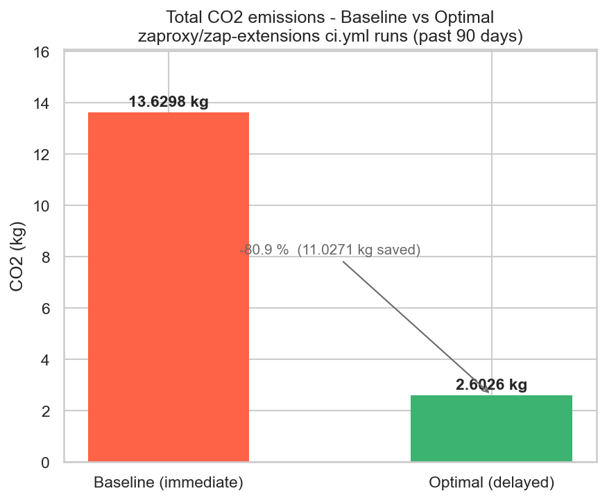

## Introduction

Continuous Integration and Continuous Deployment (CI/CD) pipelines are a key aspect of modern software engineering, enabling rapid development, automated testing, and frequent releases [Bedrina 2026]. However, the ubiquity of these automated workflows comes at a significant environmental cost. In 2021, open-source CI/CD energy consumption alone was estimated to be equivalent to driving over one million miles in a passenger vehicle [Saavedra 2025]. Given the growth of DevOps adaptation since 2021 [Dodd 2024], and that this figure excluded the vast ecosystem of private, closed-source workflows, the current environmental impact is likely orders of magnitudes higher.

Despite their impact on global carbon emissions, limited work has been done on adapting the already existing tooling to reduce the carbon impact. Various ways of mitigating the carbon impact of the CI/CD workflows have been explored [Classen 2023]. One of these carbon reduction patterns reduces the carbon impact by shifting the time of a workflow to a different time at which the carbon impact of the consumed energy is minimized.

The primary challenge in solving this problem lies in the "black box" nature of popular CI/CD orchestrators, which lack native hooks for task rescheduling. The architecture of most platforms is designed for "instant feedback," creating a total architectural focus on job response time. While this focus might sometimes be wanted, it does not align with a want for a reduction in carbon emissions [The JetBrains Blog 2025; GitLab Scheduler; GitHub Documentation].

Furthermore, existing workarounds often increase system overhead, or break the existing architectural design. Highlighting the need for a non-intrusive solution that bridges static infrastructure with dynamic energy grid conditions while minimizing the friction developers experience.

In this paper, we introduce **Flow**, a carbon-aware CI/CD scheduler designed as a decoupled orchestration layer for GitHub Actions. Unlike previous approaches, Flow utilizes a "virtual gating" mechanism through a specialized self-hosted runner. This allows jobs to be held in a pending state until grid conditions align with sustainability targets. By leveraging the WattTime API, Flow identifies local minimums in marginal carbon intensity to schedule execution. Our approach prioritizes a seamless integration that minimizes disruption to established workflows while significantly reducing the carbon impact of non-urgent workflows.

## Background & Related Work

The primary value of CI is the reduction of integration risk through frequent, automated builds — with rapid feedback loops being the mechanism by which this is achieved [Fowler 2024]. However, carbon-aware rescheduling inherently introduces a temporal delay, creating a tension between velocity and flexibility. Flow addresses this by allowing workflow developers to target non-time-critical workflows where the environmental benefit outweighs the cost of a delayed feedback cycle. Examples of these workflows could include nightly builds, code-quality checks, etc.

In recent years, sustainability has become increasingly important in software systems. Carbon-aware computing is an emerging approach where systems adapt based on grid carbon intensity, shifting flexible work to times when cleaner energy is available.

Research has shown that even modest timing adjustments can lead to measurable carbon reductions. Carbon-aware scheduling systems can restrict compute usage during high-carbon periods and shift workloads to cleaner time windows, achieving reductions without breaking service guarantees [Radovanovic 2021]. Geographic load shifting also works: distributing workloads across regions based on carbon signals reduces emissions while keeping costs acceptable [Lindberg 2022].

### WattTime API and CO₂ Signal Types

WattTime is a non-profit technology organization that provides real-time, forecasted and historical emissions data for electricity grids around the globe with a REST API [WattTime API]. WattTime's main focus is the *Marginal Operating Emissions Rate* (MOER): the emissions rate of the generator(s) currently responding to changes in electricity demand [WattTime MOER]. The marginal signal is more informative than average for load-shifting: when a workload increases demand, it is important to know which marginal generator responds, not the entire grid average [WattTime Avg vs Marginal]. If the marginal generator is a gas-fired peaker plant, your workload causes more emissions than the grid average would suggest.

Despite its appeal, there is no consensus on whether marginal or average signals better guide carbon-aware scheduling in practice. A large-scale empirical study across 65 grid regions found the two signals are largely negatively correlated: optimizing for one can increase emissions as measured by the other [Sukprasert 2024].

Another data provider, Electricity Maps, has shown that in some European grids, load-shifting based on WattTime's marginal signal can increase the reported carbon footprint according to their data [Electricity Maps].

For our implementation, we rely on WattTime, which means we inherit its use of the MOER signal. The practical consequence for evaluation is that our estimated carbon savings are expressed in marginal terms, and readers should bear this methodological choice in mind when comparing results against tools that use average intensity data.

### Related Tools

Several tools aim to improve sustainability in software systems. Electricity Maps [Electricity Maps] provides carbon intensity data as an alternative to WattTime, by focusing on the average rather than the marginal emission intensity. While average signals offer a more broad coverage, they differ from the MOER signal used by Flow, and in practice these measures can diverge, as discussed above.

A complementary approach to temporal scheduling is measuring the energy footprint of individual CI jobs. The Eco CI energy estimation tool [Eco CI 2024] addresses this by integrating energy measurement into GitHub Actions workflows. Eco CI tracks CPU utilization across job execution using pre-calculated power consumption curves based on hardware specifications, enabling developers to quantify the energy and CO₂ emissions of specific workflow steps. While Flow is not integrated with Eco CI, both tools address complementary parts of the same problem: Eco CI identifies the most energy-intensive jobs (such as long-running test suites or compilation steps), while Flow addresses when those jobs should be run. Used together, the two tools could provide a more complete optimization strategy — reducing both the energy cost of individual jobs and the carbon intensity of the grid at execution time.

## Solution Design

We introduce Flow, a Carbon-Aware CI/CD Scheduler designed to bridge the gap between static CI/CD infrastructure and dynamic energy grid conditions. The primary design challenge lies in the "black box" nature of the two most popular CI/CD orchestrators, which lack native hooks for task rescheduling.

The primary objective of Flow is to achieve the widest possible environmental impact. To this end, the system integrates with the most used CI/CD ecosystem: GitHub Actions [The JetBrains Blog 2025; Bedrina 2026]. Flow's system architecture prioritizes a non-intrusive, seamless integration. To maximize adoption within existing DevOps life cycles, the design minimizes disruption to existing developer workflows. Rather than requiring a complete migration to a new CI/CD platform, the scheduler operates as a specialized orchestration layer atop GitHub Actions.

Existing workarounds for job scheduling in GitHub Actions, such as the `schedule-job-action` marketplace utility [Borodin], split all jobs into two: one which receives the triggers from GitHub and records that it has been triggered externally, and a second one which polls this log. Such architectures not only increase system overhead but also sever the direct correlation between a trigger event and its execution. This lack of end-to-end traceability makes these solutions difficult to adopt in workflows where transparency and developer experience are paramount, like enterprise environments.

Flow uses an alternative approach: a virtual gating mechanism using a modified, dummy, self-hosted runner labeled *delay-to-offpeak*. The workflows in repositories are structured such that all energy-intensive jobs depend on this "gatekeeper" job. This gatekeeper job targets our specialized runner, which remains offline by default. The scheduler service, which is integrated via a GitHub app, monitors the repositories the *delay-to-offpeak* runner is installed on. When a workflow targeting the runner is detected, the scheduler calculates the optimal execution window based on the carbon intensity forecasts provided by the WattTime API. The runner is brought online only when the grid's marginal carbon intensity reaches a local minimum.

The following example shows a GitHub Actions workflow utilizing the `delay-to-offpeak` virtual gatekeeper to defer execution:

```yaml
jobs:
  # Wait for dummy 'delay-to-offpeak' runner to come online
  delay-to-offpeak:
    runs-on: delay-to-offpeak
    steps:
      - run: true

  greet:
    runs-on: ubuntu-latest
    needs: delay-to-offpeak
    steps:
      - name: Build Docker Image
        run: docker build .
```

### Scheduling Logic and Constraints

To ensure the feasibility of the scheduling model, we define several operational constraints imposed by the GitHub Actions environment. First, to reduce the complexity of the optimization problem, we model workflow execution as an atomic operation. We assume that once a workflow is released, its duration is negligible relative to the scheduling window.

Second, the GitHub Action Job orchestrator (the system that distributes jobs to self-hosted action runners) does not provide control over job sequencing once a runner becomes available. Consequently, the activation of a runner can be modeled as a simultaneous dispatch of all pending tasks within a repository. Third, the system must adhere to a strict temporal bound of 24 hours [GitHub Docs], after which GitHub terminates the late jobs.

Given these parameters, our scheduler adopts the following strategy. When an idle repository receives a task, the system identifies a target activation time *t_opt* corresponding to the predicted global minimum of carbon intensity within the interval [*t_arrival*, *t_arrival* + 24H]. To maintain accuracy against fluctuating forecasts, the scheduler re-evaluates the carbon forecast at periodic intervals, dynamically adjusting *t_opt* if a more efficient execution window emerges.

To facilitate organizational adoption, we provide a GitHub App-based installation. Upon authorization, the app utilizes the GitHub API to register the `delay-to-offpeak` runners at the repository level. This allows any repository within the organization to opt-in to carbon-aware scheduling simply by updating their workflow labels, without requiring developers to manage their own runner infrastructure or API keys for carbon tracking.

### Mitigating CI/CD Functionality Impact

A natural concern when introducing job delays is the impact on development velocity and feedback loops. Not all CI/CD workloads are suitable candidates for deferral. Flow mitigates this through a selective scheduling approach where developers explicitly tag workflows as deferrable by declaring a dependency on the `delay-to-offpeak` runner. Critical jobs (such as pre-deployment validation, blocking pull request checks, and hotfix CI runs) execute immediately on standard runners, unaffected by carbon scheduling.

The deferrable job category includes: (1) scheduled workflows (nightly builds, weekly full test suites), (2) non-blocking checks (lint, code quality metrics, optional integrations), and (3) flexible background tasks (dependency updates, documentation generation). By only suggesting deferral to these categories, Flow reduces carbon emissions from flexible workloads while preserving development velocity for time-critical feedback loops. A 24-hour maximum delay (aligned with GitHub Actions queue and execution limits to avoid cancellation) ensures that even deferred jobs complete within a reasonable timeframe without being canceled, preventing stale CI state which would impede development.

The trade-off is explicit: teams choosing carbon-aware scheduling accept that nightly builds may run during the cleanest grid window rather than at midnight, and comprehensive test suites may execute at 3am instead of 9am, if that aligns with lower carbon intensity.

## Implementation


*Figure 1: Diagram showing interactions between services in Flow.*

As illustrated in Figure 1, Flow is architected in multiple small services. The system functions as an intermediary designed to intercept and hold execution requests in a low-energy state until grid conditions align with sustainability constraints.

The self-hosted action runners are deployed as Docker containers. Each container encapsulates two primary processes: the standard GitHub Action Runner and a custom Man-in-the-Middle (MITM) proxy. The MITM-proxy is configured to intercept communication between the local runner and the GitHub Action Job orchestrator. By stripping the substantive computational steps from the intercepted job payload, the proxy allows the `delay-to-offpeak` runner to satisfy the GitHub backend's requirement for job "pickup" while incurring minimal CPU and memory overhead. This mechanism effectively transforms the runner into a lightweight "gatekeeper" that maintains the job in a pending state without consuming significant power.

The heart of the system is the `Orchestrator.py` service. It communicates with the GitHub API, WattTime API and the Docker container host. This orchestrator service has multiple responsibilities. First, it dynamically spawns or terminates runner containers in response to the addition or removal of repositories in the installations of the GitHub app. Second, by polling the GitHub API, the orchestrator identifies workflows targeting the `delay-to-offpeak` label. Third, when a "queued" event arrives for these workflows, the service queries the WattTime API to retrieve a 24-hour carbon intensity forecast. It identifies the local minimum (*t_opt*) and schedules the activation of the runner containers accordingly.

An important open challenge is rescheduling. Once a job has been delayed and released, the system currently does not support re-adjusting execution in response to updated forecasts. Enabling dynamic rescheduling would further improve carbon efficiency.

## Evaluation

### Architecture Validation

We assessed Flow's architecture by deploying it in a controlled test repository and configuring a GitHub Action to evaluate its performance and integration logic.


*Figure 2: Screenshot of Flow running.*

The first phase of our evaluation confirmed the system's ability to intercept and delay workloads without loss of fidelity. By simulating the recorded activity over a 24-hour period, we verified that Flow correctly identified and held jobs in the GitHub queue. The virtual gating mechanism successfully held all jobs targeting the `delay-to-offpeak` runner, preventing their execution until the scheduler determined an optimal window.

As illustrated in Figure 2, the scheduler successfully deferred peak-hour workloads, releasing them only when the local grid reached its marginal carbon intensity minimums. The delay never exceeded the 24-hour GitHub Actions timeout. This confirms that the virtual gating mechanism can effectively manipulate job execution timing without requiring modifications to the core GitHub Actions runner environment.

### Simulation Results and Carbon Impact


*Figure 3: Total CO₂ emissions of the zaproxy/zap-extensions ci.yml pipeline from 2026/01/02 to 2026/04/02 vs same pipeline scheduled using Flow.*

To calculate the theoretical reductions of Flow, we performed a simulation of the scheduling tactic for the zaproxy/zap-extensions ci.yml pipeline from 2026/01/02 to 2026/04/02. The estimated energy consumption of the pipeline is 42 Wh per run [Action Runner Data]. By using the energy consumption and WattTime's historical dataset, we modeled the expected carbon footprint *C* for two scenarios: (1) the baseline, which immediately executes jobs upon arrival, and (2) a carbon-aware scenario, which delays execution within a maximum 24-hour delay window to coincide with predicted local carbon intensity minima. Occasionally, renewable generation exceeds grid demand. WattTime's model reflects these periods of renewable curtailment with zero MOER values in the dataset. These represent genuine zero-carbon execution windows, as any additional load is served by surplus renewable energy that would otherwise be curtailed.

Initial simulations (Figure 3) indicate that, assuming execution within the CAISO\_NORTH grid region, shifting jobs could yield a carbon reduction of up to **80.9%**. This reduction is conservative, as it: (1) assumes perfect forecast accuracy (in practice, forecast errors may reduce realized savings), (2) models execution as instantaneous (longer jobs may experience varying intensity during execution). However, these results demonstrate the potential for meaningful carbon savings by delaying CI/CD pipelines.

### Limitations

While Flow demonstrates a viable path towards carbon-aware CI/CD scheduling on GitHub, several constraints and modeling simplifications must be acknowledged regarding its current implementation and evaluation.

The current implementation is primarily constrained by the data availability of the WattTime free-tier API. Our scheduler is currently restricted to the *CAISO\_NORTH* (California) grid region. While the architecture is region-agnostic, the lack of access to global marginal emissions data limits the generalizability.

To reduce the complexity of the scheduling algorithm, we modeled workflow execution as an atomic, instantaneous event. In reality, CI/CD pipelines can range from a few minutes to several hours. For longer-running jobs, the carbon intensity may fluctuate during the execution period itself. By ignoring job duration, our model may release a job at a non-optimal point if intensity changes during execution.

In the current architectural implementation one container per repository is made, which introduces a relatively low cap on the number of repositories that can be orchestrated with the app. If the app is used by more than a handful of repositories, migration to a distributed architecture would be required to dynamically provision and scale runners across a cluster of nodes based on demand when application usage increases.

## Discussion

### Impact on Software Development Lifecycle

Introducing carbon-aware scheduling into CI/CD workflows requires organizational consideration beyond technical implementation. The software development lifecycle operates under a constant pressure to reduce feedback latency and increasing predictability. Increasing the feedback latency to reduce carbon emission seems like a counter intuitive solution.

For critical tasks (code review gates, deployment validation, pull request checks), immediate feedback is essential. Flow preserves this by restricting deferral to non-blocking workloads. Developers experience no change in turnaround time for blocking CI gates. However, team culture matters: organizations accustomed to reviewing nightly build results at morning standup must adapt if those builds now complete at 3am during a renewable energy peak. This is not a technical impediment but a process adaptation.

**Release Velocity vs. Sustainability:** Teams pursuing aggressive release cadences (e.g., hourly deployments) will find fewer jobs suitable for carbon deferral, limiting carbon savings. Conversely, teams with slack in their release schedule (e.g., daily releases, structured release windows) have substantial flexibility to shift work to optimal carbon windows without impacting delivery timelines. Flow enables this trade-off decision at the team level, rather than imposing it globally.

**Organizational Adoption:** Flow's design prioritizes low-friction adoption. By operating as a GitHub App (rather than requiring platform forks or self-hosting), and by making carbon scheduling opt-in per workflow, organizations can adopt incrementally. Early adopters can tag nightly builds and non-critical checks, demonstrating carbon savings before expanding to wider workloads.

**Measurement and Accountability:** The SDLC becomes more sustainable when quantified. Instrumenting workflows with tools like Eco CI, combined with Flow's scheduling decisions, enables teams to measure: carbon footprint per workflow, marginal emissions reduced per deferral decision, and cumulative organizational impact. This transparency supports sustainability commitments and informs prioritization of further optimizations.

### Threats to Validity

The primary threat to the validity of our carbon reduction results concerns the volatility of renewable energy forecasts. The scheduling decisions are done based on the predictive accuracy of the WattTime API. Since carbon intensity is heavily influenced by fluctuating meteorological conditions, there is a risk that the predicted optimal time may diverge from the actual real-time grid minimum. If weather patterns shift unexpectedly after a job has been queued, the scheduler may commit a workload to a window that is no longer the most sustainable option.

The validity is further challenged by the geographic transparency of CI/CD infrastructure. GitHub Actions manages a distributed network of data centers located in multiple geographic locations. When an action is scheduled, it will be completed in one of the managed data centers. Currently there is no solution to determine the approximate location of the data center in which the job will be executed. Therefore, the given results are an approximation of reductions in emissions, assuming that the location of the data center is in the CAISO\_NORTH region.

### Future Work

While Flow demonstrates the feasibility of carbon-aware CI/CD through a decoupled orchestration layer, several avenues for future research and development remain.

To reduce the overhead and friction of installing Flow, future work should explore collaborating with CI/CD providers like GitHub and GitLab to implement native carbon-aware hooks. This would eliminate the need for MITM proxies and allow for more seamless rescheduling. Furthermore, expanding the system to support other CI/CD orchestrators would increase the impact of the work. Additionally, if there is collaboration with the CI/CD providers, the predicted power draw can be validated.

While Flow currently focuses on temporal shifting (delaying execution), a significant opportunity lies in spatial shifting. Future research involving the CI/CD providers would determine not only when to run a job but also where. By dynamically migrating runners between geographic regions or even across providers (e.g., moving a job from a coal-heavy AWS region to a wind-powered Azure region), the system could achieve much deeper emission cuts without increasing latency beyond allowed periods.

An effect of the delayed scheduling is an increased cost of failure. If a job is delayed 20 hours to a low-carbon window and then fails, the developer may be forced to re-run it during a high-carbon peak to meet a deadline. Future work could involve predictive failure modeling, where the scheduler prioritizes earlier (though slightly higher carbon) windows for jobs with a high statistical probability of failure, ensuring there is a carbon-safe buffer for retries.

It is unknown if the increased delay will impact the developer workflow; we suspect the negative effects will be minimal on workflows which the developers themselves have marked as deferrable. This suspicion however, should still be verified.

Leveraging paid API access for the WattTime API would allow Flow to expand beyond the *CAISO\_NORTH* region. Future research should also investigate methods for identifying the geographic location of ephemeral runners in multi-cloud environments, ensuring that the carbon intensity signals used for scheduling are geographically accurate.

## Conclusion

As the environmental footprint of software engineering comes under increasing scrutiny, the energy-intensive nature of CI/CD pipelines presents both a challenge and a significant opportunity for carbon reduction. In this paper, we introduced Flow, a carbon-aware scheduler designed to bridge the gap between static DevOps infrastructure and dynamic energy grid conditions.

By implementing a "virtual gating" mechanism via a custom GitHub App and an MITM-proxy-enabled runner, Flow demonstrates that carbon intelligence can be integrated into existing enterprise workflows with minimal friction. Our architecture successfully bypasses the "black box" limitations of major CI/CD platforms, allowing flexible workloads to be deferred to periods of low marginal carbon intensity without requiring a total migration of the underlying infrastructure.

Our evaluation indicates that by shifting execution windows within a 24-hour bound, software teams can achieve a carbon reduction of approximately **80.9%** for scheduled and non-time-critical tasks. While limitations regarding geographic transparency and atomic modeling remain, Flow makes carbon intensity a first-class citizen in the orchestration layer. We move one step closer to a sustainable software development lifecycle where speed of delivery no longer comes with needless CO₂ emissions.
