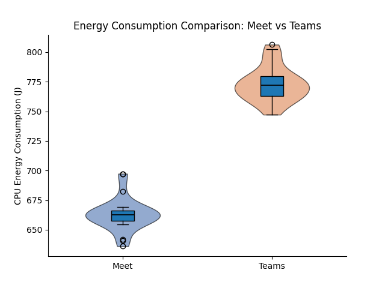
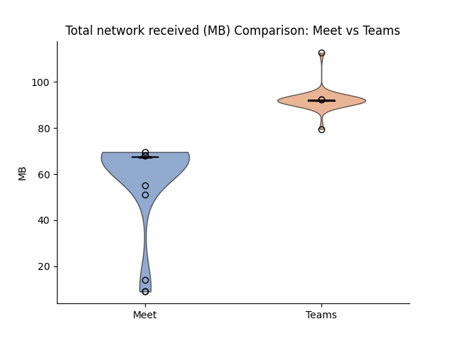

# Is Google Meet or Microsoft Teams Greener? Measuring the Energy Cost of Video Calls

**Course:** Sustainable Software Engineering — TU Delft, 2026  
**Authors:** Ocean Wang, Erkin Başol, Yasar Kocdas, Alexia Neatu
**Replication package:** GH link

---

## Table of Contents

1. [Introduction](#1-introduction)
2. [Background](#2-background)
3. [Experimental Design](#3-experimental-design)
4. [Threats to Validity](#4-threats-to-validity)
5. [Results](#5-results)
6. [Discussion](#6-discussion)
7. [Conclusion](#7-conclusion)
8. [Replication](#8-replication)

---

## 1. Introduction

Pick any medium-sized company. Its employees probably spend two to three hours a day on video calls. Multiply that by the number of employees, and then by the number of companies doing the same thing, and you have a workload that runs continuously, at massive scale, on hardware that people rarely think of as having an energy cost.

The choice of platform is usually made once, at the IT level, and then forgotten. But Google Meet and Microsoft Teams are not the same product under the hood. They make different engineering decisions about how to encode video, how to manage the call state in the browser, and how much JavaScript runs while you sit in a meeting. Those decisions affect how hard your CPU works. A harder CPU draws more power. More power, over enough users and enough hours, adds up.

Nobody seems to have measured whether this difference is real, or how large it is. That is what this study does. We ran 60 automated, hardware-measured experiments, 30 per platform, and recorded the energy consumed by a single browser participant in a standard two-minute call. Our research question is simple: **which platform costs more energy per call, and by how much?**

---

## 2. Background

### 2.1 Software Energy Measurement

The energy a piece of software consumes depends on which hardware resources it exercises and for how long. For a browser-based video call the main contributors are CPU load from video encoding and decoding, JavaScript execution, and DOM rendering, along with network I/O and memory bandwidth. CPU is typically the largest contributor.

Measuring this accurately is harder than it sounds. The obvious approach is to estimate from CPU utilisation: multiply CPU percentage by the chip's rated power draw (TDP) and by time. This is unreliable because it ignores frequency scaling, thermal states, and the fact that not all CPU work draws equal power. Hardware power sensors are the better option. They report what the chip is actually drawing, not what a model predicts it should draw.

### 2.2 Prior Work on Video Call Energy

The closest study to ours is Wattenbach et al. (2022), ["Do You Have the Energy for This Meeting?"](https://dl.acm.org/doi/10.1145/3524613.3527812), published at MOBILESoft 2022. They compared Google Meet and Zoom on Android using an automated experiment with 20 runs per treatment, measuring energy via Android's Batterystats profiler. Their main finding was that Zoom consumed about 4% less energy than Meet on average, though the difference was statistically significant only at a medium effect size (Cliff's delta = −0.344). They also found that camera use had by far the largest impact on energy, increasing consumption by over 274% compared to a camera-off call, while microphone use had negligible effect.

Their work is directly relevant to ours but leaves two gaps. First, it targets Android mobile apps, not desktop browsers, and mobile energy dynamics differ from laptop CPU workloads. Second, it does not include Microsoft Teams. Our study fills both gaps: we measure browser-based sessions on a desktop machine and compare Meet against Teams rather than Zoom.

One methodological difference is worth noting. Wattenbach et al. used Batterystats, which is a software-based energy estimator. They acknowledge this is less precise than hardware measurement. We use [EnergiBridge](https://github.com/tdurieux/EnergiBridge) [Durieux, 2023], which reads directly from hardware power sensors, giving us more accurate absolute figures.

### 2.3 EnergiBridge

EnergiBridge is a cross-platform energy measurement tool developed by Thomas Durieux that reads power sensors directly from the hardware. On Apple Silicon it reads total system power via Apple's SMC through `powermetrics`. On Intel chips and Linux it reads CPU package and DRAM power via Intel's RAPL interface. On Windows it uses LibreHardwareMonitor.

EnergiBridge samples at up to 5 Hz and produces both a time-series of instantaneous power in Watts and a total energy figure in Joules. We use Joules as our primary metric because it combines power draw and time: a platform that draws slightly more watts but for a shorter active period could end up using less total energy than one that draws less but stays busy longer.

### 2.4 Why These Two Platforms Might Differ

Both Google Meet and Microsoft Teams (specifically the consumer `teams.live.com` version) run inside Chrome. They share the same browser runtime, the same JavaScript engine, and the same WebRTC APIs for peer-to-peer media. On the surface this makes them look equivalent. They are not.

Google Meet is a Google product running inside a Google browser. Google has direct influence over both VP9 codec integration and Chrome's WebRTC implementation, and Meet is built to take advantage of that. Its UI is comparatively lean: a call in progress does not do much beyond rendering video tiles and a control bar.

Teams is built on a heavier frontend stack. The consumer web client wraps a React-based framework and carries more JavaScript than Meet. A larger JS bundle means more parsing, more execution, and more ongoing framework overhead during the call. Teams also handles the pre-join flow differently: guests wait in a lobby until admitted, which means the browser is running call-related code before the call has technically started.

The prior mobile findings from Wattenbach et al. showed Meet consuming more energy than Zoom. Whether that pattern holds when comparing Meet against Teams on desktop is an open question, but the architectural differences above give us a prior expectation: **we expect Teams to consume more energy per session than Meet.** The question is whether the difference is large enough to be meaningful, or whether it gets lost in measurement noise.

---

## 3. Experimental Design

### 3.1 Overview

We measure the client-side energy consumed by a single browser participant in a 120-second call, on each platform, repeated 30 times in randomised order. 

### 3.2 Experiment Setting

For each platform, we added five additional participant bots to better simulate a real-life environment, resulting in a total of ten additional bots. These bots were deployed using an automation script. To prevent interference with the client-side machine, where the experimental measurements were conducted, we ran the bots on a separate machine. The choice of five bots per platform was based on the hardware capabilities of the machine executing them. On the client machine itself, we only simulated the experiments.
### 3.2 Browser Bots

We use Selenium WebDriver to control real Chrome browser instances. Human interaction introduces timing variability that automation removes. Each bot joins the meeting, waits exactly 120 seconds, and leaves. Between runs, the temporary Chrome profile is deleted so no cached state carries over.

Chrome is configured with `--use-fake-device-for-media-stream`, which supplies a synthetic camera and microphone signal rather than a real one. Both platforms receive an identical media input, so any difference in codec workload comes from how each platform processes that input, not from what was in the video. We also set `page_load_strategy = "eager"` because Meet uses a persistent WebSocket connection and never fires the standard browser load event; without this, Selenium would wait indefinitely.

Chrome runs in visible mode. Google Meet rejects headless Chrome outright, so this is not a choice but a constraint.

### 3.3 Energy Measurement

EnergiBridge runs as a background process from just before the bot joins to just after it leaves. It writes a high-frequency power time-series to CSV and prints total energy consumed when it exits. Alongside it, a Python thread samples `psutil` every second for CPU%, memory, and network bytes in both directions. Together, these give us hardware-level power data at 5 Hz and a complete system-level view at 1 Hz.

### 3.4 Controls

**Randomised run order.** Due to the one-hour session limit of Google Meet, it was not possible to execute all experiments in a single run. Therefore, the experiments were divided into batches of 8, 9, 9, and 4 runs. Before each batch execution, the full sequence of 60 experiments was shuffled. This randomised ordering helps distribute time-of-day effects, background system activity, and potential thermal drift evenly across both platforms.

**Cooldown between runs.** We introduced a 60-second pause between consecutive experiments to allow the CPU to return to a resting thermal state before the next measurement began. Additionally, after each batch of experiments, when the Google Meet session ended, setting up a new session and reconnecting the bots took approximately four minutes. Therefore, an additional waiting period was naturally introduced between batches. All experiments were conducted within a continuous four-hour time window and were not distributed across different times of the day.

**Isolated Chrome profiles.** Each run starts with a clean profile directory that is deleted afterwards, so no browser state accumulates across runs.

**Zen Mode.** All unnecessary applications and background tasks were closed, and all external I/O devices were disconnected from the laptop. Only the Python script responsible for automating the experiments was running. The laptop remained connected to its charger throughout the entire process, with the battery maintained at 100%. After the script was initiated, the laptop was not used or interacted with in any way that could interfere with the experimental measurements. Also, the brightness is kept the same throughout the experiments.

**Warming up the laptop.** Before the initial run, a Fibonacci sequence script was executed for five minutes on the laptop used to conduct the experiments. This ensured that the system reached a stable operating temperature prior to measurement.

**Environment control.** The room temperature was kept constant throughout the experimental process, and the windows remained closed to minimize environmental variations.

**Consistent meeting setup.** A human host created both the Google Meet and Microsoft Teams calls. For each platform, the host and four bots remained in the meeting throughout all experimental runs. During each experiment, an additional bot executed on the experiment laptop joined the already active call. This ensured that every measurement was performed under the same controlled and consistent meeting conditions.

### 3.5 Experimental Matrix

| Parameter | Value |
|---|---|
| Platforms | Google Meet, Microsoft Teams |
| Participants per call | 1 experiment bot + 5 additional participants (1 host and 4 bots)|
| Call duration | 120 seconds |
| Repetitions per platform | 30 |
| Total runs | 60 |
| Cooldown between runs | 60 seconds |
| Browser | Google Chrome (latest), visible mode |
| Media stream | Synthetic (fake device) |
| Run order | Randomised  |
| Energy tool | EnergiBridge |
| OS / Hardware | [macOS 26.3., Apple M4, 16 GB RAM] |

### 3.6 Analysis

We compute per-platform means and standard deviations and run (Mann-Whitney U or Welch's t-test) to test whether the difference is statistically significant at α = 0.05. We produce four charts: energy per session, system power over time, CPU usage over time, and network traffic.

---

## 4. Threats to Validity

**Fake media streams are a lower bound.** A synthetic camera feed produces a simple, static signal. A real webcam with motion and lighting variation requires more codec work from both platforms. Our results underestimate real-world consumption, and the gap between platforms could be larger or smaller under realistic conditions.

**Network I/O is system-wide.** `psutil.net_io_counters()` captures all traffic on the machine, not just Chrome's. Background OS processes can inflate the figures. We closed non-essential applications before running, but cannot eliminate this entirely.

**Teams lobby timing.** Teams routes guest participants through a lobby before admitting them. The wait time depends on how quickly the host responds. Google Meet was configured to admit participants instantly. This introduces a small, variable difference in the time the browser spends running call-related code before the call formally starts.

**Single hardware configuration.** All measurements were taken on one machine. Absolute energy figures will differ on different hardware. The relative comparison between platforms should hold directionally, but we cannot verify this without testing on additional machines.

**Teams leave is macOS-only.** Our leave implementation for Teams sends `Cmd+Shift+H`. This shortcut does not exist on Linux or Windows. The failure is non-fatal and does not affect the energy measurement, but replication on other operating systems requires adjusting this part of the code.

---

## 5. Results

We compare Google Meet and Microsoft Teams across 27 repeated experimental runs per platform (after outlier removal). All runs lasted 120 seconds under identical hardware and browser conditions. Since normality assumptions were violated for multiple variables (Shapiro–Wilk p < 0.05), we report Mann–Whitney U tests with $\alpha$ = 0.05.

### 5.1 Energy Consumption

#### Results Averaged Over 27 Runs

| Metric         | Google Meet (Mean ± SD) | Microsoft Teams (Mean ± SD) | Relative Difference | Mann–Whitney p-value |
| -------------- | ----------------------- | --------------------------- | ------------------- | -------------------- |
| CPU Energy (J) | 662.98 ± 13.59          | 772.80 ± 14.48              | **+16.6%**          | < 0.001              |
| Avg Power (W)  | 5.30 ± 0.10             | 5.71 ± 0.11                 | **+7.7%**           | < 0.001              |


#### Results Using Medians

| Metric         | Google Meet (Median) | Microsoft Teams (Median) | Relative Difference |
| -------------- | -------------------- | ------------------------ | ------------------- |
| CPU Energy (J) | 662.75               | 772.24                   | **+16.5%**          |
| Avg Power (W)  | 5.29                 | 5.71                     | **+7.9%**           |




### 5.2 CPU Usage

| Metric      | Google Meet | Microsoft Teams | Relative Difference (mean) | Mann–Whitney p-value |
| ----------- | ----------- | --------------- | -------------------------- | -------------------- |
| Avg CPU (%) | 6.22 ± 0.74 | 7.28 ± 0.43     | **+17.0%**                 | < 0.001              |

Median CPU usage was 5.95% for Meet and 7.25% for Teams.

Microsoft Teams required approximately 17% more CPU utilisation than Google Meet. The difference was statistically significant (U = 65.5, p < 0.001) with a very large effect size (r = 0.82).

The increased CPU activity aligns directly with the observed increase in energy consumption.


#### Statistical Significance

All differences in CPU usage, average power, and total CPU energy were statistically significant (Mann–Whitney U, p < 0.001).

Effect sizes (rank-biserial correlation):
- CPU usage: 0.82 (large)
- Energy consumption: 1.00 (maximal separation)
- Average power: 0.99 (near-maximal)

Microsoft Teams consumed on average 109.8 Joules more per 120-second session than Google Meet. The distributions did not overlap: the Mann–Whitney U statistic for energy was U = 0.0 (p < 0.001), corresponding to a rank-biserial effect size of 1.0 — the maximum possible effect. Every Teams run consumed more energy than every Meet run.

Average power draw was also significantly higher for Teams (U = 3.0, p < 0.001), with an extremely large effect size (r $\approx$ 0.99).

These results indicate a consistent and substantial energy gap between the two platforms under identical workload conditions.


### 5.3 Network Traffic

| Metric             | Google Meet (Mean ± SD) | Microsoft Teams (Mean ± SD) | Relative Difference | p-value |
| ------------------ | ----------------------- | --------------------------- | ------------------- | ------- |
| Sent Data (MB)     | 3.47 ± 0.18             | 3.13 ± 0.08                 | **−9.9%**           | < 0.001 |
| Received Data (MB) | 60.18 ± 18.24           | 92.26 ± 4.71                | **+53.3%**          | < 0.001 |

Median received data:
- Meet: 67.38 MB
- Teams: 91.94 MB

Teams consistently received substantially more network data than Meet. The rank-biserial correlation for received bytes was 1.0, indicating complete separation between platforms.




### 5.4  Summary of Observed Differences

Across all system-level metrics:
- Microsoft Teams consumes ~16–17% more CPU energy per 2-minute call
- Teams draws ~8% higher average power
- Teams uses ~17% more CPU
- Teams receives ~53% more network data

All differences are statistically significant with large effect sizes.

---

## 6. Discussion

Our results provide strong evidence that Microsoft Teams consumes more energy than Google Meet in browser-based desktop calls under controlled conditions.

The most important result is the 16–17% increase in total CPU energy consumption. Unlike a small percentage difference that can be statistically significant but negligible in practice, this magnitude is substantial. Given that video calls can last for hours and occur daily across millions of users, a 16% per-session difference will scale into a meaningful cumulative energy impact.

In the Mann–Whitney U test results for energy consumption and network reception, U = 0.0 indicates complete separation between distributions. In practical terms, every single Teams run consumed more energy than every Meet run.

The energy difference is consistent with the architectural expectations. 

Teams showed:
- Higher average CPU utilisation
- Higher sustained power draw
- Significantly higher incoming network traffic

The increased network traffic (over 50% more data received) suggests that Teams might use different encoding strategies, bitrate targets, or buffering mechanisms compared to Meet. Increased decoding workload and JavaScript processing overhead likely translate into a higher sustained CPU activity. However, we can observe that the outgoing traffic was slightly lower in Teams than Meet. This indicates that the primary workload difference lies in receiving and processing the video streams rather than transmitting them.

From a sustainable software engineering perspective, this finding highlights how architectural and frontend decisions can greatly impact the energy consumption. However, the relative difference may vary on other hardware or with real webcam feeds.

---

## 7. Conclusion

This study measured the energy cost of browser-based video calls on Google Meet and Microsoft Teams via EnergiBridge.

Under controlled, repeatable experimental conditions:

- Microsoft Teams consumed approximately 16% more CPU energy per session than Google Meet.
- Teams required higher sustained CPU utilisation and power draw.
- Teams received substantially more network data during calls.

All differences were statistically significant with large effect sizes.

Although the absolute energy per session is small at the individual level, video conferencing operates at a global scale. Having this in mind, even small per-session increases add up across millions of daily meetings, which means that platform selection has measurable environmental implications.

Our findings suggest that, under the tested configuration, Google Meet is the more energy-efficient option for desktop browser-based video calls.

Future work could evaluate:
- Real webcam input instead of synthetic streams
- Longer meeting durations
- Multiple hardware configurations
- Mobile devices
- Multi-participant scaling effects

---

## 8. Replication

The full replication package is available at: GH url

```bash
git clone [repo-url]
cd SSE-26
python3 -m venv venv && source venv/bin/activate
pip install -r requirements.txt
cd EnergiBridge && cargo build -r && cd ..
cp .env.example .env  # add your Meet and Teams URLs
cd src
python run_experiment.py --meet-url "$MEET_URL" --teams-url "$TEAMS_URL" \
  --repeats 30 --duration 120 --visible
python analyze.py --data-dir ../data --output-dir ../figures
```

See `README.md` for full prerequisites and troubleshooting.
